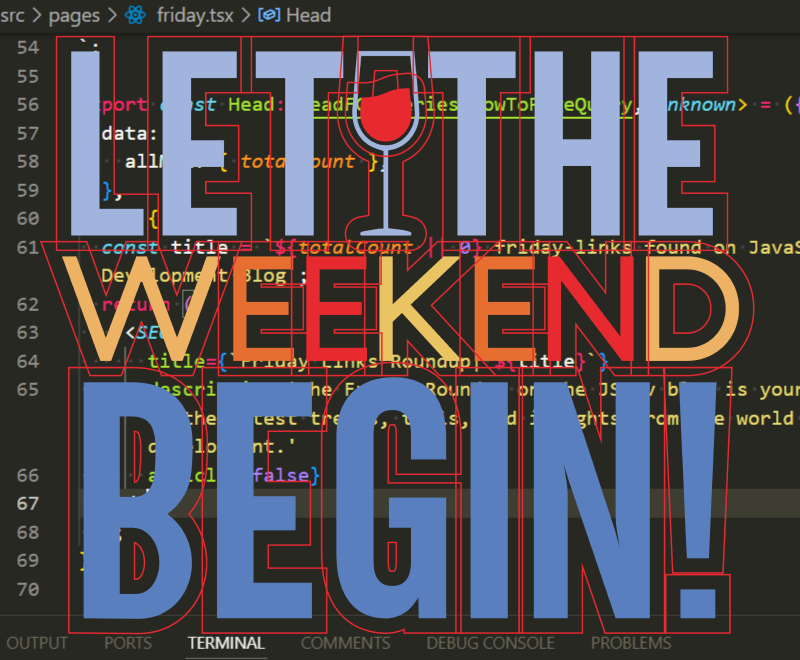

**The Friday Roundup** is your go-to weekly summary of the latest JavaScript news, tools, and
resources. Each Friday, we bring you curated articles, coding tips, and updates on new technologies
to keep you ahead in your development journey.

[Fusion Brain](https://fusionbrain.ai/)

The Fusion Brain is an AI-powered platform specializing in image generation using the Kandinsky
neural network. FREE for now.

[Beautifully simple click-to-copy CSS effects](https://cssfx.netlify.app/)

This collection is designed for seamless integration, with an emphasis on simplicity, fluidity, and
ease of use.
[CSS @property and the New Style](https://ryanmulligan.dev/blog/css-property-new-style/)

[Optimizing Javascript for fun and for profit](https://romgrk.com/posts/optimizing-javascript)

[Vue 3.5 released](https://blog.vuejs.org/posts/vue-3-5)

[CSS-only infinite scrolling carousel animation](https://blog.logto.io/css-only-infinite-scroll)

[A Text-Reveal Effect Using conic-gradient() in CSS](https://frontendmasters.com/blog/text-reveal-with-conic-gradient/)

[React Print Pdf](https://github.com/OnedocLabs/react-print-pdf)

The developers at Onedoc have released a UI Kit called React Print, designed for generating PDF
files using React and TypeScript. According to the project's creators, it can be used to create
templates for invoices, brochures, and various other documents.

[Rspack v1.0 has been released!](https://github.com/web-infra-dev/rspack)

At the end of August 2024, the first stable release of the open-source project Rspack was launched.
Rspack is a high-performance JavaScript bundler that is compatible with the Webpack ecosystem and
offers significantly faster build speeds.

[WebGPU Unleashed: A Practical Tutorial](https://shi-yan.github.io/webgpuunleashed/)

Shi Yan has released a book titled **WebGPU Unleashed**, offering a practical guide to learning
WebGPU technology. The book is free and available as a website, with each chapter featuring example
code and demonstrations.

The author explained that he began writing the book after a friend asked what technologies their
child should learn to start a journey into graphics programming. Aside from OpenGL, Vulkan, Metal,
and DirectX—which are platform-specific and require deep programming knowledge—there’s the new
WebGPU. This technology allows for rendering 3D graphics directly in the browser, making it an
excellent option for beginners. WebGPU also has implementations for C++ and Rust.

The book starts by explaining how GPU drivers work, a topic often overlooked in courses and learning
materials. This approach ensures that students not only render 3D objects and complex scenes but
also understand the underlying software and hardware mechanisms.

[Install Docmost - Open Source Notion Clone](https://tillcarlos.com/install-docmost/)

Till Carlos provides a nice tutorial on how to create a Notion clone

[Hidden cost of frontend frameworks](https://dev.to/manonbox/hidden-cost-of-frontend-frameworks-5pi)

[List of SVG logos](https://svgl.app/)

[Puter](https://puter.com/) [https://github.com/HeyPuter/puter](https://github.com/HeyPuter/puter)

**Puter**, the Open Source Internet OS.

Puter is an open-source operating system designed to run on the internet, providing a unified
platform for managing and accessing applications and services directly through the web. It aims to
streamline user workflows by integrating various digital tools into a single interface, enhancing
productivity and simplifying the management of online resources. With Puter, users can leverage a
web-based environment for their computing needs, offering a modern alternative to traditional
desktop and server-based operating systems.

[Announcing TypedSQL: Make your raw SQL queries type-safe with Prisma ORM](https://www.prisma.io/blog/announcing-typedsql-make-your-raw-sql-queries-type-safe-with-prisma-orm)

[Collage_n](https://sergey1234ovechkin.github.io/collagen_2/index.html) — A collage and sprite
creation editor.

[Generating Unique Random Numbers In JavaScript Using Sets](https://www.smashingmagazine.com/2024/08/generating-unique-random-numbers-javascript-using-sets/)

[I Built an Astro Portfolio Blog Theme So You Can Setup Your Personal Website in 10 Minutes](https://dev.to/syakirurahman/i-build-an-astro-portfolio-blog-theme-so-you-can-setup-your-personal-website-in-10-minutes-1df0)

[Creating an animated hamburger menu icon for React](https://blog.logrocket.com/creating-animated-hamburger-menu-icon-react/)

That's all for now, have a great weekend, everyone! 😇
