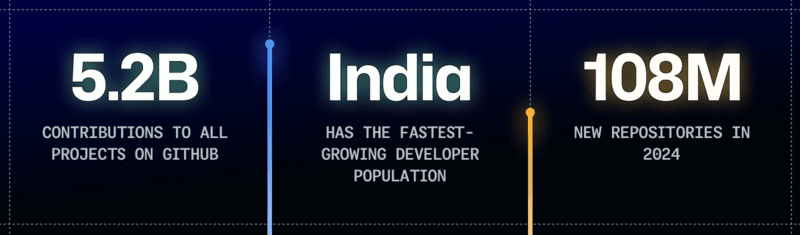

Welcome to another edition of Friday Links on JSDev Space! Every Friday, we curate a list of 10 must-read links to the best tutorials, articles, and resources in JavaScript, frontend development, and web technologies. Whether you’re looking for inspiration, tutorials, or updates on the latest tools, you’ll find something here to kickstart your weekend learning!

## State of CSS 2024: Key Trends, Top Libraries, and Upcoming Features

For those unfamiliar with it, [State of CSS](https://2024.stateofcss.com/en-US/) is an annual survey gathering insights from developers worldwide on the latest CSS trends.

### Key Features

- Filter effects like `blur()` and `contrast()` have gained popularity, becoming some of the most widely used features this year.
- The `:has()` pseudo-class ranked second (though personally, I haven’t found a use for it this year).
- Aspect ratio made it to the fourth place. Have you used it recently?

### Popular Libraries

- **Tailwind CSS** holds the top spot, a well-deserved recognition.
- **Bootstrap** is in second place, maintaining its strong presence.
- **Ant Design** shares third place with Materialize CSS.
- **OpenProps** climbs to seventh place.

### CSS-in-JS

- No surprises here: CSS Modules and Styled Components are neck-and-neck for first place.

### Pre/Post Processors

An interesting trend is emerging here. Thanks to new features, **Vanilla CSS** has surged past **Less** and **Stylus**, which is encouraging to see.

- **Sass/SCSS** holds first place, as expected.
- **PostCSS** is in second.
- **Vanilla CSS** ranks third, followed by Less and Stylus.

### Requested Features

Some of the most interesting suggestions:

- **Mixins**: Adding these would be logical and highly useful.
- **Conditional Logic**: This feature, while promising, should be used carefully to avoid complex conditions.
- **Masonry Layout**: Previously available as a plugin (think Pinterest-style grid), this would be a very useful addition.
- **Parent Selector**: Another highly requested feature—sign me up for two!
- **Nesting**: The community is calling for this as a built-in feature.
- **Functions**: A highly relevant request that could add a lot of flexibility.

Conditional Logic, Mixins, and Masonry Layouts are already being considered for future CSS updates, although their development status is still unknown.

## OpenAI Acquires Chat.com Domain

Starting today, the domain Chat.com now directs users to OpenAI's ChatGPT chatbot. An OpenAI representative confirmed the acquisition of the domain.

Originally registered in September 1996, Chat.com is one of the internet's older domains. Last year, it was revealed that HubSpot co-founder and CTO Dharmesh Shah purchased Chat.com for $15.5 million, making it one of the priciest publicly sold domains in recent years.

It appears that the domain wasn’t resold after Shah’s purchase, which may indicate that OpenAI is simply leveraging Chat.com for redirecting traffic to ChatGPT without rebranding the service. OpenAI has not disclosed the amount paid for Chat.com.

## Python Replaces JavaScript as the Most Popular Programming Language According to GitHub

GitHub's annual Octoverse report has revealed that, for the first time, Python has surpassed JavaScript to become the most popular programming language in 2024. The report, which tracks platform usage and trends, highlights Python’s growing dominance, driven by its widespread use in fields such as machine learning, data science, and web development.

This shift in the rankings marks a significant change, as JavaScript had held the top spot for many years. Python's versatility, extensive libraries, and supportive community have contributed to its rapid rise, making it the go-to language for a variety of programming tasks.

For more details, check out the full [GitHub Octoverse 2024 report](https://github.blog/news-insights/octoverse/octoverse-2024/).

## 📜 Articles & Tutorials

[Unleash the Power of Scroll-Driven Animations](https://css-tricks.com/unleash-the-power-of-scroll-driven-animations/)

[Frontend Performance Love Story](https://itnext.io/frontend-performance-love-story-ce92302fea5f)

[How WebSockets cost us $1M on our AWS bill](https://www.recall.ai/post/how-websockets-cost-us-1m-on-our-aws-bill)

[Hacking cars in JavaScript (Running replay attacks in the browser with the HackRF)](https://charliegerard.dev/blog/replay-attacks-javascript-hackrf/)

[Monorepo - Our experience](https://ente.io/blog/monorepo-retrospective/)

[We’re leaving Kubernetes](https://www.gitpod.io/blog/we-are-leaving-kubernetes)

[Fun with Custom Cursors](https://www.letsbuildui.dev/articles/fun-with-custom-cursors/)

[Developing modals using only CSS and the Popover API](https://blog.logrocket.com/developing-modals-using-only-css-popover-api/)

[Data Structures Cheat Sheet](https://memgraph.com/blog/data-structures-cheat-sheet)

[Animate Intrinsic Size With CSS](https://dockyard.com/blog/10/18/2024/animate-intrinsic-size-css)

[How to Create CSS Gradient Shadows](https://www.lambdatest.com/blog/css-gradient-shadows/)

[Algorithms Behind JavaScript Array Methods](https://dev.to/nozibul_islam_113b1d5334f/algorithms-behind-javascript-array-methods-50n9)

[Fanout with Grid and View Transitions](https://frontendmasters.com/blog/fanout-with-grid-and-view-transitions/)

[Creating 3D effects in CSS](https://blog.logrocket.com/creating-3d-effects-in-css/)

## ⚒️ Tools

[PeaZip 10.0](https://github.com/peazip/PeaZip/releases/tag/10.0.0), the latest release of the popular open-source file archiver, brings significant updates to enhance performance, usability, and security. Known for supporting a wide range of file formats such as ZIP, 7Z, and RAR, PeaZip has been a preferred choice for those looking for a free, feature-rich alternative to commercial compression tools. Version 10.0 introduces several advancements that streamline file handling and improve user experience across both Windows and Linux platforms.

[OneTab](https://www.one-tab.com/) is a popular, free browser extension designed to help users manage and organize tabs efficiently. Available for browsers like Chrome and Firefox, OneTab addresses a common problem: tab overload. With OneTab, users can consolidate all open tabs into a single list, making it easier to find what they need without overwhelming the browser or system resources.

[belt](https://github.com/thoughtbot/belt) - Belt is a CLI for starting a new React Native Expo app and will even keep your pants secure as you continue development.

[NPM Chart](https://npm.chart.dev/) — A simple, user-friendly online tool that allows you to search for any npm package and view its download statistics over time. Users can customize the start date of the chart, download the data as a PNG image, or share the chart via a unique link for easy access. This tool is perfect for developers looking to track package popularity and trends.

[sssport](https://www.fffuel.co/ssspot/) is a simple SVG generator to make backgrounds with organic spot/speck patterns. Use the resulting SVGs to add analog-feeling textures to your page elements.

[DeskThing](https://github.com/ItsRiprod/DeskThing)

DeskThing is an open-source project aimed at repurposing the soon-to-be-obsolete Spotify Car Thing. Spotify's decision to discontinue the Car Thing in December 2024 has left many devices on the brink of becoming e-waste. DeskThing offers a solution by transforming the device into a more versatile tool. Currently, it can function as a desktop companion when connected to a computer, removing the need for Bluetooth connections and adding local audio support, weather reporting, and more. The project plans to expand its compatibility to other platforms like Raspberry Pi and Android devices.

## 📚 Libs

[Moosync](https://github.com/Moosync/Moosync) - A versatile music player that can play local audio files and stream from YouTube, Spotify, and many other platforms.

[orbit](https://github.com/zumerlab/orbit) - Orbit is the first CSS framework crafted specifically for creating radial user interfaces!

[98.css](https://jdan.github.io/98.css/)

[superstreamer](https://github.com/matvp91/superstreamer) - An open, scalable, online streaming setup. All-in-one toolkit from ingest to adaptive video playback. Built for developers in need of video tooling.

[Tencent-Hunyuan-Large](https://github.com/Tencent/Tencent-Hunyuan-Large)

Tencent recently launched the Hunyuan large language model (LLM), a significant step in the AI race. Officially revealed on September 7, 2023, at Tencent's Global Digital Ecosystem Summit, Hunyuan is designed as a full-stack self-developed model with over 100 billion parameters. It has been trained on 2 trillion tokens, making it a powerful tool for tasks such as Chinese language comprehension, content creation, and logical reasoning.

[cash](https://github.com/fabiospampinato/cash) - An absurdly small jQuery alternative for modern browsers.

[vorms](https://github.com/Mini-ghost/vorms) - Vue Form Validation with Composition API

[Docling](https://ds4sd.github.io/docling/) is an innovative document extraction and conversion library that is designed to handle complex document structures. Developed by IBM's Deep Search team, Docling helps convert documents into structured outputs like JSON, Markdown, and even tables in the form of Pandas DataFrames, using Python or a CLI interface. It excels at processing documents by leveraging custom models such as a layout analysis model and a specialized TableFormer model for structured table data extraction.

## ⌚ Releases

**Containerd 2.0 Released**: The First Major Update in 7 Years

[Containerd 2.0](https://github.com/containerd/containerd/blob/main/docs/containerd-2.0.md) was released yesterday, marking the first major update to the popular container runtime since 2017. Previously a part of Docker, containerd is now a standalone executable environment for running containers. The new version introduces several exciting features, including plugin support for image extraction checks, OpenTelemetry environment variable support, and deprecation warnings for certain functions.

You can find the full list of changes in the [release notes](https://github.com/containerd/containerd/releases/tag/v2.0.0) and [containerd 2.0 documentation](https://github.com/containerd/containerd/blob/main/docs/containerd-2.0.md), which details a comprehensive set of update

[WinRAR 7.10 Beta 1 released](https://www.win-rar.com/singlenewsview.html?&L=0)

[Fedora 41](https://fedoramagazine.org/announcing-fedora-linux-41/), the latest major release of the Fedora Linux distribution, has introduced several significant updates and improvements across various areas. One of the most noteworthy features is the inclusion of RPM 4.20, which brings a new declarative build system and better support for file triggers. Additionally, Python 2 has officially been retired, with Fedora 41 no longer offering support for the outdated version, which has been replaced entirely by Python 3.

For developers, **Fedora 41** offers **Golang 1.23**, **Perl 5.40**, **LLVM 19**, and **Node.js 22.0**, along with enhancements like **PyTorch 2.4** and AMD’s ROCm 6.2. Fedora 41 also introduces multiple Kubernetes versions, allowing users to run different versions concurrently, which is a major leap forward from previous releases that only supported a single version.

[Ghidra 11.2.1](https://github.com/NationalSecurityAgency/ghidra/releases/tag/Ghidra_11.2.1_build) - Ghidra is a software reverse engineering (SRE) framework

## 📺 Videos

[Recording Videos Using JavaScript And Browser APIs](https://www.youtube.com/watch?v=69Pa1w2gOcU&ab_channel=JoyofCode)

[Hacking LightHouse Scores](https://www.youtube.com/watch?v=ZKQb5YrYO3c&ab_channel=Theo-t3%E2%80%A4gg)

[Stop Writing Extra Code: HTML Inputs Are More Powerful Than You Think](https://www.youtube.com/watch?v=iifnGw0WJIA)

[Build and Deploy a RAG Chatbot with JavaScript, LangChain.js, Next.js, Vercel, OpenAI](https://www.youtube.com/watch?v=d-VKYF4Zow0&ab_channel=freeCodeCamp.org)

[Staggered Text Animations with React and Framer Motion](https://www.youtube.com/watch?v=blUpQMJjObE&ab_channel=TomIsLoading)

[Form Validation Easy Using HTML And CSS Only](https://www.youtube.com/watch?v=yr4K6acMcrA)

[THE BIGGEST REACT.JS COURSE ON THE INTERNET ( PART 1 )](https://www.youtube.com/watch?v=qnwFpjIqsrA) | [PART 2](https://www.youtube.com/watch?v=futeaowy34Y)

[Build and Deploy Full Stack AI Email SaaS | Next JS 14, Prisma, OpenAI, Stripe, TypeScript, Tailwind](https://www.youtube.com/watch?v=Qm7-7PnszM4&ab_channel=ElliottChong)

That wraps up this week's Friday Links on JSDev Space! We hope these resources help you stay updated, learn something new, or even spark some fresh ideas. Be sure to check back next Friday for more handpicked links, and if you have any favorite resources or topics you’d like us to cover, let us know in the comments. Happy coding, and have a great weekend!
