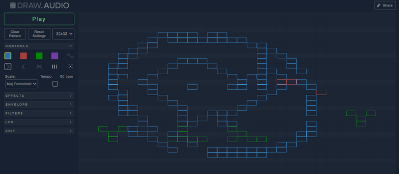

Welcome to this week's **JavaScript Roundup**! In this edition, we’re diving into the latest JavaScript resources, tutorials, and libraries to help you stay up-to-date and inspired. From fresh coding tips to essential tool updates, we’ve gathered some must-read links for developers at all levels. Let’s jump in and see what’s trending in the JavaScript world this Friday!

## How Supermaven and Cursor Are Teaming Up to Rival GitHub Copilot

GitHub Copilot has established itself as a leading AI coding assistant, boasting over 77,000 organizational users. Its value has surpassed GitHub’s acquisition price, solidifying its dominance. However, innovative startups like Cursor and Supermaven are challenging its position by reimagining coding productivity tools powered by advanced AI.

### Cursor: Revolutionizing AI Code Editing

Cursor is a cutting-edge AI-powered code editor enabling developers to streamline coding workflows with the "Tab" key. It has already gained over 40,000 users, including OpenAI, and secured $60 million in Series A funding from major backers like Andreessen Horowitz and OpenAI founders. Cursor is focused on delivering a seamless development experience with tools that emphasize speed and context-aware functionality

### Supermaven: A Smarter Alternative

Supermaven stands out with its long-context processing capabilities, attracting 40,000 developers. Its focus is on crafting a Copilot alternative that is faster and more intuitive. With $12 million in funding from notable investors like Bessemer Venture Partners, Supermaven emphasizes delivering simplicity and performance.

### The Power of Collaboration

[Supermaven](https://supermaven.com/blog/cursor-announcement) and [Cursor](https://www.cursor.com/blog/supermaven) have now joined forces to accelerate their shared vision of redefining developer tools. This partnership will see Supermaven’s plugins integrated into Cursor, while Cursor develops a new, advanced AI model tailored for managing complex code changes in real-time.

### A Competitive AI Landscape

As competition heats up, GitHub Copilot has expanded to include language models from Anthropic, Google, and OpenAI, offering developers more flexibility. This includes support for models like Anthropic’s Claude and Google’s Gemini, with further integrations planned.

The union of Supermaven and Cursor signals a significant step forward in creating innovative and adaptive developer tools, showcasing a viable alternative to Copilot’s dominance while reshaping the AI coding ecosystem.

## 📜 Articles & Tutorials

[Stop Overusing Console.log! Here's Why 🚫 (And Better Alternatives)](https://blog.stackademic.com/stop-overusing-console-log-heres-why-and-better-alternatives-e5e05ea69e75)

[Animate Intrinsic Size With CSS](https://dockyard.com/blog/10/18/2024/animate-intrinsic-size-css)

[Master the Top 5 Essential JavaScript Design Patterns Every Developer Should Know](https://blogs.thnkandgrow.com/mastering-javascript-top-5-design-patterns/)

[Nue 1.0 (RC) — Can it outshine Next.js?](https://nuejs.org/blog/nue-release-candidate/)

[Homemade GPT JS](https://dev.to/trekhleb/homemade-gpt-js-1c1c)

[JavaScript Memory Management and Optimization Techniques for Large-Scale Applications](https://dev.to/shafayeat/javascript-memory-management-and-optimization-techniques-for-large-scale-applications-5e4a)

[CSS Fan Out with Grid and @property](https://frontendmasters.com/blog/css-fan-out-with-grid-and-property/)

[Locale-sensitive text segmentation in JavaScript with Intl.Segmenter](https://developer.mozilla.org/en-US/blog/javascript-intl-segmenter-i18n/)

[How to do distributed locking](https://martin.kleppmann.com/2016/02/08/how-to-do-distributed-locking.html)

[How to Simplify Your Git Commands with Git Aliases](https://www.freecodecamp.org/news/how-to-simplify-your-git-commands-with-git-aliases/)

[Visualizing 13 million BlueSky users](https://joelgustafson.com/posts/2024-11-12/vizualizing-13-million-bluesky-users)

[Docker Cheat-sheet for beginners](https://dev.to/keshav___dev/docker-cheat-sheet-for-beginners-18mo)

[Get the scrollbar width using only CSS](https://css-tip.com/width-scrollbar/)

[Something weird is happening with LLMs and chess](https://dynomight.net/chess/)

[Next.js to htmx — A Real World Example](https://htmx.org/essays/a-real-world-nextjs-to-htmx-port/)

[Next.js 15 Deep Dive: Building a Notes App with Advanced Features](https://www.spithacode.com/blog/nextjs-15-deep-dive-building-notes-app-advanced-features)

[SQLite Index Visualization: Structure](https://mrsuh.com/articles/2024/sqlite-index-visualization-structure/)

[Texture-less Text Rendering](https://poniesandlight.co.uk/reflect/debug_print_text/)

[Node.js Frameworks Roundup 2024 — Elysia / Hono / Nest / Encore — Which should you pick?](https://dev.to/encore/nodejs-frameworks-roundup-2024-elysia-hono-nest-encore-which-should-you-pick-19oj)

[Gleam: A Basic Introduction](https://peq42.com/blog/gleam-a-basic-introduction/)

## ⚒️ Tools

[Tailwind Skeleton Generator](https://skeletongenerator.com/)

[Theme toggle effect](https://theme-toggle.rdsx.dev/)

[3d icon library](https://3dicons.co/)

[draw.audio](https://draw.audio/)

[Bash script to browse YouTube from the terminal](https://github.com/Benex254/yt-x/blob/master/yt-x)

## 📚 Libs

[tuono](https://github.com/Valerioageno/tuono) - Superfast fullstack react framework

[FastGPT](https://github.com/labring/FastGPT) - FastGPT is a knowledge-based platform built on the LLMs, offers a comprehensive suite of out-of-the-box capabilities such as data processing, RAG retrieval, and visual AI workflow orchestration, letting you easily develop and deploy complex question-answering systems without the need for extensive setup or configuration

[unovis](https://github.com/f5/unovis) - Modular data visualization framework for React, Angular, Svelte, Vue, and vanilla TypeScript or JavaScript

[rustubble](https://github.com/warpy-ai/rustubble) - Beautifull components for your terminal

[pgpdf](https://github.com/Florents-Tselai/pgpdf) - pdf type for Postgres

[DOMPurify](https://github.com/cure53/DOMPurify) - a DOM-only, super-fast, uber-tolerant XSS sanitizer for HTML, MathML and SVG. DOMPurify works with a secure default, but offers a lot of configurability and hooks.

[marked](https://github.com/markedjs/marked) - A markdown parser and compiler. Built for speed.

## ⌚ Releases

[MikroORM 6.4 Released](https://mikro-orm.io/blog/mikro-orm-6-4-released)

[Announcing TypeScript 5.7 RC](https://devblogs.microsoft.com/typescript/announcing-typescript-5-7-rc/)

[Expo SDK 52](https://expo.dev/changelog/2024/11-12-sdk-52)

[Storybook 8.4](https://storybook.js.org/blog/storybook-8-4/)

[prometheus v3.0.0 Released](https://github.com/prometheus/prometheus/releases/tag/v3.0.0) - The Prometheus monitoring system and time series database.

[FreeCAD 1.0 Release Candidate 4 is out](https://blog.freecad.org/2024/11/14/freecad-1-0-release-candidate-4-is-out/)

## 📺 Videos

[Full Stack with Next.js 14, Prisma, NextAuth, Pusher & Cloudinary – Build & Deploy a Dating App](https://www.youtube.com/watch?v=JTNBJHba_sE)

[Next.js Full-Stack School Management App Full Tutorial | Role Based School Dashboard Project](https://www.youtube.com/watch?v=6sfiAyKy8Jo)

[Build a 3D Ecommerce Landing Page with Next.js 14, GSAP, Three.js and Prismic - Full Course 2024](https://www.youtube.com/watch?v=RKQqrNyAC6k)

[Generative AI for Developers – Comprehensive Course](https://www.youtube.com/watch?v=F0GQ0l2NfHA)

[Crazy Text Animation with CSS and SVG](https://www.youtube.com/watch?v=lur8SDdUzPI)

[How To Debug React Apps Like A Senior Developer](https://www.youtube.com/watch?v=l8knG0BPr-o)

That’s it for this week’s roundup! We hope you found some useful tools and insights to enhance your JavaScript projects. Be sure to check back next Friday for more JavaScript news and resources. Until then, keep coding and experimenting—JavaScript is always evolving, and so are the possibilities!
