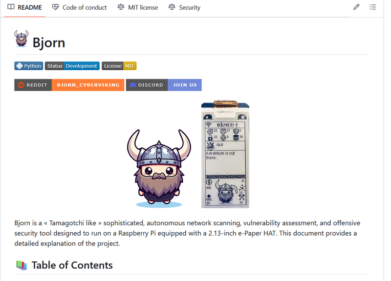
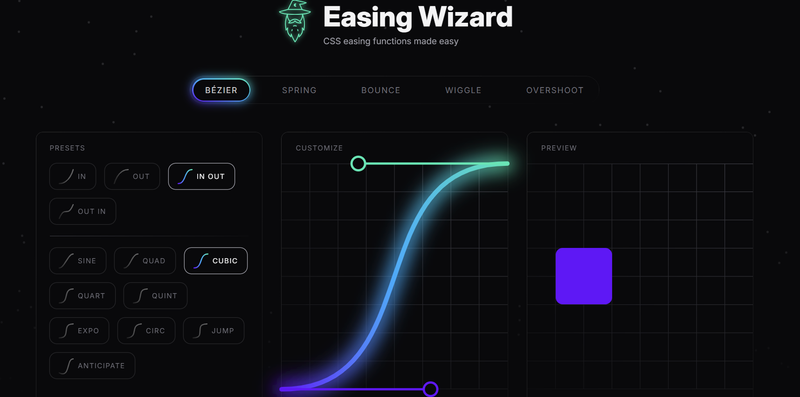
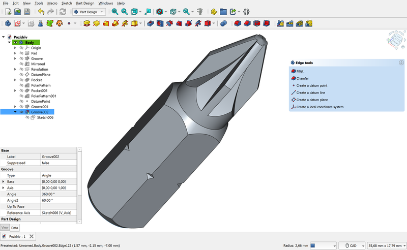

Welcome to this week's edition of Friday Links, where we bring you the most interesting, insightful, and useful JavaScript-related content from around the web. Whether you're a seasoned developer or just starting your JavaScript journey, we've curated resources, tutorials, tools, and news to keep you informed and inspired. Let's dive into the highlights of the week!

## Bjorn — A Viking-Themed Network Scanning and Data Breach Tool with a Twist

A GitHub user known as infinition has [introduced Bjorn](https://github.com/infinition/Bjorn), a unique tool designed for comprehensive network scanning, vulnerability assessment, and even executing attacks. What sets this project apart is its modular structure, which allows for easy expansion through Python scripts, and its gamified presentation.

Bjorn transforms complex cybersecurity tasks into an adventure. Styled like a Tamagotchi game, you guide your virtual Viking companion through network exploits. Successful scans or breaches earn you in-game coins to upgrade your character, blending serious tasks with playful elements.

### Features and Functionality

The current version of Bjorn includes:

- Identification of active hosts and open ports within networks;
- Vulnerability scanning using tools like Nmap and more;
- Brute-force attacks targeting services such as FTP, SSH, SMB, RDP, Telnet, and SQL;
- Data extraction from compromised services.

### What You’ll Need

To bring Bjorn to life, you’ll need:

- A Raspberry Pi Zero W or Zero W2;
- A 2.13-inch e-ink screen with a GPIO driver;
- Optional control via a web interface or the e-ink display.

By combining a fun interface with practical functionality, Bjorn offers not just a tool but a unique experience, appealing to Raspberry Pi enthusiasts and cybersecurity professionals alike. Whether you’re scanning for vulnerabilities or earning coins with your Viking companion, Bjorn makes network security engaging and educational.

## 📜 Articles & Tutorials

[The stereographic projection of the Stern–Brocot tree](https://richardt.io/stereo_stern/)

[Reactive HTML notebooks](https://maxbo.me/a-html-file-is-all-you-need.html)

[The Ultimate Guide to Headless CMS](https://www.builder.io/blog/headless-cms)

[CSS Anchor Positioning Guide](https://css-tricks.com/css-anchor-positioning-guide/)

[What’s the Difference Between HTML’s Dialog Element and Popovers?](https://frontendmasters.com/blog/whats-the-difference-between-htmls-dialog-element-and-popovers/)

[Possible Future CSS: Tree-Counting Functions and Random Values](https://kizu.dev/tree-counting-and-random/)

[How should `<selectedoption>` work?](https://jakearchibald.com/2024/how-should-selectedoption-work/)

[Hyper-responsive web components](https://www.trysmudford.com/blog/hyper-responsive-web-components/)

[5 differences between React server components and server-side rendering](https://www.tymzap.com/blog/5-differences-between-react-server-components-and-server-side-rendering)

[React Anti-Pattern: Stop Passing Setters Down the Components Tree](https://matanbobi.dev/posts/stop-passing-setter-functions-to-components)

[Stop Using .d.ts Files in TypeScript](https://www.danielfullstack.com/article/stop-using-d-ts-files-in-typescript)

[Build and Deploy a ReactJS App to AWS EC2 with Docker, NGINX, and Automate with GitHub Actions.](https://medium.com/@kilamaelie/build-and-deploy-a-reactjs-app-to-aws-ec2-with-docker-nginx-and-automate-with-github-actions-d8c57fb47967)

[Diagram-as-Code: Creating Dynamic and Interactive Documentation for Visual Content](https://differ.blog/inplainenglish/diagram-as-code-creating-dynamic-and-interactive-documentation-for-visual-content-17fb01)

[AAA - Analytical Anti-Aliasing](https://blog.frost.kiwi/analytical-anti-aliasing/)

[Mastering the Abstract Factory Pattern: A Comprehensive Guide](https://www.spithacode.com/blog/abstract-factory-design-pattern)

[Mastering the Prototype Design Pattern: A Comprehensive Guide](https://www.spithacode.com/blog/prototype-design-pattern)

[How to Create Zig-Zag CSS Loaders Using One Element](https://www.freecodecamp.org/news/zig-zag-css-loaders/)

## ⚒️ Tools

[webvm](https://github.com/leaningtech/webvm) - Virtual Machine for the Web

[Easing Wizard](https://easingwizard.com/) - CSS easing functions made easy

[Vratix](https://vratix.com/) - Build APIs Faster, Focus on What Matters.

## 📚 Libs

[Electrobun](https://electrobun.dev/) is a cutting-edge framework designed for developers aiming to build, ship, and maintain ultra-fast, cross-platform desktop applications written entirely in TypeScript. It serves as a "batteries-included" solution, streamlining the app creation process by bundling everything you need—from development to distribution—into a single tool.

[SOYO (Stream On Your Own)](https://github.com/fal3n-4ngel/SOYO) is an open-source project designed to simplify media streaming across a local network without relying on third-party servers or cloud solutions. Created by the developer "fal3n-4ngel," this tool is tailored for users looking to enjoy their personal media collections effortlessly on multiple devices.

[Nova](https://github.com/trynova/nova) - Your favorite javascript and wasm engine

[khoshnus](https://github.com/Amer-Jabar/khoshnus) - A library to bring life to your web writings!

[react-scan](https://github.com/aidenybai/react-scan) - Scan for React performance issues and eliminate slow renders in your app

[MLflow.js](https://www.npmjs.com/package/mlflow-js) - A Javascript Library for MLOps

[responsively-lazy](https://github.com/ivopetkov/responsively-lazy) - Lazy load responsive images and HTML

[sortable](https://github.com/tofsjonas/sortable) - Makes any table with class="sortable", er, sortable. The user can click on a table header and change the sorting of the table rows.

[capacitor](https://github.com/ionic-team/capacitor) - Capacitor lets you run web apps natively on iOS, Android, Web, and more with a single codebase and cross-platform APIs.

## ⌚ Releases

[Meet Angular v19](https://blog.angular.dev/meet-angular-v19-7b29dfd05b84)

FreeCAD is an open-source parametric 3D modeler, crafted to design real-world objects of any scale. Its parametric modeling capabilities empower you to refine your designs effortlessly by revisiting the model history to tweak parameters.

With FreeCAD, you can sketch geometrically constrained 2D shapes and use them as a foundation for creating complex 3D objects. Its robust features include tools for adjusting dimensions and extracting design details, enabling you to generate precise, production-ready drawings.

[FreeCAD 1.0.0](https://github.com/freecad/freecad/releases/tag/1.0.0)

[Introducing Xogot - Godot for iPad](https://xogot.com/)

[payload v3.0.0](https://github.com/payloadcms/payload/releases/tag/v3.0.0) - is the first-ever Next.js native CMS that can install directly in your existing /app folder. It's the start of a new era for headless CMS

## 📺 Videos

[Create a blog with a headless CMS // Full 3-hour course // Astro + Wix Studio](https://www.youtube.com/watch?v=Thudicbgqtg)

[Building more efficient locks with GSAP](https://www.youtube.com/watch?v=8j5yRH4p-B0)

[Coding + Maths = Art - The Beauty of the Balanced Centrifuge Challenge with a Miraculous One-Liner!](https://www.youtube.com/watch?v=MRnbFSTC6cs)

[The ONLY video you need for deploying with Github Actions](https://www.youtube.com/watch?v=GOWmXg6Fhm4)

[Build a Facial Recognition AI using TypeScript with Jack Herrington](https://www.youtube.com/watch?v=Hqlub7d-B1w)

[Let's build a Full Stack E-Commerce App with NEXT.JS 15 (Sanity, Stripe, Clerk, Tailwind, TS)](https://www.youtube.com/watch?v=o-fgWea75O4)

[Git & GitHub Tutorial | Visualized Git Course for Beginner & Professional Developers in 2024](https://www.youtube.com/watch?v=S7XpTAnSDL4)

[The Most Important Design Pattern in React](https://www.youtube.com/watch?v=Lbj3vmp8spI)

That wraps up this week's roundup of JavaScript resources and insights! We hope these links spark new ideas, solve challenges you're facing, or introduce you to exciting tools and techniques. Have something cool to share or feedback on the roundup? Drop us a comment or connect with us on social media.

Until next Friday, happy coding and stay curious!
