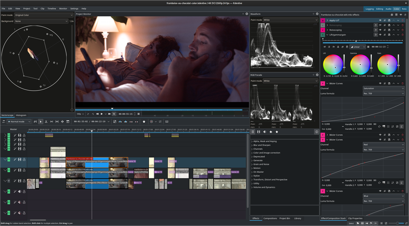

Welcome to another exciting edition of the JavaScript Friday Roundup, your go-to weekly digest for all things JavaScript! This week, we’re diving into some of the most exciting updates, insightful tutorials, and trending discussions from the JavaScript ecosystem. Whether you’re a seasoned developer or just starting, there’s something here to keep you informed and inspired. Let’s jump right in!

## Elon Musk Makes xAI’s Grok Chatbot Free: Here's What You Need to Know

If you’ve been living under a rock or just returned from Mars, here’s some big news: [Grok](https://x.com/i/grok), Elon Musk’s chatbot developed by xAI, is now available for free. This isn’t just an announcement—it’s a groundbreaking moment in AI and human communication. Let’s explore why Grok might become your new best friend and how you can use it to its full potential.

### What is Grok?

Grok isn’t just another chatbot. It’s an advanced AI created by xAI, a company founded to accelerate scientific discovery. Imagine having a mini Einstein in your pocket—minus the disheveled hair and wrinkled pants.

Designed to answer almost any question, Grok offers unique, often unconventional perspectives on human problems while striving for maximum usefulness. Unlike other AI systems, Grok avoids censorship and doesn’t shy away from topics that might make traditional bots like ChatGPT "blush."

xAI prides itself on Grok’s neutrality. It provides information from diverse viewpoints without imposing its own interpretations. While you’ll need to test this claim yourself, my experience suggests there’s little that can faze this chatbot.

### Grok’s Key Advantages

One of Grok’s standout features is its extensive knowledge. While it leans heavily on data from X (formerly Twitter), it also taps into a vast knowledge base, allowing it to cover topics ranging from quantum physics to grandma’s pie recipes.

Stuck on a tough question? Grok doesn’t just provide an answer—it explains it clearly, often with creative flair. Need help coding? It can generate code snippets in Markdown.

Grok is your go-to AI for insightful, uncensored, and practical support across a wide range of challenges.

## Pantone's 2025 Color of the Year: Mocha Mousse 17-1230

[Pantone](https://www.pantone.com/) has named Mocha Mousse 17-1230, a chocolate-brown shade, as its Color of the Year for 2025.

This earthy hue symbolizes harmony with nature and a quest for calm amidst a turbulent world. Its connection to natural textures and materials evokes a sense of coziness and stability.

According to Pantone, this rich brown tone is reminiscent of the delightful qualities of cocoa, chocolate, and coffee, bringing a comforting warmth. Leatrice Eiseman, Executive Director of the Pantone Color Institute, described it as a reflection of "thoughtful indulgence."

### What is the Pantone Color Institute?

The Pantone Color Institute is the research arm of Pantone Inc., dedicated to studying color trends and their influence on various aspects of life. It promotes standardized color classification and is globally recognized for its Pantone Matching System (PMS), widely used in printing, design, fashion, interiors, and more.

Each December, the institute announces the Color of the Year, which serves as a creative guide for designers, marketers, and other industry professionals.

### How is the Color of the Year Chosen?

Pantone’s selection process involves analyzing global trends. Experts monitor popular shades and moods across industries such as fashion, art, technology, film, advertising, interior design, and social media to identify a color that reflects the cultural zeitgeist.

## 19 Global Labs Collaborate to Launch Genesis: The Fastest Open-Source 4D Physics Simulation Engine

A groundbreaking collaboration of 19 leading laboratories worldwide has resulted in the release of [Genesis](https://genesis-embodied-ai.github.io/), the fastest open-source AI engine for 4D physics simulation.

This cutting-edge tool pushes the boundaries of computational physics, enabling unprecedented speed and accuracy in simulating complex phenomena in four dimensions. Genesis is set to revolutionize fields like scientific research, engineering, and virtual reality, offering a powerful resource for innovation and discovery.

[JavaScript is still number one - JetBrains report](https://www.infoworld.com/article/3625652/javascript-is-still-number-one-jetbrains-report.html)

## 📜 Articles & Tutorials

[The Future of CSS: Construct `<custom-ident>` and `<dashed-ident>` values with `ident()`](https://www.bram.us/2024/12/18/the-future-of-css-construct-custom-idents-and-dashed-idents-with-ident/)

[How to Build Dynamic Feature Toggling in React.js](https://www.permit.io/blog/dynamic-react-feature-toggling-2024-guide)

[Maps data visualizations: best practices](https://www.metabase.com/blog/maps-data-visualization)

[Clean Code Essentials: YAGNI, KISS, DRY](https://dev.to/juniourrau/clean-code-essentials-yagni-kiss-and-dry-in-software-engineering-4i3j)

[Build a Command-Line Application With Deno 2.0](https://dev.to/reverentgeek/build-a-command-line-application-with-deno-20-2bh7)

[Integrating Google AdSense with Next.js 14+ for Revenue Generation](https://codaily.dev/blog/nextjs/adding-google-adsense-to-nextjs-14-a-complete-guide)

[How types make hard problems easy](https://mayhul.com/posts/type-driven-design/)

[How I Used Linear Algebra to Build an Interactive Diagramming Editor — and Why Matrix Math is Awesome](https://itnext.io/how-i-used-linear-algebra-to-build-an-interactive-diagramming-editor-and-why-matrix-math-is-d5bd552f2e8d)

[Database Concurrency Patterns For Developers](https://taki-mekhalfa.github.io/misc/2024/11/24/pg-conc-patterns.html)

[Learn Web Scraping with AWS Bedrock Agents](https://pub.towardsai.net/learn-web-scraping-with-aws-bedrock-agents-0ca0b17eb5d1)

## ⚒️ Tools

[Radon IDE for React Native](https://ide.swmansion.com/) - Radon IDE is a VSCode and Cursor extension that turns your editor into a fully featured IDE for React Native and Expo.

[dashy](https://github.com/Lissy93/dashy) - 🚀 A self-hostable personal dashboard built for you. Includes status-checking, widgets, themes, icon packs, a UI editor and tons more!

[SurrealDB](https://github.com/surrealdb/surrealdb) - A scalable, distributed, collaborative, document-graph database, for the realtime web

[Beanheads Vue](https://github.com/Heunsig/beanheads-vue) - Create billions of unique characters by mixing and matching colors, hairstyles, and clothing.

[Frontend Advent Calendar 2024](https://github.com/sadiolem/advent-of-web)

[superfile](https://github.com/yorukot/superfile) - Pretty fancy and modern terminal file manager

[firenvim](https://github.com/glacambre/firenvim) - Embed Neovim in Chrome, Firefox & others.

[dLine](https://github.com/jazz-it/dline) - A sleek and simple calendar for terminal enthusiasts.

[Tig](https://jonas.github.io/tig/) - text-mode interface for Git

[350+ Places to List Your Startup / Saas](https://docs.google.com/spreadsheets/u/0/d/1WAgFtaZno651_6Tw0nmmiYIAsJ3Bm89IRRRQ5helzLY/htmlview)

[Ollama Chat Interface for VSCode](https://github.com/shikaan/ollama-chat)

[NodeTool](https://nodetool.ai/) – Open-Source Visual Builder for AI Workflows

## 📚 Libs

[Moving Icons](https://github.com/jis3r/icons) - beautifully crafted, moving icons. for svelte

[Mizu.js](https://mizu.sh/) - Lightweight HTML templating library for any-side rendering

[SQLCipher](https://github.com/sqlcipher/sqlcipher) - SQLite library that adds 256 bit AES encryption of database files

## ⌚ Releases

[Prisma 6.1](https://github.com/prisma/prisma/releases/tag/6.1.0): Popular ORM for Node.js and TypeScript Now Features GA Tracing

Prisma 6.1, the widely-used ORM for Node.js and TypeScript, introduces General Availability (GA) for Tracing. This update enhances performance monitoring and debugging, solidifying Prisma's position as a go-to tool for developers seeking robust database management solutions.

[JerryScript 3.0](https://github.com/jerryscript-project/jerryscript/releases/tag/v3.0.0): Ultra-Lightweight JavaScript Engine for IoT and Embedded Systems

JerryScript 3.0 is a compact JavaScript engine designed for IoT and embedded applications. It offers full compliance with ECMAScript 5.1 and achieves 84% conformance with the Test262 standard, making it a reliable choice for resource-constrained environments.

[pnpm 10.0 RC 0](https://github.com/pnpm/pnpm/releases/tag/v10.0.0-rc.0)

[ESLint v9.17.0 released](https://eslint.org/blog/2024/12/eslint-v9.17.0-released/)

[Recharts 2.15 released](https://recharts.org/en-US/)

[Kdenlive 24.12.0 Released](https://kdenlive.org/en/2024/12/kdenlive-24-12-0-released/) - Free and Open Source Video Editor

[Elixir 1.18 Released](https://elixir-lang.org/blog/2024/12/19/elixir-v1-18-0-released/)

[Adélie Linux 1.0-BETA6 Released](https://blog.adelielinux.org/2024/12/15/adelie-linux-1-0-beta6-released/)

## 📺 Videos

[Building REST APIs with Next.js 14 – Course for Beginners](https://www.youtube.com/watch?v=aEFkWxUNAVc)

[Next.js Top 7 Security Best Practices (Checklist)](https://www.youtube.com/watch?v=yDjXW-0Gi6k)

[Next.js Full-Stack School Management App Full Tutorial | Role Based School Dashboard Project](https://www.youtube.com/watch?v=6sfiAyKy8Jo)

[SEO in Next.js - The Ultimate Guide (Metadata, Sitemap, Robots, Google Search Console, Caching)](https://www.youtube.com/watch?v=wTGVHLyV09M)

[FREE maps for any app - replace Google maps TODAY](https://www.youtube.com/watch?v=UAQogFwyna0)

[Master 3D Click Positioning in Three.Js in 5 Minutes](https://www.youtube.com/watch?v=Zia-0PRgFPc)

[Build and Deploy an Awwwards Winning Website | React.js, Tailwind CSS, GSAP](https://www.youtube.com/watch?v=zA9r5zTllx4)

That’s it for this week’s roundup! From intriguing tutorials to the latest tools and updates, we hope you found these highlights valuable. JavaScript is ever-evolving, and staying in the loop helps you stay ahead. Have a resource or topic you'd like us to feature? Share it with us, and we might include it in a future edition!

Don’t forget to subscribe for next week’s JavaScript Friday Roundup and stay connected with the JavaScript community. Until then, happy coding!
