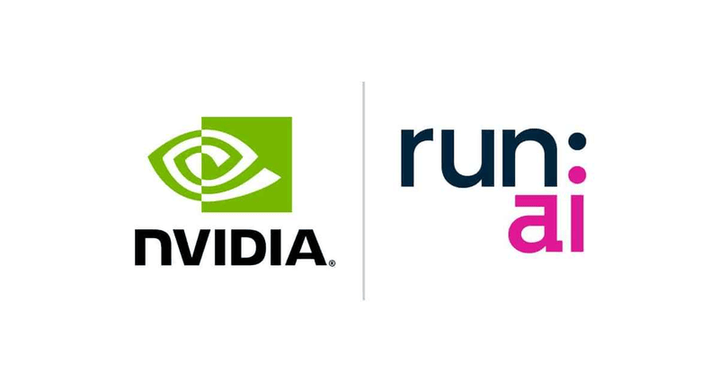
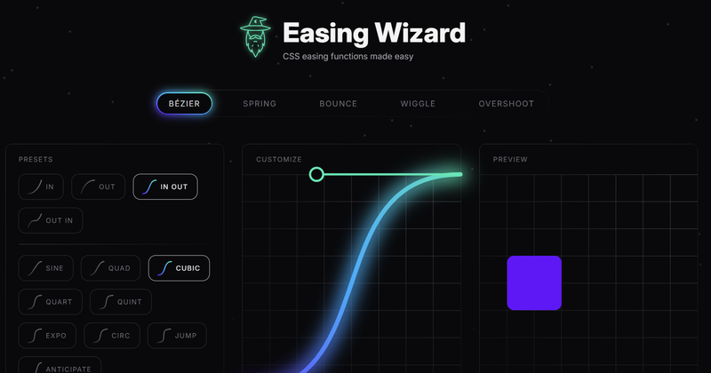
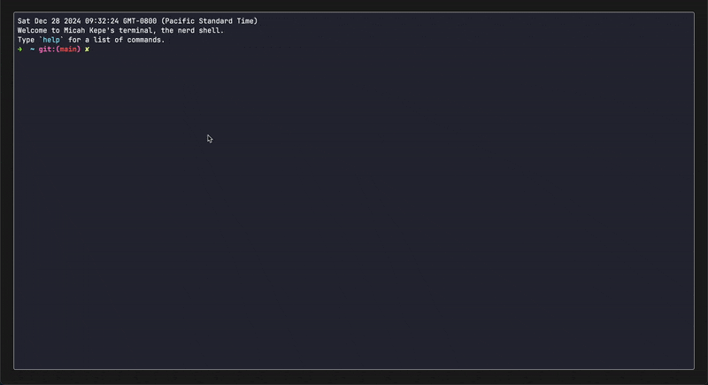
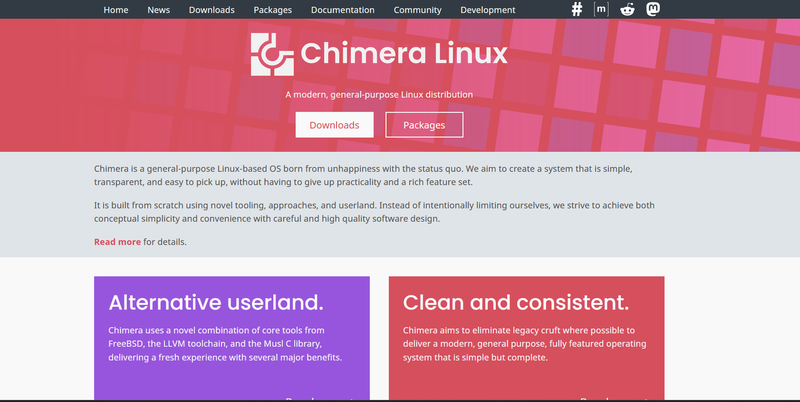

Welcome to Friday Links 14, your curated collection of the most intriguing, helpful, and inspiring finds from across the web this week. Whether you're looking to boost your productivity, dive into tech trends, or just enjoy some light reading, we've got you covered. Grab your favorite drink and explore this week’s top picks!

## Nvidia to Open Source Run:ai

Nvidia has finalized its acquisition of [Run:ai](https://www.run.ai/), an Israeli software company specializing in AI technologies. The American tech giant plans to release the startup's software as open source.

The deal, initially rumored to be valued at 1 billion, was later estimated at 700 million, according to [TechCrunch](https://techcrunch.com/2024/04/24/nvidia-acquires-ai-workload-management-startup-runai/). Financial details, however, remain undisclosed.

Run:ai’s platform optimizes computational workloads and is widely used for managing GPU clusters across data centers. Despite Nvidia's dominance, the company and Run:ai have not clarified their decision to open-source the platform.

Founders Omri Geller and Ronen Dar emphasized that this move will accelerate advancements in AI by broadening the ecosystem. Although Run:ai currently supports only Nvidia GPUs, open-sourcing the platform will make it accessible across the entire AI infrastructure landscape.

Founded in 2018, Run:ai has been pivotal in helping enterprises unlock their AI infrastructure's potential. Nvidia and Run:ai have collaborated since 2020, sharing several mutual clients.

This announcement also comes as Nvidia faces increased regulatory scrutiny, with its market capitalization recently surpassing 3.5 trillion.

## 📜 Articles & Tutorials

[Build a micro-frontend application with React](https://blog.logrocket.com/build-micro-frontend-application-react/)

[Next.js vs React – Differences and How to Choose the Right One for Your Project](https://www.freecodecamp.org/news/nextjs-vs-react-differences/)

[JavaScript Best Practices from JetBrains](https://blog.jetbrains.com/webstorm/2024/10/javascript-best-practices-2024/)

[How We Built a Social Stats Dashboard Using SST and Next.js](https://blog.awsfundamentals.com/social-stats-dashboard-sst-nextjs)

[Drag to Select in React](https://www.joshuawootonn.com/react-drag-to-select)

[Making a Trello clone using htmx](https://www.erikheemskerk.nl/htmx-trello-clone/)

[Next-level frosted glass with backdrop-filter](https://www.joshwcomeau.com/css/backdrop-filter/)

[The Lowdown on Dropdowns in HTML & CSS](https://zeroheight.com/blog/the-lowdown-on-dropdowns-in-html-css/)

[Visual Algebra YouTube lectures](https://www.math.clemson.edu/~macaule/visualalgebra/youtube/)

[Troubleshooting CSS sticky positioning](https://blog.logrocket.com/troubleshooting-css-sticky-positioning/)

[Windows 11 vs. Ubuntu 24.10 Performance](https://www.phoronix.com/review/lunar-lake-windows-linux#google_vignette)

[The Must-Have SEO Checklist for Developers For 2025](https://dev.to/thesohailjafri/the-must-have-seo-checklist-for-developers-192i)

## ⚒️ Tools

[Easing Wizard](https://easingwizard.com/) - CSS easing functions made easy

[CoRemote](https://marketplace.visualstudio.com/items?itemName=Coremote.coremote-vs-extension&ssr=false&ref=producthunt#overview)

CoRemote is an IDE extension that simplifies collaboration by enabling inline discussions directly within your code files. Share insights with your team instantly and make your workflow more seamless and productive.

[Univer Clipsheet](https://github.com/dream-num/univer-clipsheet) - is a powerful Chrome extension for web scraping and data automation. It simplifies the process of extracting, organizing, and managing web data with powerful scraping capabilities and workflow integration.

[route-list](https://github.com/VladimirMikulic/route-list) - Beautifully shows Express/Koa/Hapi/Fastify routes in CLI.

[Bananas🍌](https://github.com/mistweaverco/bananas) - cross-platform, p2p screen 🖥️ sharing 📡 made simple

## 📚 Libs

[Term-website](https://github.com/micahkepe/term-website) is a TypeScript-powered browser terminal built with vanilla TypeScript, HTML, and CSS. It uses [xterm.js](https://xtermjs.org/) for terminal emulation and a mock backend to simulate a shell environment.

[shadcn-table](https://github.com/sadmann7/shadcn-table) - About
Shadcn table with server-side sorting, filtering, and pagination.

[React Bits](https://www.reactbits.dev/) - is an open-source library for React.js. It provides a collection of animated React components and other useful snippets.

[mitmproxy2swagger](https://github.com/alufers/mitmproxy2swagger) - Automagically reverse-engineer REST APIs via capturing traffic

[kotaemon](https://github.com/Cinnamon/kotaemon) - An open-source clean & customizable RAG UI for chatting with your documents. Built with both end users and developers in mind.

[Tuono](https://tuono.dev/) - is a full-stack web framework for building React applications using Rust as the backend with a strong focus on usability and performance.

[Piling.js](https://piling.js.org/) - A JavaScript Library for Interactive Visual Piling of Small Multiples

[Better Auth](https://www.better-auth.com/) - The most comprehensive authentication framework for TypeScript.

[jan](https://github.com/janhq/jan) - Jan is an open source alternative to ChatGPT that runs 100% offline on your computer

[Spack](https://github.com/spack/spack) - is a multi-platform package manager that builds and installs multiple versions and configurations of software. It works on Linux, macOS, Windows, and many supercomputers.

[PawTunes](https://github.com/Jackysi/PawTunes) - The Ultimate HTML5 Internet Radio Player with Purrfect Visuals, Customizable Templates, and Clean Code.

## ⌚ Releases

### Beta Release of Chimera Linux Announced

In late December 2024, the beta version of [Chimera Linux](https://chimera-linux.org/) was released. The distribution combines the Linux kernel with utilities from FreeBSD, the dinit system manager, and the Musl standard C library.

The project is built using the Clang compiler and was founded three years ago by Nina Kolesa from [Igalia](https://www.igalia.com/), known for contributions to WebKit, Enlightenment, and Void Linux.

Live images of Chimera Linux are available for x86_64, ppc64le, aarch64, riscv64, and ppc64 architectures, with GNOME (1.5 GB) and KDE (2.2 GB) desktop environments.

Chimera Linux includes:

- FreeBSD utilities replacing coreutils, findutils, diffutils, sed, and grep.
- GNU Make, util-linux, syslog-ng, udev, PAM, dinit, Clang, LLD, libc++, and Musl (with memory allocation functions replaced by mimalloc).
- ZFS as the filesystem.
- A stateless /var directory.
- PipeWire for multimedia handling and Wayland as the default graphical environment.

Package management features binary packages and a custom source-build system called cports, written in Python, with about 2,800 maintained ports. The build environment runs in an unprivileged container created with bubblewrap. Chimera Linux uses the APK package manager (from Alpine) and optionally supports Flatpak.

[Astro 5.0 Released](https://astro.build/blog/astro-5/)

[Nue 1.0 (RC) — Can it outshine Next.js?](https://nuejs.org/blog/nue-release-candidate/)

[Lottielab 1.0 is live!](https://www.youtube.com/watch?v=vyUaAYo-RpA)

## 📺 Videos

[Monorepos - What, Why, When and How | Full Stack React + Hono Example](https://www.youtube.com/watch?v=KIgPJT806D0)

[BEST Next.js Frontend + NestJS API Combo for 2024!](https://www.youtube.com/watch?v=6v6tuEk2YdM)

[REST API using the Hono framework with Deno](https://www.youtube.com/watch?v=J8kZ-s-5-ms)

[Build a Slider with One Line Of Javascript Code](https://www.youtube.com/watch?v=6PZncvhAZB8)

[CSS Typography Crash Course](https://www.youtube.com/watch?v=WdBNYcWG0Yg)

[Learn React With This ONE Project](https://www.youtube.com/watch?v=G6D9cBaLViA)

[Build Sidebar Like a PRO with Next.js 15 and Shadcn UI!](https://www.youtube.com/watch?v=tWw2H4jxtxM)

[Easily create overlapping sections on a website](https://www.youtube.com/watch?v=gb9s0iBE3ak)

[Full Stack with Next.js 14, Prisma, NextAuth, Pusher & Cloudinary – Build & Deploy a Dating App](https://www.youtube.com/watch?v=JTNBJHba_sE)

[Lets build a Ticket Marketplace SAAS with NEXT.JS 15 (Convex, Stripe Connect, Clerk, Tailwind, TS)](https://www.youtube.com/watch?v=KdYci4gA2os)

[Build and Deploy a Full Stack Google Drive Clone with Next.js 15](https://www.youtube.com/watch?v=lie0cr3wESQ)

[Let's build an SSR Application With Astro + Cloudinary](https://www.youtube.com/watch?v=ui4RCLUzYCA)

That’s a wrap for Friday Links 14! We hope you found something that caught your interest, inspired you, or made your week a little brighter. Don’t forget to share your favorite link with a friend, and check back next Friday for a fresh batch of fascinating finds. Have a fantastic weekend!
