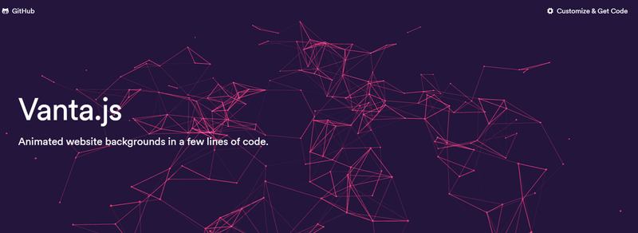

Welcome to another edition of our Weekly JavaScript Roundup, where we gather the most exciting articles, tools, libraries, and updates from the JavaScript ecosystem. Dive into this week’s highlights and stay ahead in your JavaScript journey!

## 📜 Articles & Tutorials

[Evolving GitHub Issues (public preview)](https://github.blog/changelog/2025-01-13-evolving-github-issues-public-preview/)

[Learn to Use GitHub Actions: a Step-by-Step Guide](https://www.freecodecamp.org/news/learn-to-use-github-actions-step-by-step-guide/)

[Learn Yjs in interactive way](https://learn.yjs.dev/)

[How to Build a Dynamic Web Scraper App with Playwright and React: A Step-by-Step Guide](https://www.freecodecamp.org/news/build-a-dynamic-web-scraper-app-with-playwright-and-react/)

[How to Get Started with Bash Scripting for Automation](https://dev.to/aditya8raj/how-to-get-started-with-bash-scripting-for-automation-5d0k)

[Revealed: React's experimental animations API](https://motion.dev/blog/reacts-experimental-view-transition-api)

[iframes and when JavaScript worlds collide](https://gregros.dev/post/iframes-and-when-javascript-worlds-collide)

[Building an AI agent for your frontend project](https://blog.logrocket.com/building-ai-agent-frontend-project/)

[Mastering Docker and Jenkins: Build Robust CI/CD Pipelines Efficiently](https://www.docker.com/blog/docker-and-jenkins-build-robust-ci-cd-pipelines/)

[Build an AI Travel Planner with CopilotKit, LangGraph & Google Maps API 🤩](https://dev.to/copilotkit/build-an-ai-travel-planner-with-copilotkit-langgraph-google-maps-api-32fm)

[CSS text-box-trim](https://developer.chrome.com/blog/css-text-box-trim)

[Extract any Document with Gemini 2.0 | Document Intelligence with ExtractThinker](https://pub.towardsai.net/extract-any-document-with-gemini-2-0-document-intelligence-with-extractthinker-4eda6eed99e5)

[How to Build a Video Subtitle Generator using the Gemini API](https://www.freecodecamp.org/news/build-a-video-subtitle-generator-using-the-gemini-api/)

[How to Use an LLM-Powered Boilerplate for Building Your Own Node.js API](https://itnext.io/how-to-use-an-llm-powered-boilerplate-for-building-your-own-node-js-api-59e9fc11ce95)

[Why we switched to Astro (and why it might interest you)](https://www.datocms.com/blog/why-we-switched-to-astro?ref=dailydev)

[DeepSeek AI: From Prompt Injection To Account Takeover](https://embracethered.com/blog/posts/2024/deepseek-ai-prompt-injection-to-xss-and-account-takeover/)

## ⚒️ Tools

[Bun 1.1.43](https://bun.sh/blog/bun-v1.1.43) - Now with S3 support, HTML bundling, V8 snapshots, and more enhancements.

[Genious](https://genious.name/) - Find Your Perfect Domain Name with AI

[Advanced CSS Gradient Generator](https://codepen.io/Hanzla-Baig/pen/gbYvyVN)

[tillywork](https://github.com/tillywork/tillywork) - Opensource work management solution. Manage your sprints, projects, and sales pipelines in one place

[tabby](https://github.com/TabbyML/tabby) - Self-hosted AI coding assistant

## 📚 Libs

[jason](https://github.com/realfakenerd/jason) - Slash database complexity away with jason.

[The Campsite monorepo](https://github.com/campsite/campsite)

[DBOS Transact](https://github.com/dbos-inc/dbos-transact-ts) - A Lightweight Durable Execution Library Built on Postgres

[neutrix](https://github.com/duriantaco/neutrix) - A type-safe state management solution for React

[run-if-changed](https://github.com/hkdobrev/run-if-changed) - Run a command if a file changes via Git hooks

[Vanta.js](https://www.vantajs.com/) - Animated website backgrounds in a few lines of code.

[boardgame.io](https://boardgame.io/) - State management and multiplayer networking for turn-based games.

[web-ui](https://github.com/browser-use/web-ui) - Run AI Agent in your browser.

## ⌚ Releases

[Node.js v23.6.0 enables executing TypeScript by default](https://nodejs.org/en/blog/release/v23.6.0)

[Kreya 1.16 with WebSocket support released – Postman Alternative](https://kreya.app/blog/kreya-1.16-whats-new/)

[Nextra 4 x App Router. What's New and Migration Guide](https://the-guild.dev/blog/)

[React Native 0.78 RC.0 Released](https://github.com/facebook/react-native/releases/tag/v0.78.0-rc.0)

[React Query 5.63](https://github.com/TanStack/query/releases/tag/v5.63.0) introduces the ability for `useQuery` and `useQueries` to unsubscribe from the query cache. This feature is especially useful for scenarios like unsubscribing from hidden React Native stack screens, including their ongoing queries. It provides a more flexible and granular alternative to `react-freeze`.

[Edge-to-Edge 1.3](https://github.com/zoontek/react-native-edge-to-edge/releases/tag/1.3.0) - Effortlessly enable edge-to-edge display in React Native (formerly known as react-native-bars).

[DiceDB is now open source](https://dicedb.io/blog/dicedb-is-open-source/?ref=dailydev)

## 📺 Videos

[Rapid Web Design with Wix Studio - 2025 Crash Course](https://www.youtube.com/watch?v=pjVS-TlEm4o)

[All the ways HTML gets to your browser](https://www.youtube.com/watch?v=Cifkb-ZVps4)

[Crush Your JavaScript Bugs With Records and Tuples](https://www.youtube.com/watch?v=w_dEfCWol4k)

[Build a Fullstack Project Management App with Next.js 15, Supabase, Shadcn, Resend, DnD Kit & Tiptap](https://www.youtube.com/watch?v=jUrbJ2y-xmo)

[Next.js Tutorial 2025 - Build a Full Stack Social App with React & Next.js](https://www.youtube.com/watch?v=vUYopHWOURg)

[React Native Course – Android and iOS App Development](https://www.youtube.com/watch?v=obH0Po_RdWk)

[Elasticsearch Course for Beginners](https://www.youtube.com/watch?v=a4HBKEda_F8)

[Reddit Clone - Full Tutorial w/ TypeScript, React & Convex](https://www.youtube.com/watch?v=N2vE2bP5Mok)

[Build Your First Mobile Application | React Native Real Estate App](https://www.youtube.com/watch?v=CzJQEstIiEI)

[SEO in Next.js - The Ultimate Guide (Metadata, Sitemap, Robots, Google Search Console, Caching)](https://www.youtube.com/watch?v=wTGVHLyV09M)

[New CSS Features In 2024 You Should Know About](https://www.youtube.com/watch?v=Bfdqyws-Ixw)

[React Table with Next.js, ShadCN, TanStack | Nextjs Full Stack Project](https://www.youtube.com/watch?v=ereMZIC1wac)

[I built a REAL Desktop App with both Tauri and Electron](https://www.youtube.com/watch?v=CEXex3xdKro)

That’s it for this week’s JavaScript roundup! Stay tuned for more updates and resources next Friday. Don’t forget to share your favorite finds or let us know if there’s a tool, library, or article we should feature next time. Happy coding!
