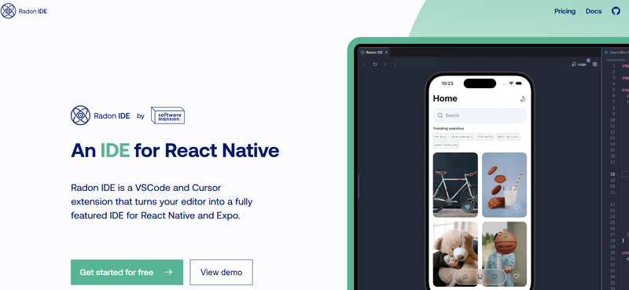
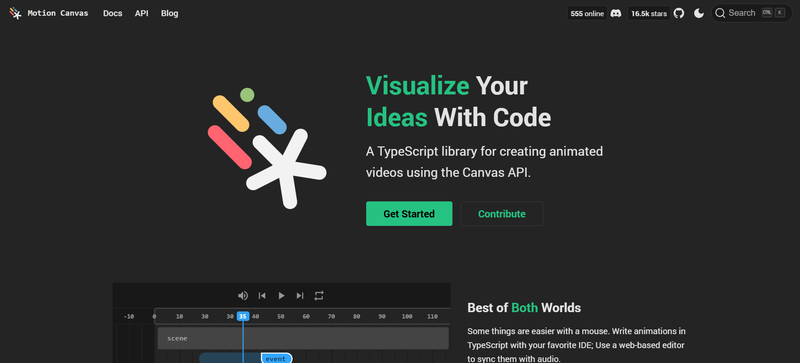

Welcome to another edition of the Weekly JavaScript Roundup! This week, we’ve gathered an exciting mix of tools, libraries, and tutorials designed to enhance your development workflow. Whether you're looking for performance optimization tips, new libraries to explore, or inspiration for your next project, we’ve got something for everyone. Stay updated on the latest trends shaping the JavaScript ecosystem and dive right in!

[SITUATIONAL AWARENESS: The Decade Ahead](https://situational-awareness.ai/) - Situational Awareness AI offers advanced AI-driven solutions to enhance real-time decision-making. It empowers organizations with actionable insights for critical operations.

## 📜 Articles & Tutorials

[All-in-one code editor using React and SandPack](https://salehmubashar.com/blog/sandpack-react-code-editor)

[How to Setup a CI/CD Pipeline with GitHub Actions and AWS](https://www.freecodecamp.org/news/how-to-setup-a-ci-cd-pipeline-with-github-actions-and-aws/)

[Mastering SVG Arcs](https://www.smashingmagazine.com/2024/12/mastering-svg-arcs/)

[Responsive Tables & Readable Paragraphs](https://frontendmasters.com/blog/responsive-tables-readable-paragraphs/)

[Running animations without keyframes](https://css-tip.com/animation-without-keyframes/)

[Hosting a Next.js (App Router) app on Amazon S3](https://dev.to/lanzone31/hosting-a-nextjs-app-router-app-on-amazon-s3-5al6)

[I Spent $10 Million on Paid Traffic, Here's What I Learned...](https://get.adskills.com/27-tips/)

[Storage Browser for Amazon S3](https://ui.docs.amplify.aws/react/connected-components/storage/storage-browser)

[Building a 100% Local mini-ChatGPT](https://blog.dailydoseofds.com/p/building-a-100-local-mini-chatgpt)

[Start Your Free Database and API Service in Just 10 Minutes！🔥🔥🔥(With GitHub repository)](https://dev.to/daniel_jones/quick-guide-build-a-backend-api-service-in-minutes-with-cloudflare-pages-d1-database-nextjs-4njj)

## ⚒️ Tools

[Lightpanda](https://github.com/lightpanda-io) - the headless browser designed for AI and automation

[beszel](https://github.com/henrygd/beszel) - Lightweight server monitoring hub with historical data, docker stats, and alerts.

[Radon IDE](https://ide.swmansion.com/) - Radon IDE is a lightweight, modern development environment designed for web and mobile developers. It features seamless debugging, smart code completion, and support for popular frameworks like React, Vue, and Angular. With built-in collaboration tools, a customizable interface, and powerful integrations, Radon IDE streamlines your workflow and boosts productivity.

[Motion Canvas](https://motioncanvas.io/) - Motion Canvas is a powerful animation tool that simplifies the process of creating interactive animations for the web. With a user-friendly interface and a wide range of features, Motion Canvas enables you to design stunning animations without writing a single line of code. Whether you’re a beginner or an experienced developer, Motion Canvas offers a seamless animation experience that brings your designs to life.

[JReleaser](https://jreleaser.org/) - JReleaser is a powerful, flexible release automation tool for Java developers, designed to streamline the process of releasing projects across multiple platforms. Its primary goal is to simplify the creation of release assets, including JARs, native installers, Docker images, and more, while automating the publishing process to various distribution platforms like GitHub, GitLab, and Maven Central. It supports Java, Go, Node, Rust, Zig, Swift, Perl, Python, C/C++, C#, Elixir, Haskell, Ruby, Crystal, and more.

## 📚 Libs

[pino](https://github.com/pinojs/pino) - Pino is a fast, lightweight logger for Node.js applications. It offers high performance, low overhead, and a simple API for logging messages to the console or a file. With support for custom serializers, log levels, and multiple transports, Pino is a versatile logging solution that scales with your application.

[litdb](https://github.com/litdb/litdb) - Lightweight RDBMS agnostic TypeScript/JS abstraction for SQLite, PostgreSQL and MySQL

[graphql-zeus](https://github.com/graphql-editor/graphql-zeus) - GraphQL Zeus is a powerful tool that generates TypeScript types and React hooks based on your GraphQL schema. By analyzing your schema, GraphQL Zeus creates a type-safe API that simplifies data fetching and management in your application. With support for custom queries, mutations, and subscriptions, GraphQL Zeus streamlines the development process and ensures type safety across your codebase.

[jsvectormap](https://github.com/themustafaomar/jsvectormap) - JSVectorMap is a lightweight JavaScript library for creating interactive vector maps on the web. With support for custom markers, tooltips, and zooming capabilities, JSVectorMap enables you to visualize geographic data in a user-friendly format. Whether you’re building a data visualization tool, a location-based application, or an interactive map, JSVectorMap offers a flexible and customizable solution for your mapping needs.

[readest](https://github.com/readest/readest) - Readest is a lightweight, fast, and customizable JavaScript library for creating responsive, accessible, and user-friendly reading experiences on the web. With support for custom themes, fonts, and layouts, Readest enables you to design beautiful and engaging reading interfaces that adapt to different screen sizes and devices. Whether you’re building a blog, a news site, or an e-book reader, Readest offers a seamless reading experience that enhances user engagement and retention.

[notion-blog](https://github.com/wildcatco/notion-blog) - Next.js blog template that uses Notion as CMS

[video-starter-kit](https://github.com/fal-ai-community/video-starter-kit) - Open-source project that demonstrates AI models for video producing on the browser

[dbos-transact-ts](https://github.com/dbos-inc/dbos-transact-ts) - Ultra-Lightweight Durable Execution in TypeScript

## ⌚ Releases

[Storybook 8.5 released](https://storybook.js.org/blog/storybook-8-5/) - Storybook 8.5 introduces new features, improvements, and bug fixes that enhance the developer experience and streamline the workflow for building UI components. With support for custom themes, accessibility improvements, and enhanced performance, Storybook 8.5 offers a powerful toolset for designing and testing UI components in isolation.

[Bun 1.2 Is Released](https://bun.sh/blog/bun-v1.2)

[Tailwind CSS v4.0](https://tailwindcss.com/blog/tailwindcss-v4)

## 📺 Videos

[React State Management – Intermediate JavaScript Course](https://www.youtube.com/watch?v=-bEzt5ISACA)

[Docker Image BEST Practices - From 1.2GB to 10MB](https://www.youtube.com/watch?v=t779DVjCKCs)

[Video Calling Interview Platform: Build a Full Stack Project with React & Next.js](https://www.youtube.com/watch?v=xEnnRNH_lyw)

[Tailwind CSS Animations That Will BLOW Your Mind!](https://www.youtube.com/watch?v=W7q03JHRqSQ)

[FREE Ethical Hacking course (70 hours & includes Kali Linux labs)](https://www.youtube.com/watch?v=htez3rhhPO8)

[Build & Deploy a Full Stack AI Sass application using Next.js 15, Supabase, Replicate API and Stripe](https://www.youtube.com/watch?v=7AQNeii5K7E)

[Build and Deploy a Fullstack App with Admin Dashboard | Next.js, PostgreSQL, Redis, Auth.js](https://www.youtube.com/watch?v=EZajJGOMWas)

That’s it for this week’s JavaScript Roundup! We hope you found these resources and updates helpful. Keep exploring new ideas, experimenting with cutting-edge tools, and sharpening your skills. Don’t forget to share your favorite insights with the community. See you next Friday for another dose of JavaScript inspiration!
