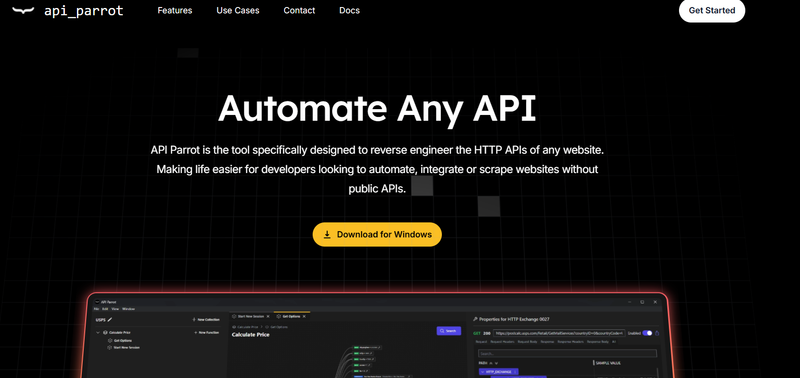
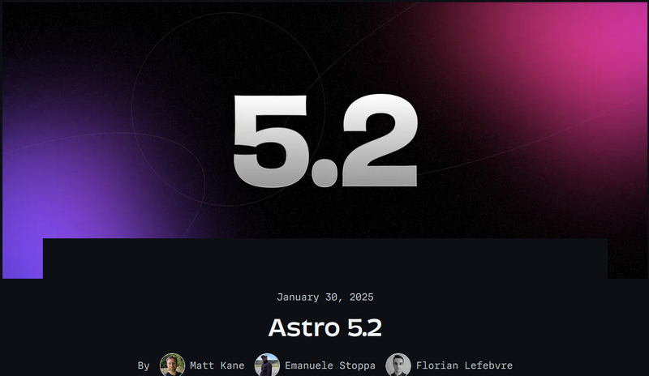
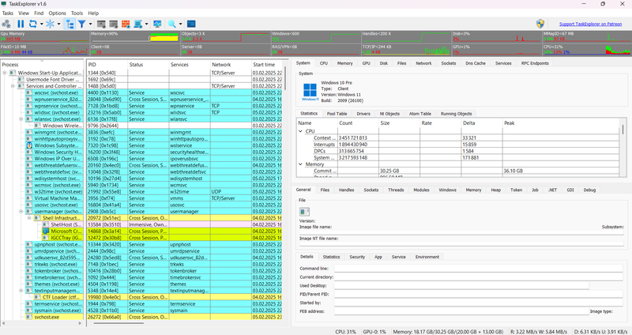
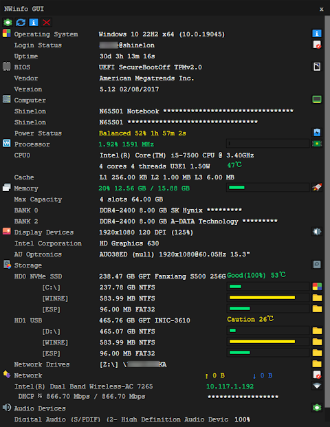

Welcome to this week’s JavaScript Roundup! Every Friday, we bring you the latest news, insightful articles, and useful resources from the JavaScript ecosystem. Whether you're a frontend developer, a Node.js enthusiast, or just keeping up with the latest trends, these links will keep you informed and inspired.

## 📜 Articles & Tutorials

[How to Build an Analytical Dashboard with Next.js](https://www.freecodecamp.org/news/build-an-analytical-dashboard-with-nextjs/)

[What is CSS Subgrid? A Practical Tutorial](https://www.freecodecamp.org/news/what-is-css-subgrid)

[Web-Slinger.css: Across the Swiper-Verse](https://css-tricks.com/web-slinger-css-across-the-swiper-verse/)

[Dynamic Focus Zoom Effect with CSS @property](https://www.jomaendle.com/blog/focus-zoom-at-property)

[The Must-Have SEO Checklist for Developers For 2025](https://dev.to/thesohailjafri/the-must-have-seo-checklist-for-developers-192i)

[Creating an Angled Slider](https://frontendmasters.com/blog/creating-an-angled-slider/)

[Build a Local Notion with an AI Agent Assistant 🤖](https://dev.to/copilotkit/work-smarter-in-notion-add-a-copilot-with-copilotkit-50be)

[Pure CSS Mixin for Displaying Values of Custom Properties](https://kizu.dev/preview-mixin/)

[The modern way to write JavaScript servers](https://marvinh.dev/blog/modern-way-to-write-javascript-servers/)

[Building a QR Code HTML Web Component](https://scottjehl.com/posts/q-r/)

[Building a simple blog architecture](https://www.allanfernandes.dev/blog/next-js-blog-using-app-router)

[Create Scroll Animations with just CSS](https://blog.openreplay.com/create-scroll-animations-with-just-css/)

[What’s new in Svelte: February 2025](https://svelte.dev/blog/whats-new-in-svelte-february-2025)

[Which rich text editor framework should you choose in 2025?](https://liveblocks.io/blog/which-rich-text-editor-framework-should-you-choose-in-2025)

[Positioning Text Around Elements With CSS Offset](https://css-tricks.com/positioning-text-around-elements-with-css-offset/)

[Transitioning Top-Layer Entries And The Display Property In CSS](https://www.smashingmagazine.com/2025/01/transitioning-top-layer-entries-display-property-css/)

## ⚒️ Tools

[RustDesk](https://rustdesk.com/) - A secure, open-source remote desktop client for Windows, macOS, and Linux. RustDesk is built with Rust and uses the Tauri framework for the frontend. It offers features like file transfer, clipboard sharing, and multi-monitor support, making it a versatile tool for remote work and IT support.

[SolidTime](https://solidtime.io/) - A privacy-focused time tracking app built with SolidJS and Tailwind CSS. SolidTime allows users to track their work hours and generate reports without compromising their data privacy. It's a lightweight, fast, and secure alternative to traditional time tracking tools.

[Scroll-driven Animations](https://scroll-driven-animations.style/)

[Every Hex Codes](https://www.everyhex.codes/) - A collection of every possible hex color code, from #000000 to #FFFFFF. Every Hex Codes provides a visual representation of all 16,777,216 hex colors, making it a handy reference for designers and developers.

[eliza](https://elizaos.github.io/eliza/) - is a simple, fast, and lightweight AI agent framework

[Screenshot to Code](https://screenshottocode.com/) - A tool that converts screenshots of websites into HTML and CSS code. Screenshot to Code uses machine learning to analyze images and generate code snippets, helping developers recreate web designs more efficiently.

[API Parrot](https://apiparrot.com/) - A tool for mocking and testing APIs without writing code. API Parrot lets you create custom API endpoints, define responses, and simulate different scenarios to test your applications' behavior. It's a useful tool for frontend developers, QA engineers, and API designers.



[vuelessui](https://vueless.com/) - A minimalistic UI framework for Vue.js applications. VuelessUI focuses on simplicity and performance, providing essential components like buttons, forms, and modals without unnecessary bloat. It's designed to be lightweight and easy to customize, making it ideal for building fast and responsive web applications.

[FinetuneDB](https://finetunedb.com/) - is an AI fine-tuning platform that enables users to create and manage datasets for customizing large language models (LLMs). It offers a collaborative editor for team-based dataset building, tools for evaluating model performance with human and AI feedback, and features for collecting production data to refine models. The platform also provides a prompt playground for optimizing interactions between users and AI models. Developers can integrate FinetuneDB into their applications using SDKs compatible with the OpenAI framework. FinetuneDB emphasizes security with encrypted data transmission and strict permission controls.

## 📚 Libs

[TargetJS](https://github.com/livetrails/targetjs) - A Novel JavaScript UI framework designed to simplify development and enhance animations. TargetJS offers a unique approach to building user interfaces, focusing on simplicity and performance. It provides a declarative syntax for creating components and animations, making it easy to develop interactive web applications. TargetJS is built with modern web technologies and aims to streamline the development process while delivering engaging user experiences.

[visprex](https://github.com/visprex/visprex) - Visualise your CSV files in seconds without sending your data anywhere

[screen-sharing](https://github.com/tonghohin/screen-sharing) - A simple screen sharing library for web applications. screen-sharing uses WebRTC technology to enable real-time screen sharing between users, making it ideal for remote collaboration and online meetings. It provides a straightforward API for integrating screen sharing functionality into web applications, allowing users to share their screens with minimal setup.

[blendy](https://github.com/TahaSh/blendy) - Smoothly transition one element into another with just a few lines of code.

[Waveform Renderer](https://waveform-renderer.vercel.app/) - A lightweight and customizable TypeScript library for rendering audio waveforms on HTML canvas. Create beautiful, interactive audio visualizations with ease.

[plotly.js](https://github.com/plotly/plotly.js) - Open-source JavaScript charting library behind Plotly and Dash

[emittery](https://github.com/sindresorhus/emittery) - Simple and modern async event emitter

[jsontr.ee](https://github.com/xzitlou/jsontr.ee) - A JSON transformer and formatter for the web

[jscanify](https://github.com/puffinsoft/jscanify) - The Javascript document scanning library.

[fumadocs](https://github.com/fuma-nama/fumadocs) - The beautiful docs framework with Next.js.

[maily.to](https://github.com/arikchakma/maily.to) - Craft beautiful emails effortlessly with Maily, the powerful email editor that ensures impeccable communication across all major clients.

[superfile](https://github.com/yorukot/superfile) - Pretty fancy and modern terminal file manager

## ⌚ Releases

[Astro 5.2 Released](https://astro.build/blog/astro-520/): Tailwind 4, TOML Support, and Improved Redirects



The Astro framework has released version 5.2, introducing support for Tailwind 4, TOML frontmatter in Markdown, and an enhanced redirect logic for trailing slashes in URLs. Additionally, there's an experimental feature to disable React streaming for better compatibility with certain libraries.

**🚀 Tailwind 4 Support**
Astro now includes the @tailwindcss/vite plugin by default, making it easier to integrate Tailwind into projects. The old integration method via `@astrojs/tailwind` remains available for previous Astro versions.

**📝 TOML Frontmatter**

Astro now supports TOML for frontmatter in Markdown pages, making it more compatible with frameworks like Hugo. To enable TOML, wrap the frontmatter in triple plus (`+++`) signs:

```toml
+++
date = 2025-01-30
title = "Use TOML frontmatter in Astro!"
[params]
  author = "Houston"
+++
```

**🔄 Improved Redirects for URLs with Slashes**

Astro now ensures that URLs like `/about/`, `/about`, and `/about///` correctly resolve to the intended page. During development, redirects are disabled to help catch potential issues. To enable redirects, update `astro.config.mjs`:

```js
export default defineConfig({
  adapter: node({ mode: 'standalone' }),
  trailingSlash: 'never', // or 'always'
});
```

Astro 5.2 continues to refine performance and developer experience, making it an even more powerful framework for modern web development.

[Mozilla Thunderbird 135.0 Released](https://www.thunderbird.net/en-US/thunderbird/135.0/releasenotes/)

[TaskExplorer 1.6.0 Released](https://github.com/DavidXanatos/TaskExplorer/releases): Advanced Task Manager for Windows



The open-source project [TaskExplorer](https://github.com/DavidXanatos/TaskExplorer) has released version 1.6.0, offering an advanced task management tool for Windows 7 and later. Unlike traditional task managers, TaskExplorer focuses not only on monitoring running applications but also on analyzing their activities in detail.

Built with C and C++, the project's source code is available on GitHub under the GNU General Public License v3.0. TaskExplorer was first introduced in October 2019, and this latest version continues to refine its capabilities for system administrators, developers, and users managing legacy hardware.

[NWinfo 1.1.1 Released](https://github.com/a1ive/nwinfo/releases/tag/v1.1.1): Portable System Info Tool for Windows



On February 4, 2025, the lightweight open-source project [NWinfo 1.1.1](https://github.com/a1ive/nwinfo/releases/tag/v1.1.1) was released. This portable system information tool provides a quick overview of key PC details, from hardware specifications to software insights. It runs on Windows XP and newer, making it a versatile tool for both tech enthusiasts and troubleshooting professionals.

[NWinfo](https://a1ive.github.io/nwinfo/) displays essential data on the CPU, memory, disks, network, and system status, all within an intuitive interface. It also generates detailed logs in JSON, YAML, and LUA formats for easy sharing and diagnostics.

[Ruck 9.0](https://ruck.tech/) - A React Webapp Framework for Deno

## 📺 Videos

[Create a Job Board SaaS with Next.js, Inngest, Auth.js, Arcjet and Tailwind | 2025](https://www.youtube.com/watch?v=lVg7kBhz2KE)

[How I used CODE to Create Paper Like Images](https://www.youtube.com/watch?v=RNRhNIk26Ow)

[Create a super fun "focus by negation" effect](https://www.youtube.com/watch?v=ReMCo2hkUAM)

[My Biggest Tutorial Ever (Build A FULL Google Drive Clone with React, Next, TypeScript and more)](https://www.youtube.com/watch?v=c-hKSbzooAg)

[Data Structures and Algorithms Crash Course](https://www.youtube.com/watch?v=Ndvm7Ge4pic)

[Build a Fullstack Project Management App with Next.js 15, Supabase, Shadcn, Resend, DnD Kit & Tiptap](https://www.youtube.com/watch?v=tZKeTSZmvTA)

[Heroku Is Dead, Here's What I Recommend](https://www.youtube.com/watch?v=prjMJtXCR-g)

[Simple CSS Animation Effects](https://www.youtube.com/watch?v=I20qfWRcgb8&ab_channel=OnlineTutorials)

[Why I Use Linux](https://www.youtube.com/watch?v=7-UCkYlTr50)

[Ultimate Next 15 Course: Build a YouTube Clone (2025)](https://www.youtube.com/watch?v=ArmPzvHTcfQ&ab_channel=CodeWithAntonio)

[Strapi 5 and Next.js 15 Full Stack Project Course](https://www.youtube.com/watch?v=Q-cPtlYG1cY&ab_channel=freeCodeCamp.org)

[Build Full Stack LMS Website using MERN Stack | Create Full Stack React JS Project 2025](https://www.youtube.com/watch?v=XZj4hmbNdSE&ab_channel=GreatStack)

[Programmatic SEO in Next.js 15 - Full Guide](https://www.youtube.com/watch?v=290Ytj96vL4&ab_channel=CodinginFlow)

That’s it for this week’s JavaScript Roundup! Stay tuned for more updates next Friday, and feel free to share any interesting JavaScript-related finds in the comments. Happy coding!
