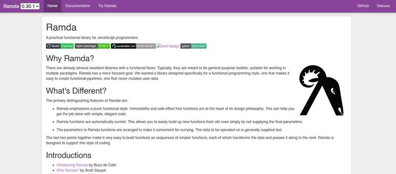

Welcome to this week’s edition of the JavaScript Friday Links! Whether you're a frontend developer, backend expert, or just exploring the world of JavaScript, we've got you covered. This week’s roundup includes must-read articles, exciting tools, and insightful discussions shaping the JavaScript ecosystem.

## 📜 Articles & Tutorials

## Ramda.js: Enhancing Array and Object Operations in JavaScript



[Ramda.js](https://ramdajs.com/) is a powerful functional programming library for JavaScript. Unlike Lodash, it focuses on code purity, supports currying, and ensures data immutability.

### Key Features

**Currying**

Allows calling functions step by step:

```js
import * as R from 'ramda';

import * as R from 'ramda';

const add = R.add(10);
console.log(add(5)); // 15
```

**Function Composition**

Replaces `.map().filter().reduce()` chains with more readable code:

```js
const normalizeNames = R.pipe(
  R.map(R.trim),
  R.map(R.toLower),
  R.filter(name => name.length > 3)
);
```

**Working with APIs**

Filtering active users and normalizing their names:

```js
const processUsers = R.pipe(
  R.filter(R.propEq('active', true)),
  R.map(R.pipe(R.prop('name'), R.trim, R.toLower))
);
```

**Objects: assoc, dissoc, evolve**

Modify objects without mutations:

```js
const user = { id: 1, name: 'Alice', age: 25 };
const updatedUser = R.assoc('status', 'active', user);
const withoutAge = R.dissoc('age', updatedUser);
```

**Data Grouping**

```js
const groupedOrders = R.groupBy(R.prop('status'), orders);
```

### When is Ramda Not Needed?

For simple operations, standard methods like map, filter, and reduce are often more convenient. Ramda is beneficial for complex transformations, ensuring immutability, and writing declarative code.

[Build your own chrome extension](https://www.allanfernandes.dev/blog/build-your-own-chrome-extension)

[Frontend Automation with Github Actions and AWS](https://techhub.iodigital.com/articles/frontend-automation-with-github-actions-and-aws)

[React Image Editor: Load and Save Images from a Database Easily](https://www.syncfusion.com/blogs/post/load-save-image-in-react-image-editor)

[Fuzz Testing REST APIs in Node.js](https://blog.appsignal.com/2025/01/22/fuzz-testing-rest-apis-in-nodejs.html)

[A CSS-Only Star Rating Component and More!](https://css-tricks.com/a-css-only-star-rating-component-and-more-part-1/)

[Micro Frontends with Angular and Native Federation](https://blog.angular.dev/micro-frontends-with-angular-and-native-federation-7623cfc5f413)

[Building a VSCode Chat Extension to Order Lunch](https://neon.tech/blog/building-a-vscode-chat-extension-to-order-lunch)

[Building a Telegram Clone with Next.js and TailwindCSS - Part One](https://tropicolx.hashnode.dev/building-a-telegram-clone-with-nextjs-and-tailwindcss-part-one), [two](https://tropicolx.hashnode.dev/building-a-telegram-clone-with-nextjs-and-tailwindcss-part-two), [three](https://tropicolx.hashnode.dev/building-a-telegram-clone-with-nextjs-and-tailwindcss-part-three)

## ⚒️ Tools

[shadcn UI theme generator](https://zippystarter.com/tools/shadcn-ui-theme-generator)

[Modern fluid typography editor](https://modern-fluid-typography.vercel.app/)

[lume](https://github.com/trycua/lume): A lightweight CLI and local API server to create, run and manage macOS and Linux virtual machines (VMs) natively on Apple Silicon.

[Agno](https://github.com/agno-agi/agno): A lightweight library for building Multimodal Agents with memory, knowledge and tools.

[ricochet](https://github.com/ricochet-im/ricochet): A peer-to-peer instant messaging system built on Tor hidden services.

## 📚 Libs

[Usertour](https://github.com/usertour/usertour): An alternative to: Appcues, Userpilot, Userflow, userguiding, Chameleon , Etc...

[Algora TV](https://github.com/algora-io/tv): A React component to embed a live streaming video player.

[Drag-and-Drop-Email-Designer](https://github.com/SendWithSES/Drag-and-Drop-Email-Designer): A drag and drop email designer for SES.

[Pruvious](https://github.com/pruvious/pruvious/tree/v4): A reliable CMS for your Nuxt app.

[webjsx](https://github.com/webjsx/webjsx): A library for building web applications with JSX and Web Components.

[kreuzberg](https://github.com/Goldziher/kreuzberg): A text extraction library supporting PDFs, images, office documents and more

[Memory](https://github.com/yousboot/Memory): A self-hosted editor and note taking app.

[InfoShop](https://github.com/NifrasUsanar/InfoShop): Free and open source laravel + Inertia JS (React JS) Point of Sale platform

[fast-png](https://github.com/image-js/fast-png):PNG image decoder and encoder written entirely in JavaScript.

[mercurius](https://github.com/mercurius-js/mercurius): A GraphQL HTTP Server for Fastify with TypeScript and hooks support.

## ⌚ Releases

[AI SDK 4.1](https://vercel.com/blog/ai-sdk-4-1): Vercel AI SDK 4.1 is out with new features and improvements.

[Next.js 15.2 Released](https://nextjs.org/blog/next-15-2)

[Astro 5.4](https://astro.build/blog/astro-540/): Astro 5.4 is out with new features and improvements.

[Bun v1.2.3 Released](https://bun.sh/blog/bun-v1.2.3)

[ESLint v9.21.0 Released](https://eslint.org/blog/2025/02/eslint-v9.21.0-released/)

[Angular v19.2 Released](https://github.com/angular/angular/releases/tag/19.2.0)

[Ember 6.2 Released](https://blog.emberjs.com/ember-released-6-2/)

## 📺 Videos

[How To Setup Rich Text Editor In Next.js](https://www.youtube.com/watch?v=mKIQZNKdU2w&t=915s)
[Build your first MCP Server in TypeScript](https://www.youtube.com/watch?v=8m-O_KiHRjk)

[New React Animation API Is Insane](https://www.youtube.com/watch?v=OTP4hhX_xpM)

[The BEST UI Animation Library of 2025? 🤯 You NEED to See This!](https://www.youtube.com/watch?v=bMqi1ujAgUc)

[Using web sockets on Next.js | NO third party solution](https://www.youtube.com/watch?v=9DEvkYB5_A4)

[CSS Clamp: Responsive design in one line](https://www.youtube.com/watch?v=w11cMyzKQ2A)

[Stream Video In React & Next.js OPTIMALLY (WebM, CDN, m3u8 / HLS / ABS, ImageKit)](https://www.youtube.com/watch?v=jHVDnbuB23k)

[How to create a Glassmorph Navbar (Next.js 15, Shadcn, Tailwind)](https://www.youtube.com/watch?v=YxnxghkFqjI)

[The Ultimate React Native Course | Build Your First Mobile App in 2025](https://www.youtube.com/watch?v=wbj-DuaL748)

[Fix Your Slow React App With React-Scan](https://www.youtube.com/watch?v=3EnathFYgz8)

[Claude 3.7 goes hard for programmers…](https://www.youtube.com/watch?v=x2WtHZciC74)

[This one tool forever changed how I use Docker](https://www.youtube.com/watch?v=IUAk1pjXDWM)

[Ultimate Next 15 Course: Build a YouTube Clone (2025)](https://www.youtube.com/watch?v=ArmPzvHTcfQ)

## 🎤 Talks & Podcasts

[Beyond Aesthetics: What the Next Generation of Frameworks Should Offer - JsJ_670](https://player.fm/series/javascript-jabber-130015/beyond-aesthetics-what-the-next-generation-of-frameworks-should-offer-jsj-670)

[AI Has Broken the Web Developer Job Market w/ Kent C. Dodds](https://www.htmlallthethings.com/podcasts/ai-has-broken-the-web-developer-job-market-w-kent-c-dodds)

## 🗞️ News & Updates

[Tailwind UI is now Tailwind Plus](https://tailwindcss.com/blog/tailwind-plus) - Tailwind UI is now Tailwind Plus, with new features and improvements.

[Announcing TanStack Form v1](https://tanstack.com/blog/announcing-tanstack-form-v1)

That’s a wrap for this week’s JavaScript roundup! Stay ahead of the curve by exploring these resources and keeping up with the latest trends. See you next Friday for more essential JavaScript insights!
