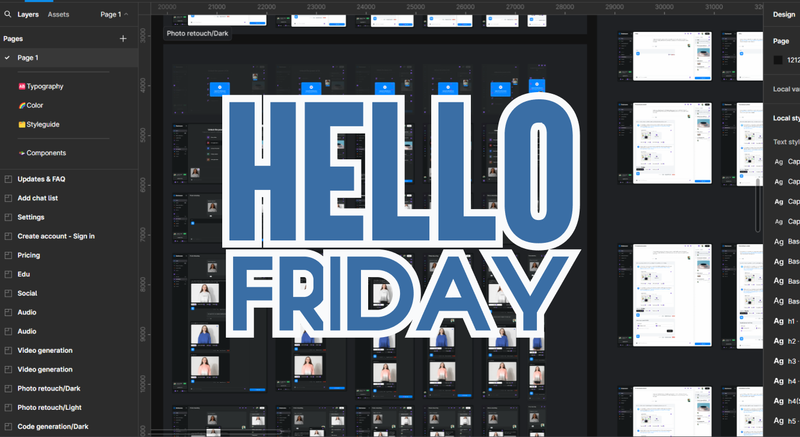
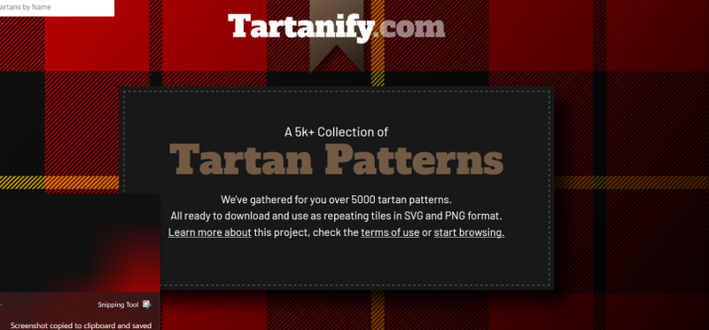
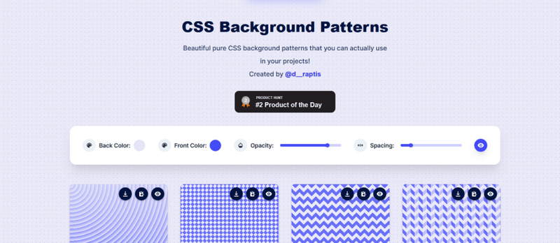
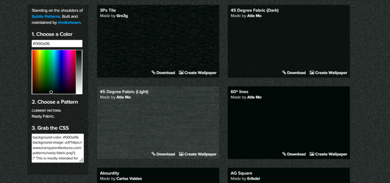
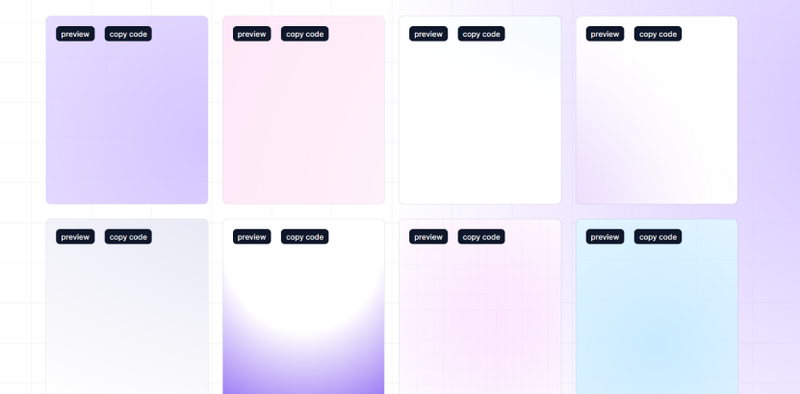

Kick off your weekend with our **Friday Roundup**! We’ve gathered the best articles, tutorials,
tools, and inspiration from the world of web design and development.

[InertiaJS](https://inertiajs.com/)

**InertiaJS** is a modern JavaScript framework designed to simplify the development of single-page
applications (SPAs) without the need for a traditional API. It allows developers to build dynamic,
fast, and interactive front-end applications using the power of frameworks like Vue.js, React, or
Svelte while still maintaining the simplicity and structure of server-side routing. Inertia.js
bridges the gap between traditional server-side apps and SPAs, giving developers the best of both
worlds.

[Uppy](https://uppy.io/)

**Uppy** is a highly flexible and modern file uploader designed to streamline the process of
handling file uploads on the web. With a sleek, easy-to-use interface and support for multiple file
sources—including local files, cloud services (such as Google Drive, Dropbox, and Instagram), and
remote URLs.

[Free Public Apis](https://www.freepublicapis.com/)

[HTML5 canvas based smooth signature drawing](https://github.com/szimek/signature_pad)

[Minecraft-CSS](https://github.com/Jiyath5516F/Minecraft-CSS)

[Tinder Style Swipe Cards with React & Framer Motion (Youtube)](https://www.youtube.com/watch?v=bzJHOoiu1Bs&ab_channel=TomIsLoading&sttick=0)

[Learn CSS Border Animations in 6 Minutes (Youtube)](https://www.youtube.com/watch?v=ezP4kbOvs_E&ab_channel=Coding2GO)

[How To Create An NPM Package](https://www.totaltypescript.com/how-to-create-an-npm-package)

[Procedural tree generator written with JavaScript and Three.js](https://github.com/dgreenheck/tree-js)

[Static Site Generation (SSG) with Next.js](https://developer.mozilla.org/en-US/blog/static-site-generation-with-nextjs/)

[Create Beautiful PDFs with HTML, CSS, and Markdown](https://michaelnthiessen.com/create-beautiful-pdfs-with-html-css-and-markdown)

[Pure CSS Circular Text](https://frontendmasters.com/blog/pure-css-circular-text-without-requiring-a-monospace-font/)

[The Fennel Programming Language](https://fennel-lang.org/)

**Fennel** is a minimalistic, Lisp-like programming language that compiles directly to Lua, designed
for those who love Lisp’s expressive syntax but want the power and simplicity of Lua. Fennel allows
developers to leverage the efficiency and portability of Lua while using a more concise and readable
syntax, making it an excellent choice for scripting, game development, and embedded systems.

[Open Props](https://open-props.style/): Supercharged CSS variables

[InstantClickJS](http://instantclick.io/)

**InstantClickJS** is a JavaScript library designed to speed up website navigation by preloading
pages as soon as the user hovers over a link. By loading content in the background, InstantClick
significantly reduces the perceived load time, giving users a near-instant browsing experience. It
creates the illusion that pages load instantly, improving site performance and enhancing user
experience without requiring complex changes to the website’s infrastructure.

[TinyGem](https://www.tinygem.org/)

[Create a Screen Recorder with JavaScript](https://blog.openreplay.com/create-a-screen-recorder-with-javascript/)

[Announcing TypeScript 5.6](https://devblogs.microsoft.com/typescript/announcing-typescript-5-6/)

[The Magic of Clip Path](https://emilkowal.ski/ui/the-magic-of-clip-path)

[ExpressJS 5.0 released!](https://github.com/expressjs/express/releases/tag/v5.0.0)

[Tartan Patterns](https://tartanify.com/)

[CSS Background Patterns](https://www.magicpattern.design/tools/css-backgrounds)

[Transparent Textures](https://www.transparenttextures.com/)

[Background Snippets](https://bg.ibelick.com/)

[Fluid for Tailwind CSS](https://fluid.tw)

[Create An Attractive GitHub Profile README](https://dev.to/parth_johri/create-an-attractive-github-profile-readme-noj)

[Pulsar](https://muffinman.io/pulsar/?grid=classic&animate=scale&code=KHQgKiAwLjEpICUgMQ%253D%253D)

Nice pulsar animation created with typescript.

That's all, wishing you a great weekend! 🤗
