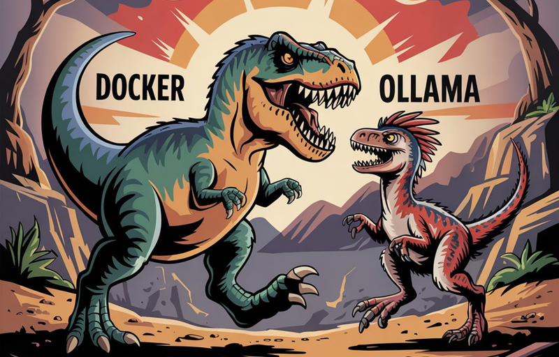

Welcome to this week’s edition of the Weekly JavaScript Roundup! We’ve gathered the latest articles, tutorials, and discussions from around the JavaScript world. Whether you’re looking for new frameworks, performance tips, or thought-provoking debates, we’ve got you covered.

## Is Docker Now Competing with Ollama?



Docker has released a major new feature [Docker Model Runner](https://docs.docker.com/desktop/features/model-runner/) which might be its biggest innovation since dev containers. This highlights how AI is becoming deeply integrated into development workflows.

### What is Docker Model Runner?

Essentially, Docker Model Runner allows users to run AI models locally, making it a direct competitor to Ollama—though still in an early, unfinished state. The tool introduces a new command set:

```sh
➜  ~ docker model --help
```

With options for inspecting, listing, pulling, running, and removing models, along with API capabilities, this is a significant step for Docker.

### Testing the Feature

To experiment, I tested smollm2, a simple AI model:

```sh
➜  ~ docker model pull ai/smollm2
➜  ~ docker model run ai/smollm2 "Hi, bro!"
➜  ~ Hello bro! Can I help you?
```

There’s also an API for interacting with models programmatically:

```sh
curl http://model-runner.docker.internal/engines/llama.cpp/v1/chat/completions \
    -H "Content-Type: application/json" \
    -d '{
        "model": "ai/smollm2",
        "messages": [
            {"role": "system", "content": "You are a helpful assistant."},
            {"role": "user", "content": "save me from missing deadlines"}
        ]
    }'
```

### Final Thoughts

Right now, **Docker Model Runner** is far from production-ready. However, given Docker’s resources and experience, it has the potential to become a serious competitor in the AI model deployment space by the end of the year.

## 📜 Articles & Tutorials

[5 GitHub Actions every maintainer needs to know](https://github.blog/open-source/maintainers/5-github-actions-every-maintainer-needs-to-know/)

[Auth.js vs BetterAuth for Next.js: A Comprehensive Comparison](https://www.wisp.blog/blog/authjs-vs-betterauth-for-nextjs-a-comprehensive-comparison)

[CSS Bursts with Conic Gradients](https://frontendmasters.com/blog/css-bursts-with-conic-gradients/)

[How to use CSS variables like a pro](https://blog.logrocket.com/how-to-use-css-variables/)

[Building an Interactive Image Grid with Three.js](https://tympanus.net/codrops/2025/03/18/building-an-interactive-image-grid-with-three-js/)

[Adaptive Video Streaming With Dash.js In React](https://www.smashingmagazine.com/2025/03/adaptive-video-streaming-dashjs-react/)

[Minimal CSS-only blurry image placeholders](https://leanrada.com/notes/css-only-lqip/)

[The `<select>` element can now be customized with CSS](https://developer.chrome.com/blog/a-customizable-select)

[CSS-only glitch effect](https://muffinman.io/blog/css-image-glitch/)

## ⚒️ Tools

[Teable: No-Code Database Platform for Scalable Applications](https://teable.io/)

Teable is a no-code database platform that combines the ease of a spreadsheet interface with the power of PostgreSQL, enabling users to build scalable, real-time applications without coding.

[Shadcn/UI Marketing Blocks](https://nsui.irung.me/)

[surf.new](https://github.com/steel-dev/surf.new) -An open-source alternative to OpenAI Operator

## 📚 Libs

[node-llama-cpp](https://github.com/withcatai/node-llama-cpp) - Run AI models locally on your machine with Node.js.

[koreader](https://github.com/koreader/koreader) - KOReader is a versatile, open-source eBook reader application that supports multiple formats—including PDF, DjVu, EPUB, and FB2—on devices like Kindle, Kobo, PocketBook, and Android. It offers a customizable reading experience with features such as adjustable fonts, multi-lingual support, and integration with services like Calibre and Google Translate.

[headscale](https://github.com/juanfont/headscale) - An open source, self-hosted implementation of the Tailscale control server

[sslyze](https://github.com/nabla-c0d3/sslyze) - Fast and powerful SSL/TLS scanning library.

[Mithril.js](https://github.com/MithrilJS/mithril.js)

Mithril.js is a modern client-side JavaScript framework designed for building Single Page Applications (SPAs). It's lightweight, with a gzipped size of approximately 8.96 KB, and offers high performance by providing routing and XHR utilities out of the box. Mithril.js is utilized by companies like Vimeo and Nike, as well as open-source platforms such as Lichess. It supports IE11, Firefox ESR, and the latest versions of Firefox, Edge, Safari, and Chrome without requiring polyfills. The framework is currently in maintenance mode due to limited time resources, but version 2.x is considered essentially complete.

[AWS MCP Servers](https://github.com/awslabs/mcp)

## ⌚ Releases

[AnimeJs v4 Released](https://animejs.com/)

[Announcing Rust 1.86.0](https://blog.rust-lang.org/2025/04/03/Rust-1.86.0.html)

[Node v18.20.8 (LTS) Released](https://nodejs.org/en/blog/release/v18.20.8)

[React 19.1 has been released](https://github.com/facebook/react/releases/tag/v19.1.0)

[Astro 5.6 released](https://astro.build/blog/astro-560/)

[Rspack 1.3 released](https://rspack.dev/blog/announcing-1-3)

[React Email 4.0](https://resend.com/blog/react-email-4) - A completely new set of tools to help you build better emails.

[tinybase v6.0.0 released](https://github.com/tinyplex/tinybase/releases/tag/v6.0.0)

[pnpm 10.7 released](https://github.com/pnpm/pnpm/releases/tag/v10.7.0)

[axios release v0.30.0](https://github.com/axios/axios/releases/tag/v0.30.0)

[Bun v1.2.7 released](https://bun.sh/blog/bun-v1.2.7)

## 📺 Videos

[Build your own UI Component - a simple guide](https://www.youtube.com/watch?v=42u64a5Q8Z0)

[The EASIEST Way to Build Mobile Apps (as a Web Developer)](https://www.youtube.com/watch?v=3L_79wvBU3c)

[Build an Invoice App with Next.js 15](https://www.youtube.com/watch?v=Mcw8Mp8PYUE)

[Build an Enterprise Nextjs Rental App | AWS, EC2, Cognito, Shadcn, RDS, S3, Node, React](https://www.youtube.com/watch?v=X1zCAPLvMtw)

[Build and Deploy a Full Stack Real Time AI Voice Agent Interview Platform](https://www.youtube.com/watch?v=8GK8R77Bd7g)

[Build a Full Stack AI Note Taking App with Next.js and Supabase](https://www.youtube.com/watch?v=6ChzCaljcaI)

[I Switched from Zod to ArkType (Here's Why)](https://www.youtube.com/watch?v=Jgcs9SPupI0)

[The Only Docker Tutorial You Need To Get Started](https://www.youtube.com/watch?v=DQdB7wFEygo)

[MERN Stack React Native Project: Build a Bookstore App With React Native and Node.js](https://www.youtube.com/watch?v=o3IqOrXtxm8)

[🎨 Build a Full Stack Canva Clone 2.0 with Next.js, React & Convex, ImageKit](https://www.youtube.com/watch?v=vjWyqs7eBP4)

## 🎤 Talks & Podcasts

No content this week 😢

## 🗞️ News & Updates

[Midjourney Unveils V7](https://www.midjourney.com/updates/v7-alpha): A Major AI Image Generation Upgrade


Midjourney, one of the pioneers in AI-powered image generation, has introduced V7, its latest model upgrade—the first in almost a year. The alpha version was released for testing on Thursday at midnight (EST), just a week after OpenAI’s viral image generator in ChatGPT made waves with its Ghibli-style artworks.

**What’s New in Midjourney V7?**

CEO David Holz describes V7 as a major architectural shift, significantly enhancing how prompts are interpreted. In a Discord announcement, he highlighted key improvements:

- Better text prompt understanding
- Higher-quality images with richer textures
- More accurate depictions of bodies, hands, and objects

OpenAI is offering free access to ChatGPT Plus for students in the U.S. and Canada through May, aiming to support them during finals. This initiative provides students with advanced AI tools to enhance their study routines. To claim this offer, students can visit the ChatGPT Students landing page. [zdnet](https://www.zdnet.com/article/chatgpt-plus-is-free-for-students-now-how-to-grab-this-deal-before-finals/)

### Wikimedia Struggles with Unprecedented Load from AI Scrapers

The Wikimedia Foundation, which oversees Wikipedia and several other crowdsourced knowledge projects, announced a 50% surge in bandwidth usage for downloading media from Wikimedia Commons since January 2024.

According to a [blog post](https://diff.wikimedia.org/2025/04/01/how-crawlers-impact-the-operations-of-the-wikimedia-projects/) on Tuesday, this spike isn't due to increased demand from human users but rather AI-powered scrapers aggressively extracting data to train machine learning models. This unprecedented load is putting strain on Wikimedia’s infrastructure, raising concerns about the sustainability of its free and open-access resources.

[New in NotebookLM: Discover sources from around the web](https://blog.google/technology/google-labs/notebooklm-discover-sources/)

[Express@5.1.0: Now the Default on npm with LTS Timeline](https://expressjs.com/2025/03/31/v5-1-latest-release.html)

That’s a wrap for this week’s JavaScript roundup! We hope these links keep you inspired and informed. Be sure to check back next Friday for another batch of must-read JavaScript insights. Happy coding! 🚀
