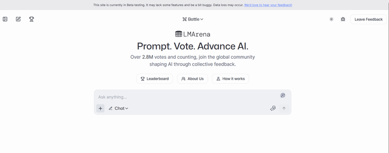

Welcome to the Weekly JavaScript Roundup where we gather the most exciting, insightful, and valuable updates in the world of JavaScript development. From fresh library releases to community-driven discussions, stay ahead of the curve with the latest trends and tips. Let's dive into this week's top picks!

### Chatbot Arena Evolves into Arena Intelligence Inc.

The popular AI benchmarking platform Chatbot Arena has rebranded as Arena Intelligence Inc., operating under the name LMArena. Originally a research project from UC Berkeley, it now attracts over a million monthly users comparing AI models. The new company will expand the platform, improve the UI, and introduce features like chat history and personalized leaderboards. A beta version is live at [beta.lmarena.ai](https://beta.lmarena.ai/). Neutrality and community trust remain core values, even as they explore funding and a potential business model.

## 📜 Articles & Tutorials

[How to Build RAG AI Agents with TypeScript](https://www.freecodecamp.org/news/how-to-build-rag-ai-agents-with-typescript/)

[Your frontend, backend, and database — now in one Cloudflare Worker](https://blog.cloudflare.com/full-stack-development-on-cloudflare-workers/)

[Data Structures & Algorithms Cheat Sheet for Tech Interviews (with Resources)](https://medium.com/javarevisited/data-structures-algorithms-cheat-sheet-for-tech-interviews-with-resources-025bb8b93368)

[Set Up Cloudinary for Video Transcription](https://cloudinary.com/blog/transcription-video-in-next-js#set_up_cloudinary_for_video_transcription)

[Image transformation with Appwrite Storage](https://appwrite.io/blog/post/image-transformation-with-appwrite-storage)

[How to Build a Team of AI Agents for Your Website for Free Using Agno and Groq](https://www.freecodecamp.org/news/build-a-team-of-ai-agents-for-your-website-for-free/)

[Adaptive Video Streaming With Dash.js In React](https://www.smashingmagazine.com/2025/03/adaptive-video-streaming-dashjs-react/)

[Building a Real-time Dashboard with FastAPI and Svelte](https://testdriven.io/blog/fastapi-svelte/)

[Carousels with CSS](https://developer.chrome.com/blog/carousels-with-css)

[Under the Hood of NextAuth.js: A Scalable Authentication System](https://leapcell.io/blog/under-the-hood-nextauth)

[A complete guide to TanStack Table (formerly React Table)](https://blog.logrocket.com/tanstack-table-formerly-react-table/)

[Zig-Zag edges using CSS mask](https://css-tip.com/zig-zag-edge/)

[The Serverless Architecture Handbook: How to Publish a Node Js Docker Image to AWS ECR and Deploy the Container to AWS Lambda](https://www.freecodecamp.org/news/serverless-architecture-with-aws-lambda/)

[Real-world uses of TypeScript’s utility types](https://piccalil.li/blog/real-world-uses-of-typescripts-utility-types/)

[Turn Figma design into Code: Lovable vs Anima](https://uxplanet.org/turn-figma-design-into-code-loveable-vs-anima-f37d301b7a5d)

[Procedural Textures with Hash Functions](https://douglasorr.github.io/2025-04-hash-textures/article.html)

[JSX Over The Wire](https://overreacted.io/jsx-over-the-wire/)

[A flowing WebGL gradient, deconstructed](https://alexharri.com/blog/webgl-gradients)

## ⚒️ Tools

[Introducing Watt Admin](https://blog.platformatic.dev/introducing-watt-admin) - A new admin panel for Platformatic DB, designed to simplify database management and enhance user experience. It offers a user-friendly interface for managing data, users, and settings, making it easier for developers to interact with their databases.

[Scales](https://jeromantik.de/scales) — A Figma or JSON file providing a well-organized, ready-to-use foundation for defining design tokens in your design system.

[Accessible Color Palette Generator](https://thisisfranciswu.com/enterprise-ui-palette-generator/)

[CSS Voxel Editor](https://voxels.layoutit.com/) — A web-based tool for creating 3D voxel art (blocky, pixel-style graphics like in Minecraft), featuring options to edit existing models, open projects in CodePen, or export creations in .VOX format.

[GitZip](https://gitzip.org/) — A browser extension that lets you quickly download specific folders or files from any GitHub repository without cloning the entire repo.

[Trae](https://www.trae.ai/) — An adaptive, AI-driven IDE that intelligently blends human input with AI assistance to boost development efficiency and productivity.

[Trueguard](https://trueguard.io/) — Trueguard is an AI-powered security solution designed to protect SaaS platforms from fraudulent signups and abuse. It detects and blocks threats such as temporary emails, free-tier abusers, and automated bots by analyzing user data like email addresses and IP information. With features like real-time risk scoring, proxy and VPN detection, and customizable rules, Trueguard helps maintain the integrity of your user base. Its easy API integration allows for quick setup, and a free tier is available for small businesses and testing purposes. ​

[HaxeUI](https://haxeui.org/) - A cross-platform UI framework to create user interfaces for various platforms, including web, mobile, and desktop. It offers a unified API and supports multiple rendering backends, making it versatile for different projects.

[athena-core](https://github.com/Athena-AI-Lab/athena-core) - Athena is a production-grade general AI agent designed for action, not just analysis—turning ideas into outcomes with seamless execution.

[weblookrs](https://github.com/TrippingKelsea/weblookrs) - A command-line tool for capturing screenshots and recordings of web pages.

[The Path to Open-Sourcing the DeepSeek Inference Engine](https://github.com/deepseek-ai/open-infra-index/tree/main/OpenSourcing_DeepSeek_Inference_Engine)

## 📚 Libs

[recorder](https://github.com/addyosmani/recorder) - A library for recording and replaying user interactions in web applications.

[homepage](https://github.com/gethomepage/homepage) - A highly customizable homepage (or startpage / application dashboard) with Docker and service API integrations.

[gpt-crawler](https://github.com/BuilderIO/gpt-crawler) - Crawl a site to generate knowledge files to create your own custom GPT from a URL

[backhub](https://github.com/Tanq16/backhub) - Backhub helps maintain backups of multiple GitHub repos as full local mirrors.

[shell-secrets](https://github.com/waj/shell-secrets) - is a small tool to set environment variables from encrypted (with GPG) files

[Chroma](https://github.com/ubisoft/Chroma) - Chroma (by Ubisoft) is an all-in-one tool for spotting color blindness issues in games. It simulates Protanopia, Deuteranopia, and Tritanopia filters to highlight accessibility problems instantly during gameplay.

## ⌚ Releases

[Ubuntu 25.04 “Plucky Puffin” Released with Linux 6.14 and GNOME 48](https://ubuntu.com/)

Ubuntu 25.04 Plucky Puffin was officially released on April 17, 2025. Powered by Linux 6.14 and GNOME 48, it brings major updates: new Papers PDF viewer, HDR support, APT 3.0, improved ARM64 support, and default use of `xdg-terminal-exec`. Python 3.13, GCC 14.2, LLVM 20, GIMP 3.0, and LibreOffice 25.2 are included. Support ends January 2026. For long-term stability, Ubuntu 24.04 LTS remains the recommended option.

[PDFsam (PDF Split And Merge) 5.3.1 Released](https://github.com/torakiki/pdfsam/releases/tag/v5.3.1)

The open-source PDF manipulation tool PDFsam has released version 5.3.1, bringing performance improvements, bug fixes, and enhanced stability. PDFsam is widely known for its simple interface and robust features that allow users to split, merge, rotate, and mix PDF files without relying on cloud services.

Version 5.3.1 focuses primarily on refining the user experience. It updates internal libraries for improved compatibility, resolves various UI glitches, and ensures smoother performance across Windows, macOS, and Linux. This update also improves error handling and makes the tool more reliable for batch operations on large sets of PDFs.

Whether you're splitting large PDF files, merging several documents into one, or reordering pages, PDFsam 5.3.1 offers a lightweight and privacy-respecting solution ideal for both personal and professional use.

[VirtualDub2 2.3.0 Released: Open Source Video Editor for Windows](https://github.com/shekh/VirtualDub2)

The open-source video editing tool VirtualDub2 2.3.0.845 has been released in April 2025. Built in C++ and licensed under GNU GPL v2.0, it expands the legacy of the original VirtualDub (discontinued in 2013) with modern features, format support (AVI, MP4, MKV, etc.), batch processing, lossless compression, real-time preview, scripting, Unicode support, FFmpeg 7.1.1 integration, and SVT-AV1 encoding.

[mIRC v7.81 has been released.](https://www.mirc.com/news.html)

mIRC is a popular Internet Relay Chat (IRC) client for Windows, enabling users to communicate, share, and collaborate on IRC networks worldwide. With over two decades of development, mIRC offers a powerful scripting language, file sharing capabilities, and a user-friendly interface. ​

[Wireshark 4.4.6 Released](https://www.wireshark.org/docs/relnotes/wireshark-4.4.6.html) -

Wireshark is the world’s most popular network protocol analyzer. It is used for troubleshooting, analysis, development and education.

## 📺 Videos

[Next.js 15 Animations Masterclass: The Real Power Of Motion.dev](https://www.youtube.com/watch?v=OkWWAgLSGkc)

[Zod 4 is out, and it is CRAZY](https://www.youtube.com/watch?v=xcm53k0ePmY)

[URL-Smart Search With Next.js & MongoDB (+ Autocomplete, RAG, Vectors, Fuzzy Search)](https://www.youtube.com/watch?v=_n0McTcterM)

[Microservices in Nest.js – JavaScript Tutorial](https://www.youtube.com/watch?v=t76UMpwFNs0)

[How to Build a Local AI Agent With Python (Ollama, LangChain & RAG)](https://www.youtube.com/watch?v=E4l91XKQSgw)

[How 10X Engineers Use Git](https://www.youtube.com/watch?v=NcQB3ZxOwQw)

[Why is Next.js so slow??](https://www.youtube.com/watch?v=mMQCLQTky34)

[Build and Deploy a Multi-Vendor E-Commerce Platform with Next.js, React & Stripe Connect (2025)](https://www.youtube.com/watch?v=6fXNWBFPfRM)

[Build and Deploy Your Own AI Fitness Trainer with Next.js - Full Course](https://www.youtube.com/watch?v=BCufdom7xgY)

[TanStack layouts are pretty nice](https://www.youtube.com/watch?v=2TAOEK9IgTg)

[How I'm Deploying My Future Web Applications](https://www.youtube.com/watch?v=yNGiOVQAY1k)

## 🎤 Talks & Podcasts

No content this week 😢

## 🗞️ News & Updates

[OpenAI Introduces Flexible Processing for Cheaper, Slower Tasks](https://platform.openai.com/docs/guides/flex-processing)

OpenAI has launched Flexible Processing, a new API tier offering 50% lower pricing for slower, lower-priority tasks. Now in beta for the latest models (o3 and o4-mini), it suits non-production use like data enrichment and model evaluation. In exchange for reduced cost, developers accept slower responses and occasional unavailability. Example pricing: $5 per million input tokens for o3, down from $10. Identity verification is now required for certain users to access o3. Read more on OpenAI’s announcement.

### Together AI Releases Open Deep Research for Structured Web Investigations

[Together AI](https://www.together.ai/) has launched Open Deep Research, an open-source tool for answering complex questions via multi-step web research. Unlike typical search engines, it delivers structured reports with citations using a transparent pipeline: query planning (Qwen2.5-72B), web search ([Tavily API](https://www.tavily.com/)), summarization (Llama 3.3), and final report generation (DeepSeek-V3). Results include visual diagrams (via Mermaid JS) and podcast summaries ([Cartesia Sonic](https://cartesia.ai/)). The tool outperforms [LangChain’s LDR](https://www.langchain.com/) and Hugging Face’s SmolAgents in benchmarks. Source code and docs are available on [GitHub](https://github.com/togethercomputer/open_deep_research).

### Gemini 2.5 Flash: New Free AI Model for Developers

Google has released [Gemini 2.5 Flash](https://developers.googleblog.com/en/start-building-with-gemini-25-flash/), a free, high-performance AI model optimized for code-related tasks and fast reasoning. Despite lower development costs, it outperforms competitors like Claude 3.7 Sonnet and Grok-3 in multiple benchmarks.

Key features:
– Autonomous reasoning time allocation based on task complexity
– User-controlled "thought token" limits to adjust reasoning depth
– Free to use via [Google AI Studio](https://aistudio.google.com/prompts/new_chat) or [Gemini API](https://ai.google.dev/)

### Cursor Apologizes After AI Support Agent Invents Nonexistent Policy

Cursor apologized after its AI support bot falsely claimed that users couldn’t use the code editor on multiple devices — a policy that never existed. The confusion, sparked by a [Reddit thread](https://www.reddit.com/r/puppy101/comments/1bznzrm/deleted_by_user/), led to canceled subscriptions and community backlash. The issue stemmed from AI hallucination and backend session changes. Cursor has since clarified its stance, labeled AI-generated support replies, and pledged better transparency. The incident highlights the risks of deploying AI in customer-facing roles.

### Wikipedia Releases AI-Optimized Dataset to Combat Scraping

[Wikimedia](https://enterprise.wikimedia.com/blog/kaggle-dataset/) has introduced a structured dataset tailored for AI training to alleviate server strain from web scraping. Published on Kaggle, it offers machine-readable content from English and French Wikipedia articles, aiming to provide a preferable alternative to raw text scraping.

That’s all for this week’s roundup! Whether you’re tackling a new project or refining your skills, we hope these links spark your next big idea. Check back next Friday for more updates, and until then, happy coding!
