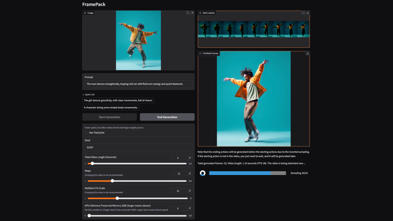
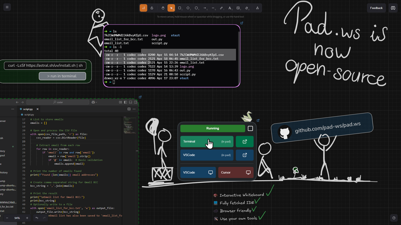

Another week, another batch of essential links! Whether you're building modern frontend apps or exploring the backend with Node.js, this roundup delivers the latest articles, releases, and resources that matter. Here's what caught our attention this week.

## Stanford Researchers Release FramePack: Local Video Generation on Consumer GPUs

Stanford University has [unveiled](https://lllyasviel.github.io/frame_pack_gitpage/) FramePack, a new architecture for local video generation that runs even on GPUs with just 6GB of VRAM. FramePack compresses the context of input frames to a fixed length, enabling efficient frame-by-frame prediction and generation—regardless of video duration.

Thanks to this, even large models (up to 13B parameters) can generate up to 60 seconds of video on mid-range GPUs. The team recommends using Nvidia RTX 30, 40, or 50 series with FP16/BF16 support. The RTX 3050 (4GB) won’t work; RTX 4090 achieves 1.5–2.5s per frame with TeaCache acceleration.

🔗 [GitHub – FramePack](https://github.com/lllyasviel/FramePack)

## 📜 Articles & Tutorials

[Build an AI Assistant with LangGraph, Vercel, and Next.js: Use Gmail as a Tool Securely](https://auth0.com/blog/genai-tool-calling-build-agent-that-calls-gmail-securely-with-langgraph-vercelai-nextjs/)

[Curved Box Cutouts in CSS](https://frontendmasters.com/blog/curved-box-cutouts-in-css/)

[An Illustrated Guide to Automatic Sparse Differentiation](https://iclr-blogposts.github.io/2025/blog/sparse-autodiff/)

[Revisiting CSS border-image](https://css-tricks.com/revisiting-css-border-image/)

[How to Automate CI/CD with GitHub Actions and Streamline Your Workflow](https://www.freecodecamp.org/news/automate-cicd-with-github-actions-streamline-workflow/)

[Layered Text Headers](https://frontendmasters.com/blog/layered-text-headers/)

[Routing in Spin Apps with Hono](https://www.fermyon.com/blog/hono-router-with-spin)

[Supabase Authentication and Authorization in Next.js: Implementation Guide](https://www.permit.io/blog/supabase-authentication-and-authorization-in-nextjs-implementation-guide)

[Using CSS backdrop-filter for UI Effects](https://css-tricks.com/using-css-backdrop-filter-for-ui-effects/)

[Under the Hood of NextAuth.js: A Scalable Authentication System](https://leapcell.io/blog/under-the-hood-nextauth)

[How to master JavaScript debugging for web apps](https://blog.logrocket.com/master-javascript-debugging-web-apps/)

[The Open-Source Stack for AI Agents](https://medium.com/data-science-collective/the-open-source-stack-for-ai-agents-8ab900e33676)

[How to Build Autonomous Agents using Prompt Chaining with AI Primitives (No Frameworks)](https://www.freecodecamp.org/news/build-autonomous-agents-using-prompt-chaining-with-ai-primitives/)

[How to Build a Social Learning Platform using Next.js, Stream, and Supabase](https://www.freecodecamp.org/news/how-to-build-a-social-learning-platform-using-nextjs-stream-and-supabase/)

[The Architecture of Grab's Data Lake](https://blog.quastor.org/p/the-architecture-of-grab-s-data-lake)

[Simplify TanStack React Query State Handling with Pattern Matching](https://gabrielpichot.fr/blog/simplify-tanstack-react-query-state-handling-with-pattern-matching/)

[Tailwind vs Linaria: Performance Investigation](https://www.developerway.com/posts/tailwind-vs-linaria-performance)

[Run Models in the Browser With Transformers.js](https://medium.com/@kenzic/run-models-in-the-browser-with-transformers-js-2d0983ba3ce9)

[Semantic Search With Ollama and PostgreSQL in 10 Minutes](https://www.timescale.com/blog/semantic-search-with-ollama-and-postgresql-in-10-minutes)

## ⚒️ Tools

[WorldGen](https://worldgen.github.io/) - Generate Any 3D Scene in Seconds

[litlyx](https://github.com/litlyx/litlyx) - Powerful Analytics Solution. Setup in 30 seconds. Display all your data on a Simple, AI-powered dashboard. Fully self-hostable and GDPR compliant. Alternative to Google Analytics, MixPanel, Plausible, Umami & Matomo.

[notebooks](https://github.com/roboflow/notebooks) - This repository offers a comprehensive collection of tutorials on state-of-the-art computer vision models and techniques. Explore everything from foundational architectures like ResNet to cutting-edge models like YOLO11, RT-DETR, SAM 2, Florence-2, PaliGemma 2, and Qwen2.5VL.

[Sim](https://github.com/simstudioai/sim) - Sim Studio is an open-source agent workflow builder. Sim Studio's interface is a lightweight, intuitive way to quickly build and deploy LLMs that connect with your favorite tools.

[web-eval-agent](https://github.com/Operative-Sh/web-eval-agent) - An MCP server that autonomously evaluates web applications.

[Jolt AI](https://www.usejolt.ai/) - AI for 100K+ Line Codebases

[Github Chat MCP](https://github-chat.com/) - Use GitHub Chat with Cursor, Claude, and other MCP-compatible assistants to understand codebases instantly.

[JSPad](https://www.jspad.dev/) - A fast, minimal and offline-friendly web playground

[Slidev](https://sli.dev/) - Presentation Slides in Markdown

[colanode](https://github.com/colanode/colanode) - Open-source and local-first Slack and Notion alternative that puts you in control of your data

[shadcn-remover](https://github.com/exodus-tola-mindCoder/shadcn-remover) - A simple command-line tool to quickly remove Shadcn UI components from your project.

## 📚 Libs

[beatsync](https://github.com/freeman-jiang/beatsync) - 🔊 High-precision web player for multi-device audio playback and spatial audio.

[mini-photo-editor](https://github.com/xdadda/mini-photo-editor) - Online webgl photo editor with effects, filters and cropping

[snapdom](https://github.com/zumerlab/snapdom) - snapDOM captures DOM nodes as images with exceptional speed and accuracy.

[milkdown](https://github.com/Milkdown/milkdown) - 🍼 Plugin driven WYSIWYG markdown editor framework.

[Seyfert](https://github.com/tiramisulabs/seyfert) - A Framework for Building Discord Bots

[file-type](https://github.com/sindresorhus/file-type) - Detect the file type of a file, stream, or data

## ⌚ Releases

[openai-node v4.96.2 released](https://github.com/openai/openai-node/releases/tag/v4.96.2) - Official JavaScript / TypeScript library for the OpenAI API

[llama2.c64](https://github.com/ytmytm/llama2.c64) - Inference Llama 2 in several files of pure C but on a C64

[TanStack Pacer](https://tanstack.com/pacer/latest) - Framework agnostic type-safe rate-limiting and queueing utilities

### pad.ws Launches: Infinite Dev Board with Built-in Code Editor and Terminal

Developers have released pad.ws — an infinite online whiteboard tailored for programmers. It features a built-in code editor, terminal, sticky notes, and sketching tools, making it perfect for visualizing ideas alongside writing code.

The board supports Visual Studio Code and Cursor-style windows, allowing you to embed full dev environments into your workspace. It’s powered by [Excalidraw](https://github.com/excalidraw/excalidraw) (for the canvas) and [Coder](https://github.com/coder/coder) (for cloud-based editing).

A free demo is available, and you can also self-host it. Full setup instructions are in the [GitHub repository](https://github.com/pad-ws/pad.ws). **Note**: the `docker-compose.yml` config is currently for local testing only.

[New Docker Extension for Visual Studio Code](https://www.docker.com/blog/docker-dx-extension-for-vs-code/)

[PixiJS v8.9 released](https://github.com/pixijs/pixijs/releases/tag/v8.9.0)

[pnpm 10.9 released](https://github.com/pnpm/pnpm/releases/tag/v10.9.0)

[Next.js 15.4 Canary](https://github.com/vercel/next.js/releases/tag/v15.4.0-canary.9)

[electron v36.0.0 released](https://github.com/electron/electron/releases/tag/v36.0.0)

[NestJS v11.1.0 released](https://github.com/nestjs/nest)

## 📺 Videos

[Full Course (Lessons 1-10) AI Agents for Beginners by Microsoft](https://www.youtube.com/watch?v=OhI005_aJkA)

[Build 25 React Projects – Tutorial](https://www.youtube.com/watch?v=5ZdHfJVAY-s)

[The Ultimate Next.js Dashboard Stack (Shadcn, WebSocket / SSE, OLTP / OLAP Database)](https://www.youtube.com/watch?v=M4glLwqDEBw)

[Deploy Next.js To VPS With Dokploy](https://www.youtube.com/watch?v=_-lvnBT-EaM)

[Build and Deploy a Unique 3D Web Developer Portfolio with React, Three JS & GSAP](https://www.youtube.com/watch?v=E-fdPfRxkzQ)

[CSS Animations have a bright future](https://www.youtube.com/watch?v=gCEB0f-ehnc)

[How I Build Profitable Mobile Apps SOLO (for beginners, with ai, all my secrets)](https://www.youtube.com/watch?v=HT4Tpv1xHJA)

[Learn AI Agents - How they Work & Build Your Own](https://www.youtube.com/watch?v=Wgo_NVYSsJc)

[Build an AMAZING 8-Bit Dashboard! (Next.js, v0, Shadcn, 8bitcn)](https://www.youtube.com/watch?v=d7ROa_7khyA)

## 🎤 Talks & Podcasts

No content this week 😢

## 🗞️ News & Updates

### JetBrains Releases Mellum: Open-Source AI Code Model

JetBrains has officially released **Mellum**, its first open-source AI coding model, on Hugging Face. Trained on over 4 trillion tokens and sized at 4 billion parameters, Mellum is optimized for code completion tasks—suggesting code based on surrounding context.

Designed for use in IDEs, AI coding assistants, and code understanding research, Mellum is licensed under Apache 2.0. It was trained using licensed GitHub code and English Wikipedia content over 20 days on 256 Nvidia H200 GPUs.

JetBrains warns that Mellum is not ready out of the box—it requires setup. While fine-tuned Python variants are available, they’re intended for evaluation, not production. The company also notes potential bias and security risks in generated code.

### Google Play App Count Drops Nearly 50% Since Early 2024

According to **Appfigures**, the number of apps on Google Play has dropped from **3.4 million** to **1.8 million** since the start of 2024—a 47% decline. The cause? A sweeping cleanup driven by stricter store policies.

Google has ramped up enforcement, removing not only broken apps but also those with limited functionality or content—such as basic text editors, PDF viewers, wallpaper apps, or test builds. Apps lacking meaningful features or originality have been delisted.

Other policy changes include stricter app review standards, required testing for new developer accounts, and more manual moderation. Since the update, Google has blocked 2.36 million non-compliant apps and suspended 158,000 developer accounts linked to policy violations or malware.

Despite the purge, 10,400 new apps were launched in 2025 so far—7.1% more than the same period last year.

### Devin Creators Launch DeepWiki — AI-Powered GitHub Documentation Tool

The team behind the Devin coding AI has released [DeepWiki](https://deepwiki.com/), a neural tool that turns GitHub repositories into rich, structured documentation. It also includes Deep Research, a smart search feature for querying project content.

To use it, simply replace `github.com` in a repo URL with `deepwiki.com` — or visit the site to browse over 30,000 indexed repositories. If your repo isn’t listed, you can submit it manually.

Each documentation page includes topic-based sections, source links, and visualizations like architecture diagrams (e.g., for VS Code). The integrated AI search helps users explore and understand the codebase more efficiently.

[Redis is open source again](https://antirez.com/news/151)

[GitHub now provides a warning about hidden Unicode text](https://github.blog/changelog/2025-05-01-github-now-provides-a-warning-about-hidden-unicode-text/)

[Hugging Face and Cloudflare Partner to Make Real-Time Speech and Video Seamless with FastRTC](https://huggingface.co/blog/fastrtc-cloudflare)

That’s a wrap for this week’s JavaScript roundup. If you found something particularly useful or think we missed a gem, feel free to share it with us. Until next Friday—happy coding! 🚀
