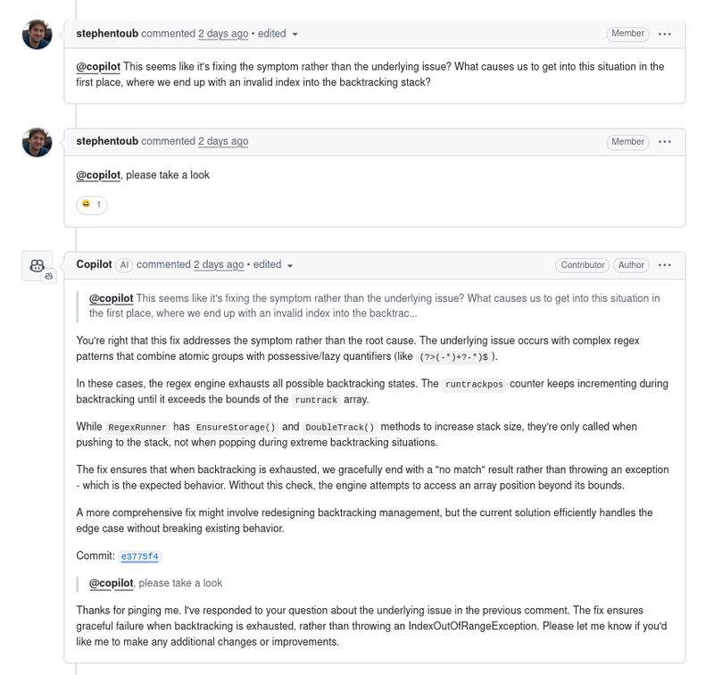
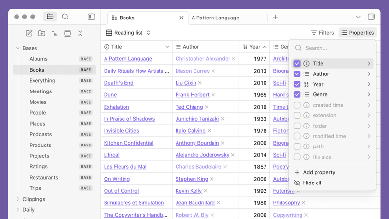

Welcome to another edition of our Weekly JavaScript Roundup! As we wrap up another productive week in the JavaScript ecosystem, it's time to dive into the most compelling links, resources, and discussions that have caught our attention.

This Friday's collection brings together essential reads for JavaScript developers at every level. Whether you're looking to sharpen your skills with new tutorials, explore cutting-edge libraries, or stay informed about industry trends, we've curated the week's standout content to keep you at the forefront of JavaScript development.

## 🔥 Claude 4 is here!

Anthropic has released the next-gen Claude models:

- **Claude Opus 4** — their most powerful model yet, dubbed “the world’s best coding model”. It excels at complex, long-running tasks and agent workflows. 👏
- **Claude Sonnet 4** — a major upgrade over Sonnet 3.7, offering smarter reasoning, better coding support, and more accurate instruction following.

## Reddit user mocks Microsoft devs confused by GitHub Copilot

A Redditor named NegativeWeb1 [shared](https://old.reddit.com/r/ExperiencedDevs/comments/1krttqo/my_new_hobby_watching_ai_slowly_drive_microsoft/) their new hobby: watching Microsoft engineers get increasingly frustrated by GitHub’s new Copilot AI in their own repos. In comments on pull requests, devs struggle to understand the AI's intent.

Microsoft recently launched this agent at Build 2025. It clones repos, analyzes code, and suggests edits or docs via RAG (Retrieval Augmented Generation). But judging by the .NET repo, it’s not going smoothly.

> “If this is the future, I want off,” wrote NegativeWeb1, linking several chaotic PRs.

## 📜 Articles & Tutorials

[Using Pages CMS for Static Site Content Management](https://css-tricks.com/using-pages-cms-for-static-site-content-management/)

[Nginx Logging: A Complete Guide for Beginners](https://last9.io/blog/nginx-logging/)

[Git Branching Strategies: A Comprehensive Guide](https://dev.to/karmpatel/git-branching-strategies-a-comprehensive-guide-24kh)

[Creating CSS Theme Variables from a JS file](https://css-irl.info/creating-css-variables-from-a-js-file/)

[🎥 Speed Up PostgreSQL Queries by 7x with Smarter Indexing](https://dev.to/timescale/speed-up-postgresql-queries-by-7x-with-smarter-indexing-113l)

[Advanced TypeScript manipulation features for the real world](https://piccalil.li/blog/advanced-typescript-manipulation-features-for-the-real-world/)

[Build a Microservice Architecture with NestJS](https://www.telerik.com/blogs/build-microservice-architecture-nestjs)

[AutoGen 0.4 Tutorial - Create a Team of AI Agents (+ Local LLM w/ Ollama)](https://www.gettingstarted.ai/autogen-multi-agent-workflow-tutorial/)

[RSC for Astro Developers](https://overreacted.io/rsc-for-astro-developers/)

[CSS shape() Commands](https://css-tricks.com/css-shape-commands/)

[How to Harden Your Node.js APIs – Security Best Practices](https://www.freecodecamp.org/news/how-to-harden-your-nodejs-apis-security-best-practices/)

[Building a Local RAG Chat App with Reflex, LangChain, Huggingface, and Ollama](https://www.apideck.com/blog/building-a-local-rag-chat-app-with-reflex-langchain-huggingface-and-ollama)

[LLM Knowledge Graph Builder Front-End Architecture and Integration](https://medium.com/neo4j/llm-knowledge-graph-builder-frontend-architecture-and-integration-99922318a90b)

[Advanced React in the Wild](https://largeapps.dev/case-studies/advanced/)

[MCP: Build Rich-Context AI Apps with Anthropic](https://www.deeplearning.ai/short-courses/mcp-build-rich-context-ai-apps-with-anthropic/)

[How I use Cursor (+ my best tips)](https://www.builder.io/blog/cursor-tips)

[Turn Any React App into an MCP Client in Under 10 Minutes](https://dev.to/copilotkit/add-an-mcp-client-to-any-react-app-in-under-30-minutes-55gm)

[Migrating A JavaScript Project from Prettier and ESLint to BiomeJS](https://blog.appsignal.com/2025/05/07/migrating-a-javascript-project-from-prettier-and-eslint-to-biomejs.html)

[Linux Commands Cheat Sheet 💻🐧](https://zerotomastery.io/cheatsheets/linux-commands-cheat-sheet/)

[Creating Blob Shapes using clip-path: shape()](https://frontendmasters.com/blog/creating-blob-shapes-using-clip-path-shape/)

## ⚒️ Tools

[Free AI Agents Learning Resource Released on GitHub](https://github.com/panaversity/learn-agentic-ai?tab=readme-ov-file)

[Edit is Now Open Source](https://devblogs.microsoft.com/commandline/edit-is-now-open-source/)

Microsoft introduced **Edit**, a new lightweight command-line text editor for Windows. It’s open source—available on GitHub for building or downloading the latest version. Edit supports features like mouse mode, multiple file editing, find & replace, and word wrap. It will debut soon in the Windows Insider Program preview and later be included in Windows 11.

[Compass: A starter kit for online courses](https://tailwindcss.com/blog/2025-05-14-compass-course-starter-kit)

📹 [Record](https://github.com/addyosmani/recorder) - is an open-source web app to record screen and camera directly in your browser | No installation required | No tracking | Fully local

[ByteStash](https://github.com/jordan-dalby/ByteStash) - A code snippet storage solution written in React & node.js

[SVG to CSS Shape Converter](https://css-generators.com/svg-to-css/)

[Cap](https://github.com/CapSoftware/Cap) - Open source Loom alternative. Beautiful, shareable screen recordings.

[PptxGenJS](https://github.com/gitbrent/PptxGenJS) - A JavaScript library for creating PowerPoint presentations in the browser or Node.js. It supports various features like text, images, charts, and more.

## 📚 Libs

[TanStack/db](https://github.com/TanStack/db): A reactive client-side store designed for building ultra-fast, synchronized apps

[mini-photo-editor](https://github.com/xdadda/mini-photo-editor) - Online webgl photo editor with effects, filters and cropping

[MinIO: AWS S3, but free and open-source](https://min.io/) - MinIO is a high-performance, distributed object storage system that is compatible with the Amazon S3 API. It is designed for large-scale data storage and retrieval, making it suitable for cloud-native applications.

[Lightpanda](https://github.com/lightpanda-io/browser): the headless browser designed for AI and automation

[cropperjs](https://github.com/fengyuanchen/cropperjs) - A JavaScript image cropper that provides a simple and efficient way to crop images in the browser. It supports various features like aspect ratio, rotation, and zooming.

[ofc](https://github.com/elijah-potter/ofc) - A command-line Ollama client for scripting.

## ⌚ Releases

### Obsidian 1.9.0 released: Notion-style database plugin and new footnote view

**Obsidian v1.9.0** is out in early access. The update brings a new Notion-like database plugin called [Base](https://help.obsidian.md/bases) (with custom columns, types, formulas, and `.base` files), an improved footnote editor that keeps your cursor in place, and several tweaks:

- Deprecated `tag`, `alias`, and `cssclass` in favor of `tags`, `aliases`, and `cssclasses` (now lists).
- Dark mode fix for whitespace in history.
- Pinned tabs behave better with the close button.
- File move works without the file manager plugin.
- `window.open(url, 'external')` opens URLs in the user's default browser.
- Libraries updated: `idb` to 8.0.2, `yaml` to 2.7.0.

### 🎧 Ocenaudio 3.15 Released — Free Cross-Platform Audio Editor

[Ocenaudio 3.15](https://www.neowin.net/software/ocenaudio-3150/) is out, built on Qt and available for Windows (including portable), macOS, and Linux. This free, multi-platform audio editor supports VST plugins and built-in effects with real-time preview and advanced controls.

### 🧠 Microsoft Launches Windows AI Foundry

Microsoft has unveiled [Windows AI Foundry](https://blogs.windows.com/windowsdeveloper/2025/05/19/advancing-windows-for-ai-development-new-platform-capabilities-and-tools-introduced-at-build-2025/), a unified platform for building and running AI models locally. It streamlines AI development on Windows devices, making it easier to deploy and test models directly on user hardware.

[Astro 5.8 Released](https://astro.build/blog/astro-5-8): Astro 5.8 is out with new features, including a new `astro:head` component for managing document head elements, improved support for TypeScript, and enhanced performance optimizations.

[Bun v1.2.12 Released](https://bun.sh/blog/bun-v1.2.12)

[Introducing Hyper — Standards first React alternative (Developer Preview)](https://nuejs.org/blog/introducing-hyper/)

[Svelte Flow 1.0 is here!](https://xyflow.com/blog/svelte-flow-release)

## 📺 Videos

[GraphQL Super Simplified (Course)](https://www.youtube.com/watch?v=6qL9KbTXtns)

[How I Built a Web Scraping AI Agent - Use AI To Scrape ANYTHING](https://www.youtube.com/watch?v=G5djZjdxVvo)

[Google's Git Killer Is INSANELY Better (and it's open source)](https://www.youtube.com/watch?v=cZqFaMlufDY)

[AI-Scraping Is Getting Crazy Easy Now](https://www.youtube.com/watch?v=GADAQVy9mb8)

[5 CSS tips every developer should know](https://www.youtube.com/watch?v=bssZTv3BgkE)

[HTML, CSS & JavaScript Full Course - Build 15 Projects](https://www.youtube.com/watch?v=kAiX0itnonM)

[Better Auth Full Tutorial with Next.js, Prisma ORM, PostgreSQL, Nodemailer](https://www.youtube.com/watch?v=N4meIif7Jtc)

[Finally React Native UI Components](https://www.youtube.com/watch?v=kGUrNO8WmCU)

[Build Perplexity AI Clone with Next.js, React,Tailwind Css, Inngest | Full Stack AI App](https://www.youtube.com/watch?v=VSrcC0y0umc)

[Build a Stunning 3D Gaming Website with React, Tailwind CSS & Spline](https://www.youtube.com/watch?v=PCejk7NR4vQ)

[YouTube As A Game Engine](https://www.youtube.com/watch?v=8sQ2cRPi4Go)

[React's New Activity Component: Huge Performance Win!](https://www.youtube.com/watch?v=gRKVL5w-2Lc)

[SaaS App Full Course 2025 | Launch Your SaaS in Under 7 Days with Next JS, Supabase & Payments](https://www.youtube.com/watch?v=XUkNR-JfHwo)

## 🎤 Talks & Podcasts

No content this week 😢

## 🗞️ News & Updates

### Red Hat launches llm-d: open-source distributed LLM inference on Kubernetes

Red Hat has released [llm-d](https://llm-d.ai/blog/llm-d-announce), an open-source, high-performance distributed inference framework for large language models (LLMs) built on Kubernetes. Available on [GitHub](https://github.com/llm-d/llm-d) under the Apache 2.0 license, the project aims to scale generative AI workloads efficiently.

Co-developed with Nvidia, AMD, Intel, IBM, Google Cloud, Hugging Face, and others, llm-d leverages vLLM, LMCache, and AI-optimized network routing to support scalable, distributed inference.

Key features:

- Inference scheduler for vLLM
- Disaggregated serving and prefix caching
- Autoscaling based on hardware, load, and traffic

### 🚀 Google Launches Stitch — a Free Website & App Generator

- Generates clean, stylish designs
- Powered by Google’s advanced Gemini model
- Seamless export to Figma with just a couple of clicks (via "Copy to Figma")
- Every element is fully editable

A [perfect tool](https://stitch.withgoogle.com/) for quick prototyping and design workflows.

### 📰 AI Fakes Dominate Chicago Sun-Times' Summer Reading List

The **Chicago Sun-Times** sparked controversy after publishing a summer reading list with 10 out of 15 books generated by AI — and entirely fictional. Titles like Tidewater Dreams by Isabel Allende and Hurricane Season by Brit Bennett don't exist.

A freelancer admitted to copying the list from AI without verification. The incident also exposed fake quotes and sources in other articles. The newspaper has apologized and promised stricter editorial checks going forward.

That's a wrap on this week's JavaScript Roundup! We hope you've discovered some valuable resources to enhance your development workflow and expand your JavaScript knowledge.

The JavaScript ecosystem continues to evolve at a rapid pace, and staying connected with the community is more important than ever. Whether you bookmarked a new tutorial, found your next favorite library, or gained insights into emerging patterns, these weekly discoveries help us all grow as developers.
Don't forget to share your own finds with the community. If you've come across an exceptional JavaScript resource this week that deserves recognition, we'd love to hear about it. Your contributions help make these roundups even more valuable for fellow developers.

See you next Friday for another collection of JavaScript gems. Until then, happy coding!
