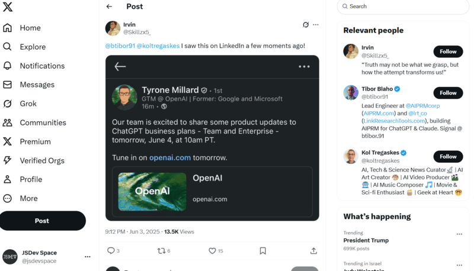

Welcome back to our weekly JavaScript roundup! In this 24th edition of Friday Links, we’ve curated some of the most impactful libraries, tutorials, and discussions from around the JavaScript world. Whether you’re deep in React, Node.js, or exploring new specs, there’s something in here for you.

## ChatGPT Pro Just Got Smarter: o3 Pro and Custom Integrations Are Coming

OpenAI is upgrading its $200/month ChatGPT Pro plan by replacing the older o1 Pro model with the more advanced o3 Pro. This new model combines o3’s smarter reasoning with boosted compute power, promising better performance on complex coding, math, and research tasks. The update is expected to roll out within weeks.

Alongside the model swap, OpenAI is expanding ChatGPT’s integration features. Connectors now support Dropbox and Box, and a new Model Context Protocol (MCP) will allow users to link ChatGPT to custom tools, APIs, and internal knowledge bases for tailored workflows.

## 📜 Articles & Tutorials

[Scroll-driven camera animation](https://garden.bradwoods.io/notes/javascript/three-js/scroll-driven-camera-animation)

[How to Build a Dynamic Wardrobe App with React Drag and Drop](https://www.freecodecamp.org/news/how-to-build-a-dynamic-wardrobe-app-with-react-drag-and-drop/)

[The Beauty of TanStack Router](https://tkdodo.eu/blog/the-beauty-of-tan-stack-router)

[How to Create Responsive and SEO-friendly WebGL Text](https://tympanus.net/codrops/2025/06/05/how-to-create-responsive-and-seo-friendly-webgl-text/)

[Open Data Standards: Postgres, OTel, and Iceberg](https://supabase.com/blog/open-data-standards-postgres-otel-iceberg)

[How to correctly use if() in CSS](https://css-tip.com/inline-if/)

[GitHub for Beginners: Building a React App with GitHub Copilot](https://github.blog/ai-and-ml/github-copilot/github-for-beginners-building-a-react-app-with-github-copilot/)

[MongoDB Aggregation Framework: A Beginner’s Guide](https://foojay.io/today/mongodb-aggregation-framework-a-beginners-guide/)

[How we organize our monorepo to ship fast](https://graphite.dev/blog/how-we-organize-our-monorepo-to-ship-fast)

[`<line-numbers>` Web Component](https://www.zachleat.com/web/line-numbers/)

[Neuromorphic computing: the future of AI ](https://www.lanl.gov/media/publications/1663/1269-neuromorphic-computing)

## ⚒️ Tools

[NeoHtop](https://github.com/Abdenasser/neohtop) - Blazing-fast system monitoring for your desktop (built with Rust, Tauri & Svelte)

[SVG Path Animations](https://tools.ui-layouts.com/svg-line-draw)

[kopia](https://github.com/kopia/kopia) - Cross-platform backup tool for Windows, macOS & Linux with fast, incremental backups, client-side end-to-end encryption, compression and data deduplication. CLI and GUI included.

[Tokenami](https://github.com/tokenami/tokenami) - CSS-in-JS Reinvented for Scalable, Typesafe Design Systems

[zodest](https://github.com/tunnckoCore/zodest) - Modern Zod-based CLI builder, fully type-safe, super lightweight and flexible.

[Second-Me](https://github.com/mindverse/Second-Me) - Train your AI self, amplify you, bridge the world

[DeepWiki](https://deepwiki.com/) - AI documentation you can talk to, for every repo

[docker2exe](https://github.com/rzane/docker2exe) - Convert a Docker image to an executable

[Claude Composer CLI](https://github.com/possibilities/claude-composer) -  A tool for enhancing Claude Code

## 📚 Libs

[kan](https://github.com/kanbn/kan) - The open source Trello alternative.

[HMPL.js](https://github.com/hmpl-language/hmpl) - Server-oriented customizable templating for JavaScript. Alternative to HTMX and Alpine.js.

[fylepad](https://github.com/imrofayel/fylepad) - an aesthetic AI notepad with Markdown.

[Glaze](https://github.com/dnnsjsk/glaze) - The utility-based animation framework for the web.

[agenticSeek](https://github.com/Fosowl/agenticSeek) - Fully Local Manus AI. No APIs, No $200 monthly bills. Enjoy an autonomous agent that thinks, browses the web, and code for the sole cost of electricity. 

## ⌚ Releases

[Docusaurus 3.8 Released](https://docusaurus.io/blog/releases/3.8)

[Introducing Zod 4](https://zod.dev/v4)

[Announcing DuckDB 1.3.0](https://duckdb.org/2025/05/21/announcing-duckdb-130.html)

[react-spring v10.0.1](https://github.com/pmndrs/react-spring/releases/tag/v10.0.1) - A spring physics based React animation library

[Announcing Ionic 8.6](https://ionic.io/blog/announcing-ionic-8-6)

[Electron 36.0.0 Released](https://www.electronjs.org/blog/electron-36-0)

[Cursor 1.0 is here!](https://www.cursor.com/en/changelog/1-0)

## 📺 Videos

[The Truth About React Native](https://www.youtube.com/watch?v=GoDXfzpYGTc)

[This Next.js Data Fetching Pattern Is CRITICAL For Every Developer](https://www.youtube.com/watch?v=bKm1rNaCFOo)

[Build a Full Stack Mobile Application with React Native & Expo - React Native Tutorial](https://www.youtube.com/watch?v=vk13GJi4Vd0)

[Essential CLI/TUI tools for developers](https://www.youtube.com/watch?v=hsPzLalRnpc)

[Web components are pretty cool](https://www.youtube.com/watch?v=DbNriWLHHjA)

[Web animations today and tomorrow](https://www.youtube.com/watch?v=UcXWY057YuQ)

[Relational DBMS Course – Database Concepts, Design & Querying Tutorial](https://www.youtube.com/watch?v=NdeeSEknp58)

[I tried Svelte and Instantly Got $125,000 Job](https://www.youtube.com/watch?v=M2X-t7d8g9s)

[Build Your Own AI Caption Editor with React Native (Convex, ElevenLabs, NativeWind, Expo)](https://www.youtube.com/watch?v=Snw0b-PMhsU)

## 🎤 Talks & Podcasts

No content this week 😢

## 🗞️ News & Updates

### Gemini 2.5 Pro Gets Smarter: Google Boosts Code & Logic Skills

Google [has updated](https://blog.google/products/gemini/gemini-2-5-pro-latest-preview/) Gemini 2.5 Pro (Preview), significantly improving its performance in programming, logic, and science benchmarks. It now scores 82.2% on Aider Polyglot (code), 86.4% on GPQA (science), and 21.6% on Humanity’s Last Exam.

**API Pricing:**

- Up to 200K tokens: $1.25 input / $10 output per million tokens
- Over 200K tokens: $2.50 / $15 per million tokens

### DeepSeek R1 Sparks Controversy Over Alleged Gemini Training

China's DeepSeek is under scrutiny after releasing its R1-0528 model, praised for strong reasoning in math and code. But similarities with Google’s Gemini 2.5 Pro raised eyebrows. Developer Sam Page [shared](https://x.com/Sam_Page_/status/1929964349189160980) striking linguistic overlaps, while another researcher [noted](https://x.com/Sam_Page_/status/1929964349189160980) R1’s reasoning patterns read like Gemini traces.

This echoes past suspicions of distillation from OpenAI models. Experts believe DeepSeek may be leveraging Gemini outputs to train R1. With growing concern, OpenAI and Google are tightening access to advanced models to guard against unauthorized training.

That wraps up this week’s JavaScript highlights. If you found something particularly helpful, share it with your dev circle. Got a link worth featuring? Send it our way and see you next Friday!