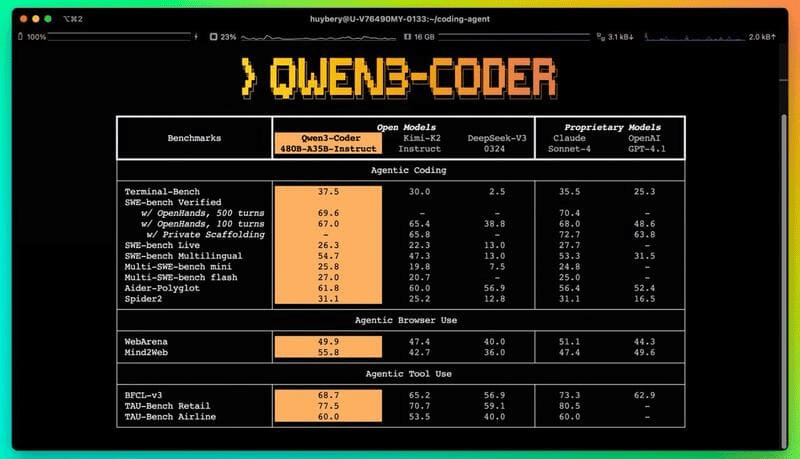

Welcome to another edition of the Friday JavaScript Roundup! In this week’s collection, we bring you the freshest tutorials, tools, and trends shaping the JavaScript ecosystem. Whether you're building full-stack apps, fine-tuning your UI, or just exploring what’s new, these curated links will keep your skills sharp and your stack modern.

## Mistral Launches Codestral Ecosystem as Enterprise AI Coding Suite

[Mistral has introduced](https://mistral.ai/solutions/coding) its response to GitHub Copilot: a comprehensive enterprise development ecosystem powered by its **Codestral** model family. At the core is **Codestral 25.08**, an updated model fine-tuned for real-world software environments.

### 🔍 Model Improvements

Codestral 25.08 delivers measurable gains based on real codebase benchmarks:

- ✅ **30% more accepted completions**  
- 📈 **10% more preserved code** after applying suggestions  
- ❌ **50% fewer overly long or incorrect generations**

These enhancements aim to streamline development and reduce common friction points in AI-assisted coding—especially in enterprise-scale projects.

---

Codestral isn’t just a model update—it’s Mistral’s strategic move toward building a full-featured coding assistant ecosystem for large teams and production systems.

## # Qwen 3 Coder: Alibaba’s Open 480B MoE Model for Programming

Alibaba has released **Qwen 3 Coder**, an open-source Mixture-of-Experts (MoE) model built for programming tasks. The model boasts **480 billion parameters** (with 35B active at any time) and was trained on **7.5 trillion tokens**, of which **70% are code**. It’s designed to solve real-world tasks and demonstrates performance comparable to **Claude 4 Sonnet** on code and tool usage benchmarks.

### 🧠 Key Features

- **480B total / 35B active parameters**  
- **7.5T tokens training corpus**, heavily code-focused  
- **256K context length**, scalable up to **1M tokens** using **YaRN**
- Trained using **RL at scale**, with 20K parallel environments
- Emphasizes real-world scenarios and tool usage

> The training approach lets the model learn from its own mistakes, thanks to a large-scale reinforcement learning setup.

### 💰 Pricing & Availability

The major downside of Qwen 3 Coder is its **expensive API** access:
- At **1M context tokens**, pricing can reach **$6–$60 per million tokens**
- Developers are encouraged to use **alternative API providers** that support up to **262K context** and are **3–4x cheaper**

### 🔗 GitHub Repository

The model and further resources are available here:  
👉 [https://github.com/QwenLM/Qwen3-Coder](https://github.com/QwenLM/Qwen3-Coder)

---

Qwen 3 Coder is a major step forward in open LLMs optimized for software development and tool interactions. While pricing may be high for some use cases, the availability of alternatives makes it flexible for research and production alike.

## 📜 Articles & Tutorials

[Dynamic nth-child() using sibling-index() and if()](https://css-tip.com/nth-child/)

[Design to Code with the Figma MCP Server](https://www.builder.io/blog/figma-mcp-server)

[CI/CD Best Practices for Microservices Architecture](https://devtron.ai/blog/microservices-ci-cd-best-practices/)

[Using the OpenTelemetry Operator to boost your observability](https://coralogix.com/blog/using-the-opentelemetry-operator-to-boost-your-observability/)

[Architecting with Constraints: A Pragmatic Guide](https://www.lorenstew.art/blog/always-architect-with-contraints)

[React Server Components: How We Got Here](https://www.epicreact.dev/react-server-components-how-we-got-here-zcuxn)

[How to Upload Large Objects to S3 with AWS CLI Multipart Upload](https://www.freecodecamp.org/news/how-to-upload-large-objects-to-s3-with-aws-cli-multipart-upload/)

[How To Create An NPM Package](https://www.totaltypescript.com/how-to-create-an-npm-package)

[Leveraging Docker with TensorFlow Models & TensorFlow.js for a Snake AI Game](https://www.docker.com/blog/leveraging-docker-with-tensorflow/)

[The Gap Strikes Back: Now Stylable](https://css-tricks.com/the-gap-strikes-back-now-stylable/)

[Parsing 1 Billion Rows in Bun/Typescript Under 10 Seconds](https://www.taekim.dev/writing/parsing-1b-rows-in-bun)

[Liquid Glass on the Web](https://frontendmasters.com/blog/liquid-glass-on-the-web/)

[Creating a scroll-spy with 2 lines of CSS](https://una.im/scroll-target-group/)

[A Full Code Agent in 200 Lines—Here’s How](https://cthiriet.com/blog/nano-claude-code)

[Tailwind CSS Grid: Complete Guide & Examples](https://prismic.io/blog/tailwind-css-grid)

## ⚒️ Tools

[OpenCut](https://github.com/OpenCut-app/OpenCut) - Cap-Cut's open-source alternative

[FilePursuit](https://filepursuit.com/) -  is a free search tool for finding files online—documents, APKs, ZIPs, images, videos, books, and PDFs—scanned directly from public sources.

[Craft Beautiful Patterns Backgrounds](https://patterncraft.fun/)

[Canine](https://canine.sh) - A modern, open source alternative to Heroku

[JavaScript Visualizer](https://www.jsv9000.app/)

[docker-commons](https://github.com/a-h-abid/docker-commons) - All common docker scripts in one place

[PicoSSG](https://picossg.dev/) - The anti-framework static site generator. No config. No nonsense Just files in, files out.

[FossFLOW](https://github.com/stan-smith/FossFLOW) - Make beautiful isometric infrastructure diagrams

[Chatwoot](https://github.com/chatwoot/chatwoot) - An Open Source Zendesk Alternative

[zen](https://github.com/sheshbabu/zen) - Selfhosted notes app. Single golang binary, notes stored as markdown within SQLite, full-text search, very low resource usage

[CSS Layout Generator](https://layout.bradwoods.io/)

[The Open-Source Agentic Browser](https://www.browseros.com/)

[SVG Doodles Collection](https://svgdoodles.com/)

## 📚 Libs

[awesome-chatgpt-prompts](https://github.com/f/awesome-chatgpt-prompts) - This repo includes ChatGPT prompt curation to use ChatGPT and other LLM tools better.

[apexcharts.js](https://github.com/apexcharts/apexcharts.js) - 📊 Interactive JavaScript Charts built on SVG

[chili3d](https://github.com/xiangechen/chili3d) - A web-based 3D CAD application for online model design and editing

[upyo](https://github.com/dahlia/upyo) - Upyo is a simple and cross-runtime library for sending email messages using SMTP and various email providers. It works on Node.js, Deno, Bun, and edge functions.

[concaveman](https://github.com/mapbox/concaveman) - A very fast 2D concave hull algorithm in JavaScript

[ReproZip](https://github.com/VIDA-NYU/reprozip) - is a tool that simplifies the process of creating reproducible experiments from command-line executions, a frequently-used common denominator in computational science. 

## ⌚ Releases

[Next.js 15.4 Released](https://nextjs.org/blog/next-15-4)

[Astro 5.12](https://astro.build/blog/astro-5120/)

[RustDesk 1.4.1](https://github.com/rustdesk/rustdesk/releases/tag/1.4.1) - a self-hosted open-source remote desktop app and TeamViewer alternative, was released in July 2025. Built with Rust and Dart, it's AGPL-licensed.

[Sourcebot v4.6.0 Released](https://github.com/sourcebot-dev/sourcebot/releases/tag/v4.6.0) -  a self-hosted tool that helps you understand your codebase. 

[PixiEditor 2.0 - a FOSS Universal 2D Graphics Editor is here!](https://pixieditor.net/blog/2025/07/30/20-release/)

[Announcing Nuxt 4.0](https://nuxt.com/blog/v4)

[Bun v1.2.19 Released](https://bun.com/blog/bun-v1.2.19)

[Tiptap V3 Released](https://tiptap.dev/docs/resources/whats-new)

[openpgpjs v6.2.0 Released](https://github.com/openpgpjs/openpgpjs/releases/tag/v6.2.0) - OpenPGP implementation for JavaScript

[ESLint v9.31.0 released](https://eslint.org/blog/2025/07/eslint-v9.31.0-released/)

[oxlint v1.8.0](https://github.com/oxc-project/oxc/releases/tag/oxlint_v1.8.0) - ⚓ A collection of JavaScript tools written in Rust.

[wasp v0.17.0](https://github.com/wasp-lang/wasp/releases/tag/v0.17.0) - The fastest way to develop full-stack web apps with React & Node.js.

## 📺 Videos

[How I Built a Web Scraping AI Agent - Use AI To Scrape ANYTHING](https://www.youtube.com/watch?v=G5djZjdxVvo)

[99% of Developers Don't Get Git Rebase](https://www.youtube.com/watch?v=yTFC_MvwJvQ)

[Bash Scripting Tutorial for Beginners](https://www.youtube.com/watch?v=PNhq_4d-5ek)

[How n8n Node Can Cut Your Costs by 90%](https://www.youtube.com/watch?v=ZSxo77jJBz4)

[React Native Bootcamp in 30 HOURS for FREE 🎉](https://www.youtube.com/watch?v=q3HE1dFiJBI)

[How I Built My Own Shadcn Library](https://www.youtube.com/watch?v=2NV1w1m9cTY)

[10x Your Neovim Experience](https://www.youtube.com/watch?v=Yqi9wINTcf4)

[Build A Sick AI-Voice Memo App W/ Next.js + OpenAI Whisper (Background Jobs / Cron Job / Inngest)](https://www.youtube.com/watch?v=9bhNdw3fmQM)

[Build and Deploy a Full Stack Car Rental Booking App using React js & ImageKit | MERN Stack Project](https://www.youtube.com/watch?v=tBObk72EYYw)

[Build an Enterprise Ready AI Powered Applicant Tracking System](https://www.youtube.com/watch?v=iYOz165wGkQ)

[DON'T Use JSON.parse & JSON.stringify](https://www.youtube.com/watch?v=PtcQwb1uBhc)

[Introducing React Native Reanimated 4](https://www.youtube.com/watch?v=Wr2fOM_xD2I)

## 🎤 Talks & Podcasts

No content this week 😢

## 🗞️ News & Updates

GitHub Copilot has surpassed 20 million users, Microsoft CEO Satya Nadella [announced](https://www.microsoft.com/en-us/Investor/earnings/FY-2025-Q4/press-release-webcast). GitHub confirmed the number reflects total usage to date.

[Figma raised $1.2B](https://www.bloomberg.com/news/articles/2025-07-29/figma-s-1-2-billion-ipo-approaching-40-times-oversubscribed?embedded-checkout=true) in its IPO, selling 36.9M shares at $33 each—above range. The company is now valued at $16.1B ($18.5B with options), nearing its scrapped Adobe deal.

That’s it for this week’s JavaScript Roundup! We hope these links inspired your next project or solved a lingering dev headache. If you found something helpful—or have a tool, library, or article worth featuring—drop us a note. See you next Friday with more handpicked JavaScript goodness.