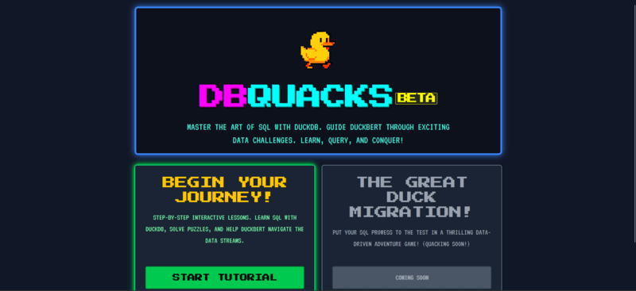
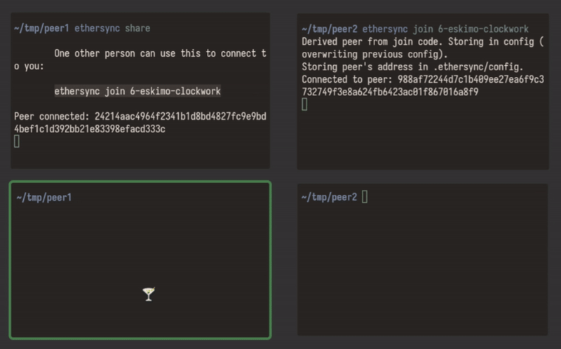

## Welcome back to Friday Links, edition #26! 🎉

This week’s roundup highlights some of the most valuable JavaScript resources, tools, and insights published around the web. From fresh libraries and tutorials to deep dives on performance and design patterns, we’ve gathered everything you need to keep your developer toolkit up to date. Perfect reading to kick off your weekend.

### Allie: Human-Like AI Chess Bot on Lichess

Since launch on Lichess, the [AI bot Allie](https://lichess.org/@/Allie) has played over 11,600 games, winning more than 6,800. The bot is free and [open source](https://github.com/ippolito-cmu/allie), available only in blitz mode, where you can also [watch its games live](https://lichess.org/@/Allie).

Created by Carnegie Mellon PhD student Yimin Zhang, Allie was trained not on engine calculations but on 91 million human games, making its style strikingly human-like. Researchers note it performs at grandmaster level, while remaining an excellent and natural sparring partner for learning.

### DBQuacks: A Quest Game to Learn SQL

[DBQuacks](https://dbquacks.com/) is a new SQL learning quest game. The first chapter (38 levels) introduces SQL basics with DuckDB through puzzles and story-driven tasks. Players solve mysteries by writing correct SQL queries, with hints and references available. A second chapter with advanced SQL features is coming soon.

## 📜 Articles & Tutorials

[How to Get Started with AWS in 2025](https://awsfundamentals.com/blog/aws-getting-started)

[How to Run Frontend & Backend Together with One Command (No Docker Needed)](https://dev.to/sumonta056/how-to-run-frontend-backend-together-with-one-command-no-docker-needed-29nd)

[How to optimize your Next.js app with after()](https://blog.logrocket.com/how-to-optimize-next-js-app-after)

[The Next.js 15 Streaming Handbook — SSR, React Suspense, and Loading Skeleton](https://www.freecodecamp.org/news/the-nextjs-15-streaming-handbook/)

[An Interactive Guide to SVG Paths](https://www.joshwcomeau.com/svg/interactive-guide-to-paths/)

[How We Exploited CodeRabbit: From a Simple PR to RCE and Write Access on 1M Repositories](https://research.kudelskisecurity.com/2025/08/19/how-we-exploited-coderabbit-from-a-simple-pr-to-rce-and-write-access-on-1m-repositories/)

[Visualizing distributions with pepperoni pizza (and javascript)](https://ntietz.com/blog/visualizing-distributions-with-pepperoni-pizza/)

[Why LLMs Can't Really Build Software](https://zed.dev/blog/why-llms-cant-build-software)

[Teaching GPT-5 to Use a Computer](https://prava.co/archon/)

[Make any website load faster with 6 lines of HTML](https://www.docuseal.com/blog/make-any-website-load-faster-with-6-lines-html)

[Using GitHub Pages as a URL shortener / redirection service](https://christianheilmann.com/2025/08/11/using-github-pages-as-a-url-shortener-redirection-service/)

[Building Bluesky Comments for My Blog](https://natalie.sh/posts/bluesky-comments/)

[Liquid Glass, but in CSS](https://atlaspuplabs.com/blog/liquid-glass-but-in-css)

## ⚒️ Tools

🍃 Ethersync

Ethersync enables real-time collaborative editing of local text files. You can use it for pair programming or note-taking, for example. It's the missing real-time complement to Git!

[WebSocket DevTools](https://github.com/law-chain-hot/websocket-devtools) - Complete WebSocket Traffic Control with advanced proxy, simulation, and blocking capabilities

[Github](https://github.com/ethersync/ethersync)

[PongHub](https://github.com/WCY-dt/ponghub) - Free endpoint monitoring. One-click deployment. 

[JWTAuditor](https://jwtauditor.com/) - A tool to audit JWTs (JSON Web Tokens) for security vulnerabilities and best practices.

[MCP Tools](https://github.com/f/mcptools) - A comprehensive command-line interface for interacting with MCP (Model Context Protocol) servers.

[Jobpare CV Generator](https://github.com/jobpare/cvgen) - A tool to generate professional CVs in various formats.

[Trackio](https://github.com/gradio-app/trackio) - A lightweight, local-first, and free experiment tracking Python library built on top of 🤗 Datasets and Spaces.

[Luminal](https://github.com/luminal-ai/luminal) - Deep learninglibrary that uses search-based compilation to achieve high performance.

[AGENTS.md](https://agents.md/) - A simple, open format for guiding coding agents, used by over 20k open-source projects.

[rendergit](https://github.com/karpathy/rendergit) - Render any git repo into a single static HTML page for humans or LLMs.

[llama-scan](https://github.com/ngafar/llama-scan) - A tool for converting PDFs to text files using Ollama.

[Anthropic Cookbook](https://github.com/anthropics/anthropic-cookbook) - A collection of examples and best practices for using Anthropic's AI models.

[Panda CSS](https://panda-css.com/) - A CSS-in-JS library that allows you to write CSS in JavaScript with a focus on performance and developer experience.

[fuite](https://github.com/nolanlawson/fuite) - A tool to detect memory leaks in JavaScript applications by tracking memory usage over time.

[AnimateIcons](https://animateicons.vercel.app/) - A sleek React library that transforms SVGs into smooth, purposeful animations — lightweight, customizable, and built with motion/react.

## 📚 Libs

[Motia](https://github.com/MotiaDev/motia) - local-first tool for creating professional resumes from JSON data and HTML templates. Features web editor, CLI tool, role-specific guidance, and PDF output. Perfect for developers and professionals who want full control over their CV presentation.

[Open Lovable](https://github.com/firecrawl/open-lovable) - About
🔥 Clone and recreate any website as a modern React app in seconds

[Claudable](https://github.com/opactorai/Claudable) - Connect Claude Code. Build what you want. Deploy instantly. 

[KittenTTS](https://github.com/KittenML/KittenTTS) - is an open-source realistic text-to-speech model with just 15 million parameters, designed for lightweight deployment and high-quality voice synthesis.

[React Native WebGPU](https://github.com/wcandillon/react-native-webgpu) - A React Native library that provides WebGPU support for high-performance graphics and compute on mobile devices.

[CryptoES](https://github.com/entronad/crypto-es) - A JavaScript library for cryptographic operations, including hashing, encryption, and decryption.

[node-soap](https://github.com/vpulim/node-soap) - A SOAP client and server for Node.js, allowing you to create and consume SOAP web services.

[syntax-highlight-element](https://andreruffert.github.io/syntax-highlight-element/) - A web component for syntax highlighting code snippets in HTML documents, supporting multiple languages and themes.

## ⌚ Releases

### Git 2.51 Released: Preparing for Git 3.0

On August 18, 2025, [Git 2.51 was released with 506 changes](https://github.blog/open-source/git/highlights-from-git-2-51/) from 91 contributors. This update prepares for Git 3.0, which will switch the default hash from SHA-1 to SHA-256 and adopt the reftable backend. Key improvements include:

- `git cat-file`: better handling of missing objects and submodules.
- `git log`: faster history search with Bloom filters.
- `git switch & git restore`: now stable replacements for git checkout.
- `git whatchanged`: deprecated, set for removal in Git 3.0.
- **New options**: `--start-after` for git `for-each-ref`, `--compact-summary` for `git merge` and `git pull`.
- **Performance boosts**: `git push` and `git fetch` are faster, especially with reftable (22× faster fetch, 18× faster push in large repos).
- C99 support: broader use of modern C features.
- Patch policy: pseudonyms now allowed for contributions.

[Next.js 15.4 Released](https://nextjs.org/blog/next-15-4) - This release includes new features like `next/image` improvements, enhanced performance, and more.

[Autobase 2.3.0 released](https://www.postgresql.org/about/news/autobase-230-released-3104/)

[DeepSeek-v3.1 Release](https://api-docs.deepseek.com/news/news250821)

[Announcing Nuxt 4.0](https://nuxt.com/blog/v4)

[Astro 5.12 Released](https://astro.build/blog/astro-5120/) 

[Node.js v24.6.0 (Current) Released](https://nodejs.org/en/blog/release/v24.6.0)

[React Native 0.81 Released](https://reactnative.dev/blog/2025/08/12/react-native-0.81)

[NVM Desktop v4.1.0](https://github.com/1111mp/nvm-desktop/releases/tag/v4.1.0)

## 📺 Videos

[How to Create a Minimap in Three.js with React Three Fiber (Drei View)](https://www.youtube.com/watch?v=d3cMODi1CtU)

[Build & Deploy 3 Full-stack Mobile Apps That’ll Get You Hired | Full 10-Hour React Native Course](https://www.youtube.com/watch?v=BTfcnxXevm0)

[Multi-Tenant SaaS Architecture in 3 Simple Steps](https://www.youtube.com/watch?v=bFLGwVyIotA)

[Linux Full Course - 10 Hours [2025]](https://www.youtube.com/watch?v=oDgkM7G8ezU&ab_channel=edureka%21)

[Build and Deploy a Multi-Vendor E-Commerce Marketplace with Nextjs, React, Stripe Connect, MongoDB](https://www.youtube.com/watch?v=6fXNWBFPfRM&t=9246s&ab_channel=CodeWithAntonio)

[Create an LMS Course Platform with Next.js, Arcjet, Better-Auth, and Stripe](https://www.youtube.com/watch?v=xqoYkX4hfwg&t=515s&ab_channel=JanMarshal)

[Build an Enterprise Nextjs Rental App | AWS, EC2, Cognito, Shadcn, RDS, S3, Node, React](https://www.youtube.com/watch?v=X1zCAPLvMtw&t=1s&ab_channel=EdRoh)

[Build an AI-Powered Job Board From Scratch with Next.js 15, Drizzle, Tailwind](https://www.youtube.com/watch?v=xIfSwINNM40&ab_channel=WebDevSimplified)

[Next.js 15 Full Course 2025 | Drizzle, Better Auth, Postgres, TypeScript | 14 Hours](https://www.youtube.com/watch?v=oxEmHmx4jm4&ab_channel=SangamMukherjee)

[Build and Deploy Full Stack AI GitHub SaaS | Next JS 15, Google Gemini AI, Assembly AI, Stripe](https://www.youtube.com/watch?v=OqlI2766LCk&list=PLv8XNy31mAPq__ZitIrgMrb4vI2I2hZKs&ab_channel=ElliottChong)

[Build and Deploy a B2B SaaS AI Support Platform | Next.js 15, React, Convex, Turborepo, Vapi, AWS](https://www.youtube.com/watch?v=CAr02YlEJUc&ab_channel=CodeWithAntonio)

[Let's build a multi-vendor E-Commerce SaaS by using Microservice Architecture, ImageKit](https://www.youtube.com/watch?v=XiD_TsGRQtE&ab_channel=Becodemy)

## 🎤 Talks & Podcasts

No content this week 😢

## 🗞️ News & Updates

### OpenAI CFO: $1B Monthly Revenue, But Compute Shortage Looms

In an [interview with CNBC](https://www.cnbc.com/2025/08/20/openai-compute-ai.html), OpenAI CFO Sarah Friar revealed the company generated over $1 billion in revenue in July 2025, projecting $12.7B for the year. Yet the main challenge remains severe compute shortages.

Key points:

- Stargate project launched to expand compute, with partners including Oracle and CoreWeave.
- Microsoft partnership remains central — as both investor and primary compute provider.
- Despite a rocky GPT-5 launch, OpenAI has seen rising Plus and Pro subscriptions.
- Analysts expect an $8B negative cash flow in 2025; Stargate’s long-term investment is valued at $500B, with Altman hinting at “trillions” for future data centers and chips.
- Friar notes OpenAI may one day sell compute to third parties, becoming an “AWS for AI”, but for now lacks the capacity even for its own work.

### IBM & NASA Launch Surya AI to Predict Solar Storms

IBM and NASA have unveiled Surya, an [open-source AI model](https://huggingface.co/ibm-nasa/Surya) designed to forecast solar flares and coronal mass ejections before they strike Earth. Built on the world’s largest heliophysics dataset, Surya analyzes high-resolution solar images to predict dangerous events that can disrupt satellites, power grids, telecoms, and navigation systems.

Highlights:

- Trained on 9 years of NASA’s Solar Dynamics Observatory images.
- Improves solar flare classification accuracy by 16%.
- First steps toward visual forecasting of flares, with warnings up to 2 hours ahead.
- Openly available for research on [Hugging Face](https://huggingface.co/ibm-nasa/Surya).
- Builds on IBM & NASA’s earlier [Prithvi](https://huggingface.co/ibm-nasa/Prithvi) Earth observation AI models.

Researchers call Surya a “weather forecaster for the Sun”, a critical step in protecting modern infrastructure from Carrington-level solar storms.

That wraps up Friday Links 26 for August 22, 2025! 🚀
We hope this collection helps you discover new ideas and sharpen your JavaScript skills. If you found it useful, share it with your teammates or dev community — and don’t forget to check back next Friday for more curated finds. Until then, happy coding!