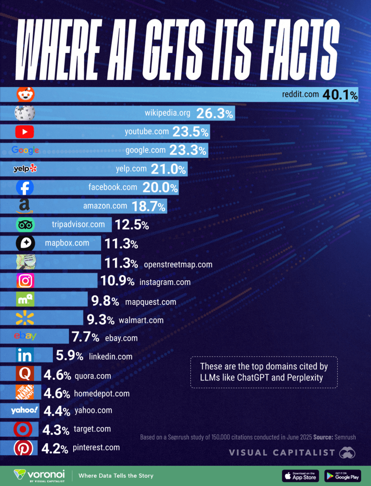
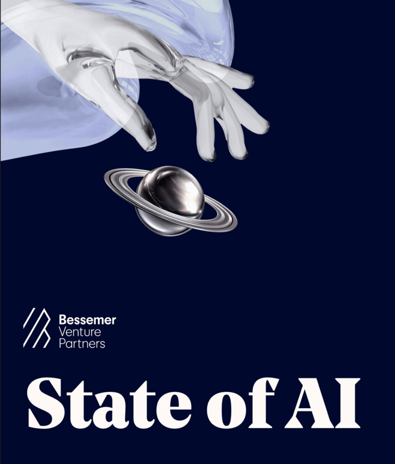
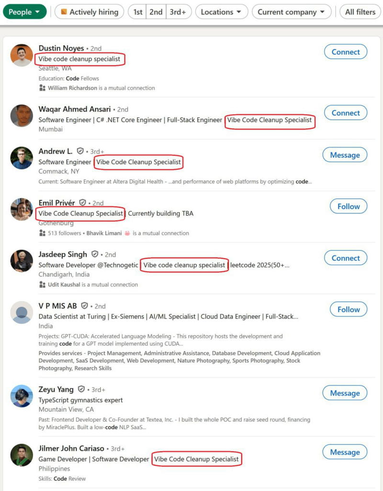

Welcome back to our weekly JavaScript roundup! Every Friday, we collect the most useful articles, libraries, and experiments from across the community. Whether you’re exploring the latest in React, Next.js, or digging into new language features, this list is designed to keep you inspired and up to speed.

## Google’s Nano Banana AI Draws 10M New Gemini App Users

Google’s Nano Banana (formerly Gemini 2.5 Flash Image) quickly hit 10M new users in the Gemini App, generating over 200M images. Similarweb [reports](https://x.com/Similarweb/status/1963556841717137676) daily visits to [Google AI Studio](https://ai.google.dev/) jumped from ~3M to 4.5M after launch.

On [Lmarena](https://lmarena.ai/), Nano Banana ranks #1 for image creation and editing — ahead of Flux-1-kontext-max by a record 171 points. Users highlight its speed and precise edits that only affect prompt-specified areas.

Nano Banana is free in Gemini App, Google AI Studio, and Vertex AI, with an API priced at $0.039 per image. Google also introduced an image generator on X (Twitter) — just tag NanoBanana in a post to use it.

## 📜 Articles & Tutorials

[Build an AI Assistant with LangGraph and Next.js: Use Your APIs and Google Calendar as Tools](https://auth0.com/blog/genai-tool-calling-build-agent-that-calls-calender-with-langgraph-nextjs/)

[Using Grok 4 in the frontend development: Here’s what I’ve learned](https://blog.logrocket.com/grok-4-frontend-development/)

[Common Tailwind CSS Patterns](https://www.telerik.com/blogs/common-tailwind-css-patterns)

[Gemini CLI + VS Code: Native diffing and context-aware workflows](https://developers.googleblog.com/en/gemini-cli-vs-code-native-diffing-context-aware-workflows/)

[Why LLMs struggle with analytics](https://www.tinybird.co/blog-posts/why-llms-struggle-with-analytics-and-how-we-fixed-that)

[Letting Playwright MCP Explore your site and Write your Tests](https://dev.to/debs_obrien/letting-playwright-mcp-explore-your-site-and-write-your-tests-mf1)

[Multiple GitHub Accounts — A Must-Have Skill for Developers](https://app.daily.dev/posts/multiple-github-accounts-a-must-have-skill-for-developers-gi3ye4i3t)

[Connecting AutoGen Agents to Any MCP Server](https://www.gettingstarted.ai/autogen-mcp/)

[CSS-Questions](https://css-tricks.com/css-questions/)

[What is Context Engineering?](https://blog.dailydoseofds.com/p/what-is-context-engineering)

[How AI Agents Remember Things: The Role of Vector Stores in LLM Memory](https://www.freecodecamp.org/news/how-ai-agents-remember-things-vector-stores-in-llm-memory/)

[Building AI Agents with Docker MCP Toolkit: A Developer’s Real-World Setup](https://www.docker.com/blog/docker-mcp-ai-agent-developer-setup/)

[Indexing JSONB in Postgres](https://www.crunchydata.com/blog/indexing-jsonb-in-postgres)

[The Fundamentals of CSS Alignment](https://css-tip.com/explore/alignment/)

[Boost Your Copilot Collaboration with Reusable Prompt Files](https://devblogs.microsoft.com/visualstudio/boost-your-copilot-collaboration-with-reusable-prompt-files/)

[Why I Ditched Docker for Podman (And You Should Too)](https://codesmash.dev/why-i-ditched-docker-for-podman-and-you-should-too)

[LLM Visualization](https://bbycroft.net/llm)

[3D QR Codes](https://erikdemaine.org/prints/QR/)

[This blog is running on a recycled Google Pixel 5](https://blog.ctms.me/posts/2024-08-29-running-this-blog-on-a-pixel-5/)

## ⚒️ Tools

An open-source project called SeedBox Lite has appeared on [GitHub](https://github.com/hotheadhacker/seedbox-lite) — a self-hosted alternative to Netflix. It builds a content library from torrents, giving free access to virtually any movie. Streaming starts instantly, with no need to wait for downloads. The player feels like a real streaming service: subtitles, fullscreen, gestures, and cross-platform support (smartphone, tablet, PC — anywhere with a browser). You can lock it with a password, and installation takes just a few minutes following a simple guide.

A new service, [Kira.art](https://kira.art/), lets you edit images directly in chat without layers, brushes, or complex tools. You just upload a picture and describe the changes you want.

You can adjust eye color, add or remove backgrounds and objects, create artwork, or apply styles like anime. The platform also includes a built-in upscaler to boost image quality several times. No complex prompts required — everything works through natural language dialogue.

[Better Auth Starter](https://github.com/TheOrcDev/better-auth-starter) - Better auth starter with Drizzle, Neon, and Shadcn

[Potion](https://github.com/abhinavthedev/potion) - 🔮 Potion is an AI-powered note-taking platform that transforms your thoughts into intelligent, searchable knowledge. Leveraging MindsDB's advanced AI capabilities, Potion enables semantic search, AI-generated summaries, and intelligent chat assistance to make your notes truly smart.

[Self-hosted AI starter kit](https://github.com/n8n-io/self-hosted-ai-starter-kit)

[OverType](https://overtype.dev/) - The Markdown Editor That's a Textarea

[Memos](https://github.com/usememos/memos) - A modern, open-source, self-hosted knowledge management and note-taking platform designed for privacy-conscious users and organizations.

[Readme Studio](https://github.com/zenui-labs/readme-studio) - is an advanced AI that generates clean, structured, and professional READMEs for you. Save time, ensure clarity, and elevate your documentation with intelligent automation.

[CodeX](https://codex.anishkumar.tech/) - Build webapps in minutes for completely free

[Dyad](https://github.com/dyad-sh/dyad) - Dyad is a local, open-source AI app builder. It's fast, private, and fully under your control — like Lovable, v0, or Bolt, but running right on your machine.

[FrameZero](https://www.framezero.app/) - Create motion in minutes. All in your browser, no sign-up.

[SiYuan](https://github.com/siyuan-note/siyuan) - A privacy-first, self-hosted, fully open source personal knowledge management software, written in typescript and golang.

[Webiny](https://github.com/webiny/webiny-js) - Open-source serverless enterprise CMS. Includes a headless CMS, page builder, form builder, and file manager. Easy to customize and expand. Deploys to AWS.

[DBeaver](https://github.com/dbeaver/dbeaver) - Free universal database tool and SQL client

[Slidev](https://github.com/slidevjs/slidev) - Presentation Slides for Developers

[kubewall](https://github.com/kubewall/kubewall) - is a Open-Source, Single-Binary Kubernetes Dashboard with Multi-Cluster Management & AI Integration.

## 📚 Libs

### Chatterbox Multilingual Introduced: Free Voice Cloning in 23 Languages

[The Chatterbox](https://github.com/resemble-ai/chatterbox) Multilingual project can clone any voice from a short recording and bring text to life with emotions. It supports 23 languages, including Russian, and lets users add emphasis, pauses, word highlights, and control pitch and tone. A built-in voice library is also available for projects.

[abogen](https://github.com/denizsafak/abogen) - Generate audiobooks from EPUBs, PDFs and text with synchronized captions. 

A new open-source project, T[he Little Book of Linear Algebra](https://github.com/the-litte-book-of/linear-algebra), has been released, offering a concise and beginner-friendly introduction to core concepts of linear algebra.

The repository focuses on clarity and brevity, making it easier for newcomers to grasp topics like vectors, matrices, transformations, and basic operations without overwhelming detail. It’s designed as a quick-start resource rather than a heavy textbook, ideal for students and developers brushing up on math fundamentals.

The [react-bits repository](https://github.com/DavidHDev/react-bits) offers thousands of animated React components for building web projects and interfaces. It includes a wide range of elements — buttons, cards, menus, creative cursors, animated lists, and decorative UI details. Each component can be previewed directly in the browser to test functionality and see how it will look on the web. Integration into a project takes just one click.

[The System Prompts Leaks repository](https://github.com/asgeirtj/system_prompts_leaks) has been updated with guides for most modern AI models from Anthropic, Google, OpenAI, Perplexity, xAI, and other top developers. It includes a database covering all models — how they were trained, what’s under the hood, benchmarks, capability limits, and the reasoning rules they follow. The repo also shares hacks to bypass restrictions, censorship, and bottlenecks, plus step-by-step instructions on creating custom AI models for specific tasks, helping save dozens of work hours on routine processes.

[hrms](https://github.com/frappe/hrms) - Open Source HR and Payroll Software

[rule-engine](https://github.com/ali-master/rule-engine) - The ultimate JSON-based rule engine that turns complex business logic into declarative configurations. Built for developers who believe code should be expressive, not repetitive.

[EmbedPDF Viewer](https://github.com/embedpdf/embed-pdf-viewer) - A PDF viewer that seamlessly integrates with any JavaScript project

[The Serverless Framework](https://github.com/serverless/serverless) - ⚡ Serverless Framework – Effortlessly build apps that auto-scale, incur zero costs when idle, and require minimal maintenance using AWS Lambda and other managed cloud services.

[Novel](https://github.com/steven-tey/novel) - Notion-style WYSIWYG editor with AI-powered autocompletion.

[Docling](https://github.com/docling-project/docling) - Docling simplifies document processing, parsing diverse formats — including advanced PDF understanding — and providing seamless integrations with the gen AI ecosystem.

[Rasterizer](https://github.com/mindbrix/Rasterizer) -  A GPU accelerated 2D vector graphics engine 

[Le Chat. Custom MCP connectors. Memories.](https://mistral.ai/news/le-chat-mcp-connectors-memories)

[Database File Format](https://www.sqlite.org/fileformat.html)

[SQL needed structure](https://www.scattered-thoughts.net/writing/sql-needed-structure/)

## ⌚ Releases

A Google engineer released a [free tutorial](https://docs.google.com/document/d/1rsaK53T3Lg5KoGwvf8ukOUvbELRtH-V0LnOIFDxBryE/preview?pli=1&tab=t.0#heading=h.pxcur8v2qagu) covering everything about AI agents — from basics to advanced prompt engineering, fine-tuning, and teaching agents to use a browser with practical code examples.

A free AI agent called [Academic Deep Search & QA](https://github.com/iblameandrew/local-deepsearch-academic) has been introduced for learning and research — from essays and reports to large-scale theses for students. It covers a wide range of subjects, from math and programming to philosophy, chemistry, biology, and even specialized areas like quantum physics. The tool enables real academic-style research: you can ask questions, refine material, restructure your work, and add new facts. The AI provides responses at an academic level, complete with citations, explanations, references, and visuals.

### Major Update in Three.js r179

On **August 1st**, the new version of **[Three.js](https://github.com/mrdoob/three.js) r179** was released, bringing a refined set of improvements for 3D developers. Three.js is a free, open-source JavaScript library that enables browser-based 3D graphics through WebGL, with experimental WebGPU support.

#### Competing Libraries
- **Babylon.js** – a powerful engine focusing on games and RTC.  
- **Verge3D** – a visual constructor with less coding.  
- **LUME** – updated even more frequently.  

Still, Three.js remains the most popular thanks to its **ease of learning, flexibility, and large community**.

#### What’s New in r179?

- **EXRLoader**: Added `lossyDctChannelDecode` for faster, smaller EXR texture loading. New output-format API and linear-sRGB color space for accurate color correction.  
- **FBXLoader**: Fixed vertex color import bug.  
- **GTAOPass**: Better Ambient Occlusion performance; `Line2` objects excluded for correct rendering.  
- **HTMLMesh**: Supports email/password inputs directly in 3D scenes.  
- **LensflareMesh**: Migrated to `colorNode` for improved flare effects.  
- **LightProbeGenerator**: Now supports `FloatType` cube textures.  
- **OutlinePass**: Keeps lines sharp and clean by excluding `Line2`.  
- **RapierPhysics**: `RoundedBoxGeometry` now integrates with physics.  
- **RoomEnvironment**: Uses `emissiveIntensity` instead of legacy ambient/intensity.  
- **RoundedBoxGeometry**: Added typings, param docs, and JSON export.  
- **NodeMaterial**: Fog applied once, new `NodeUtils`, async `compileAsync()`, and viewport/scissor APIs.  
- **BatchedMesh**: New `setInstanceCount()` API.  
- **Line3**: Distance methods between lines.  
- Plus: Better renderer logging, more reliable reversed depth buffer, and MRT support for 2D textures.  

#### Docs and Examples
Updated docs for **MaterialX, AnimationClip, Texture** and more.  
New WebGPU demos:  
- `webgpu_postprocessing_dof_basic`  
- `webgpu_compute_texture_3d`  
- Improved MaterialX and reflections.  

#### Bottom Line

Three.js r179 is **not a revolution** but a **well-rounded upgrade**. Expect more stable loaders, reliable visual effects, extended physics support, and WebGPU demos that push experimentation further.  

Perfect for structured 3D workflows, especially when paired with **Blender**.  

👉 Explore it on GitHub: [Three.js r179](https://github.com/mrdoob/three.js)

[Microsoft releases lightweight Office taskbar apps for Windows 11](https://support.microsoft.com/en-us/office/get-started-with-microsoft-365-companions-a27df74a-cc41-4e74-8216-51091dc30194)

[Bun v1.2.21 Released](https://bun.com/blog/bun-v1.2.21)

[Apollo Client 4.0: A Leaner and Cleaner GraphQL Client with No Compromises](https://www.apollographql.com/blog/announcing-apollo-client-4-0)

[Redux Toolkit v2.9.0 Released](https://github.com/reduxjs/redux-toolkit/releases/tag/v2.9.0)

### Kimi K2.1: Next-Level Performance From Moonshot

Moonshot has released **Kimi K2.1 (build Kimi K2 0905)**, now topping benchmarks and outperforming even **Claude 4 Sonnet** and **Gemini 2.5 Pro** in most tests.  

🔗 [Model Weights](https://huggingface.co/moonshotai/Kimi-K2-Instruct-0905)  
🔗 [Full Report](https://moonshotai.github.io/Kimi-K2/)  

#### Key Technical Details

- **Architecture**: Mixture-of-Experts, 32B active params, ~1T total.  
- **Update 0905**: Supports **agentic coding** and **256K context**.  
- **Variants**:  
  - **Kimi-K2-Base** — pretraining base.  
  - **Kimi-K2-Instruct** — optimized for chat/agents (fast, no “long thinking”).  
- **Training**: 15.5T tokens, optimizer **MuonClip (qk-clip)** to stabilize learning and reduce attention logit spikes.  
- **Architecture tweaks**: fewer heads for long context, higher MoE sparsity, design close to DeepSeek-V3.  
- **Agent features**: built-in tool use (MCP + synthetic tools), self-judge RL, works for both verifiable and creative tasks.  

####  Benchmarks

- Results in non-thinking mode.  
- **Tau2** used as weighted average.  
- On Swe-Bench Multilingual, compared against Claude Sonnet (Opus excluded due to cost).  
- Several SOTA scores highlighted in the full report.  

#### Strong Foundation for Agents

Kimi K2.1 integrates easily with external tools without manual scripting. Reported demos include:  
- Salary analysis with visualizations.  
- Automated website and planner generation.  
- Terminal automation.  
- Even a Minecraft prototype in JavaScript.  

⚡ A major step forward for agentic AI — fast, powerful, and versatile.  

[Radicle 1.4 Released](https://radicle.xyz/2025/09/04/radicle-1.4.0)

[Nuxt 4.1 Released](https://nuxt.com/blog/v4-1)

[Bootstrap 5.3.8](https://blog.getbootstrap.com/2025/08/25/bootstrap-5-3-8/)

## 📺 Videos

[Next.js + n8n Might Be The Ultimate Combo (+ Self-Host On VPS W/ Coolify!)](https://www.youtube.com/watch?v=VQ7djsFfD5w)

[Deep Agents UI](https://www.youtube.com/watch?v=0CE_BhdnZZI)

[Build & Deploy an AI-Powered Ecommerce Search Engine with Next.js 15, Hugging Face & Pinecone](https://www.youtube.com/watch?v=Fy_bnJmI5PE)

[Fullstack AI Chatbot with AI SDK 5 & Vercel’s New AI Elements](https://www.youtube.com/watch?v=6lur_Yit4PM)

[MERN Stack Project: Video Calling Slack Clone with React & Node.js](https://www.youtube.com/watch?v=qsFdE4okEfw)

[NEW Next.js TypeScript Features](https://www.youtube.com/watch?v=rVdR0_Ujgq4)

[3 Amazing New TanStack Query Features!](https://www.youtube.com/watch?v=EujzNb2iu3w)

[GitHub Scams](https://www.youtube.com/watch?v=aHY3JJpHfXs)

[How to Bake Lighting with Blender for Three.js](https://www.youtube.com/watch?v=w2XvGYxQiOk&ab_channel=WawaSensei)

[DevOps Full Course 2025](https://www.youtube.com/watch?v=tLg2p45ztJI&ab_channel=edureka%21)

[Intro to Fine-Tuning Large Language Models](https://www.youtube.com/watch?v=H-oCV5brtU4&ab_channel=freeCodeCamp.org)

[Glowing Corner Hover Effects | CSS & Javascript](https://www.youtube.com/watch?v=J1wmccssW9s&ab_channel=OnlineTutorials)

[3 ways to use React in Astro](https://www.youtube.com/watch?v=b9nbtjWQb5k&ab_channel=CodinginPublic)

[Best NextJS Folder Structures | Beginner - Intermediate - Advanced](https://www.youtube.com/watch?v=5HAKUIvYo-Q&ab_channel=PedroTech)

[Summarize Hacker News with Hono + Cloudflare](https://www.youtube.com/watch?v=Wuo7OOaSgmI&ab_channel=Syntax)

[Better-Auth - Full Guide (OAuth, Emails, Roles, Hooks, Authorization, Prisma, Next.js 15, Resend)](https://www.youtube.com/watch?v=w5Emwt3nuV0&ab_channel=CodinginFlow)

[UI Design 5 Years Ago vs Today (Shocking Transformation!)](https://www.youtube.com/watch?v=l9LtXlJ6cNM&ab_channel=HyginusUkeh-BuildingAmazingThings)

## 🎤 Talks & Podcasts

### Ex-OpenAI and Meta Exec: AI Pay Gap Widens

Former OpenAI and Facebook executive Peter Deng said the race for AI talent is driving a sharp pay gap between top researchers and other tech employees.

Speaking on the Unsupervised Learning podcast, Deng noted that leading AI experts are offered multimillion-dollar contracts from giants like OpenAI, Anthropic, Perplexity, and xAI, while many engineers who also contribute significantly earn far less.

Deng compared AI researchers to sports stars fought over by top teams, echoing Databricks VP Naveen Rao, who called them the “LeBrons of tech.” This imbalance, Deng warned, risks dissatisfaction and tension within companies.

<Youtube id='6eXgo53VhJI' />

## 🗞️ News & Updates

### Top Knowledge Sources for ChatGPT and Similar AI Models

With the rapid rise of chatbots like ChatGPT and users’ tendency to trust their answers, it’s important to know where these tools get their information. According to Semrush (June data, 150K citations), Reddit is the most cited source, appearing in 40% of references.

It’s followed by Wikipedia, then YouTube and Google. Visual Capitalist notes that AI models largely rely on forum discussions and community-moderated content, which risks amplifying common biases, inaccuracies, and prevailing viewpoints from those platforms.

As [Visual Capitalist highlights](https://www.visualcapitalist.com/ranked-the-most-cited-websites-by-ai-models/), AI models mainly rely on forum discussions and community-moderated content. This means widespread biases, inaccuracies, or prevailing viewpoints from these platforms can easily be carried over into AI responses and amplified even further.

Alibaba has released [Qoder](https://qoder.com/), an AI agent that can generate complete applications from a simple prompt. Framed as a “next-generation” coding platform, Qoder analyzes your entire project and codebase, learns your coding style, breaks complex tasks into steps, drafts specs, plans changes, and applies them incrementally. It’s currently available free of charge.

### State of AI 2025: Key Predictions from Bessemer

Bessemer Venture Partners has released its **[State of AI 2025](https://www.bvp.com/atlas/state-of-ai-2025)** report, highlighting how artificial intelligence is set to reshape industries and daily workflows. Below are the most notable takeaways.

#### AI Browsers as the New Interface

Browsers are expected to become the **dominant interface for AI agents**. Instead of being standalone tools, AI will integrate at the OS level, interacting directly with browser tabs and sessions to help users make real-time decisions.  

We already see early examples with [Comet](https://www.comet.ai/) and [Dia](https://www.diabrowser.com/). However, Bessemer predicts that giants like OpenAI and Google will launch their own AI browsers, likely sparking a **new browser war**.

#### Generative Video Becomes Mainstream

According to the report, **2026 will mark the breakout year for generative video**. Improved realism and accessibility will make it commercially viable at scale. Expect an explosion of startups and tools serving industries like:  

- Film and entertainment  
- Animation and VFX  
- Real-time customer engagement  

Over the next year, the key players in this market will begin to emerge.

#### Demand for Proven AI Performance

Adoption will hinge on **clear, measurable outcomes**. Companies will increasingly ask:  

- Does this AI tool drive revenue or conversions?  
- Does it improve customer satisfaction?  
- How can results be explained and scaled?  

Startups that offer **scalable, explainable evaluation frameworks** are positioned to lead the next wave of AI adoption.

#### The Next Social Network Could Be AI-Driven

Just as Instagram followed the rise of smartphone cameras and TikTok followed mobile video, **generative AI may enable the next big social network**.  

Its format remains uncertain — will it be people, AI avatars, or hybrid interactions? — but the potential for a new platform disrupting the social media market is strong.

#### A Wave of AI Acquisitions

Finally, Bessemer predicts a **surge in mergers and acquisitions** in 2025–2026. Major corporations will acquire AI startups to secure their positions in regulated sectors such as:  

- Healthcare  
- Logistics  
- Finance  
- Legal services  

In this way, startups will become building blocks of corporate AI strategies, while enterprises rethink their value propositions around automation and intelligence.

### Warner Bros. Sues Midjourney Over Alleged Copyright Violations

Warner Bros. has filed a lawsuit against Midjourney, accusing the generative graphics platform of unlawfully exploiting its intellectual property. According to the studio, users can easily create images of Batman, Bugs Bunny, Scooby-Doo, and other iconic characters without permission. The filing includes side-by-side comparisons of official artwork and Midjourney outputs.

Warner Bros. argues this is not harmless fan art but direct competition, since such images could be printed on merchandise, posters, and other commercial products. The studio is seeking $150,000 in damages per infringed work, which could amount to billions given Midjourney’s scale.

This isn’t the first case of its kind — Disney and Universal have raised similar claims in the past. Midjourney, meanwhile, cites fair use in its defense, noting that many studios themselves rely on generative AI tools in production.

---

Developers are now branding themselves as “**Vibe code cleanup specialists**” — offering paid services to fix and polish the messy code produced by AI systems.

---

That wraps up this week’s Friday Links! We’ll be back next week with more hand-picked resources to keep your JavaScript skills sharp. If you found something particularly useful, share it with your team — and don’t forget to check back next Friday for the next edition.