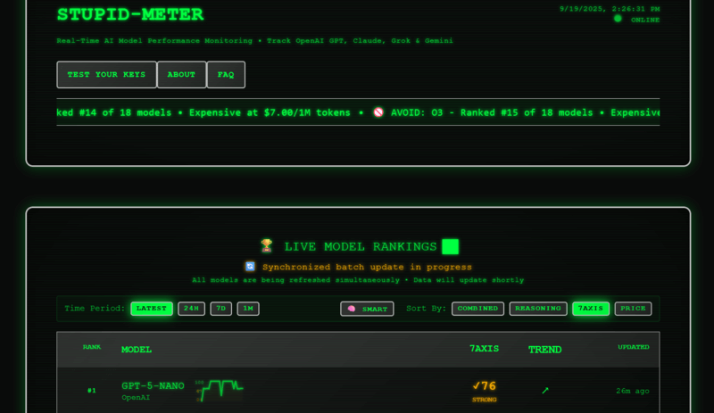

Welcome back to Friday Links, your weekly dose of JavaScript highlights. This is the 28th edition, bringing you a curated collection of new tools, insightful articles, and discussions that are shaping the JavaScript ecosystem this week. Whether you’re into frameworks, backend performance, or the latest experimental APIs, there’s something here for you.

## NPM Supply Chain Attack: `@ctrl/tinycolor` and 40+ Packages Compromised

A major supply chain attack, dubbed Shai-Hulud, compromised `@ctrl/tinycolor` and 40+ npm packages. Malicious code exfiltrated cloud credentials and GitHub tokens. Developers should remove affected versions, rotate secrets, and audit CI/CD pipelines.

## DeepSeek Trains R1 Model for Just $294K Using Nvidia H800s

Chinese AI firm DeepSeek [revealed](https://www.nature.com/articles/d41586-025-03015-6) it spent only $294,000 training its R1 model — far below the hundreds of millions claimed by U.S. rivals. Using 512 Nvidia H800 accelerators, the company trained R1 in just 80 hours. The release of R1 earlier this year rattled tech markets, even denting Nvidia’s valuation. DeepSeek also acknowledged limited use of A100s and defended model distillation, stressing it makes AI more accessible despite U.S. accusations of copying OpenAI’s work.

## Villager: Controversial Chinese AI Pentesting Tool Emerges

Security [researchers uncovered Villager](https://www.theregister.com/2025/09/11/cobalt_strikes_ai_successor_downloaded/), an AI-driven pentesting framework published on PyPI and linked to the Chinese group Cyberspike. Marketed as a “successor to Cobalt Strike,” it integrates Kali Linux, 4,200+ AI prompts, and tools like Mimikatz and AsyncRAT. While it can support legitimate penetration testing, its automation makes it equally useful for large-scale cyberattacks. Experts warn that Villager highlights how quickly attackers are adopting AI to streamline exploitation and stealth.

## 📜 Articles & Tutorials

[Behind The Scenes of Bun Install](https://bun.com/blog/behind-the-scenes-of-bun-install)

[An Interactive Guide to TanStack DB](https://frontendatscale.com/blog/tanstack-db/)

[How to Use Liquid Glass in React Native](https://www.callstack.com/blog/how-to-use-liquid-glass-in-react-native)

[Generate AWS Architecture Diagrams with Amazon Q](https://awsfundamentals.com/blog/amazon-q-architecture-diagrams)

[Building a React AI Agent: A Practical Guide for Developers](https://blog.infostrux.com/building-a-react-ai-agent-a-practical-guide-for-developers-c867253df140)

[Build a Signal Clone with React Native and Stream - Part One](https://dev.to/tropicolx/build-a-signal-clone-with-react-native-and-stream-part-one-5a47), [Part Two](https://dev.to/tropicolx/build-a-signal-clone-with-react-native-and-stream-part-two-1k3e)

[Better CSS layouts: Time.com Hero Section](https://ishadeed.com/article/time-layout/)

[How to optimize your Next.js app with after()](https://blog.logrocket.com/how-to-optimize-next-js-app-after)

[How React Works Behind the Scenes](https://www.deepintodev.com/blog/how-react-works-behind-the-scenes)

[What a Simple JS Router Taught Me About Being a Senior Developer](https://medium.com/@julien.reichel_97314/building-a-vanilla-js-router-with-vite-243e06b26cbd)

[Advanced App Router Routing Patterns (Next.js)](https://blog.curbanii.net/advanced-app-router-routing-patterns-next-js/)

[This website has no class](https://aaadaaam.com/notes/no-class/)

[OpenTelemetry Collector: What It Is, When You Need It, and When You Don’t](https://oneuptime.com/blog/post/2025-09-18-what-is-opentelemetry-collector-and-why-use-one/view)

## ⚒️ Tools

[CodeDiagram](https://marketplace.visualstudio.com/items?itemName=CodeDiagram.codediagram) - The visual note-taking tool inside your VSCode

[Term.Everything](https://github.com/mmulet/term.everything) - Run any GUI app in the terminal❗

[mdream](https://github.com/harlan-zw/mdream) - ☁️ Convert any site to clean markdown & llms.txt. Boost your site's AI discoverability or generate LLM context for a project you're working with.

[openapi-typescript-server](https://github.com/jasonblanchard/openapi-typescript-server) - Codegen TypeScript servers from OpenAPI

[Origin UI](https://originui.com/) - Beautiful UI components built with Tailwind CSS and React.

[port-kill](https://github.com/kagehq/port-kill) - Port Kill helps you find and free ports blocking your dev work.

[Advanced-Git](https://github.com/mike-rambil/Advanced-Git) - Collaborative cheatsheet for GIT

[EvilCharts v1.0](https://evilcharts.com/) - Animated & Interactive charts for your next project.

## 📚 Libs

[ts-to-zod](https://github.com/fabien0102/ts-to-zod) - Generate Zod schemas (v4) from Typescript types/interfaces.

[react horizontal heatmap](https://github.com/sakthilkv/react-horizontal-heatmap) - A lightweight React component for rendering a horizontal heatmap. Perfect for timelines, activity charts, or health status indicators. Fully customizable colors, box size, and spacing.

[Tricolore - v0.1.0](https://riatelab.github.io/tricolore.js/) - A JavaScript/TypeScript library for visualizing ternary compositions with choropleth maps, heavily inspired by the [R tricolore package](https://github.com/jschoeley/tricolore/).

[Chartbrew](https://github.com/chartbrew/chartbrew) - Open-source web platform used to create live reporting dashboards from APIs, MongoDB, Firestore, MySQL, PostgreSQL, and more 📈📊

[ow](https://github.com/sindresorhus/ow) - Function argument validation for humans

[SVG guitar](https://github.com/omnibrain/svguitar) - Create beautiful SVG guitar chord charts

[Feedsmith](https://github.com/macieklamberski/feedsmith) - Fast, all-in-one parser and generator for RSS, Atom, RDF, and JSON Feed, with support for Podcast, iTunes, Dublin Core, and OPML files.

[terminal-image](https://github.com/sindresorhus/terminal-image) - Display images in the terminal

[Mercur](https://github.com/mercurjs/mercur) - Open-source multi-vendor marketplace platform for B2B & B2C. Built on top of MedusaJS. Create your own custom marketplace. 🛍️

[manifest](https://github.com/mnfst/manifest?tab=readme-ov-file) - Portable backend to ship fast.

[JPL Open Source Rover Project](https://github.com/nasa-jpl/open-source-rover) - A build-it-yourself, 6-wheel rover based on the rovers on Mars!

## ⌚ Releases

[Deno 2.5 Released](https://deno.com/blog/v2.5): Permissions in the config file

[ESLint v9.35.0 released](https://eslint.org/blog/2025/09/eslint-v9.35.0-released/)

[Node.js v24.8.0 (Current)](https://nodejs.org/en/blog/release/v24.8.0)

[Electron 38.0.0 Released](https://www.electronjs.org/blog/electron-38-0)

[Storybook 10 is a breaking maintenance release](https://storybook.js.org/docs/10/releases/migration-guide)

[Ember 6.7 Released](https://blog.emberjs.com/ember-released-6-7/)

[Rspack 1.5.3 Released](https://github.com/web-infra-dev/rspack/releases/tag/v1.5.3)

[Expo Router v6](https://expo.dev/blog/expo-router-v6)

[Fastify 5.6 Released](https://github.com/fastify/fastify/releases/tag/v5.6.0)

[Ink 6.3 Released](https://github.com/vadimdemedes/ink)

[uuid 13.0](https://github.com/uuidjs/uuid) - Generate RFC-compliant UUIDs in JavaScript

[Announcing Rust 1.90.0](https://blog.rust-lang.org/2025/09/18/Rust-1.90.0/)

[npm-publish v4.0.0](https://github.com/JS-DevTools/npm-publish/releases/tag/v4.0.0), [React on Rails 16.0.0 Release Notes](https://github.com/shakacode/react_on_rails/blob/master/docs/release-notes/16.0.0.md), [DayPicker 9.10](https://github.com/gpbl/react-day-picker), 

[TanStack Form 1.20](https://github.com/TanStack/form/releases/tag/v1.20.0), [TanStack Query 5.89](https://github.com/TanStack/query/releases/tag/v5.89.0), [node-soap 1.4](https://github.com/vpulim/node-soap)

## 📺 Videos

[Build An Agent in 10 mins with AI SDK 5 with Nico Albanese from Vercel, AI Demo Days](https://www.youtube.com/watch?v=TjAbtsPC-Sw)

[Handling 500M clicks with a $4 VPS](https://www.youtube.com/watch?v=nk3Ti0tCGvA)

[Dockerize Next.js App & Deploy To VPS In 2025](https://www.youtube.com/watch?v=J1np6xA1Ty4)

[How To Handle Data Access Like a Senior Dev](https://www.youtube.com/watch?v=Av7KqJVLiYc)

[99% of Developers Don't Get Git Rebase](https://www.youtube.com/watch?v=yTFC_MvwJvQ)

[MCP-UI + TanStack = Next Gen Web](https://www.youtube.com/watch?v=yVXxv_8pC44)

[DevOps Full Course | Build and Deploy a Scalable Production Ready API](https://www.youtube.com/watch?v=H5FAxTBuNM8)

[Build and Deploy a Realtime Chat App with React, Node.js, Socket.io](https://www.youtube.com/watch?v=bR4b_Io8shE)

[My Linux Ubuntu Setup for Software Development](https://www.youtube.com/watch?v=T3sax7PB0vw)

## 🎤 Talks & Podcasts

No content this week 😢

## 🗞️ News & Updates

[Claude can now create and edit files](https://www.anthropic.com/news/create-files)

[Meet Gemini in Chrome](https://gemini.google/overview/gemini-in-chrome/)

### Stupid Meter Benchmarks LLMs Like GPT-5, Claude Opus 4, and Gemini 2.5

A new tool called [Stupid Meter](https://aistupidlevel.info/) continuously evaluates large language models in real time, including OpenAI GPT-5, Anthropic Claude Opus 4, and Google Gemini 2.5 Pro. Running over 140 live tests, it measures correctness, stability, efficiency, and error recovery, while also factoring in cost per successful task. The results are displayed in a dynamic dashboard, showing which models deliver the best balance of performance and price. The project is open source on GitHub.

### ElevenLabs Launches Studio 3.0: Full Audio Editor for Video

ElevenLabs has upgraded its platform with [Studio 3.0](https://elevenlabs.io/studio), turning it into a complete audio editor for video content. Users can now upload videos and edit soundtracks directly — from generating background music and voice synthesis to noise reduction and voice modulation. Available across all plans (with 10 minutes free monthly), the update positions ElevenLabs as an all-in-one post-production tool for creators on YouTube, TikTok, Reels, and beyond.

---

That’s all for Friday Links 28. Each week shows just how fast JavaScript continues to grow, with new ideas and libraries emerging daily. Explore what interests you, share it with your peers, and keep building. We’ll be back next Friday with another roundup to fuel your projects.