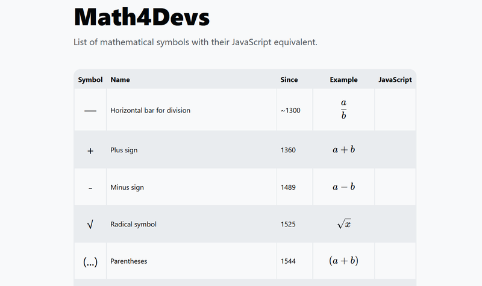
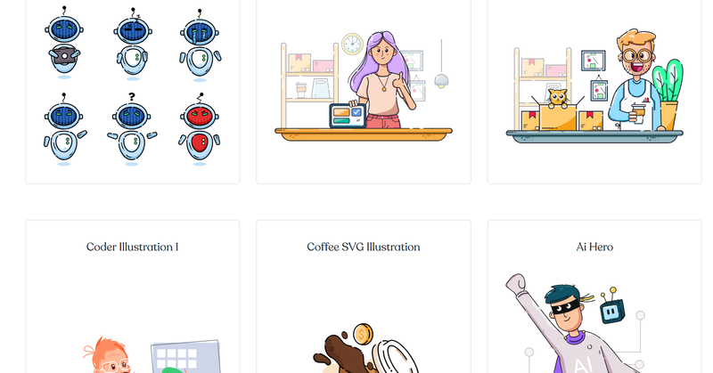
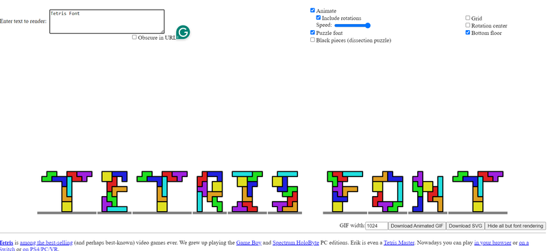
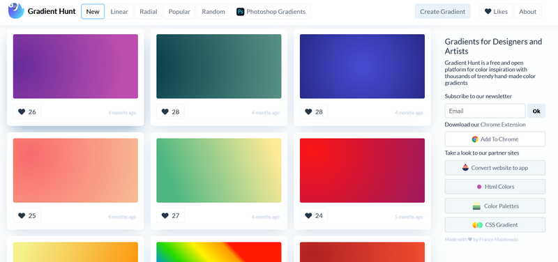

Welcome to Friday Roundup 3, your weekly collection of curated articles, tools, tips, and resources
from across the web. Every Friday, we bring you the latest insights, inspiration, and must-read
links to help you stay informed and inspired for the weekend and beyond. Whether it’s tech news,
productivity hacks, or creative ideas, Friday Links has something for everyone!

[AdzeJS](https://adzejs.com/)

**AdzeJS** is a powerful logging library designed to simplify and enhance logging in JavaScript
applications. With customizable log levels, structured output, and flexible configuration options,
AdzeJS helps developers debug and track issues efficiently. Whether you're working in a browser or
Node.js environment, AdzeJS offers an intuitive API that makes managing log data easier, improving
both development and production workflows.

[cssnano](https://cssnano.github.io/cssnano/)

**CSSNano** is a fast and efficient CSS minifier that optimizes your CSS files for better
performance. By removing unnecessary spaces, comments, and redundant code, CSSNano compresses your
stylesheets without compromising functionality. Perfect for production environments, it helps reduce
file sizes and improve load times, making your website faster and more efficient.

[15 amazing things you can do with simple JavaScript](https://dev.to/anmolbaranwal/15-amazing-things-you-can-do-with-simple-javascript-g88)

[16 Essential Problem-Solving Patterns](https://dev.to/saurabhkurve/16-essential-problem-solving-patterns-31p2)

[20 Patterns to Master Dynamic Programming](https://blog.algomaster.io/p/20-patterns-to-master-dynamic-programming)

[The Dune Shell](https://adam-mcdaniel.github.io/dune-website/)

Dune is a shell designed for powerful scripting. Think of it as an unholy combination of bash and
Lisp.

[RabbitMQ 4.0.1 Released!](https://github.com/rabbitmq/rabbitmq-server/releases/tag/v4.0.1)

[Compile and run C in JavaScript](https://bun.sh/blog/compile-and-run-c-in-js)

[scriptkavi/hooks — Battery animation using useBattery hook](https://blog.stackademic.com/scriptkavi-hooks-battery-animation-using-usebattery-hook-b21c518091dd)

[Math4Devs](https://math4devs.com/)

[Regex, the good bits](https://dev.to/gewenyu99/regex-the-good-bits-4l2o)

[Making Orbit Animations with CSS Custom Properties](https://codersblock.com/blog/making-orbit-animations-with-css-custom-properties/)

[Two CSS Properties for Trimming Text Box Whitespace](https://css-tricks.com/two-css-properties-for-trimming-text-box-whitespace/)

[SVG Coding Examples: Useful Recipes For Writing Vectors By Hand](https://www.smashingmagazine.com/2024/09/svg-coding-examples-recipes-writing-vectors-by-hand/)

[Understanding the Linux Filesystem: An In-Depth Guide for DevOps Engineers](https://dev.to/prodevopsguytech/understanding-the-linux-filesystem-an-in-depth-guide-for-devops-engineers-ona)

[Mastering SOLID Principles in React: Elevating Your Code Quality](https://dev.to/vyan/mastering-solid-principles-in-react-elevating-your-code-quality-2c6h)

[New Values and Functions in CSS](https://dev.to/alvaromontoro/new-values-and-functions-in-css-1b9o)

[CSS Classes considered harmful](https://www.keithcirkel.co.uk/css-classes-considered-harmful/)

[HTML Templates: Reusable Snippets of Code](https://blog.openreplay.com/html-templates--reusable-snippets-of-code/)

[Improve your CSS animations with individual transforms (Youtube)](https://www.youtube.com/watch?v=XVWxIEUkemI)

[Postgres is eating the database world](https://medium.com/@fengruohang/postgres-is-eating-the-database-world-157c204dcfc4)

[Self-host Maps with Protomaps and Supabase Storage](https://supabase.com/blog/self-host-maps-storage-protomaps)

[Free SVG Illustrations](https://lukaszadam.com/illustrations)

[Scale React Development with Nx (Free EggHead Course)](https://egghead.io/courses/scale-react-development-with-nx-4038)

[Astro Quick Start Course | Build an SSR Blog (Youtube)](https://www.youtube.com/watch?v=XoIHKO6AkoM&ab_channel=TraversyMedia)

[Linux/4004: booting Linux on Intel 4004 for fun, art, and no profit](https://dmitry.gr/?r=05.Projects&proj=35.%20Linux4004)

[Tetris Font](https://erikdemaine.org/fonts/tetris/)

[JS Bin](https://jsbin.com)

JS Bin is an online code editor and sandbox for experimenting with HTML, CSS, and JavaScript.
Designed for rapid prototyping, JS Bin allows developers to write, test, and share code snippets in
real-time.

[Reader-LM: Small Language Models for Cleaning and Converting HTML to Markdown](https://jina.ai/news/reader-lm-small-language-models-for-cleaning-and-converting-html-to-markdown/)

[CSS Doodle](https://github.com/css-doodle/css-doodle)

**CSS Doodle** is a web component for creating creative, generative art with CSS. It allows
developers and designers to use simple CSS code to generate intricate patterns, grids, and designs
directly in the browser. With css-doodle, you can experiment with various shapes, colors, and
layouts, transforming your web projects into visually dynamic experiences.

[Gradient Hunt](https://gradienthunt.com/)

[Dear Console](https://codepo8.github.io/dearconsole/)

[Clean React with TypeScript](https://weser.io/blog/clean-react-with-typescript)

[3D in TypeScript using Ray Casting](https://www.youtube.com/watch?v=K1xEkA46CuM)

[Adding Fireworks Effects to your React App](https://blog.openreplay.com/adding-fireworks-effects-to-your-react-app/)

[Build a Live Code Editor for Coding Interviews | MERN, Socket.IO, Monaco Editor Tutorial (Youtube)](https://www.youtube.com/watch?v=ey1Bi6lI0Gg)

That’s it for this week’s Friday Links! We hope you found something useful, inspiring, or
thought-provoking. Be sure to join us next Friday for another collection of fresh resources,
articles, and tools to fuel your creativity and keep you in the know. Have a great weekend, and
happy exploring!
