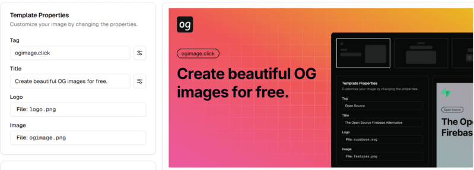

Welcome to another edition of Friday Links, your weekly JavaScript digest. This week brings a fresh batch of updates from across the JS ecosystem — including cutting-edge framework releases, developer tool upgrades, and insightful tutorials from the community. Whether you're optimizing your workflow or exploring new libraries, this roundup will keep you in sync with the fast-moving JavaScript world.

## 📜 Articles & Tutorials

[Open Social](https://overreacted.io/open-social/)

[The future of large files in Git is Git](https://tylercipriani.com/blog/2025/08/15/git-lfs/)

[Best Practices for Building Agentic AI Systems: What Actually Works in Production](https://userjot.com/blog/best-practices-building-agentic-ai-systems)

[How I Built a Full-Stack React Framework 4x Faster Than Next.js With 4x More Throughput](https://ryanskinner.com/posts/how-i-built-a-full-stack-react-framework-4x-faster-than-nextjs-with-4x-more-throughput)

[Here's How To Build Fullstack Agent Apps (Gemini, CopilotKit & LangGraph)](https://dev.to/copilotkit/heres-how-to-build-fullstack-agent-apps-gemini-copilotkit-langgraph-15jb)

[Run Express.js on Cloudflare Workers](https://jross.me/run-express-js-on-cloudflare-workers/)

[GitHub Copilot CLI: How to get started](https://github.blog/ai-and-ml/github-copilot/github-copilot-cli-how-to-get-started/)

[CSS :is() :where() the Mag­ic Happens](https://matthiasott.com/notes/css-is-where-the-magic-happens)

[The thing about contrast-color](https://stuffandnonsense.co.uk/blog/the-thing-about-contrast-color)

[Modern CSS Round-Out Tabs](https://frontendmasters.com/blog/modern-css-round-out-tabs/)

[15 Recent Node.js Features that Replace Popular npm Packages](https://nodesource.com/blog/nodejs-features-replacing-npm-packages)

[Building an Async Combobox with useSuspenseQuery() and useDeferredValue()](https://aurorascharff.no/posts/building-an-async-combobox-with-usesuspensequery-and-usedeferredvalue/)

[HTML’s Best Kept Secret: The `<output>` Tag](https://denodell.com/blog/html-best-kept-secret-output-tag)

## ⚒️ Tools

[Mirrow](https://mirrow.app/): A DSL for Dynamic SVG Creation and Animation — Instead of treating SVGs as static graphics, Mirrow reimagines them as interactive, code-defined visuals. It introduces a domain-specific language (DSL) that lets you generate and animate SVGs programmatically, making them flexible, reusable, and expressive. Visit the playground to experiment with Mirrow syntax and bring your own SVG animations to life in real time.

[ogImage.click](https://ogimage.click/)

[Make Graph](https://makegraph.app/)

[ai-digest](https://github.com/khromov/ai-digest): A CLI for Summarizing Your Entire Codebase — This command-line tool automatically compiles your entire project into a single, structured Markdown file. Perfect for feeding into Claude projects, custom ChatGPTs, or AI code assistants, it gives large models full context of your codebase for analysis, documentation, or refactoring.

[Crosspost](https://github.com/humanwhocodes/crosspost) - A JavaScript utility for posting across multiple social networks at once

[stackoverflow.ai](https://stackoverflow.ai/)

[n8n-MCP](https://github.com/czlonkowski/n8n-mcp) - A MCP for Claude Desktop / Claude Code / Windsurf / Cursor to build n8n workflows for you

## 📚 Libs

[memvid](https://github.com/Olow304/memvid) - Video-based AI memory library. Store millions of text chunks in MP4 files with lightning-fast semantic search. No database needed.

[PageLM](https://github.com/CaviraOSS/pagelm) - PageLM is a community driven version of NotebookLM & a education platform that transforms study materials into interactive resources like quizzes, flashcards, notes, and podcasts.

[Twake Drive](https://github.com/linagora/twake-drive) - The open-source alternative to Google Drive.

[ReactToPrint](https://github.com/MatthewHerbst/react-to-print) - Print React components in the browser

[jsonriver](https://github.com/rictic/jsonriver) - A simple, fast streaming JSON parser built on standards.

[xmlbuilder2](https://github.com/oozcitak/xmlbuilder2) - An XML builder for node.js

[Coding Agent Template](https://github.com/vercel-labs/coding-agent-template) - Multi-agent AI coding platform powered by Vercel Sandbox and AI Gateway

[IsAgent SDK](https://www.isagent.dev/) - A lightweight SDK for building agent-specific experiences in your app.

[react-map-gl](https://github.com/visgl/react-map-gl) - React friendly API wrapper around MapboxGL JS

## ⌚ Releases

[React Compiler v1.0](https://react.dev/blog/2025/10/07/react-compiler-1) — The React team has officially declared the compiler stable and ready for production use. It automatically applies memoization optimizations based on static code analysis, reducing unnecessary re-renders and improving performance without manual tweaks. You can still rely on `useMemo` and `useCallback` for fine-grained control when needed, but many optimizations are now handled seamlessly by the compiler itself.

[React Native 0.82 - A New Era](https://reactnative.dev/blog/2025/10/08/react-native-0.82)

[Bun 1.3 Released](https://bun.com/blog/bun-v1.3)

[Node.js v24.10.0 (Current)](https://nodejs.org/en/blog/release/v24.10.0)

[Next.js 16 (beta) released](https://nextjs.org/blog/next-16-beta)

[New Release: CrateDB 6.0](https://cratedb.com/blog/new-release-cratedb-6.0)

[llama.ui v2.38.2 released](https://github.com/olegshulyakov/llama.ui/releases/tag/v2.38.2)

[playwright v1.56.0 released](https://github.com/microsoft/playwright/releases/tag/v1.56.0)

[Happy DOM v20.0 released](https://github.com/capricorn86/happy-dom/releases/tag/v20.0.0)

[openai-node v6.4.0 released](https://github.com/openai/openai-node)

[React Admin v5.12.0](https://github.com/marmelab/react-admin/releases/tag/v5.12.0), [TanStack Router 1.133](https://github.com/TanStack/router/releases/tag/v1.133.0), [React Hook Form v7.65.0](https://github.com/react-hook-form/react-hook-form/releases/tag/v7.65.0)

## 📺 Videos

[RabbitMQ Crash Course #1 – Setup, Queues & Why Message Brokers Matter Node js + Docker](https://www.youtube.com/watch?v=gdRCIOn5zVA)

[React Coding Interview: Kent C. Dodds, Jack Herrington & Roadside Coder Solve React HARD Question](https://www.youtube.com/watch?v=5KkaaYl5rwA)

[Meta's most dystopian product yet...](https://www.youtube.com/watch?v=GOejI6c0CMQ)

[99% of Developers Don't Get PostgreSQL](https://www.youtube.com/watch?v=P8rrhZTPEAQ)

[AI Coding Sucks](https://www.youtube.com/watch?v=0ZUkQF6boNg)

[Big Tech Is Faking Revenue](https://www.youtube.com/watch?v=CBCujAQtdfQ)

[Extremely Underrated Programming Skills](https://www.youtube.com/watch?v=5cAjuIxIvHg)

## 🎤 Talks & Podcasts

[CSS Podcast 93: State queries in 2025](https://thecsspodcast.libsyn.com/93-state-queries-in-2025)

## 🗞️ News & Updates

🕹️ The JS13KGames 2025 competition has wrapped up, and [the winners have been announced](https://js13kgames.com/2025/blog/winners-announced)! Explore this year’s top entries — all built in under 13KB of JavaScript — to play inventive mini-games or dive into their clever, size-optimized source code.

[npm Adopts OIDC for Trusted Publishing in CI/CD Workflows](https://socket.dev/blog/npm-trusted-publishing)

[Triplex Goes Open Source and Moves to Poimandres](https://triplex.dev/blog/triplex-moves-to-pmndrs)

🤖 [Mastra](https://mastra.ai/), a rapidly growing TypeScript-based AI framework founded by former members of the Gatsby team, [has secured a $13 million seed](https://mastra.ai/blog/seed-round) round to accelerate development and expand its ecosystem of AI tools for developers.

---

That wraps up this week’s roundup! Stay tuned for the next Friday Links as we continue exploring the most interesting updates, open-source projects, and ideas shaping the JavaScript ecosystem. If you found something worth sharing, drop it in the comments or tag us — your find might make next week’s list.