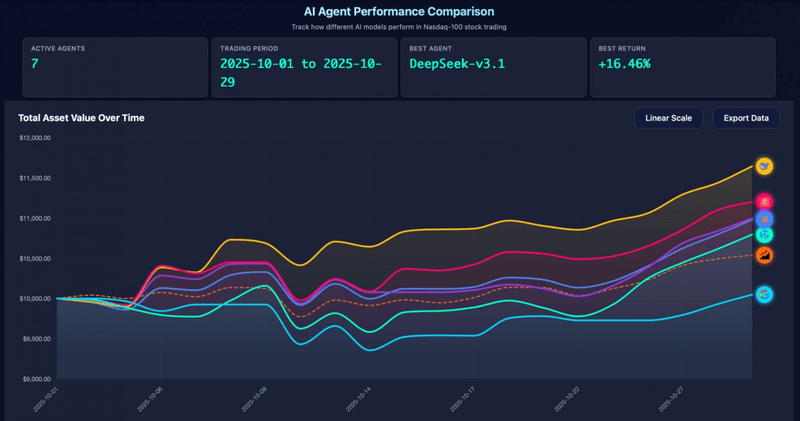

Welcome to Friday Links #31, your weekly roundup of the freshest updates in the JavaScript world. From emerging frameworks to powerful dev utilities and clever performance hacks, this week’s list spotlights tools that can make your workflow smoother and your apps faster. Whether you’re building front-end interfaces, optimizing bundles, or experimenting with AI integrations — there’s something here to inspire your next project.

## DeepSeek V3.1 Tops AI Stock Trading Challenge — With Some Fine Print

A new open benchmark called **AI-Trader** is testing how well AI models can handle real-world stock trading. Each model starts with **$10,000** and trades Nasdaq-100 stocks using real-time prices and financial news.

After the first month, **DeepSeek v3.1** leads with a **+16.46%** return, followed by **MiniMax-M2 (+12.03%)**, **GPT-5 (+9.98%)**, and **Claude 3.7 Sonnet (+9.8%)**.  
Meanwhile, **Qwen3-max** earned **+7.96%**, and **Gemini-2.5-Flash** barely moved the needle at **+0.48%** despite the most trades.  
For comparison, a passive **QQQ ETF** tracker gained **+5.39%**, proving DeepSeek’s picks weren’t just lucky — they were smart.

---

### Important Context

Still, the experiment comes with caveats:

- **Simulated setup** – models trade at the **day’s opening price**, not in real markets.  
- **Possible data leaks** – some news lacked timestamps, letting models see “future” info.  
- **Short, bullish window** – tech stocks like Nvidia and Microsoft dominated, inflating returns.

DeepSeek shows it can **spot patterns and take confident bets**, but calling it the best AI trader yet would be premature.  

If the AI-Trader team adds **hour-level trading** and fixes data issues, it could become a reliable benchmark for evaluating how AIs handle **risk**, **discipline**, and **adaptability** in real financial markets.

---

## 📜 Articles & Tutorials

[Build High-Quality, Domain-Specific Agents at 95% Lower Cost](https://www.databricks.com/blog/build-high-quality-domain-specific-agents-95-lower-cost)

[State-based vs Signal-based rendering](https://jovidecroock.com/blog/state-vs-signals/)

[Build Your Own Database](https://www.nan.fyi/database)

[Context Inheritance in TanStack Router](https://tkdodo.eu/blog/context-inheritance-in-tan-stack-router)

[Practical Caching Recipes for Next.js (App Router)](https://blog.curbanii.net/practical-caching-recipes-for-next-js-app-router/)

[Conditional Border Radius with Modern CSS](https://css-tip.com/conditional-border-radius/)

[GSoC 2025, Building a Semantic Search Engine for Any Video](https://news.opensuse.org/2025/10/08/gsoc-semantic-video-search/)

[Tanstack Directives and the Platform Boundary](https://tanstack.com/blog/directives-and-the-platform-boundary)

[Why developers are leaving Next.js for TanStack Start, and loving it](https://appwrite.io/blog/post/why-developers-leaving-nextjs-tanstack-start)

[I Run a Full Linux Desktop in Docker Just Because I Can](https://www.howtogeek.com/i-run-a-full-linux-desktop-in-docker-just-because-i-can/)

## ⚒️ Tools

[VSCode Vercel Extention](https://vscode-extension.vercel.app/)

[Jujutsu](https://jj-vcs.github.io/jj/latest/) — a version control system

[Workflow DevKit](https://github.com/vercel/workflow) - A toolkit for building Vercel Workflow integrations

[WebMCP](https://github.com/jasonjmcghee/WebMCP) - WebMCP allows a website to be an MCP server. No sharing API Keys. Use any model you want.

[ASCII Drawing Board](https://www.delopsu.com/draw)

[Hono CLI](https://github.com/honojs/cli) - Command Line Interface for Hono framework

[Typing SVG Generator](https://typingsvg.vercel.app/)

[Explore color as we see it](https://oklch.fyi/) - A tool to visualize colors in the Oklch color space

[Helium](https://github.com/imputnet/helium) - Private, fast, and honest web browser

[Handy](https://handy.computer/) - the free and open source app for speech to text

## 📚 Libs

[Yaak](https://github.com/mountain-loop/yaak) - The most intuitive desktop API client. Organize and execute REST, GraphQL, WebSockets, Server Sent Events, and gRPC 🦬

[Ky](https://github.com/sindresorhus/ky) - 🌳 Tiny & elegant JavaScript HTTP client based on the Fetch API

[QGIS](https://github.com/qgis/QGIS) - QGIS is a free, open source, cross platform (lin/win/mac) geographical information system (GIS)

[Ovi](https://github.com/character-ai/Ovi) - Twin Backbone Cross-Modal Fusion for Audio-Video Generation

## ⌚ Releases

[Vitest 4.0 is out!](https://vitest.dev/blog/vitest-4)

[Next.js 16 Released](https://nextjs.org/blog/next-16)

[Biome v2.3 Released](https://biomejs.dev/blog/biome-v2-3/)

[Bun v1.3.1 Released](https://bun.com/blog/bun-v1.3.1)

[Boa release v0.21](https://boajs.dev/blog/2025/10/22/boa-release-21)

[ESLint v9.38.0 released](https://eslint.org/blog/2025/10/eslint-v9.38.0-released/)

[Rspack 1.6.0 Beta 1](https://github.com/web-infra-dev/rspack/releases/tag/v1.6.0-beta.1)

[Storybook 10.0 Released](https://github.com/storybookjs/storybook/releases/tag/v10.0.0) — Major Update Adds Module Automocking, Next.js 16, Vitest 4, and Async Svelte Component Support

[shadcn/ui 3.5 Released](https://github.com/shadcn-ui/ui/releases/tag/shadcn%403.5.0) — Now Fully Compatible with Next.js 16

[pnpm 10.20](https://pnpm.io/blog/releases/10.20), [Astro 5.15](https://astro.build/blog/astro-5150/), [uuidv47 v1.2.0](https://github.com/ali-master/uuidv47/releases/tag/1.2.0)

## 📺 Videos

[Is this the end for Adobe?](https://www.youtube.com/watch?v=NPMi-3uf_ig)

[The coolest feature of Hono](https://www.youtube.com/watch?v=R4oYppOBKwo)

[Next.js 16 Full Course | Build and Deploy a Production-Ready Full Stack App](https://www.youtube.com/watch?v=I1V9YWqRIeI)

[I Will Never Use Shadcn Form Components Again](https://www.youtube.com/watch?v=gjrXeqgxbas)

[Cursor 2.0 is here... 5 things you didn't know it can do](https://www.youtube.com/watch?v=HIp8sFB2GGw)

[React wants to win you back…](https://www.youtube.com/watch?v=yl0YWA2K2B0)

[Master React 19.2 Async Everywhere — Boost Performance](https://www.youtube.com/watch?v=KI4gjUrOfOs)

[WebAssembly might actually save web dev...](https://www.youtube.com/watch?v=O8uazkirvVo)

[React Native Tutorial for Absolute Beginners - Build a Mobile App in 2 Hours](https://www.youtube.com/watch?v=G1XiiXTQHSE)

[99% of Developers Don't Get PostgreSQL](https://www.youtube.com/watch?v=P8rrhZTPEAQ)

[Build Docker Images in a Git Repo but Only Committed Changes](https://www.youtube.com/watch?v=8U2FNq2-IiE)

[The Standup - Jira Bought 2 Browsers???](https://www.youtube.com/watch?v=v9gsMFozXK0)

## 🎤 Talks & Podcasts

No content this week 😢

## 🗞️ News & Updates

### OpenAI Reportedly Preparing for a $1 Trillion IPO

According to [Reuters](https://www.reuters.com/business/openai-lays-groundwork-juggernaut-ipo-up-1-trillion-valuation-2025-10-29/), OpenAI is preparing for an IPO following its recent restructuring into a public benefit corporation — a move that clears the path for going public. Sources say the company aims to file with the U.S. SEC in the second half of 2026, with a potential listing in early 2027.

The valuation under discussion is reportedly up to $1 trillion, which would make it one of the most significant IPOs in tech history. OpenAI expects to reach around $20 billion in annual revenue by the end of 2025, showcasing steady demand for its AI services.

The company is also in talks to raise over $60 billion in private funding before the IPO to expand its data centers, acquire chips, and strengthen partnerships like its collaboration with Microsoft.

While OpenAI told Reuters that “IPO is not a focus,” its restructuring and growing investor interest signal that a public listing in 2026–2027 is becoming increasingly likely.

[New Domains Registrar API for domain search, pricing, purchase, and management (Vercel)](https://vercel.com/changelog/new-domains-registrar-api-for-domain-search-pricing-purchase-and-management)

[How Wi-Fi Signals Can Be Used to Detect Your Heartbeat The advance opens up new contactless heart-monitoring possibilities](https://spectrum.ieee.org/wi-fi-signal-heartbeat-detection)

---

That wraps up this week’s JavaScript Trends and Tools. Stay curious, keep experimenting, and don’t forget to star your favorite open-source repos. See you next Friday with another round of discoveries that keep the JavaScript ecosystem buzzing.