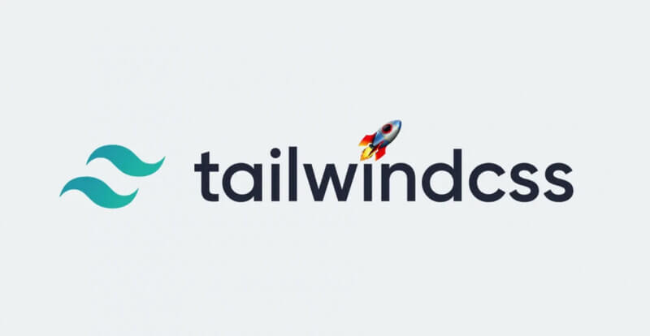

JavaScript moves fast — and staying up to date can feel overwhelming. Each week we curate the most relevant updates, new libraries, and ecosystem changes so you don’t have to dig through 50 tabs and timelines. From framework releases to niche tooling improvements, this collection is designed to give developers a quick pulse check on what matters right now.

Welcome to edition #33 of Friday Links — your weekly window into the ever-evolving JavaScript ecosystem.

## 📜 Articles & Tutorials

[Replacing JS with just HTML](https://www.htmhell.dev/adventcalendar/2025/27/)

[React2Shell exploit: What happened and lessons learned](https://blog.logrocket.com/react2shell-exploit/)

## ⚒️ Tools

A new free open-source service called [Maltrail](https://github.com/stamparm/maltrail) has been released for analyzing inbound and outbound network traffic and detecting malware. The project can:

- detect malicious domains, URLs, and IP addresses
- identify harmful HTTP User-Agent strings
- spot modern attack tools on workstations
- provide strong network security without complex setup — installable in one click
- help reveal viruses, miners, and other unwanted network-active software

## 📚 Libs

## ⌚ Releases

## 📺 Videos

## 🎤 Talks & Podcasts

No content this week 😢

## 🗞️ News & Updates

### Google AI and Vercel Sponsor Tailwind After 80% Revenue Drop Caused by AI

**Logan Kilpatrick**, Head of Product at **Google AI Studio**, posted on [X](https://x.com/OfficialLoganK/status/2009339263251566902) that the Google AI team is now a Tailwind sponsor and added:  
> “I’d love to discuss how we can do more together.”

**Guillermo Rauch**, CEO of **Vercel**, also [confirmed](https://x.com/rauchg/status/2009336725043335338) sponsorship.

## Why It Happened

According to Wathan, the crisis was caused by a broken sales funnel. Previously:

- developers googled CSS questions,
- landed on Tailwind’s documentation,
- discovered paid products like component kits and templates.

With modern LLMs such as **Claude, ChatGPT, and Cursor**, developers now generate code directly. Since LLMs were trained on Tailwind documentation, they produce accurate solutions **without the developer visiting the site**.

The result:

- documentation traffic dropped **40% since early 2023**
- Tailwind reached **75 million downloads/month**, making it more popular than ever
- revenue collapsed despite adoption increasing

## How Much Sponsorship Was Provided?

Google and Vercel did not disclose amounts. Tailwind’s public sponsorship tiers start at:

- **$6,000/year** (base tier)
- **$60,000/year** (top partner tier)

Before today, Tailwind already received **≈$1.1M/year** from **29 corporate sponsors**, including **Cursor**. Despite that, layoffs were unavoidable — only **one engineer** remains from the original four.

## Why This Matters

This situation raises a deeper question about the relationship between AI companies and open-source projects:

- LLMs generate Tailwind code constantly,
- If Tailwind stalls, **LLMs will output outdated patterns**,
- Open-source maintainers currently absorb the costs without AI companies contributing back.

For now, three engineers have already lost their jobs, new sponsorship sums remain undisclosed, and only time will tell whether this was a one-time PR move or the start of **systemic open-source funding from AI companies**.

### OpenAI, Anthropic, and Google Share the Top Spot in Intelligence Index 4.0

The platform [Artificial Analysis](https://artificialanalysis.ai/) has published the fourth edition of its Intelligence Index, one of the strictest rankings of modern AI models. In this update, the report recorded an effective three-way tie between the largest players. Formally, GPT-5.2 (X-High) takes first place, but Claude Opus 4.5 from Anthropic and Gemini 3 Pro from Google trail by only a statistically insignificant margin.

The key change in version 4.0 is methodology. The authors deliberately toughened evaluation criteria and abandoned the familiar benchmarks that models have become highly optimized for in recent years. As a result, absolute scores dropped: where leaders previously scored above 70, the new ceiling is closer to 50. This isn’t model degradation — it’s an attempt to restore genuine difficulty to the measurements.

{/* <blockquote class="twitter-tweet">
New year, new Artificial Analysis Intelligence Index! Announcing Intelligence Index v4.0: incorporating 3 new evaluations, further aligning to real-word use and reducing saturation  The Artificial Analysis Intelligence Index is our synthesis metric for assessing generalist model… <a href="https://t.co/HuUZ0XoFlO">pic.twitter.com/HuUZ0XoFlO</a>
&mdash; Artificial Analysis (@ArtificialAnlys) <a href="https://twitter.com/ArtificialAnlys/status/2008570646897573931?ref_src=twsrc%5Etfw">January 6, 2026</a></blockquote>   */}

---

That wraps up this week’s picks. If you found something useful, feel free to share the thread with other developers or drop a link you think should appear in the next edition. The JavaScript ecosystem grows through shared exploration — see you next Friday with more trends, tools, and news.