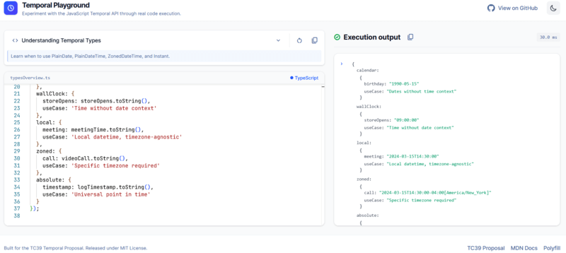
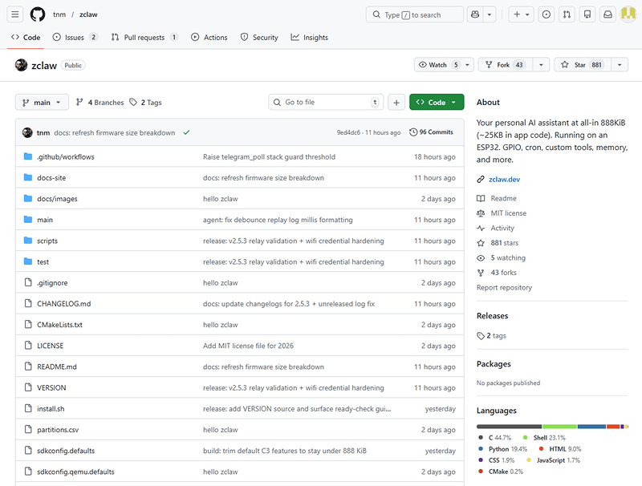

Another week, another wave of interesting releases across the JavaScript ecosystem. From emerging developer tools and AI-powered workflows to framework updates and experimental projects, the pace of innovation keeps accelerating.

In Friday Links #35, we’ve gathered the most notable discoveries worth a developer’s attention — tools that improve productivity, libraries pushing frontend boundaries, and projects that might quietly become tomorrow’s standards.

Whether you're building production apps, experimenting with AI tooling, or just staying current with modern web development, this week’s picks have something valuable to explore.

## 📜 Articles & Tutorials

[Building Next.js for an agentic future](https://nextjs.org/blog/agentic-future)

[Yes, Learning to Code Is Still Valuable](https://adventures.nodeland.dev/archive/yes-learning-to-code-is-still-valuable)

[Potentially Coming to a Browser :near() You ](https://css-tricks.com/potentially-coming-to-a-browser-near-you/)

[Death to Scroll Fade!](https://frontendmasters.com/blog/death-to-scroll-fade/)

[6 React Server Component performance pitfalls in Next.js](https://blog.logrocket.com/react-server-components-performance-mistakes/)

[Virtual Scrolling for Billions of Rows — Techniques from HighTable](https://blog.hyperparam.app/hightable-scrolling-billions-of-rows/)

[Getting Started with the Vercel AI SDK in Node.js](https://thecodebarbarian.com/getting-started-with-the-vercel-ai-sdk-in-nodejs.html)

[Loop Performance Anti-Patterns: A 40-Repository Scan and Six-Module Benchmark Study](https://stackinsight.dev/blog/loop-performance-empirical-study)

[Reduce the JS Workload with no- or lo-JS options](https://aarontgrogg.github.io/NoLoJS/)

[Tips on How to Pick the Right Icons for Your Website](https://stephaniewalter.design/blog/tips-on-how-to-pick-the-right-icons-for-your-website-with-icons8/)

[AGENTS.md outperforms skills in our agent evals](https://vercel.com/blog/agents-md-outperforms-skills-in-our-agent-evals)

[border-shape: the future of the non-rectangular web](https://una.im/border-shape)

[An in-depth guide to customising lists with CSS](https://piccalil.li/blog/an-in-depth-guide-to-customising-lists-with-css/)

[Loading Smarter: SVG vs. Raster Loaders in Modern Web Design](https://css-tricks.com/loading-smarter-svg-vs-raster-loaders-in-modern-web-design/)

## ⚒️ Tools

[React Doctor](https://www.react.doctor/) - is an open-source CLI tool created by the Million.js (millionco) team that scans React codebases and automatically detects common issues: anti-patterns, performance bottlenecks, accessibility gaps, architectural flaws, and even critical security vulnerabilities that can quietly slip into production.

[SVAR React Gantt](https://svar.dev/react/gantt/) - is a modern, high-performance Gantt chart component designed specifically for React applications.

[LLM Timeline](https://llm-timeline.com/)

[The JavaScript Oxidation Compiler](https://oxc.rs/)

[Blop](https://batiste.github.io/blop/example/) - A typed language for the web that compiles to Virtual DOM. Blop uses real control flow statements — for loops, if/else — directly in templates, without JSX constraints.

[Sciter](https://sciter.com/) – Embeddable HTML/CSS/JavaScript Engine for modern UI development

[BullMQ](https://github.com/taskforcesh/bullmq) - Message Queue and Batch processing for NodeJS, Python, Elixir and PHP based on Redis 

[TanStack Hotkeys](https://github.com/tanstack/hotkeys) -  Type-Safe keyboard shortcuts library with awesome devtools 

[Mina Rich Editor](https://github.com/Mina-Massoud/Mina-Rich-Editor) - A powerful, elegant rich text editor built with Shadcn UI. Experience unparalleled customization, beautiful design, and seamless integration. Built with React, TypeScript, and meticulous attention to detail.

[Temporal Playground](https://temporal-playground.vercel.app/) — an interactive online environment for experimenting with the JavaScript Temporal API, allowing developers to run real code and explore modern date and time handling directly in the browser.

[Zerobyte](https://github.com/nicotsx/zerobyte) - Powerful backup automation for your remote storage

## 📚 Libs

[voxcss](https://github.com/LayoutitStudio/voxcss) -  A CSS voxel engine. A 3D grid for the DOM. Renders HTML cuboids by stacking grid layers and applying transforms. 

[portless](https://github.com/vercel-labs/portless) - Replace port numbers with stable, named .localhost URLs. For humans and agents. 

[react-split-pane](https://github.com/tomkp/react-split-pane) -  React split-pane component 

[Basic FTP](https://github.com/patrickjuchli/basic-ftp) -  FTP client for Node.js, supports FTPS over TLS, passive mode over IPv6, async/await, and Typescript. 

[Lume.js](https://github.com/sathvikc/lume-js) - Minimal reactive state management using only standard JavaScript and HTML. No custom syntax, no build step required, no framework lock-in.

[fp-pack](https://github.com/superlucky84/fp-pack) -  A functional toolkit focused on type-safe pipelines, not FP dogma, for JavaScript and TypeScript. 

[tambo](https://github.com/tambo-ai/tambo) -  Generative UI SDK for React 

## ⌚ Releases

[Biome v2.4—Embedded Snippets, HTML Accessibility, and Better Framework Support](https://biomejs.dev/blog/biome-v2-4/)

[Prsma 7.4.0 Released](https://github.com/prisma/prisma/releases/tag/7.4.0)

[Phaser Editor v5 Beta now available](https://phaser.io/news/2026/02/phaser-editor-v5-beta)

[Emscripten 5.0.2](https://github.com/emscripten-core/emscripten/blob/main/ChangeLog.md#502---022526) — the well-established LLVM-to-WebAssembly compiler that enables running native low-level code in Node.js without native bindings — receives internal cleanups, removing legacy Node-specific workarounds that are no longer required.

[Hono 4.12](https://github.com/honojs/hono/releases/tag/v4.12.0) — a lightweight, multi-runtime web framework built around Web Standards, designed to run seamlessly across Node.js, Bun, Deno, Cloudflare Workers, and other edge environments.

[Orange ORM 5.2](https://github.com/alfateam/orange-orm/releases/tag/v5.2.0) — a powerful and modern ORM designed for efficient database interaction, offering type-safe queries, clean abstractions, and strong performance across modern JavaScript runtimes.

[ESLint 10.0.2 Released](https://eslint.org/blog/2026/02/eslint-v10.0.2-released/)

## 📺 Videos

[TanStack Router - How to Become a Routing God in React](https://www.youtube.com/watch?v=Ab01W6h4Giw)

[Build Your Own Claude Code with Mastra Workspaces](https://www.youtube.com/watch?v=0G_HKDrYpYc)

[Build & Deploy AI Agent Workflow Builder using NextJs, Mongodb, React, Prisma, Upstash](https://www.youtube.com/watch?v=uGsauG7Btlg)

[How One Engineer and AI Crashed IBM's Stock Price](https://www.youtube.com/watch?v=O7DTIHISrJw)

[The wild rise of OpenClaw...](https://www.youtube.com/watch?v=ssYt09bCgUY)

[My Multi-Agent Team with OpenClaw](https://www.youtube.com/watch?v=bzWI3Dil9Ig)

[OpenClaw Full Tutorial for Beginners – How to Set Up and Use OpenClaw (ClawdBot / MoltBot)](https://www.youtube.com/watch?v=n1sfrc-RjyM)

## 🎤 Talks & Podcasts

No content this week 😢

## 🗞️ News & Updates

### An AI agent running on a $5 microcontroller — powered by just 35 KB of code.

Developer tnm has released an open-source AI agent called [zclaw](https://github.com/tnm/zclaw), designed to run on ESP32 microcontrollers with a total firmware size under 888 KB. The agent itself occupies only about 35 KB, while the remaining space is used by the Wi-Fi stack (~388 KB), TLS encryption (~110 KB), and certificates.

The project is written in C using ESP-IDF and FreeRTOS, and can run on affordable hardware like the Seeed XIAO ESP32-C3 board, which costs around $5. At publication time, the repository had already gained 750+ stars on GitHub and is available under the MIT license.

---

That’s it for this week’s JavaScript discoveries.

The ecosystem continues evolving at an incredible speed — new tooling appears almost daily, while existing platforms keep redefining developer workflows. If something here caught your attention, dive deeper, experiment, and see how it fits into your stack.

See you next Friday with another curated batch of modern JavaScript ideas, tools, and inspiration.