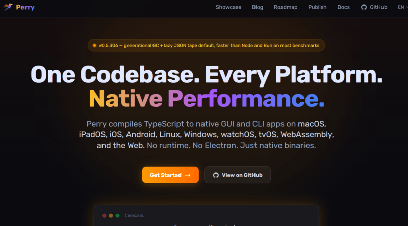
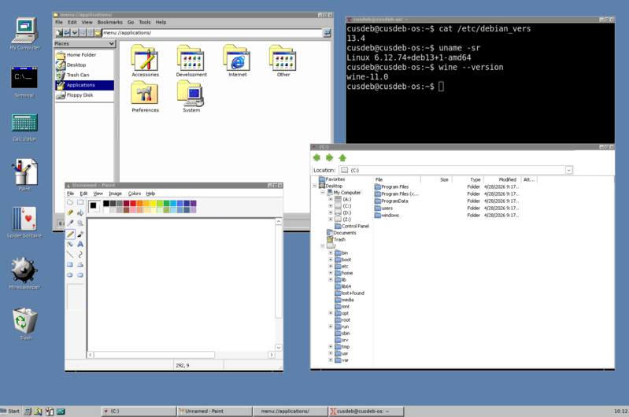

The JavaScript ecosystem doesn’t slow down—it evolves weekly. Friday Links #37 distills the most important updates across libraries, runtimes, tooling, and AI-driven development. From new releases pushing performance boundaries to emerging tools that simplify workflows, this issue highlights what’s worth your attention. Whether you’re building production systems or exploring new stacks, these curated picks help you stay informed without the noise.

## 🧠 Language & Runtime Updates

**Node.js 26 (Current) — almost here**
The upcoming release of Node.js 26 is expected to ship with V8 14.6 and enable the [Temporal API](https://developer.mozilla.org/en-US/docs/Web/JavaScript/Reference/Global_Objects/Temporal) by default—a major step toward handling dates natively without relying on third-party libraries.

**JavaScript (ES2025 → ES2026)**
The language continues evolving toward ES2026, with ongoing improvements to the standard library and deeper integration with AI-driven tooling and workflows.

[🍋 Fresh 2.3](https://deno.com/blog/fresh-2.3) — the Deno-native full-stack framework — introduces first-class WebSocket support, eliminates unnecessary JavaScript for pages that don’t need it, and makes the View Transitions API effortless with a single attribute in your views.

## 📜 Articles & Tutorials

[The end of responsive images](https://piccalil.li/blog/the-end-of-responsive-images/)

[`<dialog>` and popover: Baseline layered UI patterns](https://web.dev/articles/baseline-in-action-dialog-popover)

[Scroll-Driven Animations](https://www.joshwcomeau.com/animation/scroll-driven-animations/)

[How to Use Lazy Loading Without Hurting Web Performance](https://www.debugbear.com/blog/lazy-loading-performance)

[Compositing & Blending](https://nik.digital/posts/compositing-blending)

[Looking at New CSS Multi-Column Layout Wrapping Features](https://css-tricks.com/css-multi-column-layout-wrapping-features/)

[Recreating Apple’s Vision Pro Animation in CSS](https://css-tricks.com/recreating-apples-vision-pro-animation-in-css/)

[Constructable Stylesheets and adoptedStyleSheets: One Parse, Every Shadow Root](https://frontendmasters.com/blog/constructable-stylesheets-and-adoptedstylesheets-one-parse-every-shadow-root/)

[CSS Recently In All Browsers](https://nerdy.dev/CSS-recently-in-all-browsers)

[Session Timeouts: The Overlooked Accessibility Barrier In Authentication Design](https://www.smashingmagazine.com/2026/04/session-timeouts-accessibility-barrier-authentication-design/)

[The React Compiler at Eighteen Months: The Arc, the Debates, and What's Next](https://saschb2b.com/blog/react-compiler-year-in-review)

[Migrating from Radix UI to Base UI: Step-by-Step Guide](https://shadcnstudio.com/blog/migrate-from-radix-ui-to-base-ui)

[font-family Doesn’t Fall Back the Way You Think](https://csswizardry.com/2026/04/font-family-doesnt-fall-back-the-way-you-think/)

[A Guide to React Compiler Rendering](https://blog.isquaredsoftware.com/presentations/2026-04-react-compiler-rendering/)

## ⚒️ Tools

**TypeScript 7.0 Beta — gaining traction**

[TypeScript 7](https://devblogs.microsoft.com/typescript/announcing-typescript-7-0-beta/) is generating significant discussion. It introduces a native compiler written in Go, promising substantial performance gains and a redesigned architecture for large-scale projects.

TypeScript 6 — a transitional release
TypeScript 6.0 acts as a bridge toward TS 7, bringing:

Deprecation of legacy APIs
Updated DOM typings
Adoption of modern `import attributes` (`with`)

[Perry](https://www.perryts.com/) is a cross-platform TypeScript compiler that compiles code directly into native executables, offering an alternative to traditional JavaScript runtimes.

[OpenWarp](https://openwarp.zerx.dev/en/) - Bring any AI model into your terminal

[View Transitions Mock](https://github.com/GoogleChromeLabs/view-transitions-mock) — a non-visual polyfill for the View Transitions API — provides a JavaScript implementation of same-document transitions without the visual layer. You can write a single code path for all browsers: supported ones render transitions, while others fall back to a DOM swap, with the same promises and API behavior.

[DESIGN.md](https://github.com/google-labs-code/design.md) is a proposed format for describing a product’s visual identity—colors, typography, spacing, and UI rules—in a structured, machine-readable way. It’s designed for AI agents and tooling, enabling them to generate consistent interfaces, designs, or code based on a single source of truth.

[Formisch](https://github.com/open-circle/formisch) — a schema-based, headless form library for JavaScript frameworks that handles form state and validation. It’s type-safe, fast by default, and keeps bundle size small thanks to its modular design.

[Datatype](https://franktisellano.github.io/datatype/) is a variable font that turns text into charts, providing a unique way to visualize data.

[Boneyard](https://github.com/0xGF/boneyard) — generates pixel-perfect skeleton loading screens directly from your real UI, with no manual measurements or placeholder tuning.

Works across frameworks including React, Preact, Vue, Svelte 5, Angular, and React Native.

[crashcat](https://github.com/isaac-mason/crashcat) — a JavaScript physics engine built for games, simulations, and creative web projects. It includes rigid body simulation, support for multiple shape types, continuous collision detection, and more for building dynamic, interactive experiences.

[officeParser](https://github.com/harshankur/officeParser) — a robust, strictly typed library for Node.js and the browser that parses office documents into a clean, hierarchical AST. It preserves rich metadata, text formatting, and supports embedded attachments.

[Bifrost](https://github.com/maximhq/bifrost) — a high-performance AI gateway that unifies access to 15+ providers (including OpenAI, Anthropic, Amazon Web Services, and Google) through a single OpenAI-compatible API.

## 📚 Libs

[Portless](https://github.com/vercel-labs/portless) lets you replace port-based URLs with clean, stable local domains—so instead of `http://localhost:3000`, you can use something like `https://myapp.localhost`. It’s built on Node.js and now adds new features for Tailscale users.

[Honker](https://github.com/russellromney/honker) brings PostgreSQL-style NOTIFY/LISTEN semantics to SQLite—no daemon required. The honker-node package adds support for Node.js, making it easy to integrate event-driven messaging into your apps.

[whatsapp-api-js](https://github.com/Secreto31126/whatsapp-api-js) — a lightweight, dependency-free library for interacting with the WhatsApp Cloud API, built for efficiency and full TypeScript support.

## ⌚ Releases

[pnpm 11.0 Released](https://pnpm.io/blog/releases/11.0)

[AVA 8.0](https://github.com/avajs/ava/releases/tag/v8.0.0) — the popular Node.js test runner is now fully ESM and introduces two new test modifiers: `test.skipIf()` and `test.runIf()`.

[BWIP-JS 4.10](https://github.com/metafloor/bwip-js) — a pure JavaScript port of the original Barcode Writer in Pure PostScript, designed to run in any modern browser or JavaScript-based server environment.

It supports 100+ barcode formats, including both linear and 2D standards. Barcodes can be generated as PNG images (Node.js, React Native), rendered to a canvas (browser), or exported as SVG across all platforms.

[Hono Node.js Adapter 2.0](https://github.com/honojs/node-server/releases/tag/v2.0.0) — the latest version delivers up to 2.3× higher throughput compared to v1, based on body-parsing benchmarks from bun-http-framework-benchmark. Other scenarios like Ping and Query also see smaller, but noticeable, performance gains.

[basic-ftp 6.0](https://github.com/patrickjuchli/basic-ftp) — a modern FTP client for Node.js with support for FTPS over TLS, passive mode over IPv6, async/await APIs, and built-in TypeScript types.

[Mongoose 9.6](https://github.com/Automattic/mongoose/releases/tag/9.6.0) — the popular object data modeling (ODM) library for MongoDB, widely used with Node.js to structure and manage application data.

[Vine 4.4](https://github.com/vinejs/vine) — a fast form data validation library for Node.js, designed for performance and clean schema-based validation.

[React Hook Form 7.74](https://github.com/react-hook-form/react-hook-form/releases/tag/v7.74.0) — introduces setValues, a new API for updating multiple form fields at once, making bulk state updates simpler and more efficient.

[React Tooltip 6.0](https://github.com/ReactTooltip/react-tooltip/releases/tag/v6.0.0) — adds portalRoot and autoClose props, introduces support for React 19, and removes the legacy HTML string API.

[shadcn CLI 4.5](https://github.com/shadcn-ui/ui/releases/tag/shadcn%404.5.0) — introduces a new `--pointer` flag that re-enables `cursor: pointer` on buttons.

[Chakra UI 3.35](https://github.com/chakra-ui/chakra-ui/releases/tag/%40chakra-ui%2Freact%403.35.0) — a multi-package release covering React, charts, CLI, panda-presets, and codemods. It introduces a new Splitter component, adds support for React 19, and includes new CLI commands for generating docs and props.

[TanStack Query 5.100](https://github.com/TanStack/query/releases/tag/release-2026-04-23-1319) — adds a new `retryOnMount` callback for finer control over retries, along with internal cleanup of Svelte test infrastructure.

## 📺 Videos

[Why Rust is Replacing JavaScript for Full Stack Web Apps in 2026](https://www.youtube.com/watch?v=JHkarhWMTII)

[GitHub is facing HUGE problems!](https://www.youtube.com/watch?v=pekbl3Yz02g)

[GitHub is having some major issues right now…](https://www.youtube.com/watch?v=d53Zk28esmU)

[This Coding Tool Kills AI Code Slop](https://www.youtube.com/watch?v=XLtuSy1opW4)

[End of Vibe Coding? Github Copilot Changes](https://www.youtube.com/watch?v=TKal4pZHr0U)

## 🗞️ News & Updates

### C:/Deb — A Linux-Based OS with a Windows-Like Environment

A new project called [C:/Deb](https://github.com/cusdeb-com/os) introduces a working prototype of a Win32/Linux system built on Debian 13. It delivers a Windows-like experience using Wine and components from ReactOS, running on the Linux kernel, with a UI styled after Windows 95/98.

[Test images](https://github.com/cusdeb-com/os/releases/tag/main-197d599) are available for QEMU and VirtualBox, along with build scripts. The project follows earlier experiments like Loss32, while ongoing ReactOS progress has improved compatibility with legacy Windows drivers (Intel, NVIDIA, AMD).

---

That wraps up Friday Links #37. If something here caught your eye, try it, benchmark it, and see how it fits into your stack—because the best way to evaluate tools is in real projects. The ecosystem keeps moving fast, and next week will bring another wave of ideas, optimizations, and experiments. Stay curious, keep shipping, and see you in the next roundup.