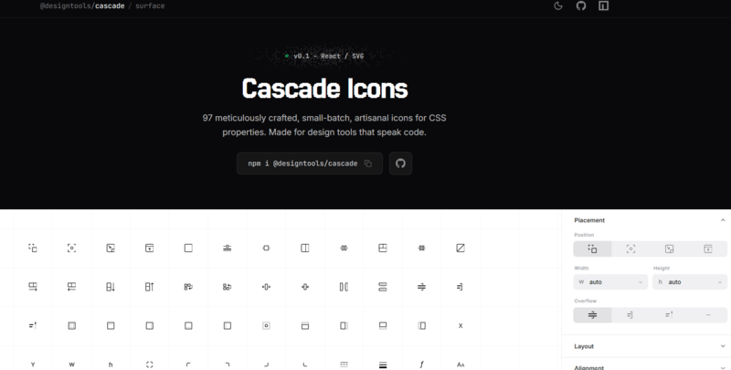

Another busy week in the JavaScript world.

Framework releases kept shipping, browser vendors continued experimenting, AI development tools evolved at an uncomfortable speed, and open-source maintainers somehow still found time to launch new libraries, runtimes, and developer utilities.

This edition collects the updates, experiments, technical discussions, and releases worth paying attention to — from frontend frameworks and tooling changes to AI coding workflows, browser platform news, and interesting projects from across the developer ecosystem.

Whether you are following React, TypeScript, Bun, Node.js, AI-assisted development, or simply looking for useful tools to explore, here are the links that stood out this week.

## 🧠 Language & Runtime Updates

### TypeScript 6.0 Is Official — And It’s Preparing the Road to TypeScript 7

One of the biggest ecosystem updates remains [TypeScript 6.0](https://www.typescriptlang.org/docs/handbook/release-notes/typescript-6-0.html).

This release is not just another incremental version bump. It acts as a transition layer between the current JavaScript-based compiler and the upcoming native TypeScript 7 compiler. According to the TypeScript team, 6.0 is effectively the bridge release that prepares projects for the future architecture.

Some notable changes include:

- alignment with future TS 7 behavior
- deprecations aimed at modern ESM workflows
- simplified DOM library behavior
- stricter compiler rules
- migration tooling for upcoming changes

The broader direction is clear: TypeScript is increasingly optimizing for modern evergreen runtimes, ESM tooling, and native performance improvements.

### Bun’s Rust Rewrite Has Been Merged

The Bun story continues.

One of the more talked-about updates recently: [Bun’s experimental Rust rewrite effort has now been merged](https://github.com/oven-sh/bun/pull/30412), generating substantial discussion across developer communities. Questions quickly emerged around maintainability, AI-assisted code generation quality, and long-term runtime strategy.

At the same time, Bun keeps strengthening its position inside the TypeScript ecosystem.

Developers increasingly evaluate Bun not just as a runtime, but as a broader replacement for parts of the traditional Node toolchain:

- package manager
- bundler
- test runner
- TypeScript execution environment
- server runtime

The “Should new TypeScript projects start with Bun?” conversation is becoming more common.

[Deno 2.8 ships this week](https://bsky.app/profile/deno.land/post/3mm6clkq5uc22) with a focus on improving the developer experience around TypeScript, ESM, and modern JavaScript features.

## 📜 Articles & Tutorials

[Install web apps with the new HTML install element](https://developer.chrome.com/blog/install-element-ot)

[Prompts are advisory. Structure is binding.](https://www.linkedin.com/pulse/prompts-advisory-structure-binding-daniel-meyer-cpxce/)

[An Excruciatingly Detailed Guide To SSH](https://grahamhelton.com/blog/ssh-cheatsheet)

[How To Make Your Text Look Futuristic](https://typesetinthefuture.com/2016/02/18/futuristic/)

[MASTER THE NODE.JS INTERNALS](https://www.thenodebook.com/)

[Let’s Use the Nonexistent ::nth-letter Selector Now](https://css-tricks.com/using-nonexistent-nth-letter-selector-now/)

[Hardening TanStack After the npm Compromise](https://tanstack.com/blog/incident-followup)

[Using safe-area-inset to build mobile-safe layouts](https://polypane.app/blog/using-safe-area-inset-to-build-mobile-safe-layouts/)

[What's new in Node.js 26](https://nodejsdesignpatterns.com/blog/whats-new-in-nodejs-26/)

[Fixing JavaScript observability, one library at a time](https://blog.sentry.io/fixing-javascript-observability/)

[Your Recursion Is Lying to You](https://blog.gaborkoos.com/posts/2026-05-09-Your-Recursion-Is-Lying-to-You/)

[HTTP/3 Over QUIC in Node.js](https://www.jasnell.me/posts/quic-part-4)

[Async React: Building Non-Blocking UIs with useTransition and useActionState](https://www.rubrik.com/blog/architecture/26/2/async-react-building-non-blocking-uis-with-usetransition-and-useactionstate)

[Better fluid sizing with round()](https://ishadeed.com/article/css-round/)

[Moving away from Tailwind, and learning to structure my CSS](https://jvns.ca/blog/2026/05/15/moving-away-from-tailwind--and-learning-to-structure-my-css-/)

[600+ million people write right-to-left: 2 fixes your app needs](https://evilmartians.com/chronicles/600-million-people-write-right-to-left-2-fixes-your-app-needs)

[Gap decorations: Now available in Chromium](https://developer.chrome.com/blog/gap-decorations-stable?hl=en)

[A few ways of specifying per-theme colours in only CSS](https://chrismorgan.info/css-themed-colours)

[When to use (and not use) CSS shorthand properties](https://thoughtbot.com/blog/when-to-use-and-not-use-css-shorthand-properties)

[How to Make The Fluffiest Grass With Three.js](https://tympanus.net/codrops/2025/02/04/how-to-make-the-fluffiest-grass-with-three-js/)

## ⚒️ Tools

Open-source Discord alternative [GoofCord](https://github.com/Milkshiift/GoofCord) has been released, promising a faster, cleaner, and far more customizable experience than the official client.

According to the project, GoofCord:

- runs noticeably faster than the standard Discord client, with fewer slowdowns and UI hiccups;
- blocks built-in telemetry and user data collection;
- supports password-encrypted conversations;
- allows screen sharing at any resolution and frame rate;
- lets users choose which application audio gets streamed;
- automatically updates your status based on games, music, or videos;
- supports Vencord, Equicord, and Shelter customization plugins out of the box;
- includes global hotkeys that keep working even when the app is minimized;
- supports audio streaming on Linux, while also running on Windows and macOS.

[Awesome CUDA Books](https://github.com/alternbits/awesome-cuda-books) is a new curated list of resources for learning CUDA programming, covering everything from beginner-friendly introductions to advanced optimization techniques.

An open-source project called [tokenspeed](https://github.com/MikeVeerman/tokenspeed) (including an [online version](https://mikeveerman.github.io/tokenspeed/?rate=30&mode=code)) has been released to make LLM token throughput easier to understand visually.

Most local LLM benchmarks report raw generation speed:

- 47 tokens/sec on an M3
- 180 tokens/sec on an RTX 4090
- 500 tokens/sec on Groq

But unless you've actually watched tokens stream at those speeds, those numbers can feel pretty abstract.

tokenspeed solves that problem.

It’s a terminal utility that simulates token streaming at any speed you choose, allowing you to see what different throughput numbers actually look like in practice.

Instead of reading benchmark figures in isolation, you can visually compare generation speeds and better understand the real-world difference between various hardware setups, runtimes, and inference environments.

[Pica 10.0 Brings Modern Browser Image Resizing to TypeScript and ESM](https://github.com/nodeca/pica)

[Counterfact](https://github.com/counterfact/api-simulator) Turns OpenAPI Specs Into Live API Simulators

Introducing [deepsec](https://vercel.com/blog/introducing-deepsec-find-and-fix-vulnerabilities-in-your-code-base): The security harness for finding vulnerabilities in your codebase

[Feed validation service](https://validator.w3.org/feed/)

[SVG Studio](https://www.svgstudio.org/) Brings Layer-Based SVG Animation to the Browser

[phantom-ui](https://github.com/Aejkatappaja/phantom-ui) Creates Structure-Aware Skeleton Loaders from the DOM

[cssdb](https://cssdb.org/) Tracks the Implementation Status of Modern CSS Features

[React Review](https://react.review/) Audits Pull Requests for React Anti-Patterns

[Cascade](https://designsurface.dev/cascade) - An Icon Set Built Around CSS Concepts

[flexboxle](https://flexboxle.com/) Turns CSS Flexbox Practice Into a Daily Puzzle

[Typescale AI](https://typescale.ai/) Helps Generate Typography Systems and Design Tokens

[ASCII Sketch](https://files.littlebird.com.au/ascii-sketch.html) Brings Diagram Drawing to the World of ASCII Art

[agentmemory](https://github.com/rohitg00/agentmemory) is a persistent memory layer designed for AI coding agents, helping them retain context across sessions instead of starting from scratch every time.

[SecretScanner](https://github.com/deepfence/SecretScanner) is an open-source tool for discovering passwords, API keys, tokens, and other sensitive data hidden inside applications.

It scans Docker images and file systems to uncover secrets that may be buried in configs, binaries, or application files.

[What Models](https://whatmodelscanirun.com/)? is an open-source online tool that helps you find local AI models that can realistically run on your hardware without exhausting system resources.

Enter your PC specs — GPU, VRAM, and RAM — and the service generates a compatibility list showing suitable models, including the AI project name, quantization format, inference speed, and context window.

## 📚 Libs

[A repository featuring 10,000+ ready-to-use APIs](https://github.com/cporter202/API-mega-list) has been released, covering everything from automation and web scraping to AI integrations and market intelligence.

The collection includes APIs for:

- **automation** — handling repetitive workflows, recurring tasks, and everyday operational processes;
- **data extraction** — scraping websites, parsing pages, and pulling structured information from across the web;
- **analytics** — gathering market, competitor, and business intelligence data;
- **e-commerce** — tracking products, monitoring prices, and analyzing market trends;
- **social media** — collecting posts, measuring audience engagement, and identifying emerging trends;
- **AI integrations** — connecting to language models, processing content, and generating structured outputs;
- **job market analysis** — tracking vacancies, salary trends, and new career opportunities;
- **real estate** — searching, monitoring, and analyzing property listings for personal use or investment research.

[easy-vibe](https://github.com/datawhalechina/easy-vibe), an open educational project for learning vibe coding, has been released.

- The course includes four levels, from beginner basics to building AI product prototypes, deployment, databases, and cross-platform development.
- It covers nine domains and 80+ interactive topics with animations and visuals, ranging from computer fundamentals to advanced AI workflows.
- The knowledge base evolves continuously alongside new AI models, prompting techniques, and development practices.

[Alien Signals](https://github.com/stackblitz/alien-signals) describes itself as “the lightest signal library”, combining ideas from Vue, Preact, and Svelte into an extremely small reactive system.

[MDXEditor 4.0](https://mdxeditor.dev/) - A Rich Markdown Editor Component

[Claude Cookbooks](https://github.com/anthropics/claude-cookbooks) is a collection of notebooks and recipe-style examples demonstrating useful, creative, and sometimes unexpected ways to work with Claude.

[GitClassic](https://github.com/openclaw/clawsweeper) Offers a Lightweight Alternative to Browsing GitHub

## ⌚ Releases

[Node.js 22.22.3 (LTS)](https://nodejs.org/en/blog/release/v22.22.3)

[Jest 30.4.0 Improves ESM, Temporal, and React 19 Support](https://github.com/jestjs/jest/releases/tag/v30.4.0)

[Bun 1.3.14 Expands Image APIs, HTTP Support, and Node Compatibility](https://bun.com/blog/bun-v1.3.14)

[Syncpack 15.0](https://github.com/JamieMason/syncpack) has been released, bringing new features to the dependency management tool widely used in large JavaScript monorepos, including projects at Electron, Cloudflare, and Vercel.

[pnpm 11.1](https://pnpm.io/blog/releases/11.1) Introduces New Commands for Debugging, Security, and GitHub Packages

[Mozilla Thunderbird 151.0 Released](https://www.thunderbird.net/en-US/thunderbird/151.0/releasenotes/)

[Angular 22 Release Candidate Lands Ahead of June Launch](https://github.com/angular/angular/releases/tag/v22.0.0-rc.0)

[ESLint Config Inspector 3.0](https://github.com/eslint/config-inspector)

[TypeORM 1.0 Released](https://typeorm.io/docs/releases/1.0/release-notes/)

[ESLint v10.4.0 released](https://eslint.org/blog/2026/05/eslint-v10.4.0-released/)

[Relay 21.0](https://github.com/facebook/relay/releases/tag/v21.0.0), [Rolldown 1.0.1](https://github.com/rolldown/rolldown/releases/tag/v1.0.1), [Critical 8.0](https://github.com/addyosmani/critical), [SQL Formatter 15.8](https://github.com/sql-formatter-org/sql-formatter),  
[Shiki 4.1](https://github.com/shikijs/shiki), [Redux Toolkit 2.12.0](https://github.com/reduxjs/redux-toolkit/releases/tag/v2.12.0), [React Redux 9.3](https://github.com/reduxjs/react-redux/releases/tag/v9.3.0), [Next.js 16.2.6 & 15.5.18 Security Releases](https://x.com/nextjs/status/2052489312944759202),  
 [PixiJS 8.17](https://pixijs.com/blog/8.17.0), [Ant Design 6.4.0](https://github.com/ant-design/ant-design/releases/tag/6.4.0), [react-qr-scanner 2.6](https://github.com/yudielcurbelo/react-qr-scanner), [styled-components v7](https://styled-components.com/docs/v7), [Storybook 10.4](https://storybook.js.org/blog/storybook-10-4/)

## 📺 Videos

[Why React Developers Are Leaving Next.js for TanStack](https://www.youtube.com/watch?v=6moPS3AAbe4)

[Learn Tanstack Start in 30 Minutes](https://www.youtube.com/watch?v=jcBzuuZvLCE)

[Why React Native is Still King in 2026](https://www.youtube.com/watch?v=VWlEt4WKpYI)

[It was more fun before AI](https://www.youtube.com/watch?v=SaHHgzoXceU)

[The Most Popular Claude Code Skills (And What They’re Missing)](https://www.youtube.com/watch?v=5ziHGrlbdOA)

[Is Software Engineering Dead?](https://www.youtube.com/watch?v=NzpcuP2RAdQ)

[The Future of SEO: Building AI-Ready Sites with Astro & AEO](https://www.youtube.com/watch?v=uJEEGBDJjQo)

## 🗞️ News & Updates

### The End of an Era: Iconic Ask.com Domain Hits the Auction Block

The digital landscape is losing another piece of its foundation. Ask.com, one of the web's original search heavyweights, has officially put its domain name up for sale.

According to reports from [Domain Incite](https://domainincite.com/31709-ask-com-hits-the-market-as-jeeves-breathes-his-last), the high-stakes sale is being spearheaded by domain brokers Andrew Miller (ATM Holdings) and Larry Fisher (LPL Financial). Miller didn't mince words about the magnitude of the listing, calling it "one of the most valuable domain assets to ever hit the market."

### Creator of C++ Criticizes Vibe Coding

  <iframe
    src="https://www.youtube.com/embed/WQABdV2p2fA"
    title="YouTube Shorts video"
    style="position:absolute;inset:0;width:100%;height:100%;border:0;"
    allow="accelerometer; autoplay; clipboard-write; encrypted-media; gyroscope; picture-in-picture; web-share"
    allowfullscreen
  ></iframe>

Bjarne Stroustrup, the creator of C++, delivered a sharp critique of vibe coding in a recent interview. His argument: AI-generated code may look convincing in demos, but in real systems it often creates bugs, bloated codebases, security issues, and maintenance problems. The burden usually lands on senior engineers, who end up reviewing, debugging, and rewriting prompt-generated code instead of moving faster.

### Large GitHub Security Incident: Malicious VS Code Extension Linked to 3,800 Repository Breach

A major security incident has hit GitHub, and the company has [already confirmed that](https://x.com/github/status/2056949168208552080?s=46) an unauthorized compromise took place.

According to preliminary findings, attackers gained access to at least 3,800 repositories. GitHub is still investigating the full scope of the breach and determining what systems, credentials, or internal data may have been affected.

The incident reportedly originated from a compromised VS Code extension. The malicious extension infected a GitHub employee’s machine, giving attackers a foothold that eventually led to access inside GitHub’s internal environment.

The investigation is ongoing, and the company continues to assess the scale of the impact. The case is another reminder that development tooling and third-party extensions can become critical attack vectors, especially inside large engineering organizations.

[An OpenAI model has disproved a central conjecture in discrete geometry](https://openai.com/index/model-disproves-discrete-geometry-conjecture/)

---

That wraps up Friday Links #38.

The JavaScript ecosystem never really slows down — frameworks evolve, tooling shifts, AI keeps changing development workflows, and new ideas appear faster than most developers can test them.

As always, the goal of this roundup is simple: filter the noise and surface the releases, discussions, tools, and experiments actually worth opening in another tab.

If something interesting launched this week and did not make the list, there is a good chance it will appear in the next edition.

See you in Friday Links #39.