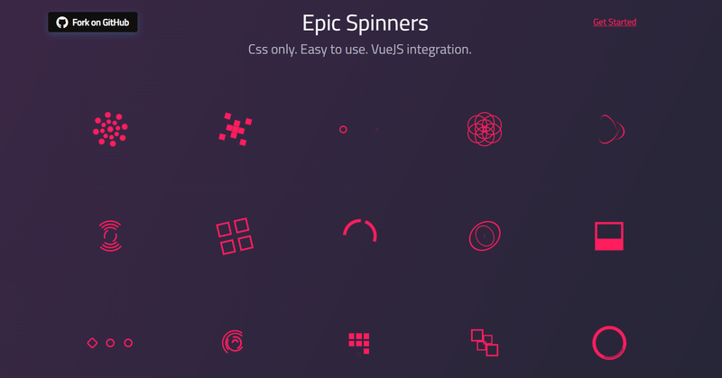
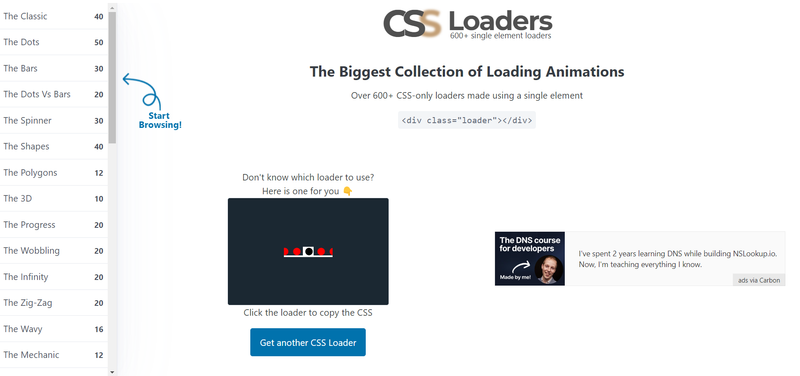
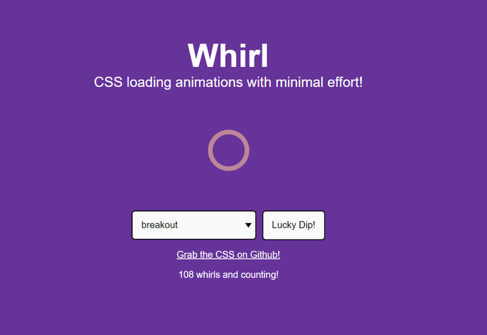

Happy Friday, developers! 🖥️ This week, we're diving deep into the world of **NodeJS** with tips,
tricks, and resources to sharpen your skills and supercharge your projects. Whether you're a
front-end, or back-end expert, or just getting started, we've got something for everyone. So grab a
coffee, sit back, and let’s explore the latest in JavaScript together!

## 📜 Articles & Tutorials

[How to Create a Chrome Extension with React, TypeScript, TailwindCSS, and Vite](https://www.luckymedia.dev/blog/how-to-create-a-chrome-extension-with-react-typescript-tailwindcss-and-vite-in-2024)

[Custom Data Attributes in HTML5](https://blog.openreplay.com/custom-data-attributes-in-html5/)

[CSS-only Custom Range Slider with Motion](https://www.bram.us/2024/06/06/css-only-custom-range-slider-with-motion/)

[Using CSS nesting](https://developer.mozilla.org/en-US/docs/Web/CSS/CSS_nesting/Using_CSS_nesting)

[Epic Spinners](https://epic-spinners.vuestic.dev/)

[CSS Loaders](https://css-loaders.com/)

[Whirl](https://whirl.netlify.app/)

CSS loading animations with minimal effort!

[Building a HTML5 game with KaplayJS](https://rohankumarthakur.co.in/blog)

[Creating the smallest possible router in JavaScript](https://www.tronic247.com/creating-the-smallest-possible-router)

[My Favorite Algorithm: Linear Time Median Finding](https://rcoh.me/posts/linear-time-median-finding/)

## ⚒️ Tools

[WebJSX](https://webjsx.org/)

**WebJSX** is a lightweight, component-based JavaScript framework designed to simplify web
development. It offers a fast, intuitive approach for building dynamic, interactive user interfaces
with minimal code. Perfect for developers seeking performance and flexibility.

[Srcbook](https://srcbook.com/)

**Srcbook** is a comprehensive resource hub for developers, offering curated tutorials, guides, and
tools to enhance coding skills and project efficiency.

[IsographJS](https://isograph.dev/)

**IsographJS** is a powerful JavaScript library designed for creating interactive, isometric
graphics and visualizations. Ideal for game developers and data visualization enthusiasts,
IsographJS makes it easy to build stunning 2D and 3D isometric scenes with smooth performance and
responsive design capabilities.

[screen-scaler](https://github.com/garronej/screen-scaler)

**Screen-Scaler** is a lightweight utility that helps developers create responsive,
resolution-independent user interfaces for games and web applications. It automatically adjusts UI
elements to fit different screen sizes, ensuring a consistent and optimized experience across all
devices.

[HumanifyJS](https://github.com/jehna/humanify)

**HumanifyJS** is a user-friendly JavaScript library designed to enhance the usability and
accessibility of web applications. By providing a set of intuitive functions and components,
HumanifyJS allows developers to create more engaging and human-centered experiences.

[Flitter](https://flitter.pages.dev/)

**Flitter** is a cutting-edge framework for building high-performance, reactive web applications
with ease. It offers a streamlined approach to creating dynamic UIs, making it ideal for developers
looking for speed, simplicity, and flexibility in their projects.

[All Proton Drive apps are now open source](https://proton.me/blog/drive-open-source)

[lazygit](https://github.com/jesseduffield/lazygit)

**Lazygit** is a simple, yet powerful terminal-based Git interface designed to enhance your Git
workflow. With an intuitive user interface and keyboard shortcuts, Lazygit makes it easy to manage
repositories, view changes, and perform common Git operations without leaving the terminal.

## 📚 Libs

[obsohtml](https://github.com/j9t/obsohtml)

**Obsohtml** is a lightweight HTML preprocessor that allows developers to easily create and maintain
clean, modular HTML code. By enabling the use of modern syntax and features, Obsohtml simplifies the
process of building web pages while enhancing readability and maintainability.

[imagehover.css](https://imagehover.io/)

**ImageHover.css** is a lightweight CSS library that brings your images to life with stunning hover
effects. Designed for simplicity and ease of use, it allows developers to create eye-catching visual
interactions without the need for JavaScript.

[Mimic.css](https://erictreacy.github.io/mimic.css/)

**Mimic.css** is a modern CSS framework designed to help developers create responsive, aesthetically
pleasing web designs with minimal effort. It offers a variety of utility classes and components that
simplify styling, allowing you to focus on your content without getting bogged down in complex CSS
rules.

[ofa.js](https://ofajs.com/en/index.html)

**OFA.js** is a powerful JavaScript library designed for creating interactive and engaging web
applications with ease. It offers a range of features for developers, including intuitive APIs,
real-time data handling, and seamless integration with existing projects.

[Autodoc](https://github.com/context-labs/autodoc)

**Autodoc** is a versatile documentation generator that automatically creates comprehensive and
user-friendly documentation for your codebase. Designed to streamline the documentation process,
Autodoc supports various programming languages and allows developers to maintain up-to-date
documentation effortlessly.

[EChartsJS](https://echartsjs.com)

**EChartsJS** is a powerful, open-source visualization library designed to create interactive and
customizable charts for web applications. With a rich set of features, including various chart
types, animations, and responsive design capabilities, EChartsJS allows developers to easily
integrate stunning data visualizations into their projects.

## ⌚ Releases

[Astro 5.0 Beta Released!](https://astro.build/blog/astro-5-beta/)

[Announcing Vue 3.5](https://blog.vuejs.org/posts/vue-3-5)

[Bun v1.1.29](https://bun.sh/blog/bun-v1.1.29)

[Strapi 5 Launch Week](https://strapi.io/launch-week)

[PostgreSQL 17 Released!](https://www.postgresql.org/about/news/postgresql-17-released-2936/)

[Storybook 8.3](https://storybook.js.org/blog/storybook-8-3/)

[Airbyte 1.0](https://airbyte.com/)

**Airbyte** is a robust open-source data integration platform that simplifies the process of syncing
data between various sources and destinations. With its modular architecture and user-friendly
interface, Airbyte enables developers to easily connect and replicate data across databases, APIs,
and cloud services. Designed for scalability and flexibility, it supports a wide range of
connectors, making it ideal for teams looking to streamline their data workflows.

[Neutralinojs v5.4.0 released!](https://github.com/neutralinojs/neutralinojs/releases/tag/v5.4.0)

**Neutralinojs** is a lightweight and versatile framework for building cross-platform desktop
applications using web technologies like JavaScript, HTML, and CSS. With a simple API and minimal
dependencies, Neutralinojs allows developers to create applications that run seamlessly on Windows,
macOS, and Linux without the overhead of a full-fledged framework.

## 📺 Videos

[Scrolling table of contents using Framer Motion](https://www.youtube.com/watch?v=xgz5jIi4R7c&ab_channel=BuiltWithCode)

[Build a Live Code Editor for Coding Interviews | MERN, Socket.IO, Monaco Editor Tutorial](https://www.youtube.com/watch?v=ey1Bi6lI0Gg)

[I Rebuilt 3 Awwwards Page Transitions using Nextjs and Framer Motion](https://www.youtube.com/watch?v=WmvpJ4KX30s&ab_channel=OlivierLarose)

[Docusaurus from ZERO to HERO](https://www.youtube.com/watch?v=Aw9D0YMK8Sk&ab_channel=MostlyCode)

[Next.js School Management Dashboard UI Design Tutorial | React Next.js Responsive Admin Dashboard](https://www.youtube.com/watch?v=myYlGLFxZas&ab_channel=LamaDev)

[Build a Full Stack React Native App with Payments | PostgreSQL, TypeScript, Stripe, Tailwind](https://www.youtube.com/watch?v=kmy_YNhl0mw)

[How to Build (Good) Admin Dashboards || React & TailwindCSS](https://www.youtube.com/watch?v=vdxnBKRD7kU&ab_channel=TomIsLoading)

[Build a Nextjs Project Management App & Deploy on AWS | Cognito, EC2, Node, RDS, Postgres, Tailwind](https://www.youtube.com/watch?v=KAV8vo7hGAo&ab_channel=EdRoh)

[The Framer Motion Crash Course || React Animation Library 2023](https://www.youtube.com/watch?v=znbCa4Rr054&ab_channel=TomIsLoading)

Thank you for joining us this week! We hope you found inspiration and valuable resources to enhance
your projects. Happy coding, and we’ll see you next week for more exciting content! 🙂
