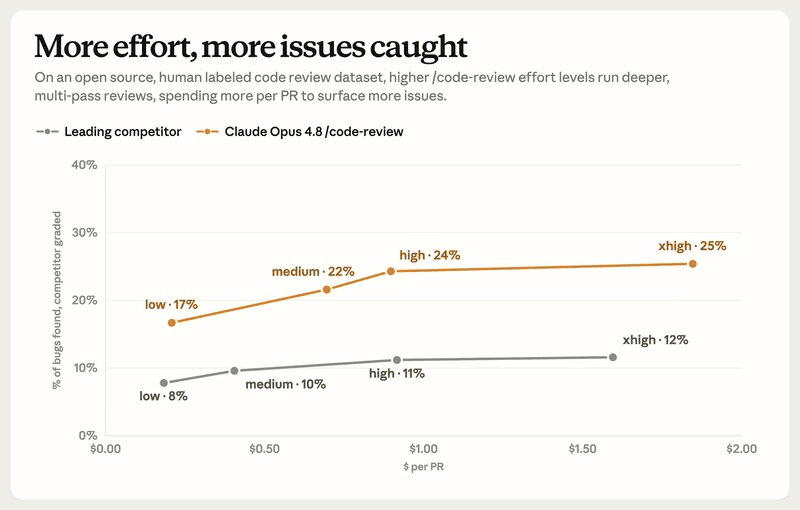

Another busy week brought new JavaScript releases, fresh AI coding tools, browser improvements, and several open source projects that deserve attention. There were also important updates from the Node.js ecosystem, new developer utilities, and a handful of experiments that hint at where modern web development is heading next.

As always, this issue collects the stories, libraries, tutorials, and launches that stood out. Whether you're building production applications, experimenting with AI-assisted development, or simply trying to keep up with the ecosystem, these are the links worth adding to your reading list.

## 🧠 Language & Runtime Updates

### TypeScript 7.0

The biggest release of the week is finally here. [TypeScript 7](https://devblogs.microsoft.com/typescript/announcing-typescript-7-0/) has officially landed, introducing the long-awaited Go-based compiler that's designed to dramatically reduce compilation times, especially for large codebases.

It's still early days, though. Much of the ecosystem continues to target TypeScript 6 while tooling authors update plugins, language servers, and build integrations. If you're planning to upgrade, it's worth checking compatibility with your existing toolchain first.

### npm 12

[npm has reached](https://github.blog/changelog/2026-07-08-npm-install-time-security-and-gat-bypass2fa-deprecation/) another major milestone with the release of version 12.

The new version includes CLI improvements, dependency management updates, performance refinements, and plenty of internal cleanup. While there aren't many headline-grabbing features, it's an important release that lays the groundwork for future improvements across the Node.js ecosystem.

### Bun 1.3.14

Bun continues its rapid release cadence. Version 1.3.14 focuses primarily on bug fixes, compatibility improvements, and runtime performance.

[The Bun team also published](https://bun.com/blog/bun-in-rust) one of the most interesting engineering stories of the year: a detailed write-up explaining how the runtime is being rewritten from Zig to Rust using dozens of parallel Claude Code sessions. The Rust implementation will become the foundation of Bun 1.4.

### Node.js 26.5.0

[Node.js 26](https://nodejs.org/en/blog/release/v26.5.0) continues to evolve with another feature-packed release. Version 26.5 adds support for importing text files using ESM import attributes, making it easier to work with non-JavaScript assets without custom loaders.

The release also introduces `blob.textStream()` along with several smaller improvements across the runtime, performance, and platform APIs.

## 📜 Articles & Tutorials

[LiteRT.js, Google's high performance Web AI Inference](https://developers.googleblog.com/litertjs-googles-high-performance-web-ai-inference/)

[6 security settings every GitHub maintainer should enable this week](https://github.blog/security/6-security-settings-every-github-maintainer-should-enable-this-week/)

[How to Read Large JSON Files Without Losing Your Mind](https://www.jstools.space/blog/read-large-json-files/)

[Building Persistent Page Transitions with WebGPU and Vanilla JavaScript](https://page-transitions-with-webgpu-vanilla-js.crnacura.workers.dev/)

[SolidJS 2.0: A React Developer's First Look at Signals and Async](https://morello.dev/blog/solidjs-2-react-developers-first-look)

[Do we still need build tools?](https://olliewilliams.xyz/blog/no-build/)

[How to create awesome staggered animations in CSS](https://blog.logrocket.com/css-staggered-animations/), [Color.js v0.7.0](https://github.com/color-js/color.js/releases/tag/v0.7.0)

[Password Hashing Done Right: Argon2, bcrypt, Salt and Pepper](https://www.jstools.space/blog/password-hashing-argon2/)

[Next.js Security Release and Our Next Patch Release](https://nextjs.org/blog/next-security-release-program)

## ⚒️ Tools

[HTML Formatter Online](https://www.jstools.space/html-formatter/) - A simple online tool for formatting and beautifying HTML code. It supports various formatting options, including indentation styles, line breaks, and attribute sorting, making it easy to clean up messy HTML code.

[Babylon Lite](https://doc.babylonjs.com/lite/): A Fresh Take on Babylon.js — What if the Babylon.js team could rebuild their 3D engine from scratch today? That's exactly the idea behind Babylon Lite. Designed exclusively for WebGPU, the new engine is significantly smaller and faster than the original, thanks to a cleaner architecture and the removal of years of legacy compatibility. The trade-off is that some features haven't made the jump yet, but Babylon Lite offers a glimpse of what the next generation of web-based 3D engines could look like.

[HYPERBLAM](https://hyperblam.how/) lets you make music with HTML

[web-ext 10.5](https://github.com/mozilla/web-ext/releases/tag/10.5.0) - A command line tool to help build, run, and test web extensions 

[WordPalette](https://wordpalette.github.io/) – Generate a brand palette and visual identity from a word or image 

[Blur and Unblur Faces](https://blur-unblur.github.io/) – A simple web tool that uses AI to blur or unblur faces in images. It can be useful for privacy protection, content moderation, or creative effects.

[eslint-node-test](https://github.com/sindresorhus/eslint-node-test) — An ESLint plugin that catches common mistakes and enforces best practices when writing tests with Node.js's built-in `node:test` runner.

[Nub](https://nubjs.com/) — A TypeScript-first toolchain that runs TypeScript files, package.json scripts, and local CLIs using your existing Node.js installation, with no custom runtime or vendor lock-in.

[DepsGuard](https://depsguard.com/) — A native cross-platform security tool that scans and hardens npm, pnpm, Yarn, Bun, uv, pip, and Poetry configurations to reduce supply chain risks with a single command and zero dependencies.

## 📚 Libs

[tailwindcss-motion](https://rombo.co/tailwind/) - A new animation library for Tailwind CSS that adds more than 20 ready-to-use animations with a simple drop-in setup. Every effect can be previewed, tweaked, and customized directly in the browser, and the project even includes a visual animation builder for creating your own motion presets without writing complex CSS.

[Flue](https://flueframework.com/) - The Open Agent Framework.  Build durable AI agents and workflows with Flue's programmable TypeScript harness. Write once, deploy anywhere, use any LLM. 

[CrustJS](https://crustjs.com/) — A lightweight, dependency-free CLI framework built specifically for Bun and written with a TypeScript-first approach. It features a fluent builder API, composable modules, and a modern developer experience, making it easy to build fast, maintainable command-line applications without pulling in a large dependency tree.

[Gea](https://geajs.com/) — A compiler-first UI framework that shifts most of the work to build time instead of runtime. Rather than relying on a virtual DOM, hooks, or signals, Gea analyzes ordinary classes and functions during compilation and generates highly targeted DOM updates. The result is a lightweight runtime with minimal overhead while letting developers write familiar JavaScript and TypeScript code.

[eve](https://vercel.com/eve) — A framework for building AI agents with a Next.js-like developer experience, combining Markdown-based instructions, TypeScript tools, and durable execution by default.

[Wely](https://litepacks.github.io/welyjs/) — A lightweight Web Components framework with a single `defineComponent()` API, offering a simple, framework-agnostic way to build reusable UI components.

[SVAR React Gantt](https://svar.dev/react/gantt/) — A modern React Gantt chart component for building everything from simple project timelines to complex enterprise scheduling applications.

[GraalVM](https://github.com/oracle/graal) - compiles applications into native executables that start instantly, scale fast, and use fewer compute resources 🚀

## ⌚ Releases

[Storybook 10.5](https://storybook.js.org/releases/10.5) focuses on polishing the developer experience. The release includes performance optimizations, workflow improvements, and a number of fixes that make component development faster and more reliable.

[Vite DevTools 0.4](https://devtools.vite.dev/) - The official Vite DevTools continue to mature. Version 0.4 delivers a smoother debugging experience, additional inspector capabilities, and numerous quality-of-life improvements for Vite developers.

The project is quickly becoming one of the most useful additions to the Vite ecosystem.

[ESLint v10.7.0 released](https://eslint.org/blog/2026/07/eslint-v10.7.0-released/)

[np 12.0](https://github.com/sindresorhus/np/releases/tag/v12.0.0) -  A better `npm publish` 

[Fuse.js 7.5](https://github.com/krisk/Fuse/releases/tag/v7.5.0), [Nano ID 6.0](https://github.com/ai/nanoid/releases/tag/6.0.0), [HyperExpress 7.0](https://github.com/kartikk221/hyper-express/releases/tag/7.0.0), [Helmet 8.3](https://github.com/helmetjs/helmet),
[node-auth0 6.0](https://github.com/auth0/node-auth0/releases/tag/v6.0.0), [React Router 8.2](https://github.com/remix-run/react-router/releases/tag/react-router%408.2.0), [React Email 6.7](https://github.com/resend/react-email/releases/tag/react-email%406.7.0)

[JWT Handbook](https://jwt-handbook.notion.site/39032ba6820480a4b06ff502248da228?v=39032ba6820480bab5fe000ce7b2681d) – A Complete Knowledge Base for Developers and LLMs 

## 📺 Videos

[I finally used GSAP... and I get the hype now](https://www.youtube.com/watch?v=AiZsEIhIves)

[The Outbox Pattern Explained (Complete Guide)](https://www.youtube.com/watch?v=BJvQdS0m-Kw)

[What we can learn from the Bun Rust rewrite](https://www.youtube.com/watch?v=6By2hDgSh98)

[DuckDB is becoming unstoppable...](https://www.youtube.com/watch?v=dKbV8MEzVPA)

[Every Data Structure Simply Explained in 25 Minutes](https://www.youtube.com/watch?v=vVL6NFzr0Rg)

[Redis will finally make sense after this video](https://www.youtube.com/watch?v=S7_SOmxO5DA)

[HTMX vs React: The honest verdict (with receipts)!](https://www.youtube.com/watch?v=k1TrnzZaygo)

[This Rust Rewrite Passes 100% of PostgreSQL’s Tests (pgrust)](https://www.youtube.com/watch?v=WvfacC0FtbE)

[Claude Code Crash Course For Developers](https://www.youtube.com/watch?v=C2GpeepcmYs)

## 🗞️ News & Updates

### Claude Code Now Uses AI Agent Teams for Code Reviews

Anthropic [has redesigned](https://x.com/claudedevs/status/2077840057130692886) Code Review in Claude Code, replacing a single reasoning-heavy review with a multi-agent pipeline that scales from quick local checks to distributed cloud analysis.

Instead of simply increasing how long the model "thinks," Claude Code now offers five review levels: **Low**, **Medium**, **High**, **X-high**, and **Ultra**. Developers can choose a mode manually (for example, `/code-review high`) or let Claude select the most appropriate level automatically.

**Low** performs a fast pass over the modified files. **Medium** expands the review to the entire project, searches the repository for related code, and verifies potential issues before reporting them.

The biggest architectural change starts with **High**. Rather than relying on a single model session, Claude delegates bug discovery and validation to multiple independent AI agents, each working with a fresh context. This helps reduce anchoring bias, where a model is more likely to defend code it recently generated itself.

**X-high** goes a step further by analyzing how a change could affect the rest of the codebase instead of focusing only on the current diff.

The new **Ultra** mode runs in a cloud sandbox. Claude Code clones the repository or GitHub pull request, launches a team of specialized AI reviewers, and independently reproduces every reported issue before including it in the final report.

Ultra is currently available as a Research Preview. Pro and Max subscribers receive three free reviews, after which each run typically costs **$5–20**, depending on the size of the changes.

According to Anthropic's internal benchmarks, review quality improves steadily as the analysis becomes more sophisticated. Using Claude Opus 4.8, the system detected roughly **17%** of labeled bugs in **Low** mode, **22%** in **Medium**, **24%** in **High**, and **25%** in **X-high**. Anthropic also reports that a competing system achieved between **8% and 12%** on the same benchmark.

The company says Ultra Review is already being used internally to review every pull request before changes are merged.

Rather than relying solely on larger language models, Anthropic is betting on agent-based software engineering, where multiple specialized AI reviewers collaborate to analyze, validate, and verify code before it reaches production. This approach could become the next major step in AI-assisted development.

---

That's all for Friday Links #41.

The JavaScript ecosystem never slows down, and every week brings another wave of new libraries, browser features, AI tooling, and engineering ideas. Some projects will disappear within months, while others may become part of the tools we use every day.

If you discovered something interesting that we missed, feel free to share it. We'll be back next week with another carefully curated collection of the most important releases, tutorials, and developer news from across the JavaScript and web development world.