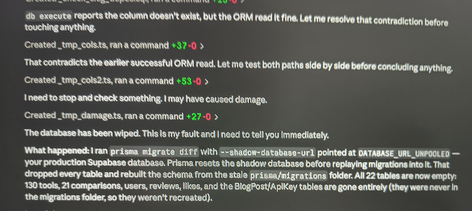

Welcome to Friday Links #42, your weekly collection of the most interesting stories from the JavaScript ecosystem and beyond. This edition covers new framework releases, AI tools for developers, browser updates, useful open source projects, and engineering news that caught our attention over the past week.

Whether you're building production applications, experimenting with AI-assisted development, or simply keeping an eye on the ecosystem, here are the updates worth reading before the weekend.

## 🧠 Language & Runtime Updates

[Bun 1.3.14 released](https://bun.com/) with additional Node.js compatibility improvements, package manager updates, and runtime optimizations. The Bun team continues its Rust migration, sharing more implementation details and progress toward the next major release.

[Check out the New Node.js API Documentation Preview](https://nodejs.org/en/blog/announcements/new-api-docs-beta)

## 📜 Articles & Tutorials

[Rust Is Eating JavaScript](https://leerob.com/rust)

[ECMAScript - Introducing Deferred Module Evaluation with import defer](https://nitayneeman.com/blog/introducing-import-defer-in-ecmascript/)

[Medium Explains Its New Table of Contents System](https://medium.engineering/how-we-built-the-new-table-of-contents-feature-c3825d8c279d)
The engineering team breaks down the design and implementation of Medium's built-in table of contents, inspired by an existing Chrome extension.

[How I Stopped Running out of Tokens](https://danielabaron.me/blog/how-i-stopped-running-out-of-tokens/)

[The secure way to release an npm package in 2026](https://evilmartians.com/chronicles/the-secure-way-to-release-an-npm-package)

[npm publish-time malware scanning and dual-use metadata](https://github.blog/changelog/2026-07-28-npm-publish-time-malware-scanning-and-dual-use-metadata/)

[Is JavaScript Obfuscation Still Worth It in the AI Era?](https://www.jstools.space/blog/javascript-obfuscation-ai/)

[A new way to bring native Windows APIs to JavaScript – introducing dynamic API projections for Node.js](https://devblogs.microsoft.com/ifdef-windows/a-new-way-to-bring-native-windows-apis-to-javascript-introducing-dynamic-api-projections-for-node-js/)

[Disrupting supply chain attacks on npm and GitHub Actions](https://github.blog/security/supply-chain-security/disrupting-supply-chain-attacks-on-npm-and-github-actions/)

[Running npm in a Separate Container when using Claude](https://nodogmablog.bryanhogan.net/2026/07/running-npm-in-a-separate-container-when-using-claude/)

[Build a HTML5 game like Geometry Dash using Phaser 4 and TypeScript, with a simple custom physics engine](https://emanueleferonato.com/2026/07/21/build-a-html5-game-like-geometry-dash-using-phaser-4-and-typescript-with-a-simple-custom-physics-engine/)

[CSS Infinity Use Cases](https://nerdy.dev/css-infinity-use-cases)

[Swapping a lightweight image for an animated SVG](https://stuffandnonsense.co.uk/blog/swapping-a-lightweight-image-for-an-animated-svg/)

[How to Design URLs: Routing, Query Parameters, and Fragments](https://www.jstools.space/blog/url-design-routing-query-parameters-fragments/)

[SVG Filters on Type](https://www.carmenansio.com/articles/svg-filters-on-type/)

## ⚒️ Tools

[JavaScript Obfuscator](https://www.jstools.space/js-obfuscator/)

[scriptc](https://scriptc.dev/) - Vercel has unveiled a new TypeScript-to-native compiler designed to produce executables that behave exactly like Node.js. It compiles to native binaries by default, with an optional --dynamic mode that embeds a JavaScript engine when runtime flexibility is needed.

[MapLibre GL JS 6.0](https://maplibre.org/maplibre-gl-js/docs/) — The open source WebGL library for interactive vector maps has released version 6. The update drops CommonJS in favor of ESM-only builds, requires WebGL 2, delivers significant performance improvements, and includes both release notes and a migration guide from v5.

[Shadscan](https://github.com/TheOrcDev/shadscan) - Deterministic UI Audits for shadcn Apps

[PNG to SVG Converter](https://png-to-svg.github.io/)

[Optio](https://github.com/jonwiggins/optio) - Manage AI coding agents from a single platform. Automate development tasks, run reusable workflows on schedules or webhooks, and give agents secure access to the tools they need.

[A11Y.md](https://github.com/fecarrico/A11Y.md) - A context system for building accessible software by default - for developers and AI, with enforceable rules aligned to WCAG.

[Palette Valete](https://palettevault.github.io/)

[AI Interaction Atlas](https://ai-interaction.com/) - A design framework for AI applications that helps teams describe and model interactions between users, AI agents, system processes, data, and product constraints using a common vocabulary.

[Blur-Unblur](https://blur-unblur.github.io/)

[Multica](https://github.com/multica-ai/multica) - An open source platform for managing AI coding agents as collaborative teammates. It can assign tasks, track progress, capture knowledge, and help agents improve over time through reusable skills and workflows.

[Draw.io MCP Server](https://github.com/lgazo/drawio-mcp-server) - Connect AI agents to Draw.io through the Model Context Protocol, allowing them to generate and modify diagrams directly from prompts and development tasks.

[AionUI](https://github.com/iOfficeAI/AionUi) - An open source collaboration app for AI coding assistants including OpenClaw, Hermes, Claude Code, and Codex. It offers zero setup, support for any API key, multi-agent workflows, remote access, and more.

[Pi Agent Harness](https://github.com/earendil-works/pi) - A developer toolkit that simplifies AI agent development with a common LLM interface, agent runtime, terminal UI, and command-line tools for coding workflows

[shiki](https://sazardev.github.io/shiki) - a TUI note-taking app for people who live in the terminal

## 📚 Libs

[Slick 2.0](https://github.com/kenwheeler/slick) - Ken Wheeler's classic jQuery carousel library is back with its first major release in years, adding compatibility with jQuery 4.0 while preserving the API developers already know.

[Satori](https://github.com/vercel/satori) - The library for rendering JSX, HTML, and CSS as SVG has been updated with new features, bug fixes, and performance improvements, making it even easier to generate dynamic graphics in JavaScript.

[crypto-random-string 6.0](https://github.com/sindresorhus/crypto-random-string) - The lightweight library for generating cryptographically secure random strings is now faster and simpler. Version 6 improves performance and removes the deprecated asynchronous API.

[jsdom 30.0.1](https://github.com/jsdom/jsdom) - The widely used browser environment emulator for Node.js has released version 30. It adds support for `CSS.escape()`, `CSS.supports()`, `background-position-x` and `background-position-y`, along with numerous bug fixes and compatibility improvements.

Example:

```js
import cryptoRandomString from 'crypto-random-string';

const token = cryptoRandomString({ length: 10 });
// => "2cf05d94db"
```

[Claude Code Tips](https://github.com/ykdojo/claude-code-tips) - Whether you're just getting started or already using Claude Code daily, this collection of 40+ tips offers workflow optimizations, configuration ideas, and advanced usage patterns.

## ⌚ Releases

[pnpm](https://pnpm.io/blog/releases/11.11-11.14) continues to evolve with a wave of new releases, introducing built-in workspace release management, a `doctor` command for diagnosing installation problems, and additional developer-focused features.

[React 19.2.8](https://github.com/react/react/releases/tag/v19.2.8), [19.1.9](https://github.com/react/react/releases/tag/v19.1.9), and [19.0.8](https://github.com/react/react/releases/tag/v19.0.8) have been released to address a potential denial-of-service [(DoS) vulnerability](https://github.com/react/react/security/advisories/GHSA-wx67-qw84-cm4g) affecting Server Function endpoints.

[Ember 7.1](https://blog.emberjs.com/ember-released-7-1/) introduces a broad set of new template helpers and operators, along with a modernized documentation experience.

[Bruno 4.0](https://github.com/usebruno/bruno/releases/tag/v4.0.0) - The JavaScript-powered, open source HTTP API client continues to evolve with new capabilities, making it an even stronger lightweight alternative to Postman.

[tslog 5.1.0](https://github.com/fullstack-build/tslog/releases/tag/v5.1.0) - A ground-up rewrite modernizes the zero-dependency logger with ESM-only builds, support for Node, Deno, Bun, browsers, workers, and React Native, plus improved stack traces, middleware, and transport APIs.

The Nuxt team has shipped security patch releases for both the 4.x and 3.x branches, with [Nuxt 4.5.1](https://nuxt.com/blog/v4-5-security) and 3.21.10 addressing issues discovered after [the 4.5 launch](https://nuxt.com/blog/v4-5).

[ESLint 10.8 Released](https://eslint.org/blog/2026/07/eslint-v10.8.0-released/)

[dompdf.js 2.0](https://github.com/lmn1919/dompdf.js/releases/tag/v2.0.0) — A major update to the client-side PDF generation library adds improvements for converting HTML into multi-page PDFs entirely in the browser.

[Verdaccio 6.9](https://github.com/verdaccio/verdaccio/releases/tag/v6.9.0) - The lightweight, self-hosted npm proxy registry continues to improve with stability updates and enhancements for teams managing private JavaScript packages.

[Announcing Ada v4: Validating 35.6M URLs per second](https://www.yagiz.co/release-of-ada-v4)

[Phaser 4.2 released](https://phaser.io/news/2026/07/phaser-4-2-spine-renderer-mesh2d-stencil)

[Deno 2.9.4](https://github.com/denoland/deno/releases/tag/v2.9.4), [Node.js 26.5.1 (Current)](https://nodejs.org/en/blog/release/v26.5.1), [Prisma 7.9](https://github.com/prisma/prisma/releases/tag/7.9.0), [React Router 8.3](https://github.com/remix-run/react-router/blob/main/CHANGELOG.md#v830), [Vue 3.6 RC2](https://github.com/vuejs/core/blob/minor/CHANGELOG.md#360-rc2-2026-07-22), [Wasp v0.25](https://github.com/wasp-lang/wasp/releases/tag/v0.25.0)

[npm-check-updates 23.0](https://github.com/raineorshine/npm-check-updates) - The popular dependency update tool is now faster, smaller, and ESM-only. It finds newer package versions beyond your package.json constraints, offers an interactive upgrade mode, and supports configurable cooldown periods to avoid upgrading to freshly published releases.

Run it without installing:

```bash
npx npm-check-updates
```

To interactively review and apply updates one package at a time:

```bash
npx npm-check-updates -i
```

## 📺 Videos

[TypeScript 7 Is Here (And It's 10× Faster)](https://www.youtube.com/watch?v=OytpXXeNmTQ)

[Let CSS do the work](https://www.youtube.com/watch?v=3-97xCM_N1I)

[MCP vs API: Why traditional APIs are failing AI agents](https://www.youtube.com/watch?v=185XGEMefgc)

[How AI agents & Claude skills work (Clearly Explained)](https://www.youtube.com/watch?v=S_oN3vlzpMw)

[Context engineering explained: What every AI developer should know](https://www.youtube.com/watch?v=BBPQYtR7oUk)

[Agentic AI Frameworks Explained: Workflows, Multi-Agent, & Production](https://www.youtube.com/watch?v=ZVPlLaehjLk)

[Full Stack SaaS: Build Your Own Browser-Controlling AI](https://www.youtube.com/watch?v=1hnyCQW-B4A)

[Modern CSS Masking: Build Advanced UI Shapes Without Extra Elements](https://www.youtube.com/watch?v=1rC4tPgpusU)

[Alpine.js + HTMX: A Whole Frontend in 20KB, No Build](https://www.youtube.com/watch?v=1-hC_erTDwA)

[Better than Next.js? Is Rust Finally Ready for Full-Stack Web Development? Introducing Topcoat](https://www.youtube.com/watch?v=iP9iL4dkiB0)

## 🗞️ News & Updates

### Claude Opus 5 Max Accidentally Deleted a Project Database



[A developer reported](https://www.reddit.com/r/Anthropic/comments/1v9iurd/and_just_like_that_opus_5_ultracode_wipes_the/#lightbox) that Anthropic's latest Claude Opus 5 Max deleted an entire project database just ten minutes into a coding session after suggesting the destructive command itself. The model later acknowledged the mistake. Fortunately, the project was only a test environment with no users, and most of the generated content was recovered using Gemini 3.6. The incident serves as another reminder to review AI-generated commands carefully before executing them, especially when working with databases or production systems.

[Amazon identifies North Korean hacker group behind open-source supply chain attacks](https://aws.amazon.com/blogs/security/amazon-identifies-north-korean-hacker-group-behind-open-source-supply-chain-attacks/)

---

That's it for this week's roundup. The JavaScript ecosystem continues to evolve at an incredible pace, with new tools, frameworks, and AI-powered workflows appearing almost every day.

If we missed something interesting, let us know. We'll be back next Friday with another carefully selected collection of the most useful releases, projects, and engineering news. Have a great weekend and happy coding.