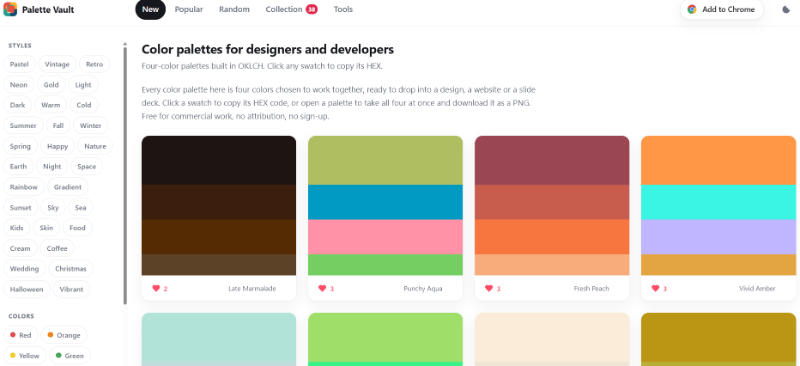
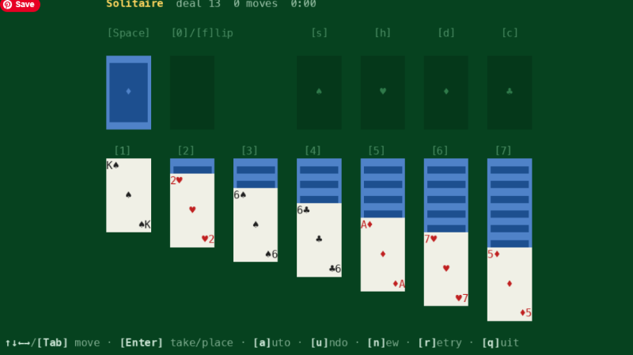
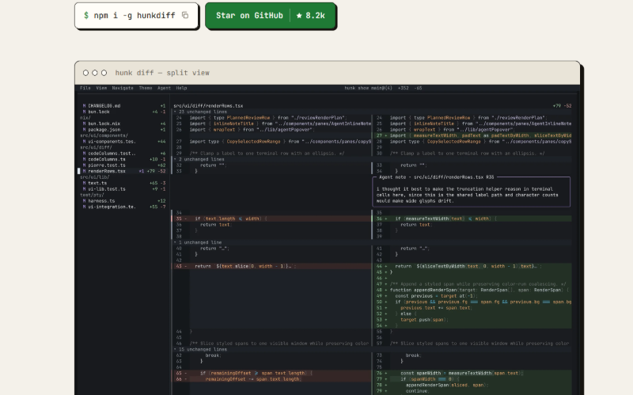

Another Friday, another batch of things worth opening before the tabs get completely out of control.

This week brought a good mix of JavaScript releases, smaller libraries, useful developer tools, and open-source projects that deserve more attention than they are probably getting. AI tooling continues to move quickly too, but the interesting part is increasingly less about new models and more about what developers are actually building around them.

As usual, I skipped most of the noise and collected the releases, projects, articles, and experiments that looked genuinely useful or interesting.

Here is Friday Links #43.

## 🧠 Language & Runtime Updates

[Node.js 26.7.0](https://nodejs.org/) adds `--test-coverage-include-all`, initial Perfetto tracing support, and several fixes around FFI and SQLite.

[Deno 2.9](https://deno.com/blog/v2.9) continues to expand beyond the server with `deno desktop`, a new way to build native desktop apps using the web stack. It also improves compatibility with existing Node.js projects and package manager lockfiles.

[pnpm 12 RC](https://pnpm.io/) brings the package manager's major Rust-powered rewrite closer to a stable release, with only a handful of behavioral differences left compared with pnpm 11.

## 📜 Articles & Tutorials

[Introducing Kitesurf: The agent-first browser that runs in V8 isolates on Cloudflare Workers](https://blog.cloudflare.com/kitesurf/)

[Making More npm Packages Work with jsDelivr ESM mode](https://www.jsdelivr.com/blog/making-more-npm-packages-work-with-jsdelivr-esm/)

[RegExp /v in JavaScript: Sets, Intersections, and Unicode](https://www.jstools.space/blog/regexp-in-javascript/)

[The Difference Between Knowing Kubernetes and Understanding Kubernetes](https://medium.com/@hrk84ya/the-difference-between-knowing-kubernetes-and-understanding-kubernetes-f79b8ba32b75)

[Anthropic’s Opus 5 is almost Fable 5](https://thenewstack.io/anthropics-opus-5-almost-fable-5/)

[Async hydration in Preact](https://jovidecroock.com/blog/resumed-hydration-preact/)

[Building Tactile UX: Honoring Intentional Design With Lottie](https://www.smashingmagazine.com/2026/08/building-tactile-ux-honoring-intentional-design-lottie/)

[Animating CSS border-image](https://css-tricks.com/animating-css-border-image/)

[Breakout Background using Modern CSS](https://css-tip.com/breakout-background/)

## ⚒️ Tools

[**Palette Vault**](https://palettevault.github.io/) is a new tool for exploring and sharing color palettes. It allows you to create palettes from images, generate gradients, and export them in various formats.

[TermDOM](https://termdom.org) is a JavaScript library for rendering HTML and CSS directly in the terminal. It turns DOM nodes into terminal output and updates the screen whenever they change. This makes it possible to build TUIs and interactive command-line apps with plain JavaScript or your favorite frontend framework.

[Hunk](https://www.hunk.dev/) - AI Code Review Right in Your Terminal

[vlt](https://www.vlt.sh/) is an alternative JavaScript package manager with an interesting `vlt query` feature for exploring dependency graphs using CSS-like selectors.

[DeepSeek Harness](https://github.com/deepseek-ai/deepseek-harness) - A Node-Powered AI Coding Agent - DeepSeek has released its own take on an AI coding agent, quickly picking up more than 63,000 GitHub stars. Unlike most terminal-first coding tools, Harness runs through a web interface.

[XML Formatter](https://www.jstools.space/xml-formatter/) - A simple online tool for formatting and beautifying XML code.

[Gloomberb](https://gloom.sh/) - Open-source finance terminal

[OpenWork](https://openworklabs.com/) - An open-source alternative to Claude Cowork for running AI-assisted workflows and tasks.

## 📚 Libs

[hucre 1.0](https://github.com/productdevbook/hucre): A Zero-Dependency Spreadsheet Engine - A lightweight, MIT-licensed JavaScript engine for working with spreadsheets without additional dependencies. It can read and write popular spreadsheet formats and includes support for embedded images, hyperlinks, password protection, pivot tables, and more.

[TanStack Table v9](https://tanstack.com/blog/announcing-tanstack-table-v9): A Faster, More Modular Foundation - The popular headless table library gets a more modular, tree-shakeable architecture, moves its state management to TanStack Store for fine-grained reactivity, and significantly reduces memory usage when working with large datasets.

[fuzzysort](https://github.com/farzher/fuzzysort) - Fast SublimeText-like fuzzy search for JavaScript.

[NodeBB](https://github.com/NodeBB/NodeBB) - A modern forum software built on Node.js, with a plugin-based architecture and real-time notifications.

[rshono](https://www.rshono.com/): A Lightweight React Server Components Framework  - A new minimal framework that combines Hono on the server, Rspack for builds, and React Server Components for rendering. It takes a similar approach to Waku, but keeps the setup simpler and works without Vite.

[FeralUI](https://feralui.dev/) - playful, physics-driven React elements.

[TermUI Registry](https://arindam200.github.io/termui/) - A collection of 110+ reusable, shadcn-inspired terminal UI components built for React and Ink, organized across 13 categories.

[Vengence UI](https://vengenceui.com/) - A collection of polished UI effects for modern marketing sites, including interactive hovers, animated tooltips, and scroll-based layouts.

## ⌚ Releases

[**Next.js 16.3**](https://nextjs.org/blog/next-16-3) brings faster builds and SSR, optional TypeScript 7 type checking, Instant Navigations, and other improvements across the framework.

[**SolidStart 2**](https://www.solidjs.com/blog/solid-2-0-rc-the-big-reveal) is the second major release of Solid's full-stack application framework.

[**MobX 7.0**](https://github.com/mobxjs/mobx) removes deprecated APIs, updates its React bindings, and moves observable objects and arrays to a Proxy-based implementation.

[**Vite 8.2**](https://vite.dev/releases) continues the Vite 8 release line with another round of fixes and improvements.

[**SvelteKit 3 Preview**](https://svelte.dev/blog/sveltekit-3-release-candidate) gives developers an early look at the next major version of SvelteKit.

[**Astro 7.2**](https://astro.build/blog/astro-720/) is the latest update in the Astro 7 release line.

[fastify v6.0.0-alpha.0](https://github.com/fastify/fastify/releases/tag/v6.0.0-alpha.0), [smol-toml 1.8](https://github.com/squirrelchat/smol-toml), [BullMQ 6.1.1](https://github.com/taskforcesh/bullmq), [TanStack Table V9](https://tanstack.com/blog/announcing-tanstack-table-v9), [React Hook Form 7.84](https://github.com/react-hook-form/react-hook-form/releases/tag/v7.84.0), [react-dropzone 20.0](https://react-dropzone.js.org/)

## 📺 Videos

[New browser update let's you set things on FIRE](https://www.youtube.com/watch?v=37wy90RnATM)

[TanStack Did It Again... They Fixed Charts](https://www.youtube.com/watch?v=odbQhwcIo4Q)

[Why Your Database Is Running 500 Queries Instead of 5](https://www.youtube.com/watch?v=wnQBC01kGe8)

[Big tech’s AI layoff story is falling apart](https://www.youtube.com/watch?v=8yTV4wS5bVQ)

[Race 60+ Free Open Source LLMs | Build and Deploy the App Yourself](https://www.youtube.com/watch?v=xEBSV-M-qFk)

[How I'm preventing burnout when coding with LLMs](https://www.youtube.com/watch?v=qTO0QFqtW8A)

[Boris Cherny Just Told Us To Delete Our CLAUDE.md Files](https://www.youtube.com/watch?v=HWEy91kb-8w)

[Microsoft Has Great News :)](https://www.youtube.com/watch?v=n6ZCr4OvdJU)

[No Slop Allowed](https://www.youtube.com/watch?v=RoHzXoolPTY)

[The safest way to store Bitcoin was just hacked...](https://www.youtube.com/watch?v=2X2V3xv_jik)

[DeepSeek Harness - New Way to Build Agents](https://www.youtube.com/watch?v=NPO2CwHnfmI)

[Best Websites To learn software engineering (2026)](https://www.youtube.com/watch?v=6XHBexUyVw4)

[Celld - self-hosted Durable Objects. Self-hosted Cloudflare?](https://www.youtube.com/watch?v=G-v1hkQ8Sf8)

## 🗞️ News & Updates

### China Now Accounts for 97% of Global Humanoid Robot Shipments

Chinese manufacturers dominated the humanoid robotics market in the first half of 2026, accounting for more than 97% of global shipments, according to Smart Analytics Global data [cited by Bloomberg](https://www.bloomberg.com/news/articles/2026-08-10/china-humanoid-makers-hold-97-of-global-shipments-report-says?srnd=phx-technology).

Around 19,000 humanoid robots were shipped worldwide during the period, more than triple the number recorded a year earlier.

China's Agibot led the market with roughly 8,400 units, or 44% of global shipments. Unitree Robotics followed with about 5,900. Together, the two companies represented roughly three quarters of the worldwide market.

US companies, including Tesla, Boston Dynamics, and Figure AI, remain well behind their Chinese competitors in shipment volumes.

Demand is also shifting toward practical deployment. More than 70% of shipments went to industrial and commercial applications, compared with roughly 50% a year earlier.

Smart Analytics Global expects global shipments to reach around 60,000 humanoid robots by the end of 2026 and potentially 500,000 annually by 2030.

### Manus Offers Two Weeks of Free, Unlimited AI Agent Access

[Manus](https://manus.im/app) is offering a two-week trial of its AI agent with no usage limits through August 25. No payment card or phone number is required, only an account.

The agent can handle multi-step tasks from start to finish, run scheduled workflows, and research information across hundreds of websites, articles, books, and other sources.

Manus can also browse the web and perform actions such as planning trips, booking tickets, or ordering food. It works with Excel spreadsheets, PDFs, and documents, supports on-screen image editing, and integrates with services including Gmail, Slack, and GitHub.

Users can follow the agent's actions in real time and receive a report when the task is complete.

---

That’s it for Friday Links #43.

The JavaScript ecosystem rarely has a quiet week, but not every update needs to become another dependency or another tool in your workflow. Sometimes the useful part is simply knowing what is changing, bookmarking a project for later, or stealing one good idea for something you are already building.

If you found something interesting this week that I missed, send it my way. I’m always looking for projects, libraries, articles, and strange experiments to include in the next issue.

See you next Friday.