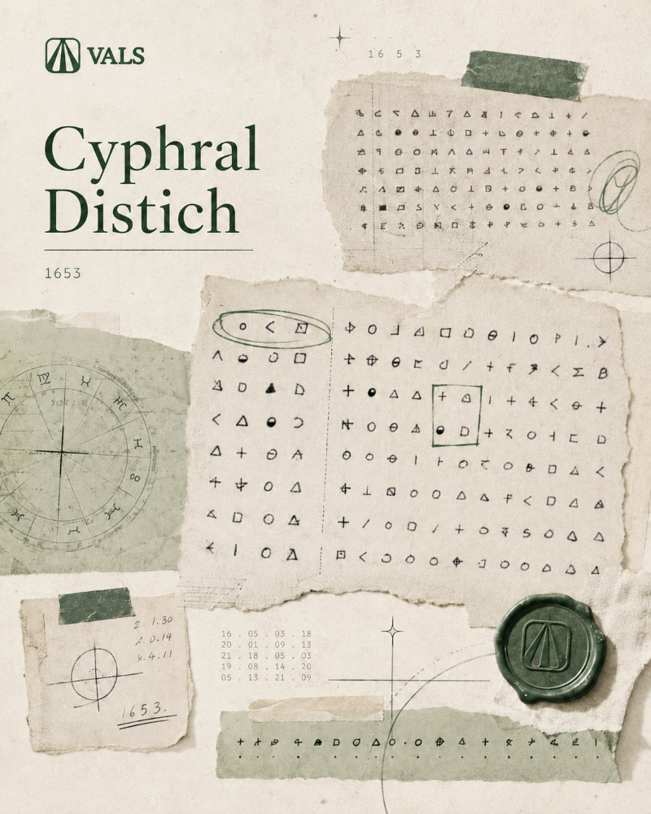

Another week, another pile of JavaScript updates.

This edition brings together the releases and projects that stood out recently, along with a few tools you might actually want to try. There are new library versions, developer tools, interesting experiments, and some good reads from around the ecosystem.

Here’s what made the list for Friday Links #44.

## 🧠 Language & Runtime Updates

[Node.js 26.8.1 Adds Native ZIP Support](https://nodejs.org/en/blog/release) - Node.js 26.8.1 can now read and write ZIP archives without an external dependency. The REPL also gets basic syntax highlighting, while 26.8.1 followed shortly after with a version-string fix.

[Bun 1.4: The Rust Rewrite Lands](https://bun.com/) - Bun's core has been rewritten from Zig to roughly one million lines of Rust. The release also adds native image, browser, Markdown, cron, and PTY APIs while improving Node.js compatibility.

[Electron 44 Released](https://www.electronjs.org/blog/electron-44-0) - Electron 44 moves to Chromium 152, V8 15.2, and Node.js 24.18.1. It also introduces net.WebSocket, persistent window state, a redesigned Clipboard API, and drops 32-bit builds.

[pnpm 12: Rewritten in Rust](https://pnpm.io/blog/releases/12.0) — pnpm 12 is now stable, bringing the Rust rewrite while keeping v11 commands, flags, and lockfiles mostly unchanged. Upgrade with `pnpm self-update next-12`.

## 🧩 Frameworks

[htmx 4.0 Is Here](https://four.htmx.org/announcements/2026-08-28-htmx-4.0.0-is-released) - The first major htmx release in two years replaces `XMLHttpRequest` internally with `fetch()`. It also changes attribute inheritance, cleans up events and history handling, and introduces built-in morph swaps.

[Svelte 5.57 Released](https://github.com/sveltejs/svelte/releases/tag/svelte%405.57.0) - Another minor Svelte 5 update landed on August 28, alongside continued work toward SvelteKit 3.

[NestJS 12 Is Now Available](https://trilon.io/blog/nestjs-12-is-now-available) - NestJS 12 ships with ESM packages, Standard Schema support for validation and serialization, a rebuilt CLI, and native observability via `@nestjs/observe`. The release also makes Rspack the default bundler for monorepos and adds the new `nest upgrade` command for easier migrations from v11.

[Remix 3 Reaches Release Candidate](https://remix.run/blog/remix-3-release-candidate) - Remix 3 has entered RC with its new full-stack architecture. Database tooling, schema validation, routing, SPA support, an asset server, HMR, and its own UI runtime now live inside a single remix package. Stable Remix 3 is planned for October 2.

[Waku 1.0 Reaches RC](https://waku.gg/blog/waku-v1-rc) - The minimal React Server Components framework has frozen its public API ahead of 1.0, with type-safe navigation and experimental cached route shells among the additions.

[TanStack AI Enters Release Candidate](https://tanstack.com/blog/tanstack-ai-rc) - TanStack's framework-agnostic toolkit for building AI-powered applications has moved into its RC phase.

[GTKX v1.6.0](https://github.com/gtkx-org/gtkx/releases/tag/v1.6.0) - The React framework for Linux.

## 📜 Articles & Tutorials

[Building a High-Performance Data Grid in React, Vue, and Svelte](https://svar.dev/blog/building-data-grid-in-react-vue-svelte/)

[Introducing `<hic-pageflip>`: A Pageflip/Flipbook Custom Element powered by HTML-in-Canvas](https://www.bram.us/2026/09/02/html-in-canvas-pageflip/)

[Let’s Use the Emergent CSS random() Function in all the Browsers](https://css-tricks.com/css-random-function-polyfill/)

[Modernist Tiles with CSS Grid](https://www.carmenansio.com/articles/modernist-tiles-css-grid/)

[How to optimize images in React for better web performance](https://blog.logrocket.com/optimize-images-in-react/)

[I built 37 terminal text effects in pure JavaScript](https://flaviocopes.com/terminal-text-effects-javascript/)

[How to get a free .arpa domain](https://hawksley.dev/blog/get-free-arpa-domain)

[Breaking Claude Code Opus 5 Auto Mode](https://embracethered.com/blog/posts/2026/breaking-claude-code-opus-5-and-automode/)

## ⚒️ Tools

[Free Image Tools](https://freeimg.tools/) - A collection of free browser-based image tools for resizing, compressing, converting, cropping, and editing images without installing extra software.

[YouTube Skills for AI Agents](https://github.com/ZeroPointRepo/youtube-skills) - An open-source toolkit that lets AI agents search YouTube, analyze videos and channels, extract transcripts and subtitles, process playlists, and research topics across multiple videos.

[Lieflat Charts](https://github.com/larashero3-dotcom/lieflat-charts) - An open-source skill for turning data into polished, animated HTML charts. It works with Claude Code, Codex, and other AI agents, offering 60 templates across three visual families.

[vphone-cli: Run a Virtual iPhone from the Command Line](https://github.com/Lakr233/vphone-cli) - An open-source tool for booting a virtual iPhone using Apple’s Virtualization.framework and PCC Research virtual machine infrastructure.

[Vitest 5.0 is out!](https://vitest.dev/blog/vitest-5) - Released September 3, Vitest 5 focuses heavily on performance. Improvements include shared Vite servers, persistent filesystem module caching, fewer worker round trips, and faster VM pools.

[Oxlint Gets React Compiler Support](https://voidzero.dev/posts/whats-new-aug-2026) - Oxlint now ships 22 React Compiler-powered rules, while Oxc can also perform the compiler transform without keeping Babel in the Vite pipeline.

[React Compiler Comes to Vite Through Oxc](https://voidzero.dev/posts/whats-new-aug-2026) - Vite 8 users can opt into the React Compiler through @vitejs/plugin-react and oxc-transform-react. VoidZero's preliminary benchmarks show substantially faster transforms than the Babel implementation.

[JS Obfuscator](https://www.jstools.space/js-obfuscator/) - A free online tool for obfuscating JavaScript code, with options for string array encoding, control flow flattening, and more.

[Audacity 4.0 Released](https://github.com/audacity/audacity/releases/tag/Audacity-4.0.0) - Audacity 4.0 is out with Master Effects, FFmpeg 9 support, and updated tools for recording, editing, mixing, and processing audio. It’s the first major release since [Audacity 3.0](https://github.com/audacity/audacity/releases?page=6#release-Audacity-3.0.0) arrived in 2021.

[Ambient CSS v3](https://ambientcss.vercel.app/) - Blender meets CSS

## 📚 Libs

[Zod Introduces `z.compile()`](https://zod.dev/blog/introducing-z-compile)

Zod 4.5 can compile schemas into optimized JavaScript validators. The project reports particularly large gains for complex objects, arrays, unions, and tuples, with a 50-key object reaching about a 10x speedup in its benchmark.

[VoiceStudio: A Local Alternative to ElevenLabs](https://github.com/debpalash/VoiceStudio) - An open-source voice toolkit for cloning voices, text-to-speech, transcription, video dubbing, and multi-speaker audiobooks. It runs locally, requires no account, and supports hundreds of languages and dialects.

[Sepia: Human-Like Writing for AI Agents](https://github.com/Nanako0129/sepia) - An open-source skill for Claude Code, Codex, Grok Build, and other agents that rewrites AI text at the structural level, not just by swapping words. It can draft, review, edit, or rebuild documents, release notes, pull requests, tickets, and social posts.

[How to Train Your GPT](https://github.com/raiyanyahya/how-to-train-your-gpt) - An interactive open-source guide to building a GPT model from scratch. It covers tokenization, training, RoPE, RMSNorm, SwiGLU, optimization, and AI agents, with hands-on models ranging from 17M to 151M parameters.

## ⌚ Releases

[Uppy 6.0 Released](https://uppy.io/blog/uppy-6.0/) - Uppy 6 rewrites its S3 plugin, consolidates several packages into `@uppy/core`, improves upload recovery, moves Companion to Express 5, and adds more supply-chain protections.

[Formisch 1.0 Released](https://formisch.dev/blog/formisch-v1/) - A framework-agnostic, schema-driven form library supporting React, Vue, Svelte, Solid, Angular and other frameworks. Version 1.0 adds Angular and React Native support.

[Stryker Mutator 10.0 Released](https://stryker-mutator.io/) - The JavaScript mutation-testing toolkit gets a new major release for testing how effective your tests actually are.

[Plotly.js 4.0 Released](https://github.com/plotly/plotly.js/releases/tag/v4.0.0) - A new major version of the standalone JavaScript visualization library landed during the period.

[Papa Parse 5.7 Released](https://www.papaparse.com/) - The popular CSV-to-JSON and JSON-to-CSV parser received another update.

[MapLibre GL JS 6.6 Released](https://github.com/maplibre/maplibre-gl-js/releases/tag/v6.7.0) - The open-source WebGL mapping library continues its 6.x series with another update.

[YouTube.js 18.0 Released](https://github.com/LuanRT/YouTube.js/releases/tag/v18.0.0) - The JavaScript client for YouTube's internal API has reached version 18.

[SVGO 4.1 Released](https://github.com/svg/svgo/releases/tag/v4.1.0) - The SVG optimizer gets stricter XML validation along with security improvements.

[Axios 1.20.0](https://github.com/axios/axios/releases/tag/v1.20.0), [node-x11 4.1.0](https://github.com/sidorares/node-x11/releases/tag/v4.1.0), [node-mongodb-native 7.6](https://github.com/mongodb/node-mongodb-native/releases/tag/v7.6.0), [grammY 1.46.0](https://github.com/grammyjs/grammY/releases/tag/v1.46.0), [nginx 1.31.5](https://github.com/nginx/nginx/releases/tag/release-1.31.4), [Ionic Framework v9](https://ionic.io/blog/announcing-ionic-framework-9)

[Cypress 16](https://www.cypress.io/blog/cypress-16-faster-tests-starting-with-http2-support), [Vue 3.6 RC6](https://github.com/vuejs/core/blob/minor/CHANGELOG.md#360-rc6-2026-08-28), [Deno 2.9.6](https://github.com/denoland/deno/releases/tag/v2.9.6), [Mocha 12.0](https://github.com/mochajs/mocha/releases/tag/v12.0.0), [Cropper.js 2.2](https://github.com/fengyuanchen/cropperjs/releases/tag/v2.2.0), [Webpack 5.110](https://webpack.js.org/blog/2026-08-29-webpack-5-110)

## 📺 Videos

[Shadcn Just Made Tailwind MUCH Faster](https://www.youtube.com/watch?v=0m9DjtsfLyE)

[This CSS property fixes a problem as old as CSS](https://www.youtube.com/watch?v=Tdpoa1j5fcU)

[This React DOCX Editor SDK Is Amazing](https://www.youtube.com/watch?v=UxqB0O8Tfqw)

[Database Internals For System Design](https://www.youtube.com/watch?v=uy2yom0AlhA)

[The 7 Rules for Writing High-Performance SQL](https://www.youtube.com/watch?v=LHgUes2genI)

[How I Built an AI Game Generator SaaS with Claude Code in 2 Hours](https://www.youtube.com/watch?v=pHOCzB5TKv0)

## 🗞️ News & Updates

[Cloudflare Saved 100 TB of RAM by Optimizing Its DNS Cache](https://blog.cloudflare.com/dns-cache-memory-optimization-1111/) - Five small changes to the Rust-based DNS cache behind 1.1.1.1 freed roughly 100 TB of RAM. At Cloudflare’s scale of 250+ billion cached DNS records, saving even a single byte per entry can save over 250 GB of memory.

### Fable 5.1 Cracked a 373-Year-Old Cipher in 44 Minutes

Fable 5.1 [reportedly solved](https://x.com/ValsAI/status/2094851406931095593?s=20) Thomas Urquhart’s Cyphral Distich, a cipher that had remained unsolved for 373 years. The solution turned out to be a word-indexing puzzle hidden inside Urquhart’s 1653 Logopandecteision.

### OpenAI GPT-6 Astra Focuses on Autonomous Cybersecurity

OpenAI has reportedly introduced GPT-6 Astra, a new model aimed at complex, multi-step autonomous work across coding, research, and cybersecurity. Access is initially limited, with a broader rollout expected later.

### Nvidia to Acquire Hugging Face for $12.9 Billion

[Nvidia is acquiring Hugging Face](https://blogs.nvidia.com/blog/nvidia-to-acquire-hugging-face/) in its largest deal to date. The platform will remain open, with continued support for different models, frameworks, cloud providers, and hardware.

### Google Launches Gemini 3.8 Flash

Google’s latest Flash model targets coding, AI agents, and long-running tasks, with stronger tool use and notable gains on Terminal-Bench, SWE-Atlas, and other benchmarks.

### GitHub Tightens Unauthenticated Public Repository Cloning

GitHub has introduced stricter limits for unauthenticated Git requests to curb automated traffic. Public repositories remain accessible, but high-volume clients may now receive 401 responses and need to authenticate.

### Chrome 154 Beta: New CSS, WebSocket, and WebCrypto APIs

Chrome 154 Beta adds new CSS features, `Iterator.prototype.includes()`, WebSocket options, post-quantum WebCrypto algorithms, responsive iframes, and new HTML insertion APIs.

### Starman Optical to Acquire GoPro for $285 Million

GoPro has agreed to merge with Starman Optical in a $285 million deal expected to close by the end of 2026, while continuing to support its existing consumer products.

---

As usual, I’ve tried to keep the list focused on things worth opening rather than collecting every announcement from the week. If I missed something interesting, send it my way and I may include it in the next edition.

See you next Friday.
