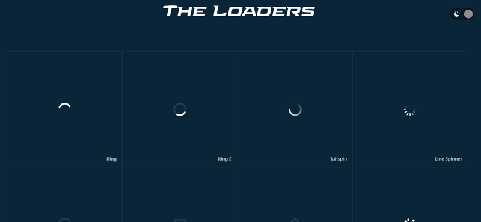
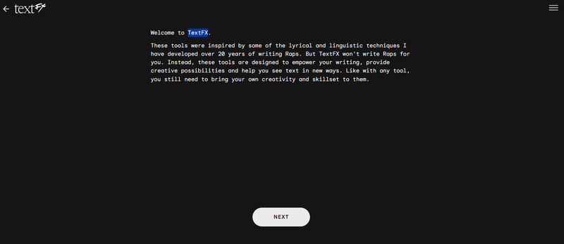
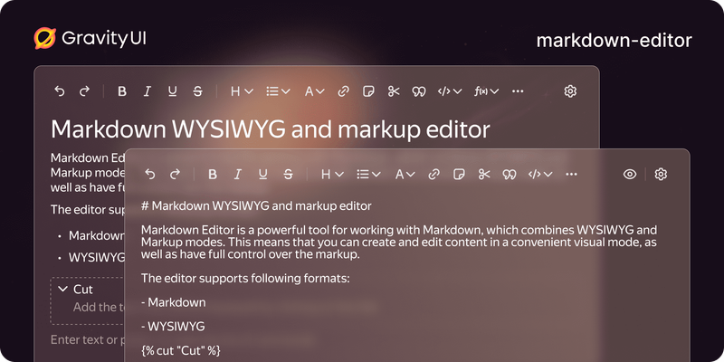
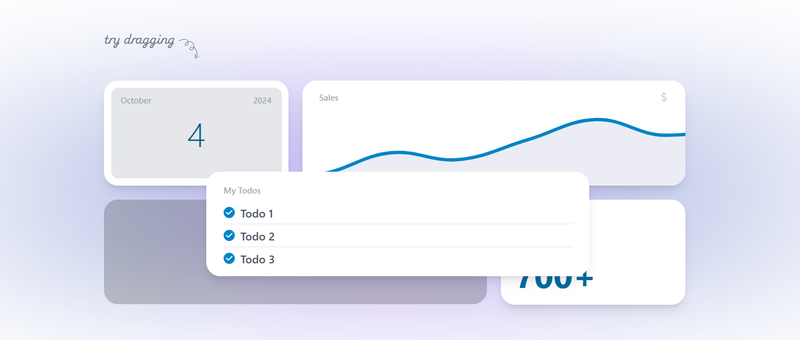

Happy Friday, devs! 🎉 It’s time for our weekly roundup, where we bring you the latest and greatest in the world of web development. Whether you're looking for fresh insights into JavaScript, updates in NodeJS, or useful tools to enhance your workflow, we’ve got it all right here. So, grab a cup of coffee, get comfortable, and let’s dive into another exciting week of coding knowledge!

## 📜 Articles & Tutorials

A script called **ReplicateUI** has been published on [GitHub Gist](https://gist.github.com/markflorkowski/4269bc529324dceb2858c77b7609704c#file-gistfile1-txt), allowing you to copy any website, including all its code and images. Previously, this solution was sold as a browser extension for $10 (https://uireplicator.com/), but now the project's code is available for free.

[How to Build a Chrome-Based Voice Assistant Using JavaScript APIs](https://medium.com/@kenzic/how-to-build-a-chrome-based-voice-assistant-using-javascript-apis-ed2895658eb2)

[Building a Dynamic Background Effect](https://www.letsbuildui.dev/articles/building-a-dynamic-background-effect/)

[Building the Perfect Logo Strip](https://9elements.com/blog/building-the-perfect-logo-strip/)

[Web Components are not Framework Components — and That’s Okay](https://lea.verou.me/blog/2024/wcs-vs-frameworks/)

[Building a breakout element with container units](https://piccalil.li/blog/building-a-breakout-element-with-container-units/)

[How to build a GitHub-style Markdown Editor](https://indiecourses.com/blog/how-to-build-a-github-style-markdown-editor)

[The Proliferation and Problem of the ✨ Sparkles ✨ Icon](https://css-tricks.com/the-proliferation-and-problem-of-the-sparkles-icon/)

[LDRS](https://uiball.com/ldrs/)

Free, open-source loaders and spinners for your next project.
Built with HTML, CSS & SVG, and powered by web components, for maximum compatibility.

[Improving rendering performance with CSS content-visibility](https://nolanlawson.com/2024/09/18/improving-rendering-performance-with-css-content-visibility/)

[Infinity in CSS](https://frontendmasters.com/blog/infinity-in-css/)

[Using Strapi CMS with Neon Postgres and Astro to build a blog](https://neon.tech/guides/strapi-cms)

[Frontend Masters: Solid Principles in React / React Native](https://blog.stackademic.com/react-native-masters-solid-principles-in-react-react-native-a1b8df8d261d)

[How Cloudflare auto-mitigated world record 3.8 Tbps DDoS attack](https://blog.cloudflare.com/how-cloudflare-auto-mitigated-world-record-3-8-tbps-ddos-attack/)

[The Math of Card Shuffling](https://fredhohman.com/card-shuffling/)

[New React 19 Features You Should Know – Explained with Code Examples](https://www.freecodecamp.org/news/new-react-19-features-you-should-know-with-code-examples/)

## ⚒️ Tools

**TextFX** is a versatile text manipulation tool designed for developers, writers, and content creators to enhance their productivity when working with text. It often includes a variety of features that enable users to format, edit, and transform text quickly and efficiently.

[TextFX](https://textfx.withgoogle.com/)

[NetworkManager 1.50](https://networkmanager.dev/)

**NetworkManager** is a utility used in Linux-based operating systems to manage network connections. It simplifies the process of configuring and maintaining network connections, whether wired or wireless, allowing users to connect to networks seamlessly.

[ESLint now officially supports linting of JSON and Markdown](https://eslint.org/blog/2024/10/eslint-json-markdown-support/)

[jiti](https://github.com/unjs/jiti)

Runtime Typescript and ESM support for Node.js

[HTTrack Website Copier](https://github.com/xroche/httrack)

**VRoid Studio** is a free 3D character creation software developed by Pixiv, designed for creating anime-style avatars and characters. It allows users to create, customize, and animate 3D models without needing extensive 3D modeling skills.

[VRoid Studio](https://vroid.com/en/studio)

## 📚 Libs

Markdown Editor

The Russian company Yandex has released **Markdown Editor**, a WYSIWYG and markup editor based on Gravity UI. It's likely one of the best editors on the market.

[Demo](https://gravity-ui.com/libraries/markdown-editor/playground)

[Github](https://github.com/gravity-ui/markdown-editor/)

[Storybook](https://preview.gravity-ui.com/md-editor/)

[Electrico](https://github.com/thomastschurtschenthaler/electrico)

**Electrico** is an experimental App Container for Electron Apps, built with Rust and JavaScript on Wry/Tauri. It uses native Web Views for NodeJS backend and Electron App GUIs, emulating Electron/Node APIs with Rust. Communication between Web Views and Rust is handled via synchronous/asynchronous XMLHttpRequests.

[swapy](https://github.com/TahaSh/swapy)

**Swapy** is a framework-independent tool that transforms any layout into a drag-and-swap interface with minimal code.

[ad :: an adaptable text editor](https://github.com/sminez/)

[Tabulator 6.3](https://tabulator.info/docs/6.3/release)

**Tabulator** is a powerful, open-source JavaScript library for creating interactive, feature-rich data tables. It allows developers to build tables with a wide range of functionality such as sorting, filtering, pagination, and inline editing without much overhead.

## ⌚ Releases

[Code Hike 1.0.1](https://github.com/code-hike/codehike)

**Code Hike** is a tool designed to enhance the presentation of code in technical content, particularly for blog posts, documentation, tutorials, or slide decks. It integrates with modern web frameworks like React and MDX (Markdown + JSX), enabling developers to create interactive and visually appealing code blocks.

[Tauri 2.0 Stable Release](https://v2.tauri.app/blog/tauri-20/)

**Tauri** is a framework for building desktop applications using web technologies like HTML, CSS, and JavaScript. Unlike Electron, which also allows developers to create cross-platform apps using web technologies, Tauri is known for being lightweight, secure, and fast.

[Eleventy v3.0.0 is now available](https://www.11ty.dev/blog/eleventy-v3/)

**Eleventy**, often referred to as 11ty, is a flexible, simple, and powerful static site generator (SSG) for building websites and web applications. It is designed to be easy to use, fast, and highly customizable, making it a popular choice among developers for creating static sites, blogs, and documentation.

[pnpm 9.12](https://github.com/pnpm/pnpm/releases/tag/v9.12.0)

## 📺 Videos

[Encore Crash Course - TypeScript Backend Framework & Toolset](https://www.youtube.com/watch?v=tL01EzN2-xA&ab_channel=TraversyMedia)

[CSS Typography Crash Course](https://www.youtube.com/watch?v=WdBNYcWG0Yg&ab_channel=KevinPowell)

[This is why feature flags are useful](https://www.youtube.com/watch?v=3JtnK4uRbJw&ab_channel=WebDevCody)

[AWS Certified Cloud Practitioner Certification Course (CLF-C02) - Pass the Exam!](https://www.youtube.com/watch?v=NhDYbskXRgc&ab_channel=freeCodeCamp.org)

[Ambient Light Effects | CSS 3D Glowing Pyramid Animation Effects](https://www.youtube.com/watch?v=J2sT05YtScM&ab_channel=OnlineTutorials)

[Front End Portfolio Website Tutorial – Next.js, Three.js, Tailwind CSS](https://www.youtube.com/watch?v=aZZrEE_UsIk&ab_channel=freeCodeCamp.org)

[Build a Full Stack Next.js App with Google Calendar - TypeScript, Drizzle, ShadCN, Tailwind](https://www.youtube.com/watch?v=0Oacr8VrnNk&ab_channel=WebDevSimplified)

[console.log([1, 2, 3].at(-1)) transpiles to 44k](https://www.youtube.com/watch?v=odhjF1obcUo)

As we close out another week, we hope you found some valuable insights and resources in this roundup! Feel free to share your thoughts, favorite links, or any cool projects you're working on in [facebook](https://www.facebook.com/jsdevspace), [twitter](https://twitter.com/jsdevspace), or [telegram](https://t.me/jsdevspace). Enjoy your weekend, recharge, and we’ll see you back here next Friday for more exciting updates and discoveries in the world of development! Happy coding! 🎉
