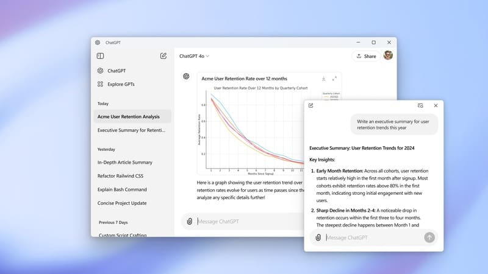
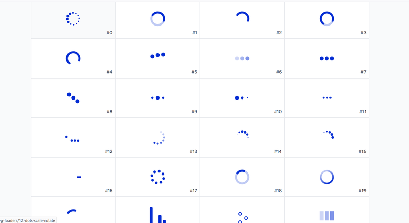
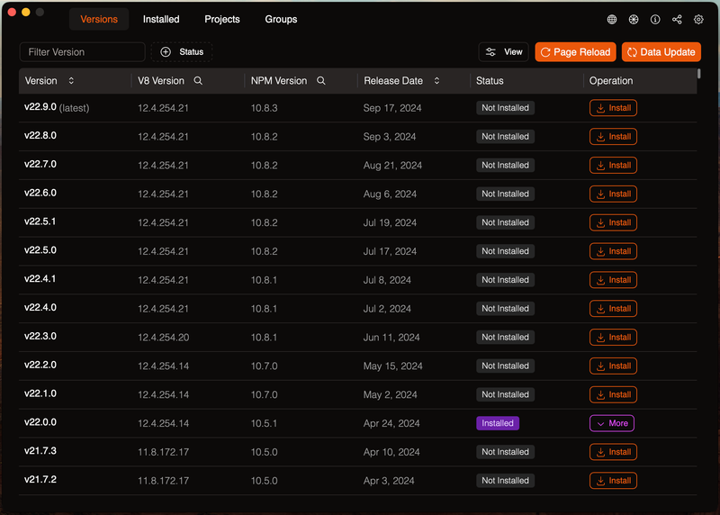
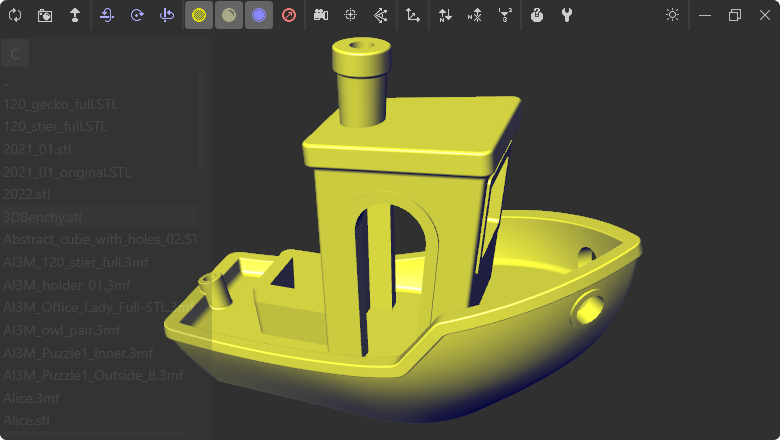
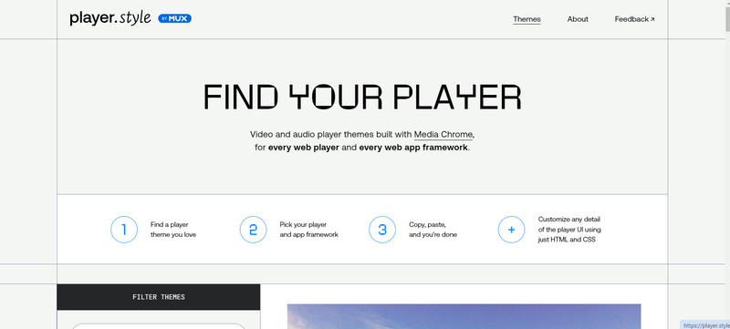
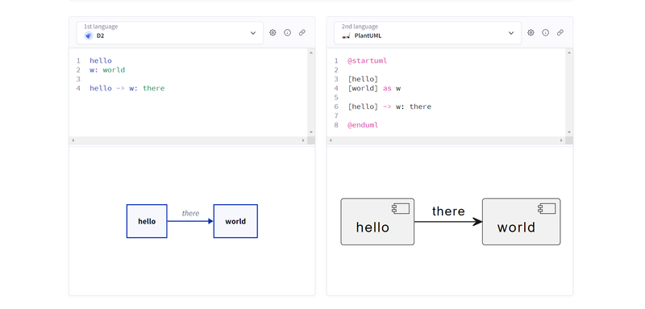
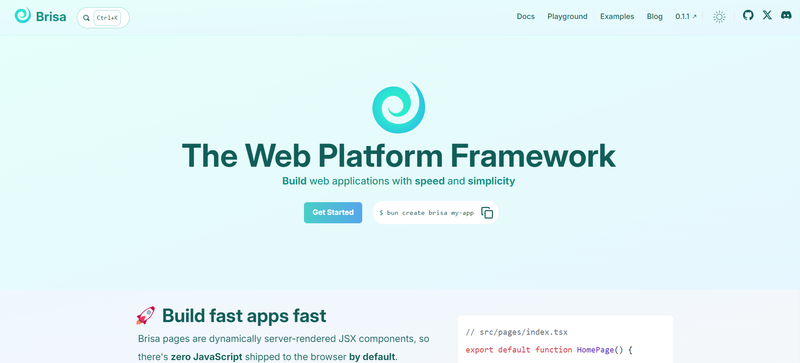
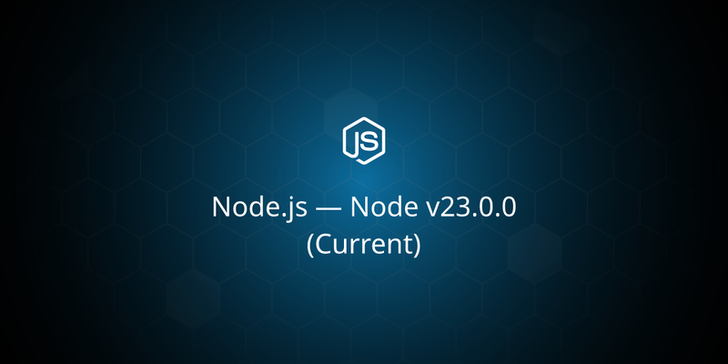
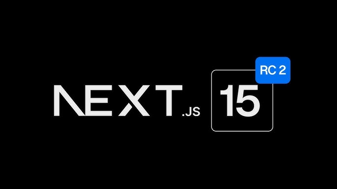

Welcome to Friday Links #7 on JavaScript Development Space! This week, we’ve curated another batch of the most insightful and useful articles, tutorials, and resources for JavaScript developers. Whether you’re a seasoned pro or just starting out, these links will help you stay on top of the latest trends and tools in the world of JavaScript. Grab your favorite beverage, sit back, and enjoy the read!

## ChatGPT Now Available on Windows

OpenAI has [announced](https://x.com/OpenAI/status/1846957067204166113) the launch of a ChatGPT app for Windows, currently in testing.

The app is available to ChatGPT Plus, Team, Enterprise, and Edu users. According to OpenAI, this is an early version ahead of a full release later in the year.

[The ChatGPT Windows app](https://openai.com/chatgpt/download/) works on most Windows 10 computers but has some limitations. It doesn't yet support voice commands or integrations with OpenAI’s GPT Store.

Similar to the macOS app, it can be minimized into a compact window for multitasking, supports file and image uploads, document summaries, and image generation via DALL-E 3.

## 📜 Articles & Tutorials

[How to Build an Image Search Application With OpenAI CLIP & PostgreSQL in JavaScript](https://www.timescale.com/blog/how-to-build-an-image-search-application-with-openai-clip-postgresql-in-javascript/)

[The story of web framework Hono, from the creator of Hono](https://blog.cloudflare.com/the-story-of-web-framework-hono-from-the-creator-of-hono/) - We recently wrote an article about [Hono](https://jsdev.space/hono-backend-cloud/), a lightweight backend framework.

[Time duration in JS](https://docs.timetime.in/blog/time-duration-in-js/)

[Build AI-Assisted blog with AdminForth and Nuxt in 20 minutes](https://adminforth.dev/blog/ai-blog/)

[LocalStorage vs. IndexedDB vs. Cookies vs. OPFS vs. WASM-SQLite](https://rxdb.info/articles/localstorage-indexeddb-cookies-opfs-sqlite-wasm.html)

[Perfecting Text Input: The Art of Subtle Details](https://glama.ai/blog/2024-10-14-craft-is-in-the-small-details)

[GSAP is Joining Webflow](https://gsap.com/blog/webflow-GSAP/)

[Implementing Regular Expressions in TypeScript Types (Badly)](https://skalt.github.io/projects/brzozowski_ts/)

[JavaScript Algorithms](https://github.com/trekhleb/javascript-algorithms)

📝 Algorithms and data structures implemented in JavaScript with explanations and links to further readings

[Grab the color palette from an image using just Javascript](https://lokeshdhakar.com/projects/color-thief/)

[CSS Fan Out with Grid and @property](https://frontendmasters.com/blog/css-fan-out-with-grid-and-property/)

[CSS Tricks That Use Only One Gradient](https://css-tricks.com/css-tricks-that-use-only-one-gradient/)

[Dynamic NestJS Listeners: Discover the Power of Lazy Loading](https://dev.to/this-is-learning/dynamic-nestjs-listeners-discover-the-power-of-lazy-loading-53i2)

[How to use Socket.IO and build your first multiplayer game!](https://geeklore.io/articles/how-to-use-socketio-and-build-your-first-multiplayer-game)

[Creating a Smooth Card-to-Modal Transition with Vanilla JavaScript](https://tahazsh.com/blog/smooth-card-to-modal-transition/)

[Optimizing React Performance: Strategies to Avoid Unnecessary Re-Renders](https://javascript.plainenglish.io/optimizing-react-performance-strategies-to-avoid-unnecessary-re-renders-f8110b4e37b2)

[CSS Anchor Positioning Guide](https://css-tricks.com/css-anchor-positioning-guide/)

[HTML5 Input Types You May Not Be Using](https://blog.openreplay.com/html5-input-types-you-may-not-be-using/)

[Top 3 features in Postgres 17](https://neon.tech/blog/top-3-features-in-postgres-17)

[Component testing in Storybook](https://storybook.js.org/blog/component-testing/)

[Creating 3D effects in CSS](https://blog.logrocket.com/creating-3d-effects-in-css/)

⚒️ Tools

[A CLI tool for seamless management of your Next.js applications](https://quicky.dev/)

[100+ Open Source SVG Loading Indicator Icons](https://magecdn.com/tools/svg-loaders)

[uiprint](https://uiprint.co/)

Get printable wireframes, mockup and sketchpads

[GitHub Actions Price Calculator](https://depot.dev/github-actions-price-calculator)

[Node Version Manager Desktop](https://github.com/1111mp/nvm-desktop)

**Node Version Manager Desktop** is a graphical user interface (GUI) for managing and switching between different versions of Node.js on your system. It simplifies the process of installing, updating, and managing multiple Node.js versions without using the command line, making it ideal for developers who prefer a visual interface to handle their Node.js environment.

[Solid Model Browser](https://github.com/questfulcat/SolidModelBrowser)

**Solid Model Browser** is a tool or application designed to facilitate the visualization, manipulation, and interaction with 3D solid models. It is often used in industries like engineering, manufacturing, and design, allowing users to explore detailed 3D models of objects or parts.

The browser typically supports various formats for 3D models, enabling users to rotate, zoom, and inspect the models from different angles. Some versions may include features like measurement tools, annotations, or support for rendering materials and textures, making it a valuable resource for both professionals and hobbyists working with 3D data.

[Player Style](https://player.style/)

**player.style** refers to the style property of a DOM element with the ID or class player in JavaScript. This property allows you to directly manipulate the inline styles of the element. By accessing player.style, you can modify CSS properties such as width, height, background color, display, and more using JavaScript.

[Text to Diagram](https://text-to-diagram.com/)

[Real-Time HTML/CSS Editor](https://codepen.io/timsamoff/pen/QQrPPy)

## 📚 Libs

[grip](https://github.com/nesterow/grip) - Simplified result/error handling for JavaScript.

[json-translator](https://github.com/samchon/json-translator) - Translate JSON file via Google Translate API with optimization strategies

[unicode-name.js](https://github.com/janlelis/unicode-name.js) - A simple JavaScript function that easily retrieves the name of any Unicode character or Emoji.

[aPulse](https://github.com/ybouane/aPulse) - A One-File Nodejs Server Status Monitoring Tool.

[Searchable Select Web Component](https://www.npmjs.com/package/@salvadorsru/searchable-select)

[OpenVMM](https://github.com/microsoft/openvmm) - A New VMM for Windows and Linux by Microsoft, Written in Rust

[makedown](https://github.com/tzador/makedown) - Organise your shell scripts within executable markdown files

[chatty-v2](https://github.com/dylnbk/chatty-v2) - Streamlit Multi AI Platform Chat App, Written in Python

[Zustand v5](https://github.com/pmndrs/zustand/releases/tag/v5.0.0)

[fast-grid](https://github.com/gabrielpetersson/fast-grid) - World's most performant DOM-based web table.

[nsfwjs](https://github.com/infinitered/nsfwjs) - NSFW detection on the client-side via TensorFlow.js

[qalendar](https://github.com/tomosterlund/qalendar) - The Vue 3 material calendar component

[gateway](https://github.com/adaline/gateway) - The only fully local production-grade Super SDK that provides a simple, unified, and powerful interface for calling more than 200+ LLMs.

[Brisa](https://brisa.build/)

**Brisa** Framework is a web development framework designed to simplify the process of building modern web applications. It offers tools and libraries that help developers create fast, scalable, and maintainable web solutions by streamlining common tasks such as routing, state management, and UI rendering.

The framework focuses on performance and simplicity, providing an intuitive API for developers to quickly prototype and deploy applications. Brisa Framework often integrates well with modern JavaScript libraries and tools like React, Vue, or Node.js, making it flexible for various types of web projects.

[renoun](https://github.com/souporserious/renoun) - Documentation that matches the quality of your product.

## ⌚ Releases

[Node v23.0.0 Released](https://nodejs.org/en/blog/release/v23.0.0)

[Next.js 15 RC 2](https://nextjs.org/blog/next-15-rc2)

[Announcing TypeScript 5.7 Beta](https://devblogs.microsoft.com/typescript/announcing-typescript-5-7-beta/)

[Inkscape launches version 1.4, with powerful new accessible and customizable features](https://inkscape.org/news/2024/10/13/inkscape-launches-version-14-powerful-new-accessib/)

## 📺 Videos

[HTMX for Impatient Devs](https://www.youtube.com/watch?v=TT7SV-bAZyA)

[Project GetMeAChai - Patreon Clone in Next.js | Sigma Web Development Course](https://www.youtube.com/watch?v=QtaorVNAwbI)

[A Practical Guide for Migrating to Server Components](https://gitnation.com/contents/a-practical-guide-for-migrating-to-server-components)

[This new CSS property just solved animating to height auto](https://www.youtube.com/watch?v=JN-nme9oF10)

[Build a Full Stack Next.js App with Google Calendar - TypeScript, Drizzle, ShadCN, Tailwind, Neon](https://www.youtube.com/watch?v=0Oacr8VrnNk&ab_channel=WebDevSimplified)

[AWS Aurora Serverless Overview (Terraform, Global cluster, Multi-region Replica)](https://www.youtube.com/watch?v=otOnCw4EMB0&ab_channel=WebDevCody)

[Create A Booking App From Scratch | React, Next.js, Appwrite, Tailwind](https://www.youtube.com/watch?v=l9zh0pqEHyc&ab_channel=TraversyMedia)

[Dependency Injection, The Best Pattern](https://www.youtube.com/watch?v=J1f5b4vcxCQ&t=5s&ab_channel=CodeAesthetic)

[Build Beautiful Animated Sidebars with React and Framer Motion](https://www.youtube.com/watch?v=ZwF9pxEqErY&ab_channel=TomIsLoading)

[How to Pass Additional Arguments to Next.js Server Actions?](https://www.youtube.com/watch?v=9PBtj0sUc7Q&ab_channel=tapaScriptbyTapasAdhikary)

[Self-Hosting Next.js](https://www.youtube.com/watch?v=sIVL4JMqRfc&ab_channel=leerob)

[This Might Be My New Favourite Auth Library 🔥](https://www.youtube.com/watch?v=Hjs3zM7o7NE&ab_channel=developedbyed)

[How to Build a Onchain Telegram Mini App](https://www.youtube.com/watch?v=ojUSPOwbpWo)

That wraps up Friday Links #7! We hope you found these resources helpful and inspiring for your JavaScript development journey. If you came across any interesting articles or tools this week, feel free to share them with us in the comments below. See you next Friday for another round of must-read JavaScript content!
