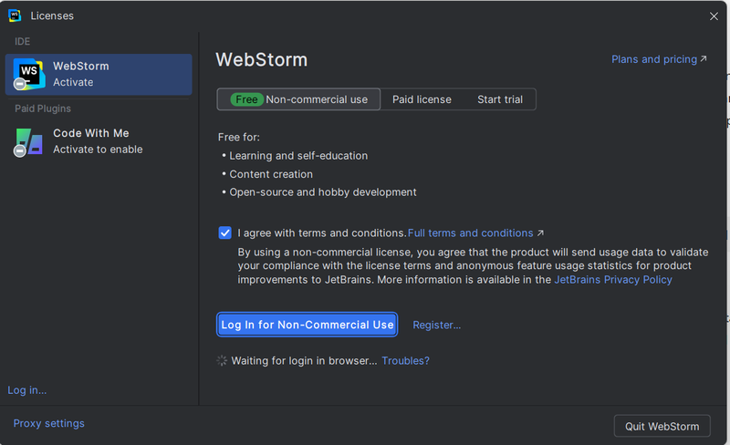

Welcome to Friday Links #8! This week’s roundup brings you the latest and greatest in the JavaScript world. Whether you're looking for helpful libraries, insightful tutorials, or just want to stay updated on new trends and best practices, we’ve got you covered. Grab a coffee, dive into the links below, and supercharge your JavaScript knowledge.

## WebStorm is Free For Non-Commercial Use

**WebStorm** is a powerful IDE for JavaScript and related technologies.
JetBrains has revealed a major update to its licensing model, allowing users to access its popular integrated development environments (IDEs) **WebStorm** and **Rider** for free for non-commercial use.. This allows individual developers, students, and open-source contributors to take advantage of its advanced features, such as intelligent code completion, debugging tools, and seamless integration with version control systems, without any financial commitment. For commercial use, a subscription is required. More info [here](https://blog.jetbrains.com/blog/2024/10/24/webstorm-and-rider-are-now-free-for-non-commercial-use/).

## 📜 Articles & Tutorials

[Generative AI Scripting](https://microsoft.github.io/genaiscript/)

**GenAIScript** by Microsoft is a JavaScript library designed to simplify the creation of AI-powered applications. It provides a seamless interface for integrating large language models (LLMs) into your JavaScript projects, enabling developers to leverage the power of generative AI in web applications. With built-in support for natural language processing, code generation, and automation, GenaScript is ideal for building intelligent applications that can interact with users in natural language, generate content, or automate complex tasks.

[Build A Static RSS Reader To Fight Your Inner FOMO](https://www.smashingmagazine.com/2024/10/build-static-rss-reader-fight-fomo/)

[Lingo: A Go micro language framework for building Domain Specific Languages](https://about.gitlab.com/blog/2022/05/26/a-go-micro-language-framework-for-building-dsls/)

[Rendering Markdown in React without react-markdown](https://glama.ai/blog/2024-10-21-rendering-markdown-in-react)

[Repopack: Pack Your Entire Repository Into A Single File](https://www.trevorlasn.com/blog/repopack)

[git reset vs git revert](https://www.pixelstech.net/article/1549115148-git-reset-vs-git-revert)

[NextJs: Our Journey with Caching](https://nextjs.org/blog/our-journey-with-caching)

[Upgrading React with micro-frontends](https://alexocallaghan.com/upgrading-react-with-microfrontends)

[Understanding React Server Components](https://vercel.com/blog/understanding-react-server-components)

[37 Tips from a Senior Frontend Developer](https://dev.to/_ndeyefatoudiop/37-tips-from-a-senior-frontend-developer-251b)

[Attacking browser extensions](https://github.blog/security/vulnerability-research/attacking-browser-extensions/)

[Building a Perplexity-like Open Source AI Search with SWIRL](https://dev.to/swirl/building-a-perplexity-like-open-source-ai-search-with-swirl-57cl)

## ⚒️ Tools

[AFFiNE](https://github.com/toeverything/AFFiNE)

**AFFiNE** is an open-source, collaborative knowledge base and workspace tool designed for teams and individuals. Combining features of note-taking, task management, and project collaboration, AFFiNE provides a flexible and unified platform for organizing thoughts, managing projects, and working together in real time. Built for productivity, it integrates seamlessly into workflows, allowing users to create, share, and collaborate on documents and tasks efficiently.

[Srcbook](https://github.com/srcbookdev/srcbook/blob/main/README.md)

**Srcbook** is an open-source platform designed for documenting and sharing source code knowledge. It allows developers to write, organize, and present code-related content in a clear and structured way. With a focus on providing detailed technical explanations, tutorials, and documentation, srcbook helps users understand, navigate, and learn from complex codebases. It's ideal for teams or individuals looking to maintain high-quality documentation alongside their development projects.

[sourcebot](https://github.com/sourcebot-dev/sourcebot)

**Sourcebot** is an open-source bot framework designed for building customizable and powerful chatbots. With a focus on flexibility and ease of use, Sourcebot allows developers to create bots that can handle tasks such as automation, moderation, and integration with various services. It supports a modular architecture, enabling users to extend functionality with plugins and tailor the bot's behavior to fit specific needs. Ideal for community management or automated workflows, Sourcebot simplifies the process of building feature-rich bots for different platforms.

[Outstatic](https://github.com/avitorio/outstatic)

**Outstatic** is an open-source CMS and static site generator for Next.js, designed to manage content and publish static websites seamlessly. It allows developers to create and maintain blogs, portfolios, or any static content site with ease, combining the power of Next.js with a simple content management system. With Outstatic, you can manage your site's content via a user-friendly interface while benefiting from the speed and flexibility of static site generation. Ideal for developers looking for a lightweight, self-hosted CMS solution.

[ReadMe-Generator](https://github.com/mainnebula/ReadMe-Generator) - A CLI tool that automatically generates a comprehensive README file for your project.

[solidtime](https://github.com/solidtime-io/solidtime)

**SolidTime** is an open-source JavaScript library designed for working with time and date management in a flexible and intuitive way. It provides a simple API for parsing, formatting, and manipulating dates and times, making it easy for developers to handle complex time-related tasks. SolidTime aims to improve productivity by offering features like time zone support, duration calculations, and date comparisons, all while maintaining a lightweight footprint. Ideal for developers looking to streamline their time handling in web applications, SolidTime is both easy to integrate and use.

## 📚 Libs

[Paint by Text](https://github.com/replicate/paint-by-text)

**Paint by Text** by Replicate is an AI-powered tool that enables users to edit images simply by using text prompts. It allows you to describe changes you want to make to an image, and the tool will modify the image accordingly. This innovative approach eliminates the need for complex image editing software, making it easy to adjust, enhance, or transform images with natural language instructions. Perfect for creatives and developers looking to integrate image editing into projects with AI-driven simplicity.

[Shooketh](https://github.com/steven-tey/shooketh)

**Shooketh** is a lightweight, open-source JavaScript library for detecting and reacting to "shake" gestures on mobile devices. It allows developers to easily implement shake detection in their web applications, enabling unique user interactions or triggering specific actions when a device is shaken. With simple integration and no external dependencies, Shooketh is ideal for adding intuitive, motion-based controls to mobile web experiences.

[Transformers.js v3](https://github.com/huggingface/transformers.js)

**Transformers.js** by Hugging Face is a JavaScript library that brings state-of-the-art machine learning models to the browser and Node.js environments. It allows developers to run pre-trained models directly in JavaScript, supporting tasks such as natural language processing, text generation, translation, and more. Built on top of TensorFlow.js, Transformers.js enables the integration of powerful AI models without the need for server-side processing, making it ideal for interactive web applications and client-side machine learning tasks.

[NextMaster](https://github.com/ethanniser/NextMaster) - A highly performant e-commerce template using Next.js

[Todoctor](https://github.com/azat-io/todoctor) - CLI tool to track and visualize TODO comments in Git repositories and make report

[Emoji-Fallback.js](https://github.com/MarketingPipeline/Emoji-Fallback.js) - Provide support for emojis on ALL web browsers!

[openapi](https://github.com/samchon/openapi) - OpenAPI definitions, converters and LLM function calling application composer.

[qr-code-generator](https://github.com/calinvladth/qr-code-generator) - Generate a QR code with your wifi credentials

[di-wise](https://github.com/exuanbo/di-wise) - Lightweight and flexible dependency injection library for JavaScript and TypeScript, w/wo ECMAScript decorators.

[guitar-chord-diagram](https://github.com/SamDarbonne/guitar-chord-diagram)

## ⌚ Releases

[React Native 0.76](https://reactnative.dev/blog/2024/10/23/release-0.76-new-architecture) - huge release introduces significant updates and improvements to its new architecture. This update focuses on enhancing performance, reliability, and developer experience.

[Turborepo 2.2 released](https://turbo.build/blog/turbo-2-2-0)

[Svelte 5 is alive](https://svelte.dev/blog/svelte-5-is-alive) - The biggest release yet

[ESLint v9.13.0 released](https://eslint.org/blog/2024/10/eslint-v9.13.0-released/)

[Knip Release 5.34.0](https://knip.dev/)

**Knip** is a developer tool designed to analyze your JavaScript and TypeScript projects, helping you identify unused files, dependencies, and exports. By providing insights into unused code, Knip allows you to optimize and clean up your projects, improving performance and maintainability.

[vizzu 0.14](https://lib.vizzuhq.com/latest/)

**Vizzu** is a free, open-source JavaScript/C++ library that generates various chart types and seamlessly animates transitions between them. Ideal for creating static charts, animated data stories, and interactive explorers, Vizzu helps viewers follow data insights through smooth animations.

[Chakra 3.0 Released](https://github.com/chakra-ui/chakra-ui)

## 📺 Videos

[AI SAAS Realtime Video Sharing + Desktop App: AWS, Cloudfront, Nextjs, Electron, Express, Socket.io](https://www.youtube.com/watch?v=3R63m4sTpKo&ab_channel=WebProdigies)

[Build and Deploy a Full Stack AI Todoist Clone: Next.js, Convex & TypeScript](https://www.youtube.com/watch?v=dVN_zN1hZI8&ab_channel=AnkitaKulkarni)

[Drawing with CSS: Pear-shaped blob](https://www.youtube.com/watch?v=YxLIbWpd_9M)

[Build a SaaS Application with NextJs, Stripe, Shadcn UI, TypeScript, Database Functions, Drizzle](https://www.youtube.com/watch?v=wSHwm29QJzI&ab_channel=webdecoded)

[Build a Lesson Plan Generator with Next.js, ShadCN, TypeScript, Prisma, Postgres, Stripe](https://www.youtube.com/watch?v=pXSeA8vmMc8&ab_channel=AlfieWebDev)

[An introduction to Shader Art Coding](https://www.youtube.com/watch?v=f4s1h2YETNY)

[JavaScript might become two languages (and it's dramatic)](https://www.youtube.com/watch?v=m1Sa1Sbyejg)

[Stripe-Inspired Typewriter Animation with React and Framer Motion](https://www.youtube.com/watch?v=-kUXSfNyQt4&ab_channel=TomIsLoading)

[Build Full Stack Doctor Appointment Booking System Using MERN Stack | Complete React JS Project](https://www.youtube.com/watch?v=eRTTlS0zaW8&ab_channel=GreatStack)

That’s all for this week’s Friday Links! We hope you found these resources valuable and are inspired to put some of them to use in your own projects. Stay tuned for more JavaScript tips, tools, and tutorials next week! And as always, feel free to share your own favorite finds in the comments or reach out on social media.
