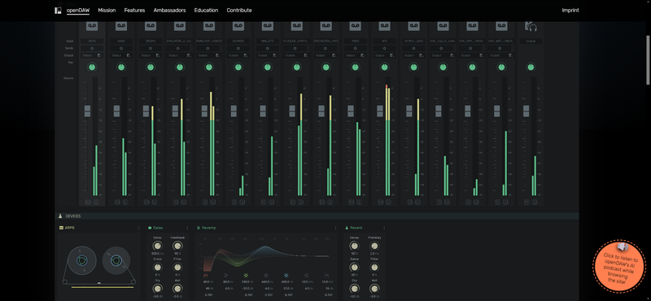
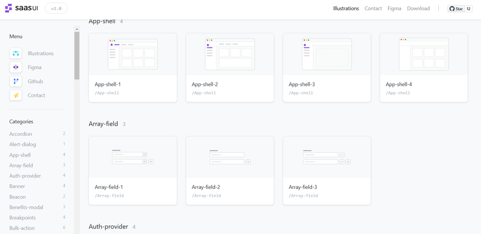

Welcome back to another Friday Links! In this edition, we’re diving into a fresh selection of tools, articles, and resources to help you wrap up the week in style. Whether you’re looking to expand your skills, catch up on industry trends, or just discover something new, this roundup has got you covered.

So grab a coffee, settle in, and explore what this week has to offer!

## GitHub Launches Spark AI Model for Web Application Generation

GitHub has [introduced](https://githubnext.com/projects/github-spark) a new product called Spark, an AI-powered tool that enables anyone to create small web applications (or "sparks") using natural language, without needing programming skills.

GitHub describes GitHub Spark as follows: “It all starts with an idea. In childhood, we have thousands of them—some silly, some crazy. Today, we present GitHub Spark, a product that lets you explore them all. Operating on natural language, it lays the groundwork for our vision—to help 1 billion people become developers. This is about entertainment and personal software, not corporate productivity applications.”

GitHub Spark offers interactive previews, revision options, automatic history tracking, and model selection for development. It is accessible from both desktop and mobile devices and comprises three closely integrated components:

- A natural language-based editor for easily describing and refining application ideas.
- A managed runtime environment that hosts sparks, complete with data storage, theming, and access to large language models (LLM).
- A Progressive Web App (PWA) dashboard for managing and launching sparks from anywhere in the world.
  Micro-applications created with GitHub Spark can be shared with others, granting read-only or read-and-write access. Users can choose from various models, including Claude Sonnet 3.5, GPT-4o, o1-preview, and o1-mini.

In the coming months, GitHub plans to enhance collaboration features, the editor, and the runtime environment, allowing users to perform semantic merging of changes, integrate applications with third-party services, and customize application behavior.

<Youtube id='oM2amcnVmzM' />

## 📜 Articles & Tutorials

[How to Create Filling CSS Loaders Using One Element](https://www.freecodecamp.org/news/filling-css-loaders/)

[🧑‍💻 How I Built the World's Best NextJS, AI Scheduling App 🤖✨](https://dev.to/copilotkit/how-i-built-the-worlds-best-nextjs-ai-scheduling-app-442c)

[Best practices to keep secrets out of GitLab repositories](https://about.gitlab.com/blog/2024/10/31/best-practices-to-keep-secrets-out-of-gitlab-repositories/)

[Simplifying CSS animations with the display and size properties](https://blog.logrocket.com/simplifying-css-animations-display-size-properties/)

[State of CSS 2024 Results](https://css-tricks.com/state-of-css-2024-results/)

[Advanced Next.js caching strategies](https://blog.logrocket.com/advanced-next-js-caching-strategies/)

[Create Beautiful Scroll Animations in Next.js Using Framer Motion](https://shivamkatareblog.hashnode.dev/create-beautiful-scroll-animations-in-nextjs-using-framer-motion)

[The web's clipboard, and how it stores data of different types](https://alexharri.com/blog/clipboard)

[Creating a Dissolve Effect Using SVG](https://glama.ai/blog/2024-10-29-creating-a-dissolve-effect-using-svg)

[Glassmorphism Login Form in HTML and CSS](https://jvcodes.com/glassmorphism-login-form-in-html-and-css/)

[How to Create A Sliding Sidebar Menu with Framer Motion](https://egghead.io/blog/how-to-create-a-sliding-sidebar-menu-with-framer-motion)

[Drag to Select in ReactJS](https://www.joshuawootonn.com/react-drag-to-select)

[Functional Programming in TypeScript](https://dev.to/aelassas/functional-programming-in-typescript-575j)

[Introducing ChatGPT search](https://openai.com/index/introducing-chatgpt-search/)

[HTML Form Validation is heavily underused](https://expressionstatement.com/html-form-validation-is-heavily-underused)

[How we shrunk our Javascript monorepo git size by 94%](https://www.jonathancreamer.com/how-we-shrunk-our-git-repo-size-by-94-percent/)

[How to Create a Secure Newsletter Subscription with NextJS, Supabase, Nodemailer and Arcjet 🔐💯](https://devdojo.com/madzadev/how-to-create-a-secure-newsletter-subscription-with-nextjs-supabase-nodemailer-and-arcjet)

[Creating a Cluster Growth Animation](https://www.kirupa.com/animations/cluster_growth_animation.htm)

[Mastering Relational Database Design: A Comprehensive Guide](https://dev.to/louaiboumediene/mastering-relational-database-design-a-comprehensive-guide-3jh8)

## ⚒️ Tools

**Shotcut 24.10**

In late October 2024, the open-source video editor [Shotcut 24.10](https://www.shotcut.org/) was released. Developed by the creator of MLT, Shotcut utilizes this framework for video editing, with support for various video and audio formats powered by FFmpeg. It also supports plugins compatible with Frei0r and LADSPA for implementing video and audio effects. The project’s source code, written in C++, is available on [GitHub](https://github.com/mltframework/shotcut) under the GPLv3 license, and ready-to-use builds are offered for Linux (AppImage, Flatpak, and Snap), macOS, and Windows.

Shotcut’s features include multitrack editing, allowing users to compose videos from fragments in different formats without prior importing or transcoding. The editor includes built-in tools for creating screencasts, processing webcam footage, and receiving streaming video. Its interface is built with Qt, ensuring a versatile and user-friendly experience.

[openDAW](https://opendaw.org/)

OpenDAW is a collaborative platform designed for music production, offering a range of tools and resources for musicians and audio engineers. It promotes the use of open-source software, enabling users to create, share, and collaborate on audio projects. The platform aims to enhance the creative process by providing an inclusive community and educational resources that empower artists to improve their skills and workflows.

[Text Behind Image](https://textbehindimage.rexanwong.xyz/)

[220+ Illustrations for Your Design Systems and Docs](https://illustrations.saas-ui.dev/)

[Search websites by colors](https://themefinder.io/)

[Claude for Desktop](https://claude.ai/download) - Your AI partner on desktop. Fast, focused, and designed for deep work.

[Neumorphism/Soft UI CSS shadow generator](https://neumorphism.io)

## 📚 Libs

[better-auth](https://github.com/better-auth/better-auth?ref=dailydev) - The most comprehensive authentication library for TypeScript

[ChartDB](https://github.com/chartdb/chartdb)

**ChartDB: How a Self-Hosted Chart Platform Captured the Developer Community**

In an era where data visualization is crucial, **ChartDB** burst onto the open-source scene with remarkable momentum. This self-hosted alternative to popular charting services struck a chord with developers, rocketing from launch to 1,500 GitHub stars in just 72 hours. The project's rapid adoption highlights the growing demand for flexible, self-hosted visualization tools that give developers full control over their data and infrastructure. Let's explore what makes ChartDB stand out and why it's generating such excitement in the developer community.

[lightGallery](https://github.com/sachinchoolur/lightGallery) - A customizable, modular, responsive, lightbox gallery plugin.

[Encore.ts: a new type of framework](https://github.com/encoredev/encore) - Open Source Development Platform for building robust type-safe distributed systems with declarative infrastructure

[react-to-print](https://github.com/MatthewHerbst/react-to-print) - Print React components in the browser. Supports Chrome, Safari, Firefox and EDGE

## ⌚ Releases

[🎉 Announcing nuqs version 2](https://nuqs.47ng.com/blog/nuqs-2)

**Audacity 3.7**

In October 30, 2024, the open-source audio editor [Audacity 3.7](https://support.audacityteam.org/additional-resources/changelog/audacity-3.7) was released, offering tools for editing audio files (Ogg Vorbis, FLAC, MP3, and WAV), recording and digitizing audio, adjusting file parameters, layering tracks, and applying effects (such as noise reduction, tempo, and pitch adjustments) with Master Effects support and FFmpeg 7 integration.

Audacity 3.7 marks the seventh major release since the project became part of Muse Group. The source code is available on [GitHub](https://github.com/audacity/audacity) under the GPLv3 license, with binary builds offered for Linux, Windows, and macOS. The previous stable release, Audacity 3.6, was launched in July 2024.

[Introducing Wasmer 5.0](https://wasmer.io/posts/introducing-wasmer-v5)

## 📺 Videos

[Build a Full Stack Next.js App with Google Calendar - TypeScript, Drizzle, ShadCN, Tailwind, Neon](https://www.youtube.com/watch?v=0Oacr8VrnNk)

[Multilayer Parallax Scroll Animation with HTML and GSAP](https://www.youtube.com/watch?v=tk3ivPgOwpc)

[Learn Turborepo By Example | Code Sharing, Distributed Cache, & More!](https://www.youtube.com/watch?v=nx-cj3dqWNE&ab_channel=MichaelGuay)

[Taking over a website with JWT Tokens!](https://www.youtube.com/watch?v=RmR6cmyLmiI&ab_channel=TechRaj)

[Next.js 15 Crash Course | Build and Deploy a Production-Ready Full Stack App](https://www.youtube.com/watch?v=Zq5fmkH0T78&ab_channel=JavaScriptMastery)

[Next.js API with Hono: The Best Route Handler Alternative!](https://www.youtube.com/watch?v=s7fsZDIVYuQ&t=363s&ab_channel=AMGOUNSTUDIO)

[Build A Full-Stack Social Media App With Next.js 15 (React Query, Lucia Auth, TypeScript, Tailwind)](https://www.youtube.com/watch?v=TyV12oBDsYI&ab_channel=CodinginFlow)

[How To Add Page Transitions To NextJS 14 (including Exit Animations)](https://www.youtube.com/watch?v=fx6KMItwJAw&ab_channel=TomIsLoading)

[Awesome Cubes Animation using CSS & Javascript](https://www.youtube.com/watch?v=D4Yfqd-qNXI&ab_channel=OnlineTutorials)

[Create Crazy 3D Image Slider Effects Using CSS Only](https://www.youtube.com/watch?v=yqaLSlPOUxM&ab_channel=LunDev)

[Build a Fullstack Job Board App with Next.js 14 (react.js, mongo, tailwind)](https://www.youtube.com/watch?v=grxNze3hjAQ&t=668s&ab_channel=CodingWithDawid)

[Create an E-Commerce Store using Next.js 15, Kinde-Auth, Neon, Upstash, Prisma, Stripe](https://www.youtube.com/watch?v=Yr-EmUEYfJA&ab_channel=JanMarshal)

[Recording Videos Using JavaScript And Browser APIs](https://www.youtube.com/watch?v=69Pa1w2gOcU)

That’s a wrap for this week’s Friday Links. Hope you found a few gems to inspire your next project or spark a new idea. Be sure to bookmark any resources you’d like to revisit, and as always, feel free to share your favorites with colleagues and friends.

Have a fantastic weekend, and we’ll see you back here next Friday for more links!
