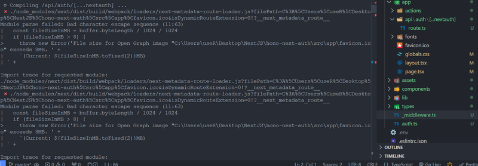

In Next.js 15, a new issue has emerged on Windows platforms. I encountered it myself and went through all the GitHub threads on it. Let's dive into the logs to see what's happening.

## Log Output:

```
○ Compiling /api/auth/[...nextauth] ...
⨯ ./node_modules/next/dist/build/webpack/loaders/next-metadata-route-loader.js?filePath=C%3A%5CUsers%5CuseR%5CDesktop%5CNextJS%5Chono-next-auth%5Csrc%5Capp%5Cfavicon.ico&isDynamicRouteExtension=0!?__next_metadata_route__
Module parse failed: Bad character escape sequence (11:63)
|   const fileSizeInMB = buffer.byteLength / 1024 / 1024
|   if (fileSizeInMB > 8) {
>     throw new Error('File size for Open Graph image "C:\Users\useR\Desktop\NextJS\hono-next-auth\src\app\favicon.ico" exceeds 8MB. ' +
|     `(Current: ${fileSizeInMB.toFixed(2)}MB)
| ` +
```

It’s clear that Webpack is mishandling the standard favicon file as if it were over 8MB in size, likely due to how paths are parsed.



The `"Module parse failed: Bad character escape sequence"` error generally occurs when Webpack or another bundler encounters an invalid character escape in your code. This often happens when using backslashes (`\`) incorrectly, typically in file paths or regular expressions.

Here's an improved step-by-step guide to solving the "Module parse failed: Bad character escape sequence" error in Next.js, particularly if you’re on Windows.

## 1. Remove the favicon.ico file:

- Start by locating and removing the favicon.ico file from your Next.js project (/src/app/). This file can sometimes trigger unexpected issues with path parsing on Windows.
- Run your application again to see if this resolves the error.

## 2. Clear the .next folder:

- The `.next` folder stores build artifacts and cached files. Removing it forces Next.js to recompile everything, potentially clearing up corrupted or outdated caches.
- To delete the folder, navigate to your project’s root directory and delete .next manually, or run:

<div className='code-cmd'>npx rimraf .next</div>

**Restart the development server with:**

<div className='code-cmd'>npm run dev</div>

These steps should help resolve the `"Module parse failed: Bad character escape sequence"` error. If the issue persists, check for any unusual paths in your configuration or dependencies, especially those that may use backslashes (`\`) rather than forward slashes (`/`).

## 3. Verify Your Webpack Configuration

- If the error is thrown by a third-party library, you might need to adjust your Webpack configuration. Adding the `exclude` property to ignore specific libraries might help:

```js
module: {
  rules: [
    {
      test: /\.js$/,
      exclude: /node_modules/,
      use: {
        loader: 'babel-loader',
      },
    },
  ],
},
```

## 4. Check File Encodings

- Sometimes, a non-UTF-8 encoded file might cause this error. Ensure your files are saved in UTF-8 encoding.

## 5. Upgrade Dependencies

- Occasionally, this issue is due to an outdated version of Webpack or related plugins. Check if you can upgrade to the latest versions of Webpack, Babel, and other related tools.

These steps should help you identify and resolve the `"Module parse failed: Bad character escape sequence"` error in your project. Let me know if you need more specific guidance!
