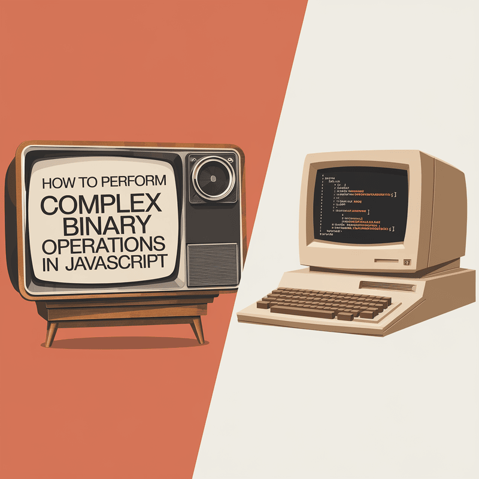

In JavaScript, working with binary data is crucial for handling files, multimedia, cryptography, and other performance-intensive tasks. This article explores JavaScript's key binary-related APIs and how they enable robust data manipulation in browser environments. From creating and converting binary data with `Blob` and `ArrayBuffer` to real-time audio processing and Base64 encoding, this guide covers complex examples demonstrating how to leverage each API effectively. Understanding these tools empowers you to build applications that handle low-level data efficiently in web contexts.



## Binary Data Essentials in JavaScript

### 1. Blob: Binary Large Object for File Handling

`Blob` is a high-level immutable binary data representation in JavaScript, commonly used to store and manipulate multimedia and text files. For instance, when you want to create a downloadable file, Blob allows you to format binary data in a suitable way for browser storage or download.

**Example: Creating and Downloading an Image File**

```js
function downloadImage(dataURL, filename) {
  const byteString = atob(dataURL.split(',')[1]);
  const mimeString = dataURL.split(',')[0].split(':')[1].split(';')[0];
  const arrayBuffer = new ArrayBuffer(byteString.length);
  const uintArray = new Uint8Array(arrayBuffer);
  for (let i = 0; i < byteString.length; i++) {
    uintArray[i] = byteString.charCodeAt(i);
  }
  const blob = new Blob([arrayBuffer], { type: mimeString });
  const link = document.createElement('a');
  link.href = URL.createObjectURL(blob);
  link.download = filename;
  link.click();
}
```

### 2. ArrayBuffer: Mutable Binary Data Buffer

`ArrayBuffer` represents raw binary data and is designed for performance. It allows developers to allocate memory and access it using views (`TypedArray` or `DataView`). This is particularly useful for managing large datasets, such as when parsing complex file formats or handling streamed data.

**Example: Parsing Binary Image Data**

```js
async function fetchImageData(url) {
  const response = await fetch(url);
  const arrayBuffer = await response.arrayBuffer();
  const view = new Uint8Array(arrayBuffer);
  console.log('Image data as Uint8Array:', view);
}
```

### 3. TypedArray and DataView: Fine-Grained Byte Manipulation

`TypedArray` enables precise handling of various binary data types like `Int8Array`, `Uint16Array`, and `Float32Array`. Meanwhile, `DataView` offers flexibility by supporting both big-endian and little-endian access.

**Example: Decoding Audio Samples**

```js
async function processAudioData(url) {
  const response = await fetch(url);
  const arrayBuffer = await response.arrayBuffer();
  const dataView = new DataView(arrayBuffer);
  const samples = [];
  for (let i = 0; i < dataView.byteLength; i += 2) {
    samples.push(dataView.getInt16(i, true));
  }
  console.log('Decoded audio samples:', samples);
}
```

### 4. File and FileReader: Client-Side File Manipulation

`FileReader` lets you read user-uploaded files like binary, JSON, or text.

**Example: Reading a JSON file**

```js
document.getElementById('fileInput').addEventListener('change', e => {
  const file = e.target.files[0];
  const reader = new FileReader();
  reader.onload = e => {
    const jsonData = JSON.parse(e.target.result);
    console.log('Parsed JSON data:', jsonData);
  };
  reader.readAsText(file);
});
```

### 5. Base64 Encoding: Binary-to-Text

Useful for embedding binary data in JSON or HTML.

```js
function arrayBufferToBase64(buffer) {
  let binary = '';
  const bytes = new Uint8Array(buffer);
  for (let b of bytes) binary += String.fromCharCode(b);
  return btoa(binary);
}

function base64ToArrayBuffer(base64) {
  const binary = atob(base64);
  const bytes = new Uint8Array(binary.length);
  for (let i = 0; i < binary.length; i++) bytes[i] = binary.charCodeAt(i);
  return bytes.buffer;
}
```

---

## Advanced Binary Applications

### Real-Time Audio Analysis (Web Audio API)

```js
async function analyzeAudioStream(url) {
  const audioContext = new AudioContext();
  const response = await fetch(url);
  const audioData = await response.arrayBuffer();
  const decoded = await audioContext.decodeAudioData(audioData);

  const analyser = audioContext.createAnalyser();
  const source = audioContext.createBufferSource();
  source.buffer = decoded;
  source.connect(analyser);

  const dataArray = new Uint8Array(analyser.frequencyBinCount);

  function update() {
    analyser.getByteFrequencyData(dataArray);
    console.log(dataArray);
    requestAnimationFrame(update);
  }

  source.start();
  update();
}
```

### Crypto API: Encryption and Decryption

```js
async function encryptData(text, key) {
  const encoded = new TextEncoder().encode(text);
  return crypto.subtle.encrypt({ name: 'AES-GCM', iv: new Uint8Array(12) }, key, encoded);
}
```

---

# BinaryOps Utility Class

```js
class BinaryOps {
  static toBinaryString(num, bits = 32) {
    return (num >>> 0).toString(2).padStart(bits, '0');
  }

  static rotateLeft(num, shifts, bits = 32) {
    shifts %= bits;
    return ((num << shifts) | (num >>> (bits - shifts))) >>> 0;
  }

  static rotateRight(num, shifts, bits = 32) {
    shifts %= bits;
    return ((num >>> shifts) | (num << (bits - shifts))) >>> 0;
  }

  static popCount(num) {
    let count = 0;
    while (num) {
      count += num & 1;
      num >>>= 1;
    }
    return count;
  }

  static getMSBPosition(num) {
    return num === 0 ? -1 : 31 - Math.clz32(num);
  }

  static getLSBPosition(num) {
    return num === 0 ? -1 : Math.log2(num & -num) | 0;
  }

  static createMask(length) {
    return (1 << length) - 1;
  }

  static extractBits(num, start, length) {
    return (num >>> start) & this.createMask(length);
  }

  static setBits(num, value, start, length) {
    const mask = this.createMask(length) << start;
    return (num & ~mask) | ((value << start) & mask);
  }
}
```

---

## Conclusion

JavaScript provides a powerful toolkit for binary manipulation — from blobs, buffers, typed arrays, file handling to encryption, audio processing, and bitwise utilities. Mastering these APIs enables creation of efficient, performance-critical apps that operate on binary data.
