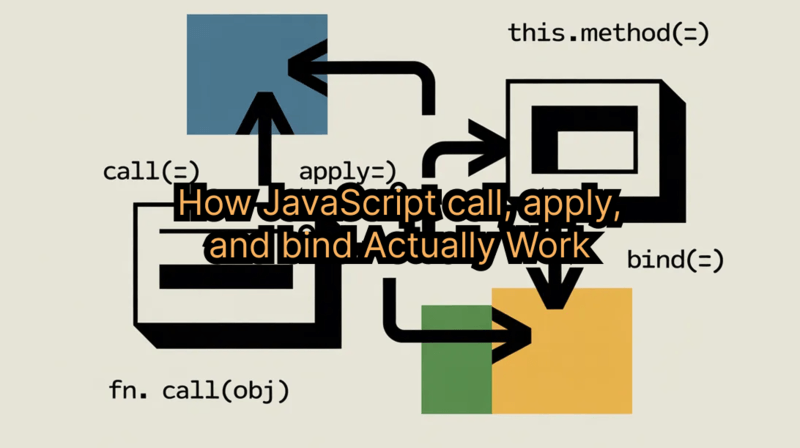

JavaScript gives functions a strange amount of power.



A function can be called directly. It can be stored in a variable. It can be passed into another function. It can become a method of an object. It can be used as a constructor. It can even be executed with a completely different `this` value from the one you expected.

That flexibility is one of the reasons JavaScript is so expressive. It is also one of the reasons `this` has confused developers for decades.

The methods `call`, `apply`, and `bind` sit right in the middle of that confusion. Most developers know their surface-level syntax:

```js
functionName.call(context, arg1, arg2)
functionName.apply(context, [arg1, arg2])
const boundFunction = functionName.bind(context, arg1)
```

But syntax is not understanding.

Real understanding starts when you can explain why these APIs exist, what invocation rules they rely on, how to implement simplified versions yourself, and where the edge cases begin.

This article takes a deep look at `call`, `apply`, `bind`, and `arguments` from the perspective of JavaScript language mechanics. The goal is not to memorize another interview trick. The goal is to understand what actually happens when a function is invoked.

## Why These APIs Exist

The main problem solved by `call`, `apply`, and `bind` is context control.

In JavaScript, `this` is not determined only by where a function is written. For regular functions, `this` is mainly determined by how the function is called.

That is the part many developers miss.

Consider this function:

```js
function showCurrentUser() {
  console.log(this.username)
}
```

There is no permanent `this` value inside this function. The value depends on the invocation pattern.

Call it directly:

```js
showCurrentUser()
```

In non-strict browser code, `this` may point to `window`. In strict mode, `this` will be `undefined`.

Call it as an object method:

```js
const account = {
  username: 'Maya',
  showCurrentUser,
}

account.showCurrentUser()
```

Now `this` points to `account`.

Call it with `call`:

```js
showCurrentUser.call({ username: 'Nina' })
```

Now `this` points to the object passed into `call`.

Same function. Different result. Different invocation.

That is why the best mental model is this:

> Most `this` bugs are invocation bugs.

Not declaration bugs. Not class bugs. Not file structure bugs. Invocation bugs.

## The Binding Rules Behind `this`

Before implementing `call`, `apply`, or `bind`, we need to understand the binding rules they interact with.

JavaScript has several important ways to determine `this`.

### Default Binding

Default binding happens when a regular function is called without an owning object.

```js
function printContext() {
  console.log(this)
}

printContext()
```

In strict mode, `this` is `undefined`.

```js
'use strict'

function printContext() {
  console.log(this)
}

printContext() // undefined
```

In older non-strict browser code, `this` can fall back to the global object.

Modern code should avoid relying on this behavior. It is fragile and often different between environments.

### Implicit Binding

Implicit binding happens when a function is called as a property of an object.

```js
const dashboard = {
  title: 'Admin Panel',
  printTitle() {
    console.log(this.title)
  },
}

dashboard.printTitle()
```

The call expression is:

```js
dashboard.printTitle()
```

Because the function is called through `dashboard`, JavaScript binds `this` to `dashboard`.

This rule is extremely important because a simplified implementation of `call` can exploit it.

### Explicit Binding

Explicit binding happens when you use `call`, `apply`, or `bind`.

```js
function printRole() {
  console.log(this.role)
}

printRole.call({ role: 'editor' })
```

Here, the function is not called as a method of the object. We explicitly provide the object that should become `this`.

That is the purpose of `call` and `apply`: execute a function immediately with a chosen `this` value.

`bind` also chooses a `this` value, but it does not execute immediately. It returns a new function that remembers the chosen context.

### Constructor Binding

Constructor binding happens when a function is called with `new`.

```js
function Product(name) {
  this.name = name
}

const book = new Product('JavaScript Guide')
```

When `new Product(...)` runs, JavaScript creates a new object and binds `this` to that new object during the constructor call.

This matters because constructor binding has higher priority than a simple bound context. A complete `bind` polyfill must handle this case. Many simplified examples do not.

## The Basic Difference Between call, apply, and bind

At a high level, the three APIs differ in two ways:

1. Whether the function executes immediately.
2. How arguments are passed.

```js
fn.call(context, arg1, arg2, arg3)
fn.apply(context, [arg1, arg2, arg3])
const later = fn.bind(context, arg1, arg2)
```

`call` executes immediately and receives arguments one by one.

`apply` executes immediately and receives arguments as an array-like list.

`bind` does not execute immediately. It returns a new function with a fixed context and optional preset arguments.

That sounds simple, but the real mechanics are more interesting.

## Implementing a Simple call

Let us start from scratch.

All functions inherit from `Function.prototype`, so we can add our own method there for educational purposes.

Do not patch built-in prototypes in production code. This is only for learning.

```js
Function.prototype.runNow = function () {
  console.log('custom method executed')
}

function calculateTotal() {
  console.log('original function executed')
}

calculateTotal.runNow()
```

This prints:

```txt
custom method executed
```

But it does not execute `calculateTotal` itself.

Inside `runNow`, what does `this` refer to?

```js
Function.prototype.runNow = function () {
  console.log(this)
}

calculateTotal.runNow()
```

The value of `this` is the function that called `runNow`. In this case, `calculateTotal`.

That means we can execute it:

```js
Function.prototype.runNow = function () {
  const targetFunction = this
  return targetFunction()
}
```

Now:

```js
function sayHello() {
  return 'Hello'
}

console.log(sayHello.runNow())
```

Output:

```txt
Hello
```

We have recreated the first part of `call`: invoking the function through a prototype method.

Now we need to control `this`.

## How call Changes this

Suppose we want this behavior:

```js
function printUser() {
  console.log(this.name)
}

printUser.call({ name: 'Sophia' })
```

The function should run with `this` pointing to the object `{ name: 'Sophia' }`.

How can we force that manually?

We can use implicit binding.

If we attach the function to the object temporarily, then call it as a method, JavaScript will bind `this` to that object.

```js
const user = { name: 'Sophia' }
user.temporaryMethod = printUser
user.temporaryMethod()
delete user.temporaryMethod
```

That is the core trick.

A first implementation looks like this:

```js
Function.prototype.customCall = function (context) {
  const targetFunction = this

  context.temporaryMethod = targetFunction
  const result = context.temporaryMethod()
  delete context.temporaryMethod

  return result
}
```

Usage:

```js
function printUser() {
  console.log(this.name)
}

printUser.customCall({ name: 'Sophia' })
```

Output:

```txt
Sophia
```

The implementation works because it converts an explicit binding problem into an implicit binding call.

Instead of calling:

```js
printUser()
```

we temporarily call:

```js
context.temporaryMethod()
```

Now JavaScript naturally sets `this` to `context`.

## Handling null, undefined, and Primitive Values

The simple implementation has problems.

What happens here?

```js
printUser.customCall(null)
```

Or here?

```js
printUser.customCall('hello')
```

The value `null` cannot receive properties. Neither can `undefined`.

Primitive values like strings and numbers are not normal objects either. JavaScript can temporarily wrap them using object wrappers.

For example:

```js
Object('hello')
Object(42)
Object(true)
```

These create wrapper objects.

So we can improve the implementation:

```js
Function.prototype.customCall = function (context, ...args) {
  const targetFunction = this

  const resolvedContext = context == null
    ? globalThis
    : Object(context)

  const methodKey = Symbol('temporaryMethod')

  resolvedContext[methodKey] = targetFunction
  const result = resolvedContext[methodKey](...args)
  delete resolvedContext[methodKey]

  return result
}
```

This version adds three important improvements.

First, it handles `null` and `undefined` by falling back to `globalThis`.

Second, it wraps primitive values with `Object(context)`.

Third, it uses `Symbol` instead of a plain property name. That avoids accidentally overwriting an existing property called `temporaryMethod`.

Example:

```js
function describePurchase(product, price) {
  return `${this.customer} bought ${product} for $${price}`
}

const message = describePurchase.customCall(
  { customer: 'Lena' },
  'keyboard',
  120
)

console.log(message)
```

Output:

```txt
Lena bought keyboard for $120
```

This is now a useful simplified implementation of `call`.

## Why call Must Receive Arguments Immediately

A common misunderstanding is thinking you can separate `this` binding from argument passing.

For example:

```js
calculate.call(orderContext)
calculate(10, 20)
```

This does not work.

Each function call creates its own invocation. The `this` value belongs to that specific invocation.

When `calculate.call(orderContext)` finishes, that invocation is over.

The next line:

```js
calculate(10, 20)
```

is a completely separate call with its own `this` rules.

That is why `call` accepts arguments in the same expression:

```js
calculate.call(orderContext, 10, 20)
```

The context and the parameters must belong to the same invocation.

## Implementing apply

Once `customCall` is clear, `apply` is easy.

The only difference is argument shape.

`call` receives arguments individually:

```js
fn.call(context, a, b, c)
```

`apply` receives them as an array or array-like value:

```js
fn.apply(context, [a, b, c])
```

A simplified `customApply` implementation:

```js
Function.prototype.customApply = function (context, argsArray) {
  const targetFunction = this

  const resolvedContext = context == null
    ? globalThis
    : Object(context)

  const methodKey = Symbol('temporaryMethod')

  resolvedContext[methodKey] = targetFunction

  const finalArgs = argsArray == null
    ? []
    : Array.from(argsArray)

  const result = resolvedContext[methodKey](...finalArgs)

  delete resolvedContext[methodKey]

  return result
}
```

Usage:

```js
function formatInvoice(currency, amount, status) {
  return `${this.invoiceId}: ${currency}${amount} (${status})`
}

const invoiceText = formatInvoice.customApply(
  { invoiceId: 'INV-2026-001' },
  ['$', 199, 'paid']
)

console.log(invoiceText)
```

Output:

```txt
INV-2026-001: $199 (paid)
```

The implementation is nearly the same as `customCall`.

That is the lesson.

`call` and `apply` are not two completely different concepts. They are the same explicit binding mechanism with different argument formats.

## Why apply Was More Important Before Spread Syntax

Before modern JavaScript introduced spread syntax, `apply` was the common way to pass an array of values into a function that expected separate arguments.

Classic example:

```js
const scores = [17, 41, 9, 88, 23]

const highestScore = Math.max.apply(null, scores)
```

Today we usually write:

```js
const highestScore = Math.max(...scores)
```

The modern version is easier to read.

Still, `apply` remains important for understanding older code, library internals, dynamic invocation, and method borrowing.

## Implementing bind

`bind` is different from `call` and `apply`.

It does not execute immediately.

Instead, it returns a new function.

```js
function printName() {
  console.log(this.name)
}

const printAdminName = printName.bind({ name: 'Admin' })

printAdminName()
```

The call to `bind` prepares a future call. The returned function remembers the context.

A basic implementation looks like this:

```js
Function.prototype.customBind = function (context, ...presetArgs) {
  const targetFunction = this

  return function boundFunction(...runtimeArgs) {
    const resolvedContext = context == null
      ? globalThis
      : Object(context)

    const methodKey = Symbol('temporaryMethod')

    resolvedContext[methodKey] = targetFunction

    const result = resolvedContext[methodKey](
      ...presetArgs,
      ...runtimeArgs
    )

    delete resolvedContext[methodKey]

    return result
  }
}
```

Example:

```js
function createShippingLabel(country, city, street) {
  return `${this.storeName}: ${street}, ${city}, ${country}`
}

const createStoreLabel = createShippingLabel.customBind(
  { storeName: 'Remazon' },
  'Israel'
)

console.log(createStoreLabel('Jerusalem', 'Jaffa Street'))
```

Output:

```txt
Remazon: Jaffa Street, Jerusalem, Israel
```

Here `bind` does two things:

1. It fixes `this` to `{ storeName: 'Remazon' }`.
2. It presets the first argument, `'Israel'`.

The remaining arguments are provided later.

## bind as Partial Application

`bind` is often introduced as a way to fix `this`, but that is only half of the story.

It can also preset arguments.

```js
function multiply(left, right) {
  return left * right
}

const double = multiply.bind(null, 2)

console.log(double(10))
console.log(double(21))
```

Output:

```txt
20
42
```

This is partial application.

You create a more specific function from a more general one.

Another example:

```js
function buildApiUrl(baseUrl, version, resource) {
  return `${baseUrl}/api/${version}/${resource}`
}

const buildV1Url = buildApiUrl.bind(
  null,
  'https://example.com',
  'v1'
)

console.log(buildV1Url('users'))
console.log(buildV1Url('orders'))
```

Output:

```txt
https://example.com/api/v1/users
https://example.com/api/v1/orders
```

This is not only a `this` trick. It is a function configuration pattern.

## The Constructor Edge Case in bind

A simplified `bind` implementation is enough to understand the idea, but it is not fully compatible with native behavior.

The biggest missing piece is constructor behavior.

Consider this:

```js
function User(name) {
  this.name = name
}

const BoundUser = User.bind({ name: 'Wrong' })

const user = new BoundUser('Correct')

console.log(user.name)
```

Native JavaScript prints:

```txt
Correct
```

Why?

Because when a bound function is called with `new`, the newly created object becomes `this`. The bound context is ignored for that constructor call.

A more advanced educational implementation needs to detect constructor usage:

```js
Function.prototype.customBindAdvanced = function (context, ...presetArgs) {
  const targetFunction = this

  function boundFunction(...runtimeArgs) {
    const isConstructorCall = this instanceof boundFunction

    const finalContext = isConstructorCall
      ? this
      : context == null
        ? globalThis
        : Object(context)

    return targetFunction.apply(
      finalContext,
      [...presetArgs, ...runtimeArgs]
    )
  }

  boundFunction.prototype = Object.create(targetFunction.prototype)

  return boundFunction
}
```

This version is still educational, not a complete spec-perfect polyfill. But it demonstrates the important principle:

> `new` has its own binding behavior, and native `bind` respects it.

That is why “just return a wrapper function” is not the whole story.

## Understanding arguments

Now let us switch to `arguments`.

Before rest parameters became common, `arguments` was the standard way to access all arguments passed into a function.

```js
function inspectArguments() {
  console.log(arguments)
  console.log(arguments.length)
  console.log(arguments[0])
}

inspectArguments('red', 'green', 'blue')
```

`arguments` looks like an array, but it is not a real array.

It is array-like.

That means it has:

- numeric indexes
- a `length` property

But it does not have normal array methods like:

- `map`
- `filter`
- `reduce`
- `forEach`

This fails:

```js
function brokenExample() {
  return arguments.map(value => value.toUpperCase())
}
```

Because `arguments.map` does not exist.

## Converting arguments to an Array

The classic conversion uses `slice` and `call`:

```js
function collectValues() {
  const values = Array.prototype.slice.call(arguments)
  return values
}
```

This looks strange until you understand method borrowing.

`slice` expects an array-like `this` value. By using `call`, we force `slice` to operate on `arguments`.

In other words:

```js
Array.prototype.slice.call(arguments)
```

means:

> Run the array `slice` method, but treat `arguments` as the array-like object to slice.

Modern JavaScript gives us better options:

```js
function collectValues() {
  return Array.from(arguments)
}
```

Or:

```js
function collectValues() {
  return [...arguments]
}
```

But the cleanest version is usually rest parameters:

```js
function collectValues(...values) {
  return values
}
```

Now `values` is a real array from the beginning.

## Why Arrow Functions Do Not Have arguments

Arrow functions do not create their own `this`.

They also do not create their own `arguments`.

This is intentional.

Regular functions create their own invocation context:

```js
function outerFunction() {
  function innerFunction() {
    console.log(arguments)
  }

  innerFunction('inner value')
}

outerFunction('outer value')
```

`innerFunction` has its own `arguments` object.

Arrow functions behave differently:

```js
function outerFunction() {
  const innerArrow = () => {
    console.log(arguments)
  }

  return innerArrow
}

const run = outerFunction('outer value')

run('runtime value')
```

The arrow function does not receive its own `arguments`. It reads `arguments` from the surrounding regular function.

That is lexical behavior.

A regular function asks:

> How was I called?

An arrow function asks:

> Where was I created?

That difference also explains arrow function `this` behavior.

## Rest Parameters Are the Modern Replacement

In new code, prefer rest parameters over `arguments`.

Instead of this:

```js
function sumNumbers() {
  const numbers = Array.from(arguments)

  return numbers.reduce((total, value) => total + value, 0)
}
```

write this:

```js
function sumNumbers(...numbers) {
  return numbers.reduce((total, value) => total + value, 0)
}
```

Rest parameters are clearer, safer, and produce a real array.

They also work naturally with arrow functions:

```js
const sumNumbers = (...numbers) => {
  return numbers.reduce((total, value) => total + value, 0)
}
```

No legacy `arguments` object required.

## Practical Differences Between call, apply, and bind

Here is the practical comparison.

| Feature | call | apply | bind |
| --- | --- | --- | --- |
| Changes `this` | Yes | Yes | Yes |
| Executes immediately | Yes | Yes | No |
| Returns a new function | No | No | Yes |
| Accepts arguments one by one | Yes | No | Yes |
| Accepts arguments as an array | No | Yes | No |
| Supports preset arguments | No | No | Yes |

Use `call` when you know the arguments and want immediate execution.

Use `apply` when your arguments are already stored in an array-like structure.

Use `bind` when you want delayed execution, stable context, or preset arguments.

## Real-World Use Cases

### Fixing Lost Context in Callbacks

A classic issue:

```js
const cart = {
  items: ['keyboard', 'mouse'],

  printItems() {
    console.log(this.items)
  },
}

const handler = cart.printItems
handler()
```

The function was copied out of the object. The original owner is gone. The invocation is now plain function execution.

Fix it with `bind`:

```js
const handler = cart.printItems.bind(cart)
handler()
```

Now the context is stable.

### Borrowing Methods

You can borrow array methods for array-like objects.

```js
const listLike = {
  0: 'first',
  1: 'second',
  length: 2,
}

Array.prototype.forEach.call(listLike, item => {
  console.log(item)
})
```

This works because `forEach` only needs a length and numeric indexes.

### Building Specialized Functions

`bind` is useful for creating preconfigured utilities.

```js
function logMessage(level, source, message) {
  console.log(`[${level}] [${source}] ${message}`)
}

const logAuthError = logMessage.bind(null, 'ERROR', 'auth')

logAuthError('Invalid token')
logAuthError('Session expired')
```

Output:

```txt
[ERROR] [auth] Invalid token
[ERROR] [auth] Session expired
```

This is cleaner than repeating the same parameters everywhere.

## Common Pitfalls

### Losing this by Destructuring

```js
const userService = {
  currentUser: 'Alex',

  printUser() {
    console.log(this.currentUser)
  },
}

const { printUser } = userService

printUser()
```

Destructuring removes the method from its owner. The call no longer looks like:

```js
userService.printUser()
```

So implicit binding no longer applies.

Fix:

```js
const printUser = userService.printUser.bind(userService)
```

### Using Arrow Functions as Object Methods

This usually does not do what people expect:

```js
const settings = {
  theme: 'dark',
  printTheme: () => {
    console.log(this.theme)
  },
}

settings.printTheme()
```

Arrow functions do not bind `this` from the call site. They capture `this` from the surrounding lexical scope.

For object methods, prefer regular method syntax:

```js
const settings = {
  theme: 'dark',
  printTheme() {
    console.log(this.theme)
  },
}
```

### Forgetting That bind Returns a New Function

This does nothing useful:

```js
button.addEventListener('click', cart.checkout.bind(cart))
button.removeEventListener('click', cart.checkout.bind(cart))
```

Each `bind` call creates a new function reference. The function passed to `removeEventListener` is not the same one that was registered.

Store it:

```js
const boundCheckout = cart.checkout.bind(cart)

button.addEventListener('click', boundCheckout)
button.removeEventListener('click', boundCheckout)
```

## Engineering Takeaways

The biggest lesson is not that `call`, `apply`, and `bind` exist.

The biggest lesson is that JavaScript function behavior depends on invocation mechanics.

Once you understand that, many confusing patterns become predictable.

`call` and `apply` are immediate explicit invocation tools.

`bind` is a deferred invocation tool.

`arguments` is a legacy array-like object.

Rest parameters are the modern replacement.

Arrow functions are lexical and intentionally avoid their own `this` and `arguments`.

And most importantly:

> `this` is not about where a function lives. It is about how a function is called.

That single idea explains a huge part of JavaScript.

## Final Thoughts

You can use `call`, `apply`, and `bind` after reading a short documentation page.

But mastering them requires a deeper question:

> What is JavaScript doing at invocation time?

When you can answer that, the APIs stop feeling like isolated tricks.

They become different interfaces over the same underlying model: function execution, context selection, and argument forwarding.

That knowledge transfers everywhere: React handlers, framework internals, utility functions, older codebases, interview questions, and debugging sessions where `this` suddenly points to the wrong thing.

You do not need to handwrite these methods in production.

But implementing them once is valuable because it reveals the language beneath the API.

And once you see that layer, JavaScript becomes much easier to reason about.