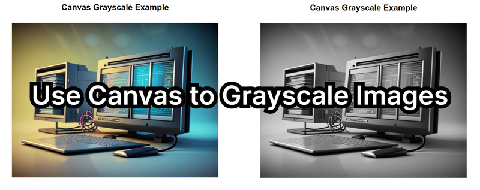

When working with web applications that manipulate images, applying effects like grayscale can enhance the user experience or serve functional needs. HTML5’s `<canvas>` element lets you process images directly in the browser with full pixel-level control — no external libraries required. This guide shows how to convert any image to grayscale, toggle effects interactively, and optimize performance.



## How Canvas Enables Pixel Manipulation

The `<canvas>` API allows JavaScript to draw graphics, text, and images. Once an image is drawn on a canvas, its pixels can be read and modified using:

- `getImageData()` → reads pixels (RGBA)
- `putImageData()` → writes pixels back
- `drawImage()` → renders images onto canvas

To grayscale an image, we:

1. Load the image.
2. Draw it to canvas.
3. Read its pixels.
4. Apply a grayscale formula.
5. Re-render the updated pixels.

---

## 1. HTML Setup

```html
<canvas id="imageCanvas" width="800" height="600"></canvas>
<script src="script.js"></script>
```

---

## 2. Load the Image onto Canvas

```js
const canvas = document.getElementById('imageCanvas');
const ctx = canvas.getContext('2d');

const img = new Image();
img.src = 'path-to-your-image.jpg';

img.onload = () => {
  ctx.drawImage(img, 0, 0, canvas.width, canvas.height);
};
```

---

## 3. Extract Pixel Data

```js
const imageData = ctx.getImageData(0, 0, canvas.width, canvas.height);
const data = imageData.data; // RGBA sequence
```

Each pixel takes **4 values**:

| Index | Meaning |
|-------|---------|
| i     | Red     |
| i+1   | Green   |
| i+2   | Blue    |
| i+3   | Alpha   |

---

## 4. Convert Pixels to Grayscale

Using the **luminosity formula**, which simulates human perception:

```js
for (let i = 0; i < data.length; i += 4) {
  const red = data[i];
  const green = data[i + 1];
  const blue = data[i + 2];

  const gray = 0.3 * red + 0.59 * green + 0.11 * blue;

  data[i] = gray;
  data[i + 1] = gray;
  data[i + 2] = gray;
}
ctx.putImageData(imageData, 0, 0);
```

---

## 5. Add Interactivity (Optional)

```html
<button id="grayscaleBtn">Grayscale</button>
<button id="resetBtn">Reset</button>
```

```js
grayscaleBtn.addEventListener('click', () => {
  for (let i = 0; i < data.length; i += 4) {
    const gray = 0.3 * data[i] + 0.59 * data[i + 1] + 0.11 * data[i + 2];
    data[i] = data[i + 1] = data[i + 2] = gray;
  }
  ctx.putImageData(imageData, 0, 0);
});

resetBtn.addEventListener('click', () =>
  ctx.drawImage(img, 0, 0, canvas.width, canvas.height)
);
```

---

## 6. Alternative: CSS Grayscale Filter

Not pixel-level, but instant:

```css
canvas {
  filter: grayscale(100%);
}
```

---

## 7. Advanced Grayscale Variations

### Slight sepia effect

```js
data[i] = gray * 1.2;
data[i + 1] = gray * 1.05;
data[i + 2] = gray * 0.9;
```

### Brightness-adjusted grayscale

```js
const gray = (red + green + blue) / 3;
const boosted = gray * 1.15;
```

---

## 8. Performance Tips

- Use **Web Workers** for heavy pixel loops.
- Lower canvas size when high detail isn’t needed.
- Preload images for smoother UI.
- Batch updates — avoid frequent repeated `putImageData()` calls.

---

## 9. Complete Working Example (Copy‑Paste Ready)

```html
<!DOCTYPE html>
<html lang="en">
  <head>
    <meta charset="UTF-8" />
    <meta name="viewport" content="width=device-width, initial-scale=1.0" />
    <title>Canvas Grayscale Example</title>
    <style>
      body { font-family: Arial; text-align: center; margin: 20px; }
      canvas { border: 1px solid #ccc; margin-top: 20px; }
      button { padding: 10px 20px; margin: 10px; cursor: pointer; }
    </style>
  </head>
  <body>
    <h1>Canvas Grayscale Example</h1>

    <canvas id="imageCanvas" width="800" height="600"></canvas>
    <br />
    <button id="grayscaleBtn">Apply Grayscale</button>
    <button id="resetBtn">Reset Image</button>

    <script>
      const canvas = document.getElementById('imageCanvas');
      const ctx = canvas.getContext('2d');

      const img = new Image();
      img.src = 'pic.png';

      img.onload = () => {
        ctx.drawImage(img, 0, 0, canvas.width, canvas.height);
      };

      grayscaleBtn.onclick = () => {
        const imageData = ctx.getImageData(0, 0, canvas.width, canvas.height);
        const data = imageData.data;

        for (let i = 0; i < data.length; i += 4) {
          const gray = 0.3 * data[i] + 0.59 * data[i + 1] + 0.11 * data[i + 2];
          data[i] = data[i + 1] = data[i + 2] = gray;
        }
        ctx.putImageData(imageData, 0, 0);
      };

      resetBtn.onclick = () => {
        ctx.drawImage(img, 0, 0, canvas.width, canvas.height);
      };
    </script>
  </body>
</html>
```

---

## Conclusion

Using HTML5 Canvas, you can quickly transform images into grayscale while retaining full control over performance, pixel data, and visual quality. Whether you're building an editor, applying effects dynamically, or creating UI interactions, Canvas makes it possible with just a few lines of JavaScript.