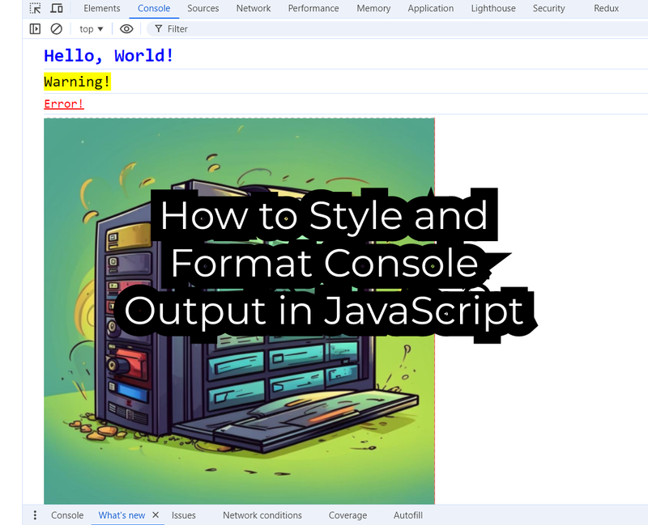

Styling and formatting console output in JavaScript can greatly enhance the readability and
usability of logs, especially during debugging. Here’s a detailed guide on how to effectively style
and format console output using `console.log` and other related methods.



## What is the Console?

The console is part of the web browser's developer tools, and it provides a way to output messages
and interact with JavaScript. It serves as a valuable resource for developers, offering insights
into code execution and helping identify errors and performance issues.

## Common Console Methods

- **console.log()**: The most commonly used method for logging messages to the console. It can log
  strings, numbers, objects, and arrays.

```js
console.log('Hello, World!'); // Logs a string
```

- **console.error()**: Logs error messages, typically displayed in red, making them stand out.

```js
console.error('This is an error message.');
```

- **console.warn()**: Logs warning messages, usually styled differently to indicate caution.

```js
console.warn('This is a warning message.');
```

- **console.info()**: Logs informational messages, which can help clarify the flow of execution.

```js
console.info('This is an informational message.');
```

- **console.table()**: Displays data in a table format, making it easier to read arrays and objects.

```js
const users = [
  { name: 'Alex', age: 30 },
  { name: 'Bob', age: 25 },
];
console.table(users);
```

- **console.group()** and **console.groupEnd()**: Groups related log messages, which can help
  organize output.

```js
console.group('User Info');
console.log('Name: Alex');
console.log('Age: 45');
console.groupEnd();
```

- **console.time()** and **console.timeEnd()**: Measures the time taken for code execution, useful
  for performance testing.

```js
console.time('MyTimer');
// Code to measure...
console.timeEnd('MyTimer'); // Outputs the time taken
```

- **console.assert()**: Logs a message if a specified condition is false, aiding in debugging
  assumptions.

```js
const age = 15;
console.assert(age >= 18, 'User is not an adult');
```

The console is an essential tool for JavaScript developers, offering a variety of methods to log
messages, inspect data, and debug applications. By effectively utilizing the console, developers can
streamline their workflow, identify issues quickly, and enhance the overall development process.
Familiarizing yourself with console methods and practices is key to becoming a more efficient
JavaScript programmer.

## Formatting Output with Placeholders

You can use placeholders to format strings dynamically:

- %s: String
- %d: Number
- %o: Object

**Example:**

```js
const user = { name: 'Alex', age: 45 };
console.log('User Info: %s, Age: %d, Details: %o', user.name, user.age, user);
```

## Using CSS Styles

You can apply CSS styles to console messages using the %c placeholder.

```js
console.log(
  '%cHello, World!',
  'color: blue; font-size: 24px; font-weight: bold;'
);
console.log(
  '%cWarning!',
  'color: black; font-size: 20px; background-color: yellow;'
);
console.log(
  '%cError!',
  'color: red; font-size: 16px; text-decoration: underline;'
);
```

## Displaying an Image in the Console

To log an image, you can create an img element and use it in the console log. Here’s an example:

```js
const imageUrl = 'https://via.placeholder.com/150'; // Replace with your image URL
console.log(
  '%c ',
  `background-image: url(${imageUrl}); padding: 100px; background-size: cover;`
);
```

**Explanation**

- **%c**: This directive is used to apply CSS styles to the log message.
- **background-image**: `url(${imageUrl})`: This sets the background image of the log message.
- **padding**: 100px: This adds padding around the image, making it visible in the console.
- **background-size**: cover: This ensures the image covers the allocated space without stretching.

### Create a CustomLog function

You can create a custom logging function in JavaScript that allows you to easily insert images into
the console using the console.log method. This custom function will accept a message, scale, and an
image URL, formatting them appropriately. Here's how to implement it:

```js
function CustomLog(message, imageUrl, scale = 1) {
  const img = new Image();
  img.crossOrigin = 'anonymous';
  img.onload = () => {
    const c = document.createElement('canvas');
    const ctx = c.getContext('2d');
    if (ctx) {
      c.width = img.width;
      c.height = img.height;
      ctx.fillStyle = 'red';
      ctx.fillRect(0, 0, c.width, c.height);
      ctx.drawImage(img, 0, 0);
      const dataUri = c.toDataURL('image/png');

      console.log(
        `%c sup?`,
        `font-size: 1px;
                padding: ${Math.floor((img.height * scale) / 2)}px ${Math.floor(
                  (img.width * scale) / 2
                )}px;
                background-image: url(${dataUri});
                background-repeat: no-repeat;
                background-size: ${img.width * scale}px ${img.height * scale}px;
                color: transparent;
                `,
        message
      );
    }
  };
  img.src = imageUrl;
}
```

**Explanation**

**Function Definition**: The CustomLog function takes two parameters: message (the text to log) and
imageUrl (the URL of the image to display).

**Styles**: A CSS string is defined with properties:

- **padding**: Adds space around the message.
- **background-image**: Sets the background image using the provided URL.
- **background-size**: Ensures the image fits within the defined dimensions.
- **width and height**: Set the size of the log area. You can adjust these values as needed.

**Usage**

You can use the `CustomLog` function like this:

```js
CustomLog('Check out this image!', './console-javascript.png');
```

By using this CustomLog function, you can enhance your console output by including images alongside
text, making your debugging sessions more informative and visually engaging.

## Conclusion

The console is an essential tool for JavaScript developers, offering a variety of methods to log
messages, inspect data, and debug applications. By effectively utilizing the console, developers can
streamline their workflow, identify issues quickly, and enhance the overall development process.
Familiarizing yourself with console methods and practices is key to becoming a more efficient
JavaScript programmer.
