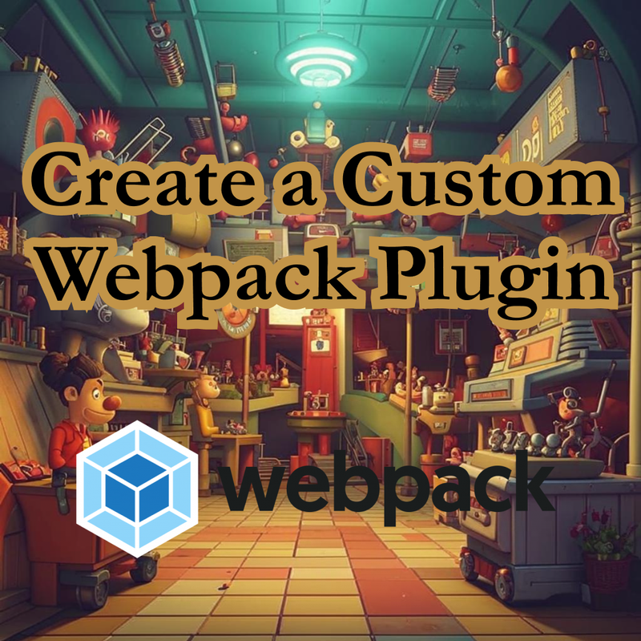
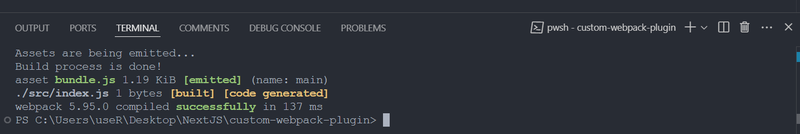

Creating a plugin for Webpack allows you to customize and extend Webpack's functionality to suit your needs. Webpack plugins can perform a variety of tasks, from file transformations and optimizations to code analysis and generation. Here's a step-by-step guide to creating a simple Webpack plugin.



## Steps to Create a Webpack Plugin

### 1. Setup Your Project

First, you'll need to set up a basic Node.js project if you haven't already.

```bash
mkdir custom-webpack-plugin
cd custom-webpack-plugin
npm init -y
npm install webpack --save-dev
```

### 2. Create the Plugin File

Create a folder **plugins** for your plugin, where you’ll write the logic for it. For example, let's create a **CustomPlugin.js** file.

```bash
mkdir plugins
touch plugins/CustomPlugin.js
```

### 3. Write the Plugin Code

In the CustomPlugin.js file, you'll define your plugin. A Webpack plugin is essentially a JavaScript class with an apply method that hooks into the Webpack lifecycle.

```js
class CustomPlugin {
  constructor(options) {
    // You can pass options when initializing the plugin
    this.options = options;
  }

  // The apply method is called by Webpack when the plugin is registered
  apply(compiler) {
    // Hook into the Webpack compilation process
    compiler.hooks.done.tap('CustomPlugin', stats => {
      console.log('Build process is done!');
      // You can add more functionality here, like writing files, modifying assets, etc.
    });

    // You can hook into other Webpack lifecycle events
    compiler.hooks.emit.tapAsync('CustomPlugin', (compilation, callback) => {
      // Modify the compilation assets or metadata
      console.log('Assets are being emitted...');

      // Call the callback to proceed with the build
      callback();
    });
  }
}

module.exports = CustomPlugin;
```

### 4. Register the Plugin in Webpack

Create Webpack configuration file (**webpack.config.js**), and then register your plugin.

<div className='code-cmd'>touch webpack.config.js</div>

```js
const CustomPlugin = require('./plugins/CustomPlugin');

module.exports = {
  mode: 'development',
  entry: './src/index.js',
  output: {
    filename: 'bundle.js',
    path: __dirname + '/dist',
  },
  plugins: [
    new CustomPlugin({
      message: 'Hello Webpack!', // Pass options to the plugin if needed
    }),
  ],
};
```

### 5. Test Your Plugin

**How does it work?**

Webpack will take the file src/index.js, which we specified in the config, convert it into bundle.js, and then insert our plugin.

Let's create src/index.js to prevent Webpack from throwing an error.

<div className='code-cmd'>touch src/index.js</div>

then fill it

```js
console.log('Hello from index.js');
```

Now, when you run Webpack, your plugin will execute and print the logs or modify the output as needed.

<div className='code-cmd'>npx webpack</div>



## Webpack Plugin Lifecycle

Webpack provides several hooks you can tap into for different stages of the build process:

- **emit**: When Webpack is about to emit assets to the output directory.
- **compilation**: When Webpack starts compiling the modules.
- **afterEmit**: After the assets have been emitted.
- **done**: After the build process is finished.

You can access these hooks using `tap`, `tapAsync`, or `tapPromise` depending on whether the hook is synchronous or asynchronous.

## Example: Adding a Custom File to the Output

Here’s a quick example of how you can use a plugin to add a custom file to the Webpack output:

```js
class AddCustomFilePlugin {
  apply(compiler) {
    compiler.hooks.emit.tapAsync(
      'AddCustomFilePlugin',
      (compilation, callback) => {
        // Add a new asset to the compilation
        const content =
          'This is a custom file created by the AddCustomFilePlugin!';
        compilation.assets['custom-file.txt'] = {
          source: () => content,
          size: () => content.length,
        };
        callback();
      }
    );
  }
}

module.exports = AddCustomFilePlugin;
```

In `webpack.config.js`:

```js
const AddCustomFilePlugin = require('./plugins/AddCustomFilePlugin');

module.exports = {
  mode: 'development',
  plugins: [new AddCustomFilePlugin()],
};
```

When you run Webpack, a file called `custom-file.txt` will be added to the `dist/` folder.

## Conclusion

Creating a Webpack plugin involves:

- Defining a class with an apply method.
- Hooking into Webpack's lifecycle with various hooks.
- Optionally, modifying the Webpack compilation or assets.

Once you understand the plugin lifecycle, you can extend Webpack in powerful ways to automate tasks and improve your build process!
