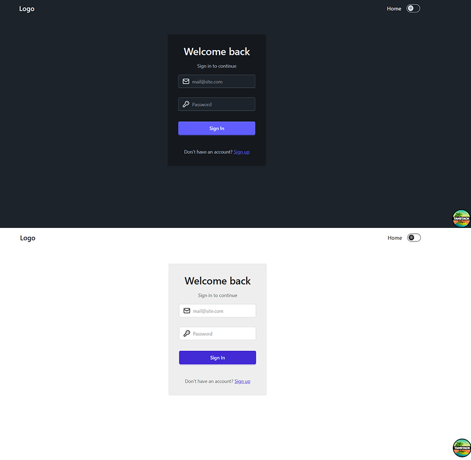

Modern web applications often require dark mode support by default. Using **DaisyUI** with **TanStack Router**, developers can implement a clean, responsive theme switcher that stores user preferences and applies them across routes without additional configuration files.

This guide demonstrates how to build such a switcher in a **Vite + TypeScript** project using the new Tailwind CSS plugin syntax.

---

## 1. Project Setup

A new project is created with TanStack Router and React:

```bash
npm create vite@latest
# Select: TanStack Router + React + TypeScript
cd your-app
npm install
```

Install DaisyUI:

```bash
npm install -D daisyui
```

---

## 2. Tailwind and DaisyUI Configuration

The latest Tailwind version supports plugin syntax directly in CSS. A configuration file is no longer needed.

Create or edit `src/styles.css`:

```css
@import 'tailwindcss';
@plugin 'daisyui' {
  themes:
    light --default,
    dark --prefersdark;
}
```

This configuration enables two DaisyUI themes — light and dark — with system preference detection.

---

## 3. Creating the Theme Provider

`src/providers/theme-provider.tsx` manages the theme state and synchronizes it with both the document and local storage.

```tsx
import { createContext, useContext, useEffect, useMemo, useState } from 'react';

export type Theme = 'light' | 'dark';
const THEME_KEY = 'vite-ui-theme';

type ThemeProviderState = {
  theme: Theme;
  setTheme: (next: Theme) => void;
};

const ThemeProviderContext = createContext<ThemeProviderState | undefined>(undefined);

function canUseDOM() {
  return typeof window !== 'undefined' && typeof document !== 'undefined';
}

export function ThemeProvider({
  children,
  defaultTheme = 'system',
  storageKey = THEME_KEY,
  ...props
}: {
  children: React.ReactNode;
  defaultTheme?: Theme | 'system';
  storageKey?: string;
}) {
  const [theme, setThemeState] = useState<Theme>(() => {
    if (!canUseDOM()) {
      return defaultTheme === 'system' ? 'light' : (defaultTheme as Theme);
    }
    try {
      const saved = localStorage.getItem(storageKey) as Theme | null;
      if (saved === 'light' || saved === 'dark') return saved;
      if (defaultTheme === 'system') {
        return window.matchMedia('(prefers-color-scheme: dark)').matches ? 'dark' : 'light';
      }
      return defaultTheme as Theme;
    } catch {
      return defaultTheme === 'system' ? 'light' : (defaultTheme as Theme);
    }
  });

  useEffect(() => {
    if (!canUseDOM()) return;
    document.documentElement.setAttribute('data-theme', theme);
    try {
      localStorage.setItem(storageKey, theme);
    } catch {}
  }, [theme, storageKey]);

  useEffect(() => {
    if (!canUseDOM()) return;
    const onStorage = (e: StorageEvent) => {
      if (e.key === storageKey && (e.newValue === 'light' || e.newValue === 'dark')) {
        setThemeState(e.newValue);
      }
    };
    window.addEventListener('storage', onStorage);
    return () => window.removeEventListener('storage', onStorage);
  }, [storageKey]);

  const setTheme = (next: Theme) => setThemeState(next);

  const value = useMemo(() => ({ theme, setTheme }), [theme]);

  return (
    <ThemeProviderContext.Provider value={value} {...props}>
      {children}
    </ThemeProviderContext.Provider>
  );
}

export function useTheme() {
  const ctx = useContext(ThemeProviderContext);
  if (!ctx) throw new Error('useTheme must be used within a ThemeProvider');
  return ctx;
}
```

This provider:
- Initializes the theme from local storage or system preference.
- Updates the `data-theme` attribute on `<html>` for DaisyUI.
- Synchronizes theme changes across browser tabs.

---

## 4. Adding the Theme Toggler

`src/components/ui/theme-toggler.tsx` defines an accessible toggle that switches between light and dark themes.

```tsx
import { useTheme } from '@/providers/theme-provider';

export default function ThemeToggler() {
  const { theme, setTheme } = useTheme();
  const isDark = theme === 'dark';

  return (
    <button
      type="button"
      className="btn btn-ghost btn-sm"
      aria-pressed={isDark}
      aria-label="Toggle color theme"
      title="Toggle color theme"
      onClick={() => setTheme(isDark ? 'light' : 'dark')}
    >
      <span className="inline-flex items-center gap-2">
        <svg aria-hidden viewBox="0 0 24 24" className="size-5">
          <g stroke="currentColor" strokeWidth="2" fill="none" strokeLinecap="round" strokeLinejoin="round">
            {isDark ? (
              <path d="M12 3a6 6 0 0 0 9 9 9 9 0 1 1-9-9Z" />
            ) : (
              <>
                <circle cx="12" cy="12" r="4" />
                <path d="M12 2v2M12 20v2M4.93 4.93l1.41 1.41M17.66 17.66l1.41 1.41M2 12h2M20 12h2M6.34 17.66l-1.41 1.41M19.07 4.93l-1.41 1.41" />
              </>
            )}
          </g>
        </svg>
        <span className="hidden md:inline">{isDark ? 'Dark' : 'Light'}</span>
      </span>
    </button>
  );
}
```

The button toggles the theme and saves the choice in local storage.

---

## 5. Integration with TanStack Router

The theme provider should wrap the entire shell component in `routes/__root.tsx`:

```tsx
import { HeadContent, Scripts, createRootRouteWithContext } from '@tanstack/react-router';
import { TanStackDevtools } from '@tanstack/react-devtools';
import { TanStackRouterDevtoolsPanel } from '@tanstack/react-router-devtools';
import { ThemeProvider } from '@/providers/theme-provider';
import Header from '../components/header/header';
import appCss from '../styles.css?url';
import type { QueryClient } from '@tanstack/react-query';

interface MyRouterContext {
  queryClient: QueryClient;
}

export const Route = createRootRouteWithContext<MyRouterContext>()({
  head: () => ({
    meta: [
      { charSet: 'utf-8' },
      { name: 'viewport', content: 'width=device-width, initial-scale=1' },
      { title: 'DaisyUI Theme Switcher' },
    ],
    links: [{ rel: 'stylesheet', href: appCss }],
  }),
  shellComponent: RootDocument,
});

function RootDocument({ children }: { children: React.ReactNode }) {
  return (
    <html lang="en">
      <head>
        <HeadContent />
      </head>
      <body>
        <ThemeProvider>
          <Header />
          {children}
          <TanStackDevtools
            config={{ position: 'bottom-right' }}
            plugins={[
              { name: 'Tanstack Router', render: <TanStackRouterDevtoolsPanel /> },
            ]}
          />
          <Scripts />
        </ThemeProvider>
      </body>
    </html>
  );
}
```

---

## 6. Example Header Integration

`src/components/header/header.tsx` includes the toggle button alongside navigation links.

```tsx
import { Link } from '@tanstack/react-router';
import ThemeToggler from '../ui/theme-toggler';

export default function Header() {
  return (
    <header className="px-2 xl:px-40 my-2.5 flex items-center justify-between gap-2 md:gap-4 xl:gap-6 lg:gap-12">
      <div className="flex items-center justify-between w-full">
        <button
          className="btn btn-ghost text-xl"
        >
          Logo
        </button>

        <nav className="flex items-center gap-4" aria-label="Main">
          <Link to="/" className="link link-hover">Home</Link>
          <ThemeToggler />
        </nav>
      </div>
    </header>
  );
}
```

**Result**



---

## 7. Conclusion

This approach demonstrates how a modern React application can handle theming efficiently without additional configuration files.  
By combining DaisyUI and TanStack Router:

- The theme applies instantly through `data-theme` on `<html>`.
- Preferences are stored and synchronized automatically.
- The interface remains consistent across pages and sessions.

This lightweight implementation works seamlessly with **Vite**, **TypeScript**, and **the new Tailwind CSS plugin system**, making it ideal for any modern front-end project.
