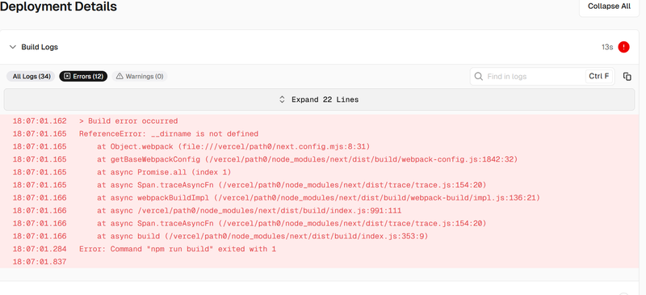

When using **ES modules** (`"type": "module"`) in Node.js, you may encounter the following error:



```bash
ReferenceError: __dirname is not defined in ES module scope
```

This error happens because ES modules don’t include the CommonJS global variables like `__dirname` and `__filename`. Let’s go over how to recreate them and understand what’s happening under the hood.

---

## Understanding the "__dirname" Variable

In CommonJS, Node.js automatically defines two global variables:

- `__filename` — represents the absolute path of the current file.
- `__dirname` — represents the directory name of the current file.

However, in **ES module scope**, these variables are not defined because ES modules use **`import`/`export`** syntax and the **URL-based module system**, not file-based globals.

To fix this, you can extract the current file path using the `import.meta.url` property and the `path` module.

---

## 1. Define `__dirname` Manually in ES Modules

You can recreate `__dirname` and `__filename` manually using `import.meta.url` and `path.dirname()`.

```js
import { dirname } from 'path';
import { fileURLToPath } from 'url';

// Create __filename and __dirname from URL
const __filename = fileURLToPath(import.meta.url);
const __dirname = dirname(__filename);

console.log('Filename:', __filename);
console.log('Directory:', __dirname);
```

**Explanation:**  
- `import.meta.url` gives the module’s URL.  
- `fileURLToPath()` converts it into a file path.  
- `dirname()` extracts the directory path.  

Now, `__dirname` behaves the same as it does in CommonJS.

---

## 2. Remove `"type": "module"` to Use CommonJS

If you don’t need ES modules, the simplest fix is to remove `"type": "module"` from your `package.json` file.

```json
{
  "type": "commonjs"
}
```

This switches your project back to CommonJS mode, where `__dirname` and `__filename` are automatically available as global variables.

---

## 3. Fixing `__dirname` in Webpack or Rollup

If your project is bundled for the browser, Node.js globals like `__dirname` don’t exist. To handle that safely, use bundler options.

### Webpack Example

```js
node: {
  __dirname: false,
  __filename: false
}
```

This prevents Webpack from replacing those variables incorrectly.

### Rollup Example

In Rollup, you can add a plugin to define globals manually:

```js
import replace from '@rollup/plugin-replace';

export default {
  plugins: [
    replace({
      preventAssignment: true,
      __dirname: JSON.stringify('/src'),
      __filename: JSON.stringify('/src/index.js')
    })
  ]
}
```

---

## 4. Why `__dirname` is Undefined in ES Module Scope

Unlike CommonJS, ES modules in Node.js use URLs, not file paths. This design improves interoperability with browsers but removes file-based globals like `__dirname`.

**Key technical points:**

- ES modules use the `import.meta` object instead of CommonJS globals.  
- The module loader derives paths from URLs rather than the filesystem.  
- Node.js intentionally does not provide `__dirname` to avoid ambiguity across environments.

If you need compatibility with file operations, always reconstruct `__dirname` manually.

---

## 5. Common Mistakes and Debug Tips

**❌ Using `__dirname` directly in ESM code**
```js
console.log(__dirname);
// ReferenceError: __dirname is not defined
```

**✅ Correct version**
```js
import { dirname } from 'path';
import { fileURLToPath } from 'url';
const __dirname = dirname(fileURLToPath(import.meta.url));
console.log(__dirname);
```

**Pro Tip:** When debugging path-related issues, log both the file URL and resolved path:

```js
console.log(import.meta.url);
console.log(fileURLToPath(import.meta.url));
```

This helps confirm that the `URL` is being converted properly.

---

## 6. Related Concepts and Best Practices

Here’s a quick summary of related Node.js path utilities:

| Concept | Description |
|----------|-------------|
| `path.dirname()` | Extracts the directory from a file path |
| `path.basename()` | Returns the last portion of a path |
| `path.resolve()` | Resolves relative paths into absolute ones |
| `fileURLToPath()` | Converts a file URL to a local path |
| `import.meta.url` | Returns the module’s file URL in ES modules |

By combining these, you can manage file paths safely across ESM and CommonJS.

---

## Summary

If you see **“ReferenceError: __dirname is not defined in ES module scope”**, here’s what to do:

1. **Manually define `__dirname`** using `import.meta.url` and `path.dirname()`  
2. **Remove `"type": "module"`** to return to CommonJS  
3. **Configure your bundler** (Webpack or Rollup) to handle file paths properly  

By applying these methods, you can restore the familiar `__dirname` and `__filename` behavior — ensuring your Node.js projects run consistently in both CommonJS and ES module environments.

---

<footer>
<p>✅ Updated for Node.js 22+ and ESM compatibility</p>
</footer>
