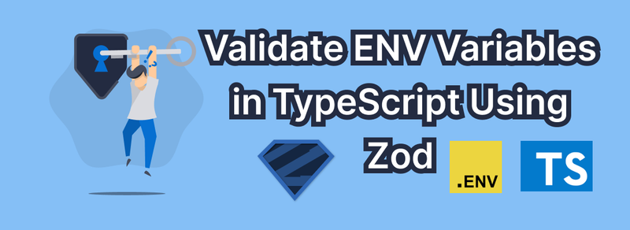

Validating environment variables in TypeScript is essential for ensuring that your application is running with the required configuration. You can validate environment variables in TypeScript by using packages like [zod](https://zod.dev/) or [joi](https://joi.dev/), or even with custom code. Here’s a step-by-step guide on how to validate environment variables effectively using TypeScript and the zod package.



## Step 1: Install Dependencies

To get started, install `dotenv` to load environment variables from a `.env` file and `zod` for validation.

<div className='code-cmd'>npm install dotenv zod</div>

Then, add `dotenv` configuration at the start of your code to ensure environment variables load correctly.

```ts
import dotenv from 'dotenv';

import dotenv from 'dotenv';

dotenv.config();
```

## Step 2: Setting Up Environment Variable Schema with Zod

Define the structure of your environment variables using Zod. This schema will specify the expected types and constraints, catching errors early.

```ts
import { z } from 'zod';

import { z } from 'zod';

// Define the schema for environment variables
const envSchema = z.object({
  NODE_ENV: z.enum(['development', 'production', 'test']),
  PORT: z
    .string()
    .transform(Number)
    .refine(port => port > 1000 && port < 5000, {
      message: 'PORT must be a number between 1 and 65535',
    }),
  DATABASE_URL: z.string().url(),
  AUTH_SECRET: z.string(),
});
```

In this example:

- `NODE_ENV` must be one of "development," "production," or "test."
- `PORT` is a string parsed as a number, constrained to valid port numbers (1000–5000).
- `DATABASE_URL` must be a valid URL.
- `AUTH_SECRET` should be a non-empty string.

## Step 3: Validating Environment Variables

Using the `safeParse` function in Zod, you can validate environment variables and handle errors if they don’t match the expected schema.

```ts
const parsedEnv = envSchema.safeParse(process.env);

if (!parsedEnv.success) {
  console.error('Invalid environment variables:', parsedEnv.error.format());
  process.exit(1); // Stop the application if validation fails
}

export const env = parsedEnv.data; // Export the validated variables for use in your app
```

The `safeParse` method checks `process.env` variables against the schema:

- If the validation fails, an error message will display, and the app will exit.
- If successful, the validated env object is exported.

### Integrating Validation into `process.env`

To improve type safety, we can extend the ProcessEnv interface in TypeScript to include the types from our Zod schema. This will allow you to access process.env with the proper types everywhere in your code.

## Step 4: Declaring Types Globally

To make the TypeScript types globally accessible, extend the `ProcessEnv` interface with Zod’s inferred type. This type declaration should be placed in a `.d.ts` file in your project, such as `env.d.ts`.

### Create a `src/types/env.d.ts` file with the following content:

```ts
import { envSchema } from '../path/to/envSchema';
import { z } from 'zod';

import { envSchema } from '../path/to/envSchema';
import { z } from 'zod';

// Adjust path as necessary

declare global {
  namespace NodeJS {
    interface ProcessEnv extends z.infer<typeof envSchema> {}
  }
}
```

In this code:

- We use `z.infer<typeof envSchema>` to get the inferred type of `envSchema`.
- `ProcessEnv` is extended with this inferred type, adding strict typing to `process.env`.

After this setup, TypeScript will ensure your code references valid and correctly typed environment variables.

## Complete Code Example

Here is the full code example combining all steps:

```ts
// src/env.ts
import dotenv from 'dotenv';
import { z } from 'zod';

dotenv.config();

const envSchema = z.object({
  NODE_ENV: z.enum(["development", "production", "test"]),
  PORT: z.string().transform(Number).refine((port) => port > 1000 && port < 5000, {
    message: 'PORT must be a number between 1 and 65535',
  }),
  DATABASE_URL: z.string().url(),
  API_KEY: z.string(),
});

const parsedEnv = envSchema.safeParse(process.env);

if (!parsedEnv.success) {
  console.error("Invalid environment variables:", parsedEnv.error.format());
  process.exit(1);
}

export const env = parsedEnv.data;

// src/types/env.d.ts
import { z } from 'zod';
import { envSchema } from "../env";  // Adjust path as necessary

declare global {
  namespace NodeJS {
    interface ProcessEnv extends z.infer<typeof envSchema> {}
  }
}
```

## Benefits of Using zod

- **Type Safety**: `zod` ensures your environment variables are type-safe, preventing runtime errors due to misconfigured values.
- **Detailed Errors**: Validation errors provide detailed messages, making it easy to identify which variables are missing or incorrectly set.
- **Optional Defaults**: `zod` allows default values for certain fields, reducing the need for extensive fallback logic.

### Alternatives

While `zod` is very flexible, here are other libraries for environment variable validation:

- **Joi**: A popular validation library that can also be used with TypeScript, although it requires slightly more configuration.
- **dotenv-typesafe**: A package that combines `dotenv` with TypeScript for safe and typed environment variables.

## Final Thoughts

Using TypeScript for environment variable validation is a simple but effective way to catch configuration issues early. It’s particularly helpful in environments where your application relies on multiple services or API keys, as it ensures every required value is set correctly before the application starts.
