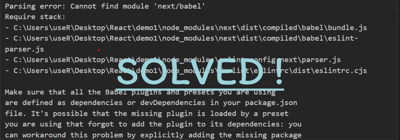

When you see the **"Parsing error: Cannot find module 'next/babel'"**, it usually means ESLint can’t locate the Next.js Babel preset. This often happens in misconfigured projects or when upgrading Next.js/ESLint/Babel.

Below is an improved, clearer, and more complete guide.

## Why This Error Happens

ESLint tries to load a Babel parser preset called **next/babel**, but:

- the preset isn’t installed,
- your ESLint config is wrong,
- Babel config conflicts with Next.js defaults,
- or you're using old/legacy Next.js config patterns.

Good news: this is easy to fix.

---

## 1. Correct Your ESLint Configuration (Fastest Fix)

Use the official ESLint config from Next.js.  
In `.eslintrc.json` or `.eslintrc.js`:

```json
{
  "extends": ["next/core-web-vitals"]
}
```

**Do NOT** include `"next/babel"` in ESLint's `"extends"` — it used to work in old Next.js versions but is deprecated.

### If you really need custom Babel parsing:

```json
{
  "parser": "@babel/eslint-parser",
  "parserOptions": {
    "requireConfigFile": false,
    "babelOptions": {
      "presets": ["next/babel"]
    }
  },
  "extends": ["next/core-web-vitals"]
}
```

---

## 2. Check Your Babel Configuration

Next.js comes with Babel preconfigured.

Make sure you did **not accidentally add** an empty or broken Babel config:

❌ **Remove or fix these if empty:**

- `.babelrc`
- `babel.config.js`

If you need a custom config, use:

```js
// babel.config.js
module.exports = {
  presets: ['next/babel'],
};
```

---

## 3. Clear ESLint Cache

ESLint may cache outdated config paths.

```bash
npx eslint . --cache --cache-location node_modules/.cache/eslint --no-eslintrc
```

or simply:

```bash
npx eslint --clear-cache
```

---

## 4. Reinstall ESLint + Next.js ESLint Plugin

Often the error appears due to mismatched versions.

```bash
npm install --save-dev eslint eslint-config-next
```

or with Yarn:

```bash
yarn add -D eslint eslint-config-next
```

---

## 5. Ensure Correct File Extensions

ESLint must be set to lint the file types you use:

```json
{
  "overrides": [
    {
      "files": ["*.js", "*.jsx", "*.ts", "*.tsx"]
    }
  ]
}
```

Incorrect patterns may cause ESLint to apply wrong parsers.

---

## 6. Remove Old `next/babel` References

If you migrated from older Next.js versions (pre‑12):

❌ Remove from `.eslintrc`:

```json
"extends": ["next/babel"]
```

❌ Remove from `.eslintignore`:

```
.next/babel
```

These are outdated, and removing them fixes the error in most cases.

---

## 7. Final Check: Node Modules & Lockfile

If issues persist:

```bash
rm -rf node_modules package-lock.json
npm install
```

or with Yarn:

```bash
rm -rf node_modules yarn.lock
yarn
```

---

## Conclusion

The error **"Cannot find module 'next/babel'"** comes from outdated ESLint configs or Babel overrides. Most projects only need:

- `"extends": ["next/core-web-vitals"]`
- removing old `"next/babel"` references,
- updating ESLint packages.

After applying the fixes above, your Next.js ESLint setup should run without any parsing issues.


