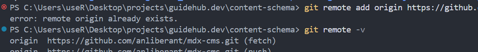

The error message:

```bash
fatal: remote origin already exists.
```



is a common Git issue that developers encounter when working with remote repositories. This typically happens when you try to add a remote called origin, but Git tells you that one already exists. In this article, we’ll dive into why this happens and explore multiple ways to fix or work around it depending on your workflow and needs.

✅ What Causes the Error?

You usually see this error when you run:

```bash
git remote add origin <url>
```

and a `remote` named origin already exists in your local repository.

This could happen if:

- You cloned the repository (Git adds the `origin` remote by default).
- You already added a remote before.
- You ran a script or command that added it previously.

## 🔍 Check Existing Remotes

Before fixing it, check what remotes exist:

```bash
git remote -v
```

**Example output:**

```bash
origin  https://github.com/user/my-repo.git (fetch)
origin  https://github.com/user/my-repo.git (push)
```

This shows that `origin` is already set.

## 🛠️ Solution 1: Change the Existing Remote URL

If your goal is to point `origin` to a new repository, you don’t need to add a new one. Just change the existing remote URL:

```bash
git remote set-url origin <new-url>
```

**Example:**

```bash
git remote set-url origin https://github.com/yourname/new-repo.git
```

Then confirm the change:

```bash
git remote -v
```

## 🧹 Solution 2: Remove the Existing Remote and Add It Again

If you prefer a clean slate:

1. **Remove the existing remote**:
   ```bash
   git remote remove origin
   ```
2. **Then add it again**:
   ```bash
   git remote add origin <your-url>
   ```

## 🧠 Solution 3: Rename the Remote

If you want to keep the current `origin` but add a second remote, rename the original:

```bash
git remote rename origin old-origin
```

Then add the new one:

```bash
git remote add origin <new-url>
```

You can now push/pull from `old-origin` or `origin` as needed:

```bash
git push old-origin main
git push origin main
```

## 🔄 Solution 4: Force Overwrite the Remote (Advanced)

You can overwrite the remote config directly (less recommended unless automating):

```bash
git remote remove origin 2>/dev/null; git remote add origin <new-url>
```

This line removes `origin` if it exists, then adds a new one. Useful in scripts.

## 📁 Solution 5: Manually Edit the `.git/config` File

If you're comfortable editing config files, open `.git/config` and modify or delete the `[remote "origin"]` block.

**Example:**

```ini
[remote "origin"]
    url = https://github.com/user/old-repo.git
    fetch = +refs/heads/*:refs/remotes/origin/*
```

Update or remove this section to resolve conflicts manually.

## 🛡️ Solution 6: Check for Scripted or CI/CD Issues

In CI/CD or automation, you may run into this error due to repeated `git remote add` commands. To avoid that:

- Use `git remote set-url` instead of `add.`
- Use the safe fallback:

```bash
git remote get-url origin || git remote add origin <url>
```

This checks if `origin` exists before trying to add it.

## 🧪 Bonus: Use `git clone --origin` to Set a Different Name

If you want to use a different name than `origin` while cloning:

```bash
git clone --origin upstream <repo-url>
```

This sets the remote name to `upstream` instead of `origin`.

## 🧼 Summary Table

<table>
  <thead>
    <tr>
      <th>**Situation**</th>
      <th>**Best Fix**</th>
    </tr>
  </thead>
  <tbody>
    <tr>
      <td>Just need to change the URL</td>
      <td>`git remote set-url origin <url>`</td>
    </tr>
    <tr>
      <td>Want to delete and re-add	</td>
      <td>`git remote remove origin` then `add`</td>
    </tr>
    <tr>
      <td>Want to keep old and add new</td>
      <td>`git remote rename origin old-origin`</td>
    </tr>
    <tr>
      <td>Running scripts</td>
      <td>Use fallback or conditional logic</td>
    </tr>
    <tr>
      <td>Manual fix</td>
      <td>Edit `.git/config` directly</td>
    </tr>
  </tbody>
</table>

## 🚀 Final Thoughts

The “`fatal: remote origin already exists`” error might seem annoying, but it’s actually Git’s way of protecting your repository from unintended changes. By using the appropriate solution—be it modifying, removing, or renaming the remote—you can keep your Git workflow smooth and conflict-free.

If you're automating Git tasks or working in collaborative repos, having this flexibility can save you a lot of time and debugging effort. Bookmark this guide for the next time Git gives you a hard time!
