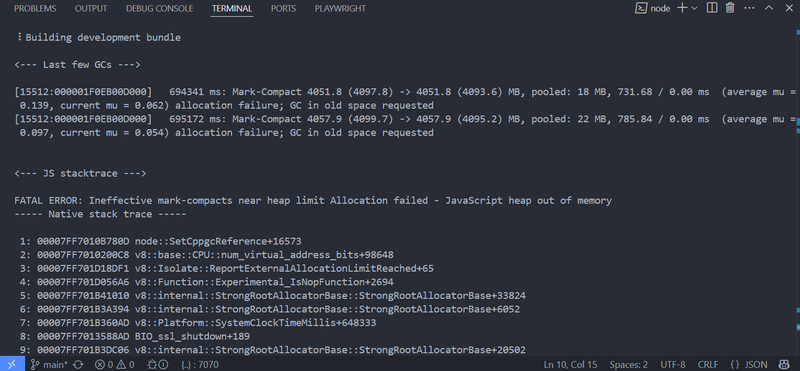

If you've encountered the dreaded error:

```bash
FATAL ERROR: Ineffective mark-compacts near heap limit Allocation failed - JavaScript heap out of memory
```



You're not alone. This error typically occurs in Node.js applications when memory usage exceeds the default limit (usually 512 MB or 1.76 GB depending on version and system architecture).

In this guide, we’ll cover all known ways to resolve or work around this issue.

## 1. Increase Node’s Memory Limit

The easiest and most common solution is to increase Node’s memory allocation limit using the `--max-old-space-size` flag:

```bash
node --max-old-space-size=4096 your-script.js
```

This sets the memory limit to 4 GB. You can go higher depending on your machine:

```bash
node --max-old-space-size=8192 your-script.js # 8GB
```

For npm/yarn scripts:

```bash
node --max-old-space-size=4096 node_modules/.bin/webpack
```

Or define it in your package.json:

```json
"scripts": {
  "build": "node --max-old-space-size=4096 node_modules/.bin/next build"
}
```

## 2. Use Environment Variable for Memory (cross-env)

For cross-platform builds, use `cross-env`:

```bash
npm install --save-dev cross-env
```

```json
"scripts": {
  "build": "cross-env NODE_OPTIONS=--max-old-space-size=4096 next build"
}
```

## 3. Optimize Your Code / Build Tool

Memory leaks and poor bundling practices can also be the cause:

- Avoid in-memory caching of large assets
- Use lazy loading
- Reduce bundle size with [tree-shaking](https://webpack.js.org/guides/tree-shaking/)
- Avoid huge `require()` or `import()` graphs
- Split large builds into smaller chunks

If you're using `webpack`, try enabling `cache`, limiting plugins, or using `webpack-bundle-analyzer`.

## 4. Upgrade Dependencies

Outdated libraries (especially ones using large polyfills or older versions of TypeScript) can drastically impact memory. Upgrade to latest versions:

```bash
npm outdated
npm update
```

## 5. Use a More Efficient Build Tool

Some tools like Webpack or Babel are heavier in memory than newer tools like:

- [esbuild](https://esbuild.github.io/)
- [Vite](https://vitejs.dev/)
- [swc](https://swc.rs/)

For example, switch from Webpack to Vite for large React projects.

## 6. Use `node --inspect` to Analyze Memory

You can profile memory usage using the Chrome DevTools:

```bash
node --inspect your-script.js
```

Then open `chrome://inspect` in Chrome and look for memory usage.

## 7. Use Worker Threads or Child Processes

If a single Node process needs too much memory, consider offloading work to a `worker_thread` or separate `child_process`:

```js
// worker.js
parentPort.postMessage(expensiveOperation());
```

```js
// main.js
const { Worker } = require('worker_threads');
new Worker('./worker.js');
```

## 8. Garbage Collection Tweaks (advanced)

You can tune V8’s GC behavior:

```bash
--expose-gc --max-semi-space-size=128
```

Then manually call GC when idle:

```js
if (global.gc) global.gc();
```

> ⚠️ These are advanced and situational; use with care.

---

## TLDR

- Use `--max-old-space-size=4096`
- Profile with `--inspect`
- Optimize code, split tasks
- Switch to efficient tools

Still stuck? Run a profiler or memory analyzer like `clinic.js` or `Chrome DevTools` to dig deeper.
