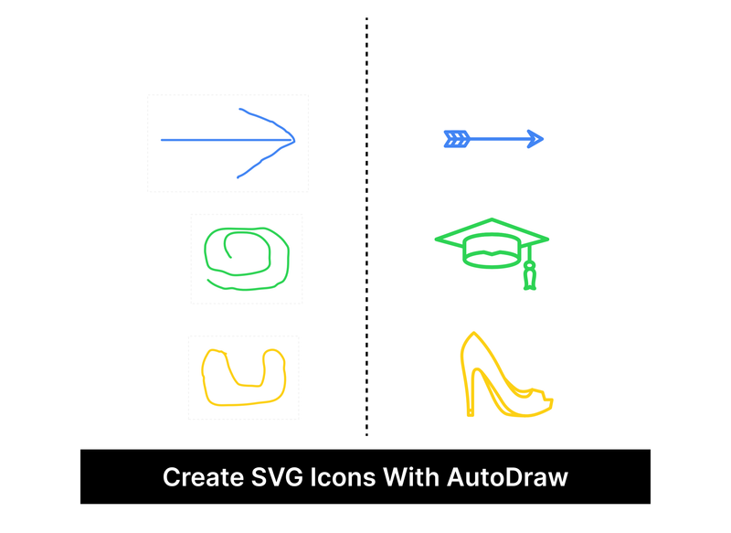
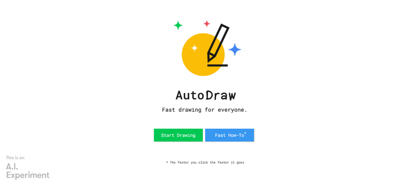
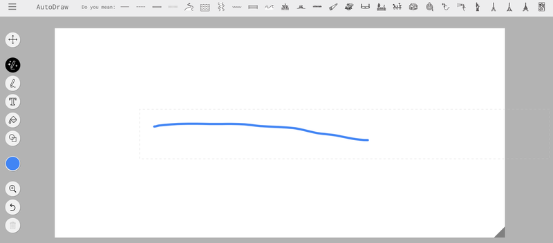
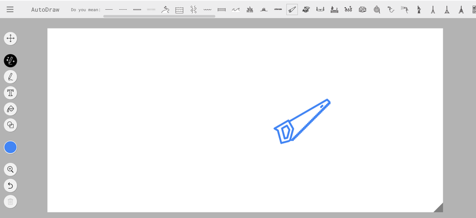
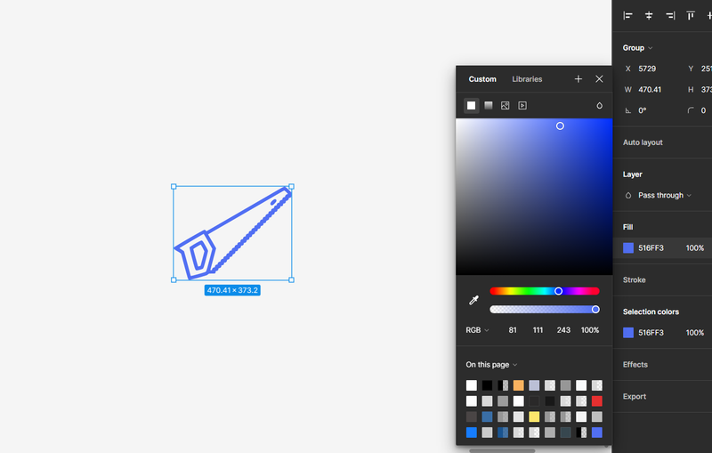

In this howto, we’ll explore another method for creating icons. I want to make it clear right
away—this article is aimed at developers, not graphic designers. Of course, tools like Photoshop,
Aseprite, or even Figma are better suited for drawing icons. However, this tutorial is primarily for
those who don't have any drawing skills.

## What is AutoDraw?

[**AutoDraw**](https://www.autodraw.com/) is an AI-powered drawing tool developed by Google Creative
Lab. It helps users create polished drawings and illustrations by turning rough sketches into
refined images. As you draw, AutoDraw suggests possible shapes or objects based on your input,
allowing you to quickly select a professionally designed version. It’s designed for everyone,
especially those with minimal artistic skills, to easily create visuals like icons, doodles, and
sketches. AutoDraw is a web-based tool that’s accessible for free, making it a simple solution for
quick graphic creation.

## How it Works?

**AutoDraw** is an experimental project by Google, now 7 years old. It’s a simple app trained on the
work of several artists, designed to "guess" what you’re trying to draw. While the results are
fairly basic—understandable given the app’s simplicity and age—it remains one of the easiest ways to
generate icons for people with no drawing skills whatsoever.

Open the app and try drawing something, even just a simple line.

At the top, you’ll see suggested results. Choose one from the list.

Export the image and upload it to any online PNG-to-SVG converter.

Take it to **Figma**

Now you can edit the icon and export it in any format, including **SVG**.
