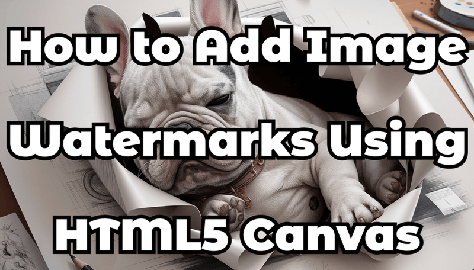

Adding watermarks to images using **HTML5 Canvas** is a practical way to protect your content, brand your images, or automate batch watermarking in web applications. With Canvas, you can draw, layer, style, and export watermarked images entirely on the client side—no servers needed.



This guide covers:

- Adding **text watermarks**
- Adding **image watermarks**
- Adjusting **opacity**, **position**, and **style**
- Exporting the final result
- Full working example

---

## 1. Basic HTML Setup

Prepare your HTML file with a hidden `` (source image) and a `<canvas>`:

```html

<canvas id="canvas"></canvas>
<script src="app.js"></script>
```

---

## 2. Add a Text Watermark

Use the Canvas 2D API to draw text with styling and transparency.

```js
const canvas = document.getElementById('canvas');
const ctx = canvas.getContext('2d');
const img = document.getElementById('sourceImage');

img.onload = function () {
  canvas.width = img.width;
  canvas.height = img.height;

  ctx.drawImage(img, 0, 0);

  ctx.font = '32px Inter, Arial';
  ctx.fillStyle = 'rgba(255, 255, 255, 0.55)';
  ctx.textAlign = 'right';
  ctx.textBaseline = 'bottom';

  ctx.fillText('© Your Brand', canvas.width - 20, canvas.height - 20);
};
```

### Improvements:
- Smooth modern fonts  
- Slightly increased opacity for readability  
- Padding from edges  

---

## 3. Add an Image Watermark (Logo)

Load another image and draw it on top of the main image.

```js
const logo = new Image();
logo.src = 'watermark.png';

logo.onload = function () {
  ctx.globalAlpha = 0.45;
  ctx.drawImage(
    logo,
    canvas.width - logo.width - 20,
    canvas.height - logo.height - 20
  );
  ctx.globalAlpha = 1.0;
};
```

### Tip  
Use a transparent PNG for best results.

---

## 4. Export the Final Image

You can download or reuse the generated image:

```js
const result = canvas.toDataURL('image/png');
console.log(result);
```

Or trigger a download:

```js
const link = document.createElement('a');
link.download = 'watermarked.png';
link.href = canvas.toDataURL('image/png');
link.click();
```

---

## 5. Full Working Example

```html

<canvas id="canvas"></canvas>

<script>
  const canvas = document.getElementById('canvas');
  const ctx = canvas.getContext('2d');
  const img = document.getElementById('sourceImage');

  img.onload = function () {
    canvas.width = img.width;
    canvas.height = img.height;
    ctx.drawImage(img, 0, 0);

    // Text watermark
    ctx.font = '30px Arial';
    ctx.fillStyle = 'rgba(255, 255, 255, 0.5)';
    ctx.textAlign = 'right';
    ctx.textBaseline = 'bottom';
    ctx.fillText('Your Watermark', canvas.width - 15, canvas.height - 15);

    // Image watermark
    const logo = new Image();
    logo.src = 'watermark.png';
    logo.onload = function () {
      ctx.globalAlpha = 0.5;
      ctx.drawImage(
        logo,
        canvas.width - logo.width - 15,
        canvas.height - logo.height - 15
      );
      ctx.globalAlpha = 1.0;
    };
  };
</script>
```

---

## Customization Ideas

✔ Control opacity using `globalAlpha`  
✔ Add drop shadows:  
```js
ctx.shadowColor = 'rgba(0,0,0,0.4)';
ctx.shadowBlur = 6;
```

✔ Position presets:
- top-left: `(20, 40)`
- top-right: `(canvas.width - 20, 40)`
- bottom-left: `(20, canvas.height - 20)`
- bottom-right: `(canvas.width - 20, canvas.height - 20)`

✔ Scale logos dynamically:
```js
const scale = 0.25;
const w = logo.width * scale;
const h = logo.height * scale;
ctx.drawImage(logo, canvas.width - w - 20, canvas.height - h - 20, w, h);
```

---

## Conclusion

HTML5 Canvas gives you complete control over watermark generation using only browser-side JavaScript. Its flexibility makes it ideal for:

- CMS and admin dashboards  
- Photo galleries  
- User-uploaded image processing  
- Branding and copyright protection  

You can easily extend this setup with sliders, opacity controls, presets, and batch processing.

